+++
url = "english2023r/6-input.html"
linktitle = "Data input and interpretation"
title = "6. Data input and interpretation — Hands-on Introduction to R 2023"
date = 2023-12-04T16:00:00+09:00
draft = false
css = "style.css"
dpi = 108
+++

# [Hands-on Introduction to R 2023](.)

<div class="author">
岩嵜 航 (Watal M. Iwasaki, PhD)
</div>

<div class="affiliation">
Graduate School of Life Sciences, Tohoku University
</div>

<ol>
<li><a href="1-introduction.html">Introduction: what is data analysis and R basics</a>
<li><a href="2-visualization.html">Data visualization and reporting</a>
<li><a href="3-structure1.html">Data transformation 1: extract, summarize</a>
<li><a href="4-structure2.html">Data transformation 2: join, pivot</a>
<li><a href="5-content.html">Data cleansing and conversion: numbers, text</a>
<li class="current-deck"><a href="6-input.html">Data input and interpretation</a>
<li><a href="7-distribution.html">Statistical modeling 1: probability distribution, likelihood</a>
<li><a href="8-glm.html">Statistical modeling 2: linear regression</a>
</ol>

<div class="footnote">
2023-12-04 Tohoku University<br>
<a href="https://heavywatal.github.io/slides/english2023r/">https://heavywatal.github.io/slides/english2023r/</a>
</div>


---
## Outline of data analysis

1. Setup computer environment ✅
1. Get and read input data ⬜ day 6 👈
1. Exploratory data analysis
    - **Preparation** (harder than it seems) ✅ day 3--5
    - **Visualization**, generating hypotheses (fun!) ✅ day 2
    - **Statistical analysis**, testing hypotheses ⬜ day 7--8
1. Report ✅ day 2

<figure>
<a href="https://r4ds.hadley.nz/intro">

<figcaption class="url">https://r4ds.hadley.nz/intro</figcaption>
</a>
</figure>


---
## Read/write data.frame

<a href="https://readr.tidyverse.org/">

</a>

- `readxl` package helps reading `.xlsx`, but...
- Prefer CSV (Comma-separated values) and TSV (Tab-).
- Use `readr` package instead of base R functions.
- Specify a file with the **relative path** from **working directory**.

    ```r
    readr::write_tsv(iris, "data/iris.tsv")
    iris2 = readr::read_tsv("data/iris.tsv")
    ```

Oops, an error occurred:


```
Error: Cannot open file for writing:
* 'data/iris.tsv'
```

---
## Common errors when reading/writing files

- Wrong file names
- Wrong directory
- Have not created the output directory.

See [よくあるエラー集 (石川由希さん@名古屋大)](https://comicalcommet.github.io/r-training-2023/R_training_2023_7.html).

<hr>

Check your current directory and its content:
```r
getwd()                 # GET Working Directory
fs::dir_ls(".")         # List files in "." (here)
fs::dir_ls("data")      # List files in "./data"
fs::dir_create("data")  # Create directory
```

🔰 Write some data.frames to `data/` directory.

🔰 Read them and create objects with different names.

---
## 🔰 Reporting assignment for Tohoku Univ. students

<iframe width="1200" height="810" src="./8-glm.html#/50"></iframe>

Read → Prepare → Visualize → a piece of cake ... hopefully?

---
## Demo: [e-Stat national population census](https://www.e-stat.go.jp/gis/statmap-search?page=1&type=1&toukeiCode=00200521) CSV

2020年 → 小地域 → 年齢（５歳階級、４区分）別、男女別人口 → 宮城県

Population pyramids as follows can be drawn from this CSV file, but...


---
## Rare to read public data effortlessly

First trial, an error:

```r
infile = "tblT001082C04.txt"
readr::read_csv(infile)
```

```
Error in nchar(x, keepNA = FALSE): invalid multibyte string, element 2
```

View this file with RStudio as a plain text.
Decoding fails:

```
                                                                                                                                                                                                                                                                                                                                                                                                                                                                                                                                                                                                                                                                                                                                                                                                                                                                                                                                                                                                                                                                                                                                                                                                                                                                                                                                                                                                                                                                                                                                                                                                                                                                                                                                                                                                                                                                                                                                                                                                                                                                                                                                                                                                                                                                                                                                                                                                                                                                                                                                                                                                                                     
 KEY_CODE,HYOSYO,CITYNAME,NAME,HTKSYORI,HTKSAKI,GASSAN,T001082001,T001082002,T001082003,T001082004,T001082005,T001082006,T001082007,T001082008,T001082009,T001082010,T001082011,T001082012,T001082013,T001082014,T001082015,T001082016,T001082017,T001082018,T001082019,T001082020,T001082021,T001082022,T001082023,T001082024,T001082025,T001082026,T001082027,T001082028,T001082029,T001082030,T001082031,T001082032,T001082033,T001082034,T001082035,T001082036,T001082037,T001082038,T001082039,T001082040,T001082041,T001082042,T001082043,T001082044,T001082045,T001082046,T001082047,T001082048,T001082049,T001082050,T001082051,T001082052,T001082053,T001082054,T001082055,T001082056,T001082057,T001082058,T001082059,T001082060                                                                                                                                                                                                                                                                                                                                                                                                                                                                                                                                                                                                                                                                                                                                                                                                                                                                                                                                                                                                                                                                                                                                                                                                                                                                                                                                                                                                                                                                                                                                                                                                                                                                                                                                                                                                                                                                                           
 ,,,,,,,\x91\x8d\x90\x94\x81A\x94N\x97\xee\x81u\x95s\x8fځv\x8a܂\xde,\x91\x8d\x90\x94\x82O\x81`\x82S\x8d\xce,\x91\x8d\x90\x94\x82T\x81`\x82X\x8d\xce,\x91\x8d\x90\x94\x82P\x82O\x81`\x82P\x82S\x8d\xce,\x91\x8d\x90\x94\x82P\x82T\x81`\x82P\x82X\x8d\xce,\x91\x8d\x90\x94\x82Q\x82O\x81`\x82Q\x82S\x8d\xce,\x91\x8d\x90\x94\x82Q\x82T\x81`\x82Q\x82X\x8d\xce,\x91\x8d\x90\x94\x82R\x82O\x81`\x82R\x82S\x8d\xce,\x91\x8d\x90\x94\x82R\x82T\x81`\x82R\x82X\x8d\xce,\x91\x8d\x90\x94\x82S\x82O\x81`\x82S\x82S\x8d\xce,\x91\x8d\x90\x94\x82S\x82T\x81`\x82S\x82X\x8d\xce,\x91\x8d\x90\x94\x82T\x82O\x81`\x82T\x82S\x8d\xce,\x91\x8d\x90\x94\x82T\x82T\x81`\x82T\x82X\x8d\xce,\x91\x8d\x90\x94\x82U\x82O\x81`\x82U\x82S\x8d\xce,\x91\x8d\x90\x94\x82U\x82T\x81`\x82U\x82X\x8d\xce,\x91\x8d\x90\x94\x82V\x82O\x81`\x82V\x82S\x8d\xce,\x91\x8d\x90\x94\x82P\x82T\x8dΖ\xa2\x96\x9e,\x91\x8d\x90\x94\x82P\x82T\x81`\x82U\x82S\x8d\xce,\x91\x8d\x90\x94\x82U\x82T\x8dΈȏ\xe3,\x91\x8d\x90\x94\x82V\x82T\x8dΈȏ\xe3,\x92j\x82̑\x8d\x90\x94\x81A\x94N\x97\xee\x81u\x95s\x8fځv\x8a܂\xde,\x92j\x82O\x81`\x82S\x8d\xce,\x92j\x82T\x81`\x82X\x8d\xce,\x92j\x82P\x82O\x81`\x82P\x82S\x8d\xce,\x92j\x82P\x82T\x81`\x82P\x82X\x8d\xce,\x92j\x82Q\x82O\x81`\x82Q\x82S\x8d\xce,\x92j\x82Q\x82T\x81`\x82Q\x82X\x8d\xce,\x92j\x82R\x82O\x81`\x82R\x82S\x8d\xce,\x92j\x82R\x82T\x81`\x82R\x82X\x8d\xce,\x92j\x82S\x82O\x81`\x82S\x82S\x8d\xce,\x92j\x82S\x82T\x81`\x82S\x82X\x8d\xce,\x92j\x82T\x82O\x81`\x82T\x82S\x8d\xce,\x92j\x82T\x82T\x81`\x82T\x82X\x8d\xce,\x92j\x82U\x82O\x81`\x82U\x82S\x8d\xce,\x92j\x82U\x82T\x81`\x82U\x82X\x8d\xce,\x92j\x82V\x82O\x81`\x82V\x82S\x8d\xce,\x92j\x82P\x82T\x8dΖ\xa2\x96\x9e,\x92j\x82P\x82T\x81`\x82U\x82S\x8d\xce,\x92j\x82U\x82T\x8dΈȏ\xe3,\x92j\x82V\x82T\x8dΈȏ\xe3,\x8f\x97\x82̑\x8d\x90\x94\x81A\x94N\x97\xee\x81u\x95s\x8fځv\x8a܂\xde,\x8f\x97\x82O\x81`\x82S\x8d\xce,\x8f\x97\x82T\x81`\x82X\x8d\xce,\x8f\x97\x82P\x82O\x81`\x82P\x82S\x8d\xce,\x8f\x97\x82P\x82T\x81`\x82P\x82X\x8d\xce,\x8f\x97\x82Q\x82O\x81`\x82Q\x82S\x8d\xce,\x8f\x97\x82Q\x82T\x81`\x82Q\x82X\x8d\xce,\x8f\x97\x82R\x82O\x81`\x82R\x82S\x8d\xce,\x8f\x97\x82R\x82T\x81`\x82R\x82X\x8d\xce,\x8f\x97\x82S\x82O\x81`\x82S\x82S\x8d\xce,\x8f\x97\x82S\x82T\x81`\x82S\x82X\x8d\xce,\x8f\x97\x82T\x82O\x81`\x82T\x82S\x8d\xce,\x8f\x97\x82T\x82T\x81`\x82T\x82X\x8d\xce,\x8f\x97\x82U\x82O\x81`\x82U\x82S\x8d\xce,\x8f\x97\x82U\x82T\x81`\x82U\x82X\x8d\xce,\x8f\x97\x82V\x82O\x81`\x82V\x82S\x8d\xce,\x8f\x97\x82P\x82T\x8dΖ\xa2\x96\x9e,\x8f\x97\x82P\x82T\x81`\x82U\x82S\x8d\xce,\x8f\x97\x82U\x82T\x8dΈȏ\xe3,\x8f\x97\x82V\x82T\x8dΈȏ\xe3
 04101,1,\x90\xe5\x91\xe4\x8es\x90\u0097t\x8b\xe6,,0,,,311590,10231,11633,11838,15944,23772,17838,17677,19028,21113,23299,20544,18295,16702,17137,17700,33702,194212,69969,35132,150932,5350,6087,6066,8321,12579,8669,8600,9241,10232,11412,10317,9031,7893,8010,8082,17503,96295,29477,13385,160658,4881,5546,5772,7623,11193,9169,9077,9787,10881,11887,10227,9264,8809,9127,9618,16199,97917,40492,21747                                                                                                                                                                                                                                                                                                                                                                                                                                                                                                                                                                                                                                                                                                                                                                                                                                                                                                                                                                                                                                                                                                                                                                                                                                                                                                                                                                                                                                                                                                                                                                                                                                                                                                                                                                                                                                                                                                                                                                                                                                                                                                                                                                                                                         
 041010010,2,\x90\xe5\x91\xe4\x8es\x90\u0097t\x8b\xe6,\x90\u0097t\x92\xac,0,,,649,16,15,17,23,53,62,49,40,40,40,45,33,28,38,38,48,413,143,67,307,8,10,7,10,26,30,27,21,18,14,25,16,11,15,16,25,198,60,29,342,8,5,10,13,27,32,22,19,22,26,20,17,17,23,22,23,215,83,38                                                                                                                                                                                                                                                                                                                                                                                                                                                                                                                                                                                                                                                                                                                                                                                                                                                                                                                                                                                                                                                                                                                                                                                                                                                                                                                                                                                                                                                                                                                                                                                                                                                                                                                                                                                                                                                                                                                                                                                                                                                                                                                                                                                                                                                                                                                                                                 
 041010020,2,\x90\xe5\x91\xe4\x8es\x90\u0097t\x8b\xe6,\x82\xa0\x82\xaf\x82ڂ̒\xac,0,,,741,23,18,13,26,32,55,48,42,60,51,48,47,38,55,43,54,447,209,111,365,12,10,4,15,16,22,28,19,39,27,25,16,23,24,21,26,230,89,44,376,11,8,9,11,16,33,20,23,21,24,23,31,15,31,22,28,217,120,67                                                                                                                                                                                                                                                                                                                                                                                                                                                                                                                                                                                                                                                                                                                                                                                                                                                                                                                                                                                                                                                                                                                                                                                                                                                                                                                                                                                                                                                                                                                                                                                                                                                                                                                                                                                                                                                                                                                                                                                                                                                                                                                                                                                                                                                                                                                                                        
```

Select "File → **Reopen with Encoding...**".<br>
Modern, decent text files should be encoded in **UTF-8**.<br>
Old Japanese text tend to be encoded in **SHIFT-JIS** (or EUC-JP).

---
## Open a file with a different encoding

Next problem: the second row also has column names:

```r
sjis = readr::locale(encoding = "SHIFT-JIS")
readr::read_csv(infile, locale = sjis)
```

```
        KEY_CODE HYOSYO     CITYNAME         NAME HTKSYORI HTKSAKI GASSAN             T001082001   T001082002   T001082003       T001082004       T001082005       T001082006       T001082007       T001082008       T001082009       T001082010       T001082011       T001082012       T001082013       T001082014       T001082015       T001082016     T001082017       T001082018     T001082019     T001082020                 T001082021 T001082022 T001082023     T001082024     T001082025     T001082026     T001082027     T001082028     T001082029     T001082030     T001082031     T001082032     T001082033     T001082034     T001082035     T001082036   T001082037     T001082038   T001082039   T001082040                 T001082041 T001082042 T001082043     T001082044     T001082045     T001082046     T001082047     T001082048     T001082049     T001082050     T001082051     T001082052     T001082053     T001082054     T001082055     T001082056   T001082057     T001082058   T001082059   T001082060
   1        <NA>     NA         <NA>         <NA>       NA    <NA>   <NA> 総数、年齢「不詳」含む 総数０〜４歳 総数５〜９歳 総数１０〜１４歳 総数１５〜１９歳 総数２０〜２４歳 総数２５〜２９歳 総数３０〜３４歳 総数３５〜３９歳 総数４０〜４４歳 総数４５〜４９歳 総数５０〜５４歳 総数５５〜５９歳 総数６０〜６４歳 総数６５〜６９歳 総数７０〜７４歳 総数１５歳未満 総数１５〜６４歳 総数６５歳以上 総数７５歳以上 男の総数、年齢「不詳」含む 男０〜４歳 男５〜９歳 男１０〜１４歳 男１５〜１９歳 男２０〜２４歳 男２５〜２９歳 男３０〜３４歳 男３５〜３９歳 男４０〜４４歳 男４５〜４９歳 男５０〜５４歳 男５５〜５９歳 男６０〜６４歳 男６５〜６９歳 男７０〜７４歳 男１５歳未満 男１５〜６４歳 男６５歳以上 男７５歳以上 女の総数、年齢「不詳」含む 女０〜４歳 女５〜９歳 女１０〜１４歳 女１５〜１９歳 女２０〜２４歳 女２５〜２９歳 女３０〜３４歳 女３５〜３９歳 女４０〜４４歳 女４５〜４９歳 女５０〜５４歳 女５５〜５９歳 女６０〜６４歳 女６５〜６９歳 女７０〜７４歳 女１５歳未満 女１５〜６４歳 女６５歳以上 女７５歳以上
   2       04101      1 仙台市青葉区         <NA>        0    <NA>   <NA>                 311590        10231        11633            11838            15944            23772            17838            17677            19028            21113            23299            20544            18295            16702            17137            17700          33702           194212          69969          35132                     150932       5350       6087           6066           8321          12579           8669           8600           9241          10232          11412          10317           9031           7893           8010           8082        17503          96295        29477        13385                     160658       4881       5546           5772           7623          11193           9169           9077           9787          10881          11887          10227           9264           8809           9127           9618        16199          97917        40492        21747
   3   041010010      2 仙台市青葉区       青葉町        0    <NA>   <NA>                    649           16           15               17               23               53               62               49               40               40               40               45               33               28               38               38             48              413            143             67                        307          8         10              7             10             26             30             27             21             18             14             25             16             11             15             16           25            198           60           29                        342          8          5             10             13             27             32             22             19             22             26             20             17             17             23             22           23            215           83           38
   4   041010020      2 仙台市青葉区   あけぼの町        0    <NA>   <NA>                    741           23           18               13               26               32               55               48               42               60               51               48               47               38               55               43             54              447            209            111                        365         12         10              4             15             16             22             28             19             39             27             25             16             23             24             21           26            230           89           44                        376         11          8              9             11             16             33             20             23             21             24             23             31             15             31             22           28            217          120           67
  --                                                                                                                                                                                                                                                                                                                                                                                                                                                                                                                                                                                                                                                                                                                                                                                                                                                                                                                                                                                                                                     
5941 04606004015      4     南三陸町   歌津字石浜        0    <NA>   <NA>                    295            9            7               11                6                6               12                6               18               16               19               21               36               18               30               26             27              158            110             54                        146          5          5              5              3              5              8              2              6              8             10             14             16              8             11             20           15             80           51           20                        149          4          2              6              3              1              4              4             12              8              9              7             20             10             19              6           12             78           59           34
5942 04606004016      4     南三陸町 歌津字田の浦        0    <NA>   <NA>                    144            5            2                5                3                5                7                5                7                6                5               15               12               17               14                4             12               82             50             32                         66          -          1              3              1              3              4              3              4              3              2              6              5              9              9              4            4             40           22            9                         78          5          1              2              2              2              3              2              3              3              3              9              7              8              5              -            8             42           28           23
5943 04606004017      4     南三陸町 歌津字草木沢        0    <NA>   <NA>                    457           21           16               18               16               12               13               20               18               18               41               34               28               37               46               43             55              237            165             76                        234         11          6              8             10             11              5              9             10             11             22             18             15             17             19             29           25            128           81           33                        223         10         10             10              6              1              8             11              8              7             19             16             13             20             27             14           30            109           84           43
5944 04606004018      4     南三陸町 歌津字伊里前        0    <NA>   <NA>                      -            -            -                -                -                -                -                -                -                -                -                -                -                -                -                -              -                -              -              -                          -          -          -              -              -              -              -              -              -              -              -              -              -              -              -              -            -              -            -            -                          -          -          -              -              -              -              -              -              -              -              -              -              -              -              -              -            -              -            -            -
```

---
## Bind the left and right halves after cleaning each

Numeric columns have non-numeric characters like `-` and `X`:

```r
dfL = readr::read_csv(infile, locale = sjis, col_select = seq(1, 7)) |>
  dplyr::slice(-1)
dfR = readr::read_csv(infile, locale = sjis, col_select = -seq(1, 7),
  skip = 1L)
raw_miyagi = dplyr::bind_cols(dfL, dfR) |> print()
```

```
        KEY_CODE HYOSYO     CITYNAME         NAME HTKSYORI HTKSAKI GASSAN 総数、年齢「不詳」含む 総数０〜４歳 総数５〜９歳 総数１０〜１４歳 総数１５〜１９歳 総数２０〜２４歳 総数２５〜２９歳 総数３０〜３４歳 総数３５〜３９歳 総数４０〜４４歳 総数４５〜４９歳 総数５０〜５４歳 総数５５〜５９歳 総数６０〜６４歳 総数６５〜６９歳 総数７０〜７４歳 総数１５歳未満 総数１５〜６４歳 総数６５歳以上 総数７５歳以上 男の総数、年齢「不詳」含む 男０〜４歳 男５〜９歳 男１０〜１４歳 男１５〜１９歳 男２０〜２４歳 男２５〜２９歳 男３０〜３４歳 男３５〜３９歳 男４０〜４４歳 男４５〜４９歳 男５０〜５４歳 男５５〜５９歳 男６０〜６４歳 男６５〜６９歳 男７０〜７４歳 男１５歳未満 男１５〜６４歳 男６５歳以上 男７５歳以上 女の総数、年齢「不詳」含む 女０〜４歳 女５〜９歳 女１０〜１４歳 女１５〜１９歳 女２０〜２４歳 女２５〜２９歳 女３０〜３４歳 女３５〜３９歳 女４０〜４４歳 女４５〜４９歳 女５０〜５４歳 女５５〜５９歳 女６０〜６４歳 女６５〜６９歳 女７０〜７４歳 女１５歳未満 女１５〜６４歳 女６５歳以上 女７５歳以上
   1       04101      1 仙台市青葉区         <NA>        0    <NA>   <NA>                 311590        10231        11633            11838            15944            23772            17838            17677            19028            21113            23299            20544            18295            16702            17137            17700          33702           194212          69969          35132                     150932       5350       6087           6066           8321          12579           8669           8600           9241          10232          11412          10317           9031           7893           8010           8082        17503          96295        29477        13385                     160658       4881       5546           5772           7623          11193           9169           9077           9787          10881          11887          10227           9264           8809           9127           9618        16199          97917        40492        21747
   2   041010010      2 仙台市青葉区       青葉町        0    <NA>   <NA>                    649           16           15               17               23               53               62               49               40               40               40               45               33               28               38               38             48              413            143             67                        307          8         10              7             10             26             30             27             21             18             14             25             16             11             15             16           25            198           60           29                        342          8          5             10             13             27             32             22             19             22             26             20             17             17             23             22           23            215           83           38
   3   041010020      2 仙台市青葉区   あけぼの町        0    <NA>   <NA>                    741           23           18               13               26               32               55               48               42               60               51               48               47               38               55               43             54              447            209            111                        365         12         10              4             15             16             22             28             19             39             27             25             16             23             24             21           26            230           89           44                        376         11          8              9             11             16             33             20             23             21             24             23             31             15             31             22           28            217          120           67
   4   041010030      3 仙台市青葉区       旭ケ丘        0    <NA>   <NA>                   9160          279          289              272              315              766              880              771              643              633              713              561              493              436              363              358            840             6211           1671            950                       4274        149        161            141            155            315            366            352            308            296            350            278            237            220            165            167          451           2877          697          365                       4886        130        128            131            160            451            514            419            335            337            363            283            256            216            198            191          389           3334          974          585
  --                                                                                                                                                                                                                                                                                                                                                                                                                                                                                                                                                                                                                                                                                                                                                                                                                                                                                                                                                                                                                                     
5940 04606004015      4     南三陸町   歌津字石浜        0    <NA>   <NA>                    295            9            7               11                6                6               12                6               18               16               19               21               36               18               30               26             27              158            110             54                        146          5          5              5              3              5              8              2              6              8             10             14             16              8             11             20           15             80           51           20                        149          4          2              6              3              1              4              4             12              8              9              7             20             10             19              6           12             78           59           34
5941 04606004016      4     南三陸町 歌津字田の浦        0    <NA>   <NA>                    144            5            2                5                3                5                7                5                7                6                5               15               12               17               14                4             12               82             50             32                         66          -          1              3              1              3              4              3              4              3              2              6              5              9              9              4            4             40           22            9                         78          5          1              2              2              2              3              2              3              3              3              9              7              8              5              -            8             42           28           23
5942 04606004017      4     南三陸町 歌津字草木沢        0    <NA>   <NA>                    457           21           16               18               16               12               13               20               18               18               41               34               28               37               46               43             55              237            165             76                        234         11          6              8             10             11              5              9             10             11             22             18             15             17             19             29           25            128           81           33                        223         10         10             10              6              1              8             11              8              7             19             16             13             20             27             14           30            109           84           43
5943 04606004018      4     南三陸町 歌津字伊里前        0    <NA>   <NA>                      -            -            -                -                -                -                -                -                -                -                -                -                -                -                -                -              -                -              -              -                          -          -          -              -              -              -              -              -              -              -              -              -              -              -              -              -            -              -            -            -                          -          -          -              -              -              -              -              -              -              -              -              -              -              -              -              -            -              -            -            -
```

---
## Read non-empty "missing" values as `NA`

OK, now we got to the starting point...

```r
dfL = readr::read_csv(infile, locale = sjis, col_select = seq(1, 7)) |>
  dplyr::slice(-1)
dfR = readr::read_csv(infile, locale = sjis, col_select = -seq(1, 7),
  skip = 1L, na = c("-", "X"))
raw_miyagi = dplyr::bind_cols(dfL, dfR) |> print()
```

```
        KEY_CODE HYOSYO     CITYNAME         NAME HTKSYORI HTKSAKI GASSAN 総数、年齢「不詳」含む 総数０〜４歳 総数５〜９歳 総数１０〜１４歳 総数１５〜１９歳 総数２０〜２４歳 総数２５〜２９歳 総数３０〜３４歳 総数３５〜３９歳 総数４０〜４４歳 総数４５〜４９歳 総数５０〜５４歳 総数５５〜５９歳 総数６０〜６４歳 総数６５〜６９歳 総数７０〜７４歳 総数１５歳未満 総数１５〜６４歳 総数６５歳以上 総数７５歳以上 男の総数、年齢「不詳」含む 男０〜４歳 男５〜９歳 男１０〜１４歳 男１５〜１９歳 男２０〜２４歳 男２５〜２９歳 男３０〜３４歳 男３５〜３９歳 男４０〜４４歳 男４５〜４９歳 男５０〜５４歳 男５５〜５９歳 男６０〜６４歳 男６５〜６９歳 男７０〜７４歳 男１５歳未満 男１５〜６４歳 男６５歳以上 男７５歳以上 女の総数、年齢「不詳」含む 女０〜４歳 女５〜９歳 女１０〜１４歳 女１５〜１９歳 女２０〜２４歳 女２５〜２９歳 女３０〜３４歳 女３５〜３９歳 女４０〜４４歳 女４５〜４９歳 女５０〜５４歳 女５５〜５９歳 女６０〜６４歳 女６５〜６９歳 女７０〜７４歳 女１５歳未満 女１５〜６４歳 女６５歳以上 女７５歳以上
   1       04101      1 仙台市青葉区         <NA>        0    <NA>   <NA>                 311590        10231        11633            11838            15944            23772            17838            17677            19028            21113            23299            20544            18295            16702            17137            17700          33702           194212          69969          35132                     150932       5350       6087           6066           8321          12579           8669           8600           9241          10232          11412          10317           9031           7893           8010           8082        17503          96295        29477        13385                     160658       4881       5546           5772           7623          11193           9169           9077           9787          10881          11887          10227           9264           8809           9127           9618        16199          97917        40492        21747
   2   041010010      2 仙台市青葉区       青葉町        0    <NA>   <NA>                    649           16           15               17               23               53               62               49               40               40               40               45               33               28               38               38             48              413            143             67                        307          8         10              7             10             26             30             27             21             18             14             25             16             11             15             16           25            198           60           29                        342          8          5             10             13             27             32             22             19             22             26             20             17             17             23             22           23            215           83           38
   3   041010020      2 仙台市青葉区   あけぼの町        0    <NA>   <NA>                    741           23           18               13               26               32               55               48               42               60               51               48               47               38               55               43             54              447            209            111                        365         12         10              4             15             16             22             28             19             39             27             25             16             23             24             21           26            230           89           44                        376         11          8              9             11             16             33             20             23             21             24             23             31             15             31             22           28            217          120           67
   4   041010030      3 仙台市青葉区       旭ケ丘        0    <NA>   <NA>                   9160          279          289              272              315              766              880              771              643              633              713              561              493              436              363              358            840             6211           1671            950                       4274        149        161            141            155            315            366            352            308            296            350            278            237            220            165            167          451           2877          697          365                       4886        130        128            131            160            451            514            419            335            337            363            283            256            216            198            191          389           3334          974          585
  --                                                                                                                                                                                                                                                                                                                                                                                                                                                                                                                                                                                                                                                                                                                                                                                                                                                                                                                                                                                                                                     
5940 04606004015      4     南三陸町   歌津字石浜        0    <NA>   <NA>                    295            9            7               11                6                6               12                6               18               16               19               21               36               18               30               26             27              158            110             54                        146          5          5              5              3              5              8              2              6              8             10             14             16              8             11             20           15             80           51           20                        149          4          2              6              3              1              4              4             12              8              9              7             20             10             19              6           12             78           59           34
5941 04606004016      4     南三陸町 歌津字田の浦        0    <NA>   <NA>                    144            5            2                5                3                5                7                5                7                6                5               15               12               17               14                4             12               82             50             32                         66         NA          1              3              1              3              4              3              4              3              2              6              5              9              9              4            4             40           22            9                         78          5          1              2              2              2              3              2              3              3              3              9              7              8              5             NA            8             42           28           23
5942 04606004017      4     南三陸町 歌津字草木沢        0    <NA>   <NA>                    457           21           16               18               16               12               13               20               18               18               41               34               28               37               46               43             55              237            165             76                        234         11          6              8             10             11              5              9             10             11             22             18             15             17             19             29           25            128           81           33                        223         10         10             10              6              1              8             11              8              7             19             16             13             20             27             14           30            109           84           43
5943 04606004018      4     南三陸町 歌津字伊里前        0    <NA>   <NA>                     NA           NA           NA               NA               NA               NA               NA               NA               NA               NA               NA               NA               NA               NA               NA               NA             NA               NA             NA             NA                         NA         NA         NA             NA             NA             NA             NA             NA             NA             NA             NA             NA             NA             NA             NA             NA           NA             NA           NA           NA                         NA         NA         NA             NA             NA             NA             NA             NA             NA             NA             NA             NA             NA             NA             NA             NA           NA             NA           NA           NA
```

<!-- dfR = readr::read_csv(infile, locale = sjis, col_select = -seq(1, 7),
  skip = 1L, na = c("-", "X"), name_repair = "minimal") -->

---
## Then, tidy it with dplyr and tidyr

Still many traps: leading/trailing whitespace, full-width numbers, etc.


```r
tidy_miyagi = raw_miyagi |>
  dplyr::rename_with(stringr::str_trim) |>
  dplyr::filter(HYOSYO == 1) |>
  dplyr::select(CITYNAME, matches("[男女].+歳")) |>
  tidyr::pivot_longer(!CITYNAME, names_to = "category", values_to = "count") |>
  tidyr::separate(category, c("sex", "age"), 1) |>
  dplyr::mutate(age = stringi::stri_trans_nfkc(age)) |>
  tidyr::separate(age, c("lower", "upper"), "〜", fill = "right") |>
  dplyr::mutate(lower = readr::parse_number(lower),
                upper = readr::parse_number(upper)) |>
  dplyr::filter((upper - lower) < 5 | lower == 75) |>
  dplyr::mutate(age = (lower + upper) / 2) |>
  print()
```

```
         CITYNAME sex lower upper count age
   1 仙台市青葉区  男     0     4  5350   2
   2 仙台市青葉区  男     5     9  6087   7
   3 仙台市青葉区  男    10    14  6066  12
   4 仙台市青葉区  男    15    19  8321  17
  --                                       
1245     南三陸町  女    60    64   507  62
1246     南三陸町  女    65    69   553  67
1247     南三陸町  女    70    74   450  72
1248     南三陸町  女    75    NA  1602  NA
```

---
## Plotting is easy once tidy data is ready


```r
tidy_miyagi |>
  dplyr::mutate(count = ifelse(sex == "男", -1, 1) * count) |>
  ggplot() +
  geom_col(aes(age, count, fill = sex)) +
  facet_wrap(vars(CITYNAME), nrow = 4L) +
  coord_flip() + theme_minimal(base_size = 15)
```


---
## Datasets in the wild require prep for prep

Now we have great skills for data preparation with R ✨<br>
Not scared of messy data!

that being said,

- Data files must be readable at least.
- The more irregularity, the more workload.

What should we care about when we are the primary data source?

<br>

Ministry of Internal affairs and Communication published a document in 2020.<br>
[「統計表における機械判読可能なデータの表記方法の統一ルール」](https://www.soumu.go.jp/menu_news/s-news/01toukatsu01_02000186.html)

---
## Rule 1. One value in one cell

<figure><a href="https://www.soumu.go.jp/menu_news/s-news/01toukatsu01_02000186.html">

<figcaption><cite>総務省 2020「統計表における機械判読可能なデータの表記方法の統一ルール」より</cite></figcaption>
</a></figure>

Useful functions to handle bad forms:
`tidyr::separate()`, `stringr::str_split()`, `stringr::str_extract()`

---
## Rule 1. One value in one cell

<figure><a href="https://www.soumu.go.jp/menu_news/s-news/01toukatsu01_02000186.html">

<figcaption><cite>総務省 2020「統計表における機械判読可能なデータの表記方法の統一ルール」より</cite></figcaption>
</a></figure>

Useful functions to handle bad forms:
`tidyr::separate()`, `stringr::str_split()`, `stringr::str_extract()`

---
## Rule 2. Leave numbers purely numeric

No unit, no comma, no space should be included in a cell.

<figure><a href="https://www.soumu.go.jp/menu_news/s-news/01toukatsu01_02000186.html">

<figcaption><cite>総務省 2020「統計表における機械判読可能なデータの表記方法の統一ルール」より</cite></figcaption>
</a></figure>

Useful functions to handle bad forms:
`readr::parse_number()`, `stringr::str_remove()`, `stringr::str_replace()`

---
## Rule 2. Leave numbers purely numeric

No unit, no comma, no space should be included in a cell.

<figure><a href="https://www.soumu.go.jp/menu_news/s-news/01toukatsu01_02000186.html">

<figcaption><cite>総務省 2020「統計表における機械判読可能なデータの表記方法の統一ルール」より</cite></figcaption>
</a></figure>

Useful functions to handle bad forms:
`readr::parse_number()`, `stringr::str_remove()`, `stringr::str_replace()`

---
## Rule 2. Leave numbers purely numeric

No footnote should be included in a table.

<figure><a href="https://www.soumu.go.jp/menu_news/s-news/01toukatsu01_02000186.html">

<figcaption><cite>総務省 2020「統計表における機械判読可能なデータの表記方法の統一ルール」より</cite></figcaption>
</a></figure>

Useful functions to handle bad forms:
`readr::parse_number()`, `stringr::str_remove()`, `stringr::str_replace()`

---
## Rule 3. Don't align/justify text with space characters

`"A"`, `"　A"`, and `"  A"` are different for machines.

<figure><a href="https://www.soumu.go.jp/menu_news/s-news/01toukatsu01_02000186.html">

<figcaption><cite>総務省 2020「統計表における機械判読可能なデータの表記方法の統一ルール」より</cite></figcaption>
</a></figure>

Useful functions to handle bad forms:
`stringr::str_trim()`, `stringr::str_remove()`, `stringr::str_replace()`

---
## Rule 3. Don't align/justify text with space characters

<figure><a href="https://www.soumu.go.jp/menu_news/s-news/01toukatsu01_02000186.html">

<figcaption><cite>総務省 2020「統計表における機械判読可能なデータの表記方法の統一ルール」より</cite></figcaption>
</a></figure>

Useful functions to handle bad forms:
`stringr::str_trim()`, `stringr::str_remove()`, `stringr::str_replace()`

---
## Rule 4. Never merge cells, ever

<figure><a href="https://www.soumu.go.jp/menu_news/s-news/01toukatsu01_02000186.html">

<figcaption><cite>総務省 2020「統計表における機械判読可能なデータの表記方法の統一ルール」より</cite></figcaption>
</a></figure>

Useful functions to handle bad forms:
`tidyr::fill()`

---
## Rule 4. Never merge cells, ever

<figure><a href="https://www.soumu.go.jp/menu_news/s-news/01toukatsu01_02000186.html">

<figcaption><cite>総務省 2020「統計表における機械判読可能なデータの表記方法の統一ルール」より</cite></figcaption>
</a></figure>

Useful functions to handle bad forms:
`tidyr::fill()`

---
## Rule 5. Don't omit repeated words

They are not recognized automatically.

<figure><a href="https://www.soumu.go.jp/menu_news/s-news/01toukatsu01_02000186.html">

<figcaption><cite>総務省 2020「統計表における機械判読可能なデータの表記方法の統一ルール」より</cite></figcaption>
</a></figure>

Useful functions to handle bad forms:
`tidyr::fill()`, `tidyr::separate()`, `stringr::str_replace()`

---
## Rule 6. Avoid platform-dependent characters

Stick to only ASCII characters whenever possible.

<figure><a href="https://www.soumu.go.jp/menu_news/s-news/01toukatsu01_02000186.html">

<figcaption><cite>総務省 2020「統計表における機械判読可能なデータの表記方法の統一ルール」より</cite></figcaption>
</a></figure>

Useful functions to handle bad forms:
`stringi::stri_trans_nfkc()`

---
## Rule 7. One table in one sheet

For that matter, one sheet in one file.

<figure><a href="https://www.soumu.go.jp/menu_news/s-news/01toukatsu01_02000186.html">

<figcaption><cite>総務省 2020「統計表における機械判読可能なデータの表記方法の統一ルール」より</cite></figcaption>
</a></figure>

---
## Rule 8. Miscellaneous

- First row is column names (or first record).
  - No meaning less blank lines.
  - No nameless columns.
  - Columns names should be valid object names in a program.
    - contains only normal word characters `\w+`.
    - **not starts with numbers**.
- Save as plain text, not Excel (`.xlsx`).
    - Tab-separated values (`.tsv`) or Comma- (`.csv`)
    - Files and directories should be named systematically too.

See
[熊谷直喜さんのブログ「R解析用データフォーマット例」](http://nhkuma.blogspot.com/2012/12/r_5.html)

---
## Data input rules

1. One value in one cell.
1. Leave numbers purely numeric.
1. Don't align/justify text with space characters.
1. Never merge cells, ever.
1. Don't omit repeated words.
1. Avoid platform-dependent characters.
1. One table in one sheet.
1. First row is column names.

In other words, think about the future you analyze it.


---
## Be aware of Excel's kindness/betrayal

Widely used as a software to view and edit table format data.<br>
It has many nice features, but often brings chaos.

- Some strings are converted to dates: `22-4`, `4-14`
- Some gene names are converted to date: `MARCH1`, `SEPT1`<br>
  ([Scientists renamed them because of this.](https://www.theverge.com/2020/8/6/21355674/human-genes-rename-microsoft-excel-misreading-dates))

🔰 Experience the fear:

```
gene,label
MARCH1,22-4
SEPT1,4-14
```
1.  Copy-and-paste the text above to a plaintext named `excel.csv`.
1.  Open it with Excel, and check the content.
1.  Save it as another CSV, `excel2.csv`.
1.  Open it as plaintext, and check the content.

---
## Today's lesson

✅ Data input
- Difficulty in reading data in the wild
- What you should care about when you are the data source.

⬜ Data interpretation (very basic introduction)
- Errors (bias and dispersion)
- Statistical hypothesis testing
- Correlation and causation


---
## Garbage in, garbage out

no matter how fantastic your statistical analysis is.

<figure>

</figure>

What impairs data input?


---
## Observation/sampling involves distortion inevitably

Whole population and phenomena themselves cannot be observed.
: Only their subsets are sampled.
: Only measurable aspects are measured.

<figure>
<br>
<figcaption><cite>「データ分析のための数理モデル入門」江崎貴裕 2020 より改変</cite></figcaption>
</figure>


---
## Two types of errors

Systematic errors / bias
: consistent differences between the observed and true values.

Random errors
: inconsistent and unpredictable differences between observations.

e.g., Weigh yourself 10 times with your clothes on.

<figure>
<br>
<figcaption><cite>「分析者のためのデータ解釈学入門」江崎貴裕 2020 より改変</cite></figcaption>
</figure>


---
## Selection bias

<figure style="position: absolute; top: 40px; right: 40px;"><a href="https://en.wikipedia.org/wiki/Survivorship_bias">
<br>
<figcaption class="url">https://en.wikipedia.org/wiki/Survivorship_bias</figcaption>
</a></figure>

Survivorship bias
: A kind of logical error based on incomplete data.
: e.g., Damage distribution of surviving aircraft ✈️✈️<br>
  being shot → **<span style="color: #bb0000;">survived → observed</span>**<br>
  being shot → **crashed → not observed**<br>
  Add armor to the {least or most} damaged areas?

Sampling bias
: Targets are already biased, not representing the population.
: 📞 Phone survey by newspaper →
  afford phones, has spare time,
  answers an anonymous caller,
  subscribing the newspaper.

🔰 Selection bias in biological research?

---
## Biased data collection + interpretation

Cherry picking 🍒
: to collect information that confirm/support a hypothesis<br>
  while ignoring the others that contradict it.

Confirmation bias
: innate and unconscious tendency to cherry-pick.

Each card has a number on one side and an alphabet on the other.<br>
"If a card has an even number, then it has A on the other side."<br>
To test this statement, which cards should be turned over?


???
論理学的な正解は2, B。


---
## Tendency to perceive patterns in random information

*Post hoc* (*ergo propter hoc*) fallacy
: *A* occurred, then *B* occurred; therefore *A* caused *B*.

Gambler's fallacy
: Tossed *N* heads in a row; the next is likely to come up tails.


---
## Cognitive bias related to data interpretation

Availability heuristic
: overrating an immediate example that came to mind
: e.g., words with leading "k" vs words with "k" at third; which exist more?

Representativeness heuristic
: overrating stereotypes.
: e.g., Linda is a 31 year-old single woman. Honest and smart. Majors in philosophy.
  Interested in racial discrimination and justice. Attended anti-nuclear demonstration as a student.<br>
  Which is more likely as current Linda?
  1. Linda is a bank teller.
  1. Linda is a bank teller and being feminist.

There are many other cognitive bias and errors.<br>

???

https://lambtani.hatenablog.jp/entry/2017/05/18/032108


---
## Variations by random errors → probability distribution

We will learn it [next time](7-distribution.html).

Various shapes depending on underlying mechanisms.

<iframe width="720" height="540" src="./7-distribution.html#/34"></iframe>


---
## Central tendency of a distribution

<div class="column-container">
  <div class="column" style="flex-shrink: 1.6;">

mean
: sum divided by count

median
: 50th percentile

mode
: the most frequent value

  </div>
  <div class="column">
  <a href="https://www.mhlw.go.jp/toukei/list/20-21.html">
  
  <figcaption><cite>所得金額階級別世帯数の頻度分布 厚生労働省 国民生活基礎調査 2019</cite></figcaption>
  </a>
  </div>
</div>

Responses to outliers
: Suppose a trillionaire with 20 trillion yen assets moved into Tottori pref..<br>
  → **Mean** assets increases by 40M yen while **median** and **mode** remain.

---
## Summary statistics to describe variability/dispersion

Variance
: mean squared deviations from the average: $\frac 1 n \sum _i ^n (X_i - \bar X)^2$
: Its square root is **standard deviation**.

Percentile, Quantile
: What percentage of values are smaller than this?
: median = 50th percentile = second quantile (Q2)


---
## Many ways to visualize 1D data distribution

Impression and information amount vary by graph.


---
## Comparing two variables: is *A* smaller than *B*?

considering dispersion as well as central tendency.

<div class="column-container" style="padding-left: 10px;">
<div class="column" style="flex-shrink: 1.1;">
Only 1 obs.<br>
Cannot conclude.
</div>
<div class="column" style="flex-shrink: 1;">
Large dispersion.<br>
<em>A</em> tend to be smaller...?
</div>
<div class="column" style="flex-shrink: 1;">
Small dispersion.<br>
Sure <em>A</em> is smaller.
</div>
</div>


"The probability to observe this difference by chance is very low."<br>
A method to show this is called **statistical hypothesis testing**.


---
## Statistical hypothesis testing

🎲 Out of **10 rolls** of a dice, 6 appeared **9 times**. Is this dice unfair?

Null hypothesis, $H_0$
: The probability that 6 comes up = 1/6. The dice is fair.

Alternative hypothesis, $H_1$
: The probability that 6 comes up ≠ 1/6. The dice is unfair.

<div>\[\begin{split}
p = \binom {10} {9} \times {\frac 1 6} ^ {9} \times {\frac 5 6} ^ 1 + {\frac 1 6} ^ {10}
  = 8.43 \times 10 ^ {-7}
\end{split}\]</div>

1. Calc the probability *p* to get the observed or more extreme values under $H_0$.
1. Reject $H_0$ if $p < \alpha$, significance level, the probability of type 1 error.<br>
   ($\alpha$ should be set before testing, e.g., to 0.05 or 0.01.)
1. Otherwise accept $H_1$. The probability to roll a 6 is different from 1/6.


---
## Statistical hypothesis testing

🎲 Out of **12 rolls** of a dice, 6 appeared **4 times**. Is this dice unfair?

<span style="color: #990000;">Probability to roll 4 or more sixes out of 12 under $H_0$: $p = 0.125 > \alpha$</span><br>

Failed to reject $H_0$ this time.<br>
The probability to roll a 6 is **not significantly different** from 1/6.


Note: **NOT** accepting $H_0$. **NOT** saying the probability **is equal to** 1/6.


---
## Multiple testing increases the risk of false positive

A test with $\alpha=0.05$ mistakenly rejects true $H_0$ with the probability of ≤5%.<br>
By repeating such test 10 times, the probability to get at least one false positive (family-wise error rate, FWER) is up to
$1 - (1 - 0.05)^{10} \approx 0.40$


Multiple testing correction
: making statistical tests more stringent to counteract the problem.
: e.g., Bonferroni, Holm, Benjamini and Hochberg, etc.


<!--  -->


---
## Comparing two variables: correlation and causation

<style>
.spurious {color: #fde725;}
.correlation {color: #35B779;}
.causality-wrong {color: #31688e;}
.causality {color: #440154;}
</style>

<div class="column-container">
<div class="column" style="flex-shrink: 1;">

<span class="correlation">(Linear) Correlation</span>
: degree and direction to which two variables vary together.
: e.g., math scores and physics scores.

<span class="causality">Causation</span>
: one phenomenon affects another.
: e.g., studying 1 hour longer leads to scoring 3 points more.

</div>
<div class="column" style="flex-shrink: 1.8;">


</div>
</div>


<hr>

- <span class="causality">Causation</span> often leads to <span class="correlation">correlation</span>.
- <strong><span class="correlation">Correlation</span> does not imply <span class="causality">causation</span></strong> →


---
## Misjudgment 1: confounding factor

**誤:** Increasing 🍦icecream sales causes increasing 🍺beer sales.

**正:** Both 🍦icecream and 🍺beer sell better when it is 🌞 **hot**.

<div class="column-container">
  <div class="column" style="flex-shrink: 1.2;">


</div>
<div class="column" style="flex-shrink: 1;">

<figure>

</figure>

</div>
</div>


---
## Misjudgment 2: reverse causation

**誤:** <span class="causality-wrong">Increasing police officer causes increase in crimes.</span>

**正:** <span class="causality">The more crime leads to more police deployment.</span>

<br>

## Misjudgment 3: selection bias

Collecting (x + y) pairs that fall within a specific range.


---
## Misjudgment 4: Outliers and group structures

Correlation coefficient can jump by **a few outliers** and **group structures**.


---
## Misjudgment 5: by chance

Number of drowned people and the films in which Nicolas Cage appeared.

<figure>

<figcaption><cite>
<a href="https://www.tylervigen.com/spurious-correlations">https://www.tylervigen.com/spurious-correlations</a>
</cite></figcaption>
</figure>


---
## Relationship between variables

<figure>

<figcaption><cite>
<a href="https://amzn.to/3uznzCK">「分析者のためのデータ解釈学入門」江崎貴裕 2020</a>より改変
</cite></figcaption>
</figure>

<hr>

- **<span class="correlation">Correlation</span> does not imply <span class="causality">causation</span>**.
- Be aware of <span class="causality-wrong">reverse causation</span> and <span class="spurious">spurious correlation</span>.

🔰 Find examples of these four types of relationships.

???
16--17世紀、怪我をしたら武器に軟膏を塗ると早く治るという迷信。
質の低い軟膏を傷口に塗らないことがプラスに働いたというのが真相。


---
## Reference

- 「[Rを用いたデータ解析の基礎と応用](https://comicalcommet.github.io/r-training-2023/)」
   石川由希 2023 名古屋大学
- [データ解析のための統計モデリング入門](https://amzn.to/33suMIZ) 久保拓弥 2012
- [分析者のためのデータ解釈学入門](https://amzn.to/3uznzCK) 江崎貴裕 2020
- [データ分析のための数理モデル入門](https://amzn.to/3uCxTKo) 江崎貴裕 2020
- [統計学を哲学する](https://amzn.to/3ty80Kv) 大塚淳 2020
- [統計思考の世界](https://amzn.to/3urpls1) 三中信宏 2018
- Quarto / R Markdown
  - [R for Data Science --- Quarto](https://r4ds.hadley.nz/quarto)
  - [R Markdown: The Definitive Guide](https://bookdown.org/yihui/rmarkdown/)

<a href="7-distribution.html" class="readmore">
7. Statistical modeling 1: probability distribution, likelihood
</a>
