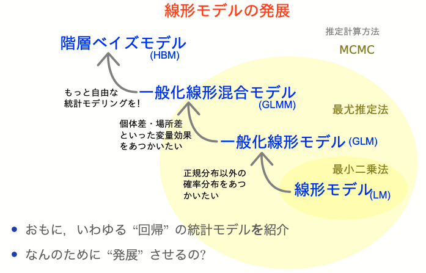

+++
url = "iwate2023stats/3-glm.html"
linktitle = "尤度、最尤推定、一般化線形モデル、個体差"
title = "3. 尤度、最尤推定、一般化線形モデル、個体差 — 統計モデリング入門 2023 岩手連大"
date = 2023-06-28T18:00:00+09:00
draft = false
css = "style.css"
dpi = 100
+++

# [統計モデリング入門 2023 岩手連大](.)

<div class="author">
岩嵜 航 (Watal M. Iwasaki, PhD)
</div>

<div class="affiliation">
東北大学 生命科学研究科 進化ゲノミクス分野 特任助教<br>
(Graduate School of Life Sciences, Tohoku University)
</div>

<ol>
<li><a href="1-introduction.html">導入、Rの基礎</a>
<li><a href="2-distribution.html">直線回帰、確率分布</a>
<li class="current-deck"><a href="3-glm.html">尤度、最尤推定、一般化線形モデル、個体差</a>
<li><a href="4-bayesian.html">ベイズの定理、事後分布、MCMC、Stan</a>
</ol>

<div class="footnote">
2023-06-28 岩手大学 連合農学研究科<br>
<a href="https://heavywatal.github.io/slides/iwate2023stats/">https://heavywatal.github.io/slides/iwate2023stats/</a>
</div>


---
## 有名な確率分布対応関係ふりかえり

<figure style="float: right;">
<br>
</figure>

離散一様分布
: コインの表裏、サイコロの出目1–6

負の二項分布 (幾何分布 if n = 1)
: 成功率pの試行がn回成功するまでの失敗回数

二項分布
: 成功率p、試行回数nのうちの成功回数

ポアソン分布
: 単位時間あたり平均$\lambda$回起こる事象の発生回数

ガンマ分布 (指数分布 if k = 1)
: ポアソン過程でk回起こるまでの待ち時間

正規分布
: 確率変数の和、平均値。使い勝手が良く、よく登場する。


---
## データに分布をあてはめたい

ある植物を50個体調べて、それぞれの種子数Xを数えた。<br>
個体Aは種2個、個体Bは種4個、、、サンプルサイズ n = 50 のデータ。


カウントデータだし形も<span class="fragment custom blur">ポアソン</span>分布っぽい。<br>
分布のパラメータ $\lambda$ はどれくらいがいいだろう？


---
## データに分布をあてはめたい

ある植物を50個体調べて、それぞれの種子数Xを数えた。<br>
個体Aは種2個、個体Bは種4個、、、サンプルサイズ n = 50 のデータ。


カウントデータだし形もポアソン分布っぽい。<br>
分布のパラメータ $\lambda$ はどれくらいがいいだろう？

黒が観察データ。<span style="color: #56B4E9;">青がポアソン分布</span>。
よく重なるのは $\lambda \approx 3$ くらいか。


---
## <ruby>尤<rt>ゆう</rt>度</ruby> (likelihood)

<ruby>尤<rt>もっと</rt></ruby>もらしさ。
モデルのあてはまりの良さの尺度のひとつ。

**あるモデル$M$の下でそのデータ$D$が観察される確率**。<br>
定義通り素直に書くと<br>
$\text{Prob}(D \mid M)$

データ$D$を固定し、モデル$M$の関数とみなしたものが**尤度関数**:<br>
$L(M \mid D)$

モデルの構造も固定してパラメータ$\theta$だけ動かす場合はこう書く:<br>
$L(\theta \mid D)$ とか $L(\theta)$ とか


---
## 尤度を手計算できる例

コインを5枚投げた結果 $D$: 表 4, 裏 1

表が出る確率 $p = 0.5$ と仮定:
<div>\[\begin{split}
L(0.5 \mid D)
  &= \binom 5 1 \times \text{Prob}(表 \mid 0.5) ^ 4 \times \text{Prob}(裏 \mid 0.5) ^ 1 \\
  &= 5 \times 0.5 ^ 4 \times 0.5 ^ 1 = 0.15625
\end{split}\]</div>

表が出る確率 $p = 0.8$ と仮定:
<div>\[\begin{split}
L(0.8 \mid D)
  &= \binom 5 1 \times \text{Prob}(表 \mid 0.8) ^ 4 \times \text{Prob}(裏 \mid 0.8) ^ 1 \\
  &= 5 \times 0.8 ^ 4 \times 0.2 ^ 1 = 0.4096
\end{split}\]</div>

$L(0.8 \mid D) > L(0.5 \mid D)$

$p = 0.8$ のほうがより尤もらしい。


---
## 種子数ポアソン分布の例でも尤度を計算してみる

$n = 50$個体ぶん、且つ、且つ、且つ、と確率を掛けていく:

<div>\[\begin{split}
L(\lambda \mid D)
  = \prod _i ^n \text{Prob}(X_i \mid \lambda)
  = \prod _i ^n \frac {\lambda ^ {X_i} e ^ {-\lambda}} {X_i !}
\end{split}\]</div>


この中では $\lambda = 3$ がいいけど、より尤もらしい値を求めたい。

---
## 最尤推定 <u>M</u>aximum <u>L</u>ikelihood <u>E</u>stimation

扱いやすい **対数尤度** (log likelihood) にしてから計算する。<br>
一階微分が0になる $\lambda$ を求めると...**標本平均**と一致。

<div>\[\begin{split}
\log L(\lambda \mid D)
  &= \sum _i ^n \left[ X_i \log (\lambda) - \lambda - \log (X_i !) \right] \\
\frac {\mathrm d \log L(\lambda \mid D)} {\mathrm d \lambda}
  &= \frac 1 \lambda \sum _i ^n X_i - n = 0 \\
\hat \lambda &= \frac 1 n \sum _i ^n X_i
\end{split}\]</div>


---
## 最尤推定を使っても“真のλ”は得られない

今回のデータは真の生成ルール“$X \sim \text{Poisson}(\lambda = 3.0)$”で作った。<br>
「50個体サンプル→最尤推定」を1,000回繰り返してみると:


サンプルの取れ方によってはかなりズレた推定をしてしまう。<br>
(標本データへのあてはまりはかなり良く見えるのに！)


---
## サンプルサイズを増やすほどマシにはなる

“$X \sim \text{Poisson}(\lambda = 3.0)$”からnサンプル→最尤推定を1,000回繰り返す:


Q. じゃあどれくらいのサンプル数nを確保すればいいのか？<br>
A. 推定したい統計量とか、許容できる誤差とかによる。


---
## すべてのモデルは間違っている

確率分布がいい感じに最尤推定できたとしても、<br>
それはあくまでモデル。仮定。近似。

> All models are wrong, but some are useful. --- George E. P. Box

<figure>
<br>
<figcaption><cite>「データ分析のための数理モデル入門」江崎貴裕 2020 より改変</cite></figcaption>
</figure>


---
## 統計モデリングの道具 --- まとめ

- 何はともあれ作図して俯瞰
- **確率変数** $X$
- **確率分布** $X \sim f(\theta)$
    - **少ないパラメータ** $\theta$ でばらつきの様子を表現
    - **この現象はこの分布を作りがち(〜に従う)** という知見がある
- **尤度**
    - あるモデルでこのデータになる確率 $\text{Prob}(D \mid M)$
    - データ固定でモデル探索 → **尤度関数** $L(M \mid D),~L(\theta \mid D)$
    - 対数を取ったほうが扱いやすい → **対数尤度** $\log L(M \mid D)$
    - これを最大化するようなパラメータ $\hat \theta$ 探し ＝ **最尤法**


---
## 🔰 尤度の練習問題

サイコロを10回振ったら6の目が3回出た。

1. 6の目の出る確率が1/6だとした場合の尤度は?
1. 6の目の出る確率が0.2だとした場合の尤度は?
1. 横軸を6の目の出る確率、縦軸を対数尤度とするグラフを描こう。
1. このサイコロで6の目が出る確率を最尤推定しよう。<br>
   数学で解ければ**優**。Rで見つければ**良**。目分量・勘で**可**。

ヒント
: 確率pで当たるクジをn回引いてk回当たる確率、と同じ計算を使う。
: 数学の $\binom 5 2 = {}_5 \mathrm{C} _2 = 10$ はRでは `choose(5, 2)` 。


---
## 🔰 分布を当てはめる練習問題

1. データの分布を描いてみる
1. 理論分布のどれが当てはまりそうか検討する
1. 理論分布を適当なパラメータで描いてみる
1. 尤度を計算しつつ擦り寄せる


<div class="column-container">
  <div class="column">

[`radiation.tsv`](data/radiation.tsv)

```
           time label
  1   0.1125739     A
  2   0.3140102     A
  3   0.3277063     A
  4   0.6970379     C
 --                  
597 231.2013532     A
598 232.1383628     B
599 232.4407758     C
600 232.7671255     B
```

  </div>
  <div class="column">

[`gacha.csv`](data/gacha.csv)

```
    trials hit
  1     10   1
  2     10   2
  3     10   3
  4     10   0
 --           
597     10   2
598     10   0
599     10   1
600     10   1
```

  </div>
</div>


---
## ちょっとずつ線形モデルを発展させていく

**線形モデル LM** (単純な直線あてはめ)

<span style="color: #888888;">&nbsp; &nbsp; ↓ いろんな<span style="font-weight: bold; color: #56B4E9;">確率分布</span>を扱いたい</span>

**一般化線形モデル GLM**

<span style="color: #888888;">&nbsp; &nbsp; ↓ 個体差などの変量効果を扱いたい</span>

**一般化線形混合モデル GLMM**

<span style="color: #888888;">&nbsp; &nbsp; ↓ もっと自由なモデリングを！</span>

**階層ベイズモデル HBM**

<cite>[データ解析のための統計モデリング入門](https://amzn.to/33suMIZ) 久保拓弥 2012 より改変</cite>

<hr>

<span style="font-weight: bold; color: #56B4E9;">確率分布</span>に長い時間を割いたけど、元はと言えば**回帰**したいのでした。


---
## ここまでに見た統計モデル

確率変数$X$はパラメータ$\theta$の確率分布$f$に“従う”:&nbsp;
$X \sim f(\theta) $

e.g., ある植物が作る種の数$X$は平均値$\lambda$のポアソン分布に従う:

<div>\[\begin{split}
X \sim \text{Poisson}(\lambda)
\end{split}\]</div>


これを一般化線形モデル(GLM)として見ることもできる→

---
## 一般化線形モデル(GLM)として記述してみる

個体$i$の種子数$y_i$は平均値$\lambda_i$のポアソン分布に従う。<br>
平均値$\lambda_i$は**他のデータによらず$\beta_0$で一定**。

<div>\[\begin{split}
y_i &\sim \text{Poisson}(\lambda_i) \\
\lambda_i &= \beta_0
\end{split}\]</div>


種子数をY軸にして、式を2つに分けただけ...?<br>
**説明変数**を含むモデルを見ればご利益が分かるかも。

---
## 説明変数が1つある一般化線形モデル

個体$i$の種子数$y_i$は<span style="color: #3366ff;">平均値$\lambda_i$</span>の<span style="color: #56B4E9;">ポアソン分布</span>に従う。<br>
平均値の対数$\log(\textcolor{#3366ff}{\lambda_i})$は**その個体の大きさ$x_i$に比例**する。

<div class="column-container">
  <div class="column" style="flex-shrink: 1.0;">

<figure style="margin-block: 1rem;">
<br>
</figure>

  </div>
  <div class="column" style="flex-shrink: 1.0;">


  </div>
</div>

この場合は**単回帰**。説明変数が複数あると**重回帰**。


---
## 複数の説明変数を同時に扱う重回帰

<p>\[\begin{split}
y_i &\sim \text{Poisson}(\lambda_i) \\
\log(\lambda_i) &= \beta_0 + \beta_1 x_{1i} + \beta_2 x_{2i} + \ldots
\end{split}\]</p>

気温も湿度も高いほどビールが売れる架空データ:


ほかの**確率分布**と**リンク関数**を使う例を見てみよう。


---
## ロジスティック回帰

- 確率分布: **二項分布**
- リンク関数: $\text{logit}(p) = \log \frac {p} {1 - p}$

何かの成否に対する何かの因子の影響、とか

<div class="column-container">
  <div class="column" style="flex-shrink: 1.0; padding-top: 1rem;">

客10人中$y_i$人がビールを注文。<br>
その日$i$の気温$x_i$によって割合が変化。

<p>\[\begin{split}
y_i &\sim \text{Binomial}(n,~p_i) \\
\text{logit}(p_i) &= \beta_0 + \beta_1 x_i \\
p_i &= \frac 1 {1 + e^{-(\beta_0 + \beta_1 x_i)}}
\end{split}\]</p>

ロジスティック関数↑

  </div>
  <div class="column" style="flex-shrink: 1.0;">


  </div>
</div>

???
ロジット = 対数オッズ
オッズ = 失敗の何倍成功しやすいか
Xが1増えるとオッズがe^a倍に増える。


---
## ロジスティック回帰 (狭義)

- 確率分布: **ベルヌーイ分布** ($n = 1$ の二項分布)
- リンク関数: $\text{logit}(p) = \log \frac {p} {1 - p}$

何かの成否に対する何かの因子の影響、とか

<div class="column-container">
  <div class="column" style="flex-shrink: 1.0; padding-top: 1rem;">

風が吹けば桶屋が儲かる。

<p>\[\begin{split}
y_i &\sim \text{Bernoulli}(p_i) \\
  &= \text{Binomial}(1,~p_i) \\
\text{logit}(p_i) &= \beta_0 + \beta_1 x_i \\
p_i &= \frac 1 {1 + e^{-(\beta_0 + \beta_1 x_i)}}
\end{split}\]</p>

ロジスティック関数↑

  </div>
  <div class="column" style="flex-shrink: 1.0;">


  </div>
</div>


---
## 一般線形モデル (“化”無し) はGLMの一種

- 確率分布: **正規分布**
- リンク関数: **恒等関数**(なにもせずそのまま)

<div class="column-container">
  <div class="column" style="flex-shrink: 1.0; padding-top: 1rem;">

<p>\[\begin{split}
y_i &\sim \mathcal{N}(\mu_i,~\sigma^2) \\
\text{identity}(\mu_i) &= \beta_0 + \beta_1 x_i
\end{split}\]</p>

  </div>
  <div class="column" style="flex-shrink: 1.0;">


  </div>
</div>

最小二乗法の直線あてはめと結果的に同じになる。

<small style="color: #999999;">単回帰・重回帰と言ったとき一般線形モデルを前提とする人もいる。</small>

---
## 分散分析 (<u>An</u>alysis <u>o</u>f <u>va</u>riance, ANOVA) as GLM

**質的な説明変数**を持つ**正規分布・恒等リンク**のGLM、と解釈可能。<br>
<span title="ダミー変数とも呼ばれる">**指示変数**</span> (0 or 1) に変換してから重回帰する。

<div class="column-container">
  <div class="column" style="flex-shrink: 1.0; padding-top: 1rem;">

| 天気 | → | $x_1$ ☀️ 晴れ | $x_2$ ☔️ 雨 |
| ---- | :-: | :---: | :---: |
| ☁️ くもり | | 0 | 0 |
| ☀️ 晴れ | | 1 | 0 |
| ☔️ 雨 | | 0 | 1 |

<p>\[\begin{split}
y_i &\sim \mathcal{N}(\mu_i,\sigma^2) \\
\mu_i &= \beta_0 + \beta_1 x_{1i} + \beta_2 x_{2i}
\end{split}\]</p>

  </div>
  <div class="column" style="flex-shrink: 1.3;">


  </div>
</div>

くもり☁️ $\beta_0$ を基準に、晴れの効果☀️ $\beta_1$ と雨の効果☔️ $\beta_2$ が求まる。

GLMなら確率分布・リンク関数を変えてもっと柔軟にモデリングできる。


---
## 共分散分析 (<u>An</u>alysis of <u>cova</u>riance, ANCOVA) as GLM

**質的変数と量的変数を両方**含むGLM、と解釈可能。<br>
正規分布・等分散・恒等リンクなどが仮定される。


<div class="column-container">
  <div class="column" style="flex-shrink: 1.0; padding-top: 1rem;">

| 天気 | → | $x_1$ ☀️ 晴れ | $x_2$ ☔️ 雨 |
| ---- | :-: | :---: | :---: |
| ☁️ くもり | | 0 | 0 |
| ☀️ 晴れ | | 1 | 0 |
| ☔️ 雨 | | 0 | 1 |

<p>\[\begin{split}
y_i &\sim \mathcal{N}(\mu_i,\sigma^2) \\
\mu_i &= \beta_0 + \beta_1 x_{1i} + \beta_2 x_{2i} + \beta_3 x_{3i}
\end{split}\]</p>

  </div>
  <div class="column" style="flex-shrink: 1.3;">


  </div>
</div>

GLMなら確率分布・リンク関数を変えてもっと柔軟にモデリングできる。


---
## 交互作用

ある説明変数の効果が、別の説明変数によって異なる。<br>
e.g., ビール売上の温度依存性が天気によって異なる。

<div class="column-container">
  <div class="column" style="flex-shrink: 1.0; padding-top: 0.1rem;">

| 天気 | $x_1$ |
| ---- | :---: |
| ☀️ 晴れ | 1 |
| ☔️ 雨 | 0 |

<p>\[\begin{split}
y_i &\sim \mathcal{N}(\mu_i,\sigma^2) \\
\mu_i &= \beta_0 + \beta_1 x_{1i} + \beta_2 x_{2i} + \beta_{1,2} x_{1i} x_{2i}
\end{split}\]</p>

雨の日は $x_{1i} = 0$ のため $\beta_0,~\beta_2$ の項だけ。<br>
晴れの日はそれに加えて $\beta_1,~\beta_{1,2}$ の項も。

  </div>
  <div class="column" style="flex-shrink: 1.3;">


  </div>
</div>


解釈が一気に難しくなるのでむやみに使わない。


---
## 一般化線形モデル(GLM)ふりかえり

確率分布・リンク関数を変えて柔軟にモデリングできる。<br>
特定の組み合わせには名前がある。

| 名前 | 確率分布 | リンク関数 | 説明変数 |
| ---- | -------- | -------- | -------- |
|ポアソン回帰|ポアソン分布|log| |
|ロジスティック回帰|二項分布|logit| |
|一般線形回帰|正規分布|恒等| |
|分散分析|正規分布|恒等|質的変数|
|共分散分析|正規分布|恒等|質的変数+量的変数|

確率分布については[前章を参照](2-distribution.html)。<br>
リンク関数をもう少しだけ掘り下げたい。


---
## リンク関数

統計モデリングにおいて「まっすぐ以外も表現できる」意味

$\text{identity}(\mu_i)$
: $\mu_i = \beta_0 + \beta_1 x_{1i} + \beta_2 x_{2i} + \ldots$
: 説明変数の効果が**足し算**的に働く。

$\log(\lambda_i)$
: $\lambda_i = e^{\beta_0 + \beta_1 x_{1i} + \beta_2 x_{2i} + \ldots} = e^{\beta_0} \times e^{\beta_1 x_{1i}} \times e^{\beta_2 x_{2i}} \times \ldots$
: 説明変数の効果が**掛け算**的に働く。<br>
  e.g., $\Delta x_1$ 増えると $e^{\beta_1 \Delta x_{1}}$ 倍になる

$\text{logit}(p_i)$
: $p_i = \frac 1 {1 + e^{-(\beta_0 + \beta_1 x_i + \ldots)}} $ (ロジスティック関数)
: 説明変数の効果が**頭打ち**になる。<br>
  e.g., $\lim_{x \to -\infty} p = 0;~\lim_{x \to \infty} p = 1$

ほかに `probit`, `inverse`, `sqrt`, etc.


---
## RにおけるGLMのやりかた

直線回帰のときの `lm` とほぼ同じ。


```r
formula = weight ~ height
fit = glm(formula, data = df_weight)
coef(fit)
```

```
(Intercept)      height 
  -69.85222    78.63444 
```

デフォルトは正規分布・恒等リンクで `lm` と同じ結果。<br>
`family=` オプションで確率分布とリンク関数を明示的に指定:
```r
glm(formula, family = gaussian(link = identity), data = mydata)
glm(formula, family = poisson(link = log), data = mydata)
glm(formula, family = binomial(link = logit), data = mydata)
```

See [`?family`](https://stat.ethz.ch/R-manual/R-patched/library/stats/html/family.html) for more details.


---
## 🔰 とにかくGLMを使ってみる練習

とりあえず当てはめと作図だけ。<br>
結果の解釈やモデルの評価はこの後。


```r
n = 50
df_weight = tibble::tibble(
  height = rnorm(n, 1.70, 0.05),
  bmi = rnorm(n, 22, 1),
  weight = bmi * (height**2)
) |>
  print()
```

```
     height      bmi   weight
 1 1.718019 21.55500 63.62151
 2 1.782862 22.83775 72.59199
 3 1.617464 22.43569 58.69604
 4 1.678291 23.37245 65.83231
--                           
47 1.762930 21.78337 67.70106
48 1.744133 21.47257 65.31960
49 1.730495 19.72866 59.07966
50 1.676496 22.85824 64.24627
```

---
## 🔰 とにかくGLMを使ってみる練習 解答例


```r
fit_wh = glm(weight ~ height, family = gaussian(link = identity), data = df_weight)
coef(fit_wh)
```

```
(Intercept)      height 
  -69.85222    78.63444 
```

```r
df_fit_wh = modelr::add_predictions(df_weight, fit_wh, type = "response")
ggplot(df_fit_wh) +
  aes(height, weight) +
  geom_point() +
  geom_line(aes(y = pred), linewidth = 1, color = "#3366ff")
```


---
## 🔰 ポアソン回帰


```r
n = 300L
a = 3
b = -3
df_seeds = tibble::tibble(
  body_mass = runif(n, 0.4, 1.7),
  num_seeds = rpois(n, exp(a * body_mass + b))
) |>
  print()
```

```
    body_mass num_seeds
  1 0.9185923         1
  2 0.5154446         0
  3 1.3362802         4
  4 1.6858125        11
 --                    
297 1.3407210         3
298 1.3357421         1
299 0.8928759         0
300 0.4583795         0
```

---
## 🔰 重回帰

`pred` で回帰線を引くには `add_predictions()` の使い方に工夫が必要。<br>
とりあえず `geom_point()` で"回帰点々"を表示してみるとこまでで可とする。


```r
n = 200L
true_coef = c(3, 0.05, 0.006)
df_beer = tibble::tibble(
  temperature = runif(n, 8, 32),
  humidity = runif(n, 20, 80),
  beer_sales = rpois(n, exp(true_coef[1] + true_coef[2] * temperature + true_coef[3] * humidity))
) |>
  print()
```

```
    temperature humidity beer_sales
  1    17.57401 54.68339         67
  2    10.13129 67.34727         55
  3    25.28517 40.93855        104
  4    31.73808 32.14308        113
 --                                
197    26.28116 41.89173        105
198    23.53532 73.12257        113
199    13.87494 41.92560         51
200    31.60519 61.47984        140
```

---
## 🔰 ロジスティック回帰

次ページにヒント。


```r
sigmoid = function(x, gain = 1) {1 / (1 + exp(-gain * x))}
nrep = 200L
n = 10L
df_logistic = tibble::tibble(
  x = runif(nrep, -10, 35),
  logit_p = -3 + 0.3 * x,
  p = sigmoid(logit_p),
  y = rbinom(nrep, n, p),
  response = matrix(c(y, n - y), ncol = 2)
) |>
  print()
```

```
            x    logit_p          p  y response[,1] [,2]
  1  7.951271 -0.6146188 0.35100632  4            4    6
  2 -6.003840 -4.8011520 0.00815325  0            0   10
  3 22.409698  3.7229095 0.97640654 10           10    0
  4 34.508895  7.3526686 0.99935953 10           10    0
 --                                                     
197 24.277180  4.2831541 0.98638875 10           10    0
198 19.128721  2.7386162 0.93926720  8            8    2
199  1.015520 -2.6953441 0.06324865  0            0   10
200 34.259733  7.2779199 0.99930986 10           10    0
```

---
## ロジスティック回帰のヒント

左辺の応答変数に指定できるのはだいたい次の2種類:
- 成功を1、失敗を0で表す整数vector (狭義のロジスティック回帰)
- 1列目が成功回数、2列目が失敗回数の整数matrix

今回の場合、成功回数 `y` だけをformulaに入れると怒られる

```r
glm(y ~ x, df_logistic, family = binomial)
```

```
Error in eval(family$initialize): y values must be 0 <= y <= 1
```
ので失敗回数もモデルに含むよう `response ~ x` とする。

(今回のように試行回数が10回固定じゃなくても使える、ということ)


---
## 🔰 共分散分析: GLM with 質的変数 + 量的変数

まずはweatherだけで分散分析、次にtemperatureを入れて共分散分析。


```r
n = 200L
b = c(70, 3, 20, -20)  # true coef
weather_levels = c("sunny", "cloudy", "rainy")
df_ancova = tibble::tibble(
    temperature = runif(n, 8, 32),
    weather = factor(sample(weather_levels, n, TRUE), levels = weather_levels)
  ) |>
  dplyr::mutate(name = weather, value = 1L) |>
  tidyr::pivot_wider(values_fill = 0L) |>
  dplyr::select(!cloudy) |>
  dplyr::mutate(mu = b[1] + b[2] * temperature + b[3] * sunny + b[4] * rainy) |>
  dplyr::mutate(beer_sales = rnorm(n, mu, 10)
) |>
  print()
```

```
    temperature weather sunny rainy        mu beer_sales
  1   23.377217  cloudy     0     0 140.13165  129.36288
  2   26.043088  cloudy     0     0 148.12926  138.26966
  3   30.830351  cloudy     0     0 162.49105  141.46190
  4   15.022311  cloudy     0     0 115.06693  108.18593
 --                                                     
197    8.277514  cloudy     0     0  94.83254   74.38321
198   28.675228   rainy     0     1 136.02568  140.34777
199   27.310881   rainy     0     1 131.93264  122.31587
200   24.064285   sunny     1     0 162.19286  144.89368
```

---
## 🔰 交互作用


```r
n = 200L
b = c(70, 3, 100, -2)  # true coef
weather_levels = c("sunny", "rainy")
df_interact = tibble::tibble(
    temperature = runif(n, 8, 32),
    weather = factor(sample(weather_levels, n, TRUE), levels = weather_levels)
  ) |>
  dplyr::mutate(name = weather, value = 1L) |>
  tidyr::pivot_wider(values_fill = 0L) |>
  dplyr::mutate(mu = b[1] * sunny + b[2] * temperature + b[3] * rainy + b[4] * temperature * rainy) |>
  dplyr::mutate(beer_sales = rnorm(n, mu, 10)) |>
  print()
```

```
    temperature weather rainy sunny        mu beer_sales
  1   23.377217   rainy     1     0 123.37722   116.2995
  2   26.043088   rainy     1     0 126.04309   133.9018
  3   30.830351   rainy     1     0 130.83035   130.6798
  4   15.022311   rainy     1     0 115.02231   117.5620
 --                                                     
197    8.277514   sunny     0     1  94.83254   104.2573
198   28.675228   sunny     0     1 156.02568   155.3134
199   27.310881   rainy     1     0 127.31088   131.0297
200   24.064285   sunny     0     1 142.19286   142.8241
```

---
## データはひとつ、モデルはたくさん

どう選ぶ？

1. メカニズム的に納得できるものを選ぶ
    - ポアソン過程の**カウント**ならポアソン分布、**間隔**ならガンマ分布
    - n回中k回のように**割合的なカウント**なら二項分布
1. データを可視化してみて、それっぽい形・性質のものを選ぶ
    - **左右対称のひと山**ならとりあえず正規分布
    - **負の値を取らない**ならガンマ分布
    - 直線的か、指数関数的か、頭打ちか、などなど

客観的な指標もほしい。<br>
モデルの尤もらしさといえば...


---
## <ruby>尤<rt>ゆう</rt>度</ruby> (likelihood)

**あるモデル$M$の下でそのデータ$D$が観察される確率**:<br>
$\text{Prob}(D \mid M)$

データ$D$を固定し、モデル$M$の関数とみなしたものが**尤度関数**:<br>
$L(M \mid D)$

モデルの構造も固定してパラメータ$\theta$だけ動かす場合はこう書く:<br>
$L(\theta \mid D)$ or $L(\theta)$

**対数尤度** $\log L$ の形にしたほうがいろいろ便利。

<hr>

各モデルで最適なパラメータを探して、比較:<br>
$\log L^* (M_1) \text{ vs. } \log L^* (M_2) \text{ vs. } \log L^* (M_3) \ldots$


```r
broom::glance(fit)
```

```
  null.deviance df.null    logLik      AIC      BIC deviance df.residual nobs
1      1305.043      49 -124.9298 255.8597 261.5957 433.2606          48   50
```

---
## たしかに尤度はあてはまりの良さを表してそう

この場合は直線回帰よりもポアソン回帰が良さそう:


この調子で、より尤度の高いモデルを探していけばいいだろうか？

---
## あてはまりが良ければいいってもんでもない

過剰適合 / 過学習 / overfitting
: パラメータを増やせば**現データへの**適合度・尤度を高くできるが、<br>
  予測・理解の役には立たなくなる。


**帰無モデル**: 説明変数なし。切片のみ。<br>
**飽和モデル**: データ点の数 ≤ パラメータの数。“データ読み上げ”的モデル


---
## 無駄な説明変数を加えても尤度は上がる

ある植物が作る種の数 $y$ は個体のサイズ $x$ に応じて増える。<br>
観察時に着てた服の色 $x_2$ を追加すると尤度が上がる......?


---
## AIC: 赤池情報量基準

<p>\[\begin{split}
\text{AIC} = -2 (\log L^* - k) = -2 \log L^* + 2k
\end{split}\]</p>

- **AICが小さいほど予測精度の良いモデル**。
    - 尤度は上げたい。
    - パラメータ数 $k$ が増えるとペナルティ。
- どのデータに対する当てはまりを目指すかという観点
    - 「手元のデータ」に対する対数尤度は $\log L^*$<br>
    - 「真のメカニズムから出てくる未来のデータ」に対する<br>
      平均対数尤度の推定量は $(\log L^* - k)$<br>
      (Kullback--Leibler情報量を使って導出するらしい)


```r
broom::glance(fit)
```

```
  null.deviance df.null    logLik      AIC      BIC deviance df.residual nobs
1      1305.043      49 -124.9298 255.8597 261.5957 433.2606          48   50
```

???
https://www.slideshare.net/logics-of-blue/1-6aic


---
## 無駄な説明変数の追加でAIC増加

ある植物が作る種の数 $y$ は個体のサイズ $x$ に応じて増える。<br>
観察時に着てた服の色 $x_2$ を追加したモデルはAICが増加。


---
## ほかの情報量基準

- $\text{BIC} = -2 \log L^* + k \log n$
    - パラメータ数 $k$ でペナルティを付けるのはAICと同じ。
    - データの観測数 $n$ に依存する点でAICと異なる。<br>
      感覚としては「AICはデータサイズによるペナルティが無い」
    - (周辺尤度の最大化という観点で導出するらしい)
- [WAIC](http://watanabe-www.math.dis.titech.ac.jp/users/swatanab/waic2011.html),
  [WBIC](http://watanabe-www.math.dis.titech.ac.jp/users/swatanab/wbic2012.html)
    - AIC, BICを一般化し、広く使えるようにしたもの。
    - 理想的な条件ではそれぞれAIC, BICとほぼ同じ。<br>
      そうじゃない場合(現実的には常に)こちらが優位。
    - WAICは予測の良さ、WBICは真のモデルへの近さ、を表す。


---
## モデル選択の心構え

「正しい」ものを選べるわけではない。<br>
予測・理解に useful なものを何らかの基準で選ぶだけ。

> All models are wrong, but some are useful. --- George E. P. Box

<figure>
<br>
<figcaption><cite>「データ分析のための数理モデル入門」江崎貴裕 2020 より改変</cite></figcaption>
</figure>


---
## 現実的な注意点・悩みどころ

- 多重共線性(multicollinearity):
    - 説明変数同士が強い相関関係にある
- 変数変換:
    - 気安くやるべきじゃないけど、対数変換などしばしば有用
    - 割り算した値は危険
- 交互作用を入れると解釈が難しくなる。


---
## 一般化線形モデル座学まとめ

- 何はともあれ散布図を描く
- 適切な確率分布・リンク関数・説明変数を考える
- パラメータを最尤推定する
- 尤度は「手元のデータへのあてはまり」
- モデルを比較するときは情報量基準を参考にする


---
## penguinsデータセット

<a href="https://allisonhorst.github.io/palmerpenguins/">
<cite>https://allisonhorst.github.io/palmerpenguins/</cite><br>


</a>

```r
install.packages("palmerpenguins")
library(palmerpenguins)
penguins_colors = c(Adelie = "darkorange", Chinstrap = "purple", Gentoo = "cyan4")
print(penguins)
```


---
## penguinsデータセット

<a href="https://allisonhorst.github.io/palmerpenguins/">
<cite>https://allisonhorst.github.io/palmerpenguins/</cite><br>


</a>


```
      species    island bill_length_mm bill_depth_mm flipper_length_mm body_mass_g    sex year
  1    Adelie Torgersen           39.1          18.7               181        3750   male 2007
  2    Adelie Torgersen           39.5          17.4               186        3800 female 2007
  3    Adelie Torgersen           40.3          18.0               195        3250 female 2007
  4    Adelie Torgersen             NA            NA                NA          NA     NA 2007
 --                                                                                           
341 Chinstrap     Dream           43.5          18.1               202        3400 female 2009
342 Chinstrap     Dream           49.6          18.2               193        3775   male 2009
343 Chinstrap     Dream           50.8          19.0               210        4100   male 2009
344 Chinstrap     Dream           50.2          18.7               198        3775 female 2009
```

---
## 欠損値のある行を取り除いておく

性別はとりあえず使わないので、体長関連だけでも。


```r
penguins |> dplyr::filter(dplyr::if_any(everything(), is.na))
```

```
   species    island bill_length_mm bill_depth_mm flipper_length_mm body_mass_g sex year
 1  Adelie Torgersen             NA            NA                NA          NA  NA 2007
 2  Adelie Torgersen           34.1          18.1               193        3475  NA 2007
 3  Adelie Torgersen           42.0          20.2               190        4250  NA 2007
 4  Adelie Torgersen           37.8          17.1               186        3300  NA 2007
--                                                                                      
 8  Gentoo    Biscoe           46.2          14.4               214        4650  NA 2008
 9  Gentoo    Biscoe           47.3          13.8               216        4725  NA 2009
10  Gentoo    Biscoe           44.5          15.7               217        4875  NA 2009
11  Gentoo    Biscoe             NA            NA                NA          NA  NA 2009
```

```r
penguins_dropna = penguins |> tidyr::drop_na(body_mass_g)
dim(penguins_dropna)
```

```
[1] 342   8
```

---
## 🔰 penguinsでGLMの練習

次の課題を解いてみよう。<br>
(次ページ以降に解答。まずは自力で。)

1. `body_mass_g` を横軸、 `flipper_length_mm` を縦軸に、まず作図。
1. 単回帰して、切片と傾きを求める。そして作図。
1. `species` で色分けして作図。
1. `species` も説明変数に加えて重回帰し、切片と傾きを求める。そして作図。
1. 余裕があれば、クチバシの長さと深さを縦横軸にして同様の解析。


---
## 単回帰の練習: 1. まず作図

どうやら、重いペンギンほど翼長も長い。


```r
p_penweight = ggplot(penguins_dropna) +
  aes(body_mass_g, flipper_length_mm) +
  geom_point(shape = 16, alpha = 0.66) +
  theme_bw(base_size = 20) +
  theme(panel.grid.minor = element_blank())
p_penweight
```


---
## 単回帰の練習: 2. モデル作成、フィッティング

とりあえずデフォルトの正規分布・恒等リンク。
$y = 136.7 + 0.0153 x$


```r
fit1 = glm(flipper_length_mm ~ body_mass_g, data = penguins_dropna)
broom::tidy(fit1)
```

```
         term     estimate   std.error statistic       p.value
1 (Intercept) 136.72955927 1.996835406  68.47312 5.712947e-201
2 body_mass_g   0.01527592 0.000466836  32.72223 4.370681e-107
```

```r
broom::glance(fit1)
```

```
  null.deviance df.null    logLik      AIC     BIC deviance df.residual nobs
1      67426.54     341 -1145.518 2297.035 2308.54  16250.3         340  342
```

---
## 単回帰の練習: 3. フィッティング結果を作図

結果とデータから予測値を作って回帰線を引く。


```r
added1 = modelr::add_predictions(penguins_dropna, fit1, type = "response")
p1 = p_penweight +
  geom_line(aes(y = pred), data = added1, linewidth = 1, color = "#3366ff")
p1
```


---
## 重回帰の練習: 1. まず作図

種によって色分けしてみると、傾向の違いが見える。


```r
p_penweight_color = p_penweight + aes(color = species) +
  scale_color_manual(values = penguins_colors)
p_penweight_color
```


---
## 重回帰の練習: 2. モデル作成、フィッティング

Adelieを基準に、ChinstrapとGentooはそれより長め。<br>
体重の効果は単回帰のとき(0.0153)より小さい。


```r
fit2 = glm(flipper_length_mm ~ body_mass_g + species, data = penguins_dropna)
broom::tidy(fit2)
```

```
              term     estimate    std.error statistic       p.value
1      (Intercept) 1.588603e+02 2.3865766963 66.564071 2.450113e-196
2      body_mass_g 8.402113e-03 0.0006338976 13.254686  1.401600e-32
3 speciesChinstrap 5.597440e+00 0.7882166229  7.101398  7.334777e-12
4    speciesGentoo 1.567747e+01 1.0906590679 14.374308  6.800823e-37
```

```r
broom::glance(fit2)
```

```
  null.deviance df.null    logLik      AIC      BIC deviance df.residual nobs
1      67426.54     341 -1059.718 2129.437 2148.611 9839.073         338  342
```

---
## 重回帰の練習: 3. フィッティング結果を作図


```r
added2 = modelr::add_predictions(penguins_dropna, fit2, type = "response")
p2 = p_penweight_color +
  geom_line(aes(y = pred), data = added2, linewidth = 1)
p2
```


**傾き**も種によって違うかも。**交互作用**を入れてみたい。


---
## 交互作用の練習: モデル作成、フィッティング

Adelieを基準に、Chinstrapの傾きが結構違う。<br>
切片の違いは解釈しにくくなった。


```r
fit3 = glm(flipper_length_mm ~ body_mass_g * species, data = penguins_dropna)
broom::tidy(fit3)
```

```
                          term      estimate    std.error statistic       p.value
1                  (Intercept) 165.244812649 3.5508916651 46.536146 1.561669e-148
2                  body_mass_g   0.006676867 0.0009522935  7.011354  1.301783e-11
3             speciesChinstrap -13.863939075 7.3012647809 -1.898841  5.844186e-02
4                speciesGentoo   6.059375933 6.0508813200  1.001404  3.173522e-01
5 body_mass_g:speciesChinstrap   0.005228197 0.0019486293  2.683013  7.657147e-03
6    body_mass_g:speciesGentoo   0.002362269 0.0013525781  1.746494  8.163897e-02
```

```r
broom::glance(fit3)
```

```
  null.deviance df.null    logLik      AIC      BIC deviance df.residual nobs
1      67426.54     341 -1055.711 2125.422 2152.265 9611.166         336  342
```

---
## 交互作用の練習: フィッティング結果を作図


```r
added3 = modelr::add_predictions(penguins_dropna, fit3, type = "response")
p3 = p_penweight_color +
  geom_line(aes(y = pred), data = added3, linewidth = 1)
p3
```


---
## ここまでの3つのモデルでどれがいいか？

AICで選ぶなら交互作用入り重回帰が良さそう。


```r
labels = sprintf("AIC = %.1f", AIC(fit1, fit2, fit3)$AIC)
cowplot::plot_grid(p1 + labs(title = labels[1]),
                   p2 + labs(title = labels[2]) + theme(legend.position = "none"),
                   p3 + labs(title = labels[3]) + theme(legend.position = "none"), nrow = 1L)
```


---
## 余裕があったら追加の練習

🔰クチバシの長さと深さで同じ解析をやってみよう。


---
## ちょっとずつ線形モデルを発展させていく

<figure style="float: right;">
<a href="https://kuboweb.github.io/-kubo/ce/IwanamiBook.html">

</a>
</figure>

久保先生の"緑本"こと<br>
「[データ解析のための統計モデリング入門](https://kuboweb.github.io/-kubo/ce/IwanamiBook.html)」<br>
をベースに回帰分析の概要を紹介。

**線形モデル LM** (単純な直線あてはめ)

<span style="color: #888888;">&nbsp; &nbsp; ↓ いろんな**確率分布**を扱いたい</span>

**一般化線形モデル GLM**

<span style="color: #888888;">&nbsp; &nbsp; ↓ <span style="font-weight: bold; color: #E69F00;">個体差</span>などの変量効果を扱いたい</span>

**一般化線形混合モデル GLMM**

<span style="color: #888888;">&nbsp; &nbsp; ↓ もっと自由なモデリングを！</span>

**階層ベイズモデル HBM**


---
## n個のうちy個生存。二項分布に従......わない！

植物100個体から8個ずつ種子を取って植えたら全体で半分ちょい発芽。<br>
親1個体あたりの生存数は<span style="color: #56B4E9;">n=8の二項分布</span>になるはずだけど、<br>
極端な値(全部死亡、全部生存)が多かった。個体差？


---
## 個体差をモデルに組み込みたい

各個体の生存率$p_i$をそのままパラメータにすると**過剰適合**。<br>
「パラメータ数 ≥ サンプルサイズ」の“データ読み上げ”モデル。<br>
i.e., この個体は4個生き残って生存率0.5だね。次の個体は2個体だから......


個体の生存能力をもっと少ないパラメータで表現できないか？


---
## 個体差をモデルに組み込みたい

各個体の生存率$p_i$が能力値$z_i$のシグモイド関数で決まると仮定。<br>
その能力値は全個体共通の正規分布に従うと仮定:
$z_i \sim \mathcal{N}(\hat z, \sigma)$


パラメータ2つで済む: 平均 $\hat z$, ばらつき $\sigma$ 。

前者は標本平均 $\hat p$ から求まるとして、後者どうする？

---
## 個体能力のばらつき $\sigma$ が大きいと両端が増える

普通の二項分布は個体差無し $\sigma = 0$ を仮定してるのと同じ。


---
## zの値で色分けしてみると想像しやすい

正規分布と二項分布の混ぜ合わせ......?


---
## 混合分布。ただの二項分布よりも良いあてはまり。

パラメータp(を決めるz)ごとに二項分布を作って、重み付けして足したもの。


<div align="center">


</div>

---
## 🔰 乱数生成で混合分布を実感してみよう

1. Quarto Markdown を用意する
1. 100個体の能力値zを正規乱数で生成。分布を描く。
1. 各個体の種子生存率pをシグモイド関数で計算。分布を描く。
   ```r
   sigmoid = function(x, gain = 1) {1 / (1 + exp(-gain * x))}
   ```
1. そのpを使って実際の生存種子数を二項分布(n = 8)から生成。分布を描く。
1. 能力の平均や分散の値を変えたらどうなるか見てみる。


---
## ビールの注文数、再び


お客さんたちが注文したビールの杯数X。平均2.74杯。<br>
はいはい、<span style="color: #56B4E9;">ポアソン分布</span>でしょ......
いや、分散が大きいぞ。


全員が同じ平均注文数$\lambda$を持つという仮定が間違ってたのかも。<br>

🔰 平均注文数がガンマ分布に従うと仮定して、乱数生成してみよう。


---
## 負の二項分布 $~\text{NB}(n, p)$

成功率pの試行がn回成功するまでの失敗回数X。
n = 1 のとき幾何分布と一致。


\\[
\text{Prob}(X = k \mid n,~p) = \binom {n + k - 1} k p^n (1 - p)^k
\\]

失敗回数ではなく試行回数を変数とする定義もある。

平均$\lambda$がガンマ分布でばらついたポアソン分布、とも解釈できる。<br>
($k \to \infty$でポアソン分布と一致)

---
## 一般化線形混合モデル GLMM

**固定効果(fixed effects)** のみ扱っていたGLMを拡張して、<br>
**変量効果(random effect)** を混合したモデル。<br>
<small style="color: #999999;">「混合分布を使うモデル」という意味ではないらしい。</small>

<p>\[\begin{split}
y_i &\sim \text{Binomial}(n,~p_i) \\
\text{logit}(p_i) &= \beta_0 + \beta_1 x_{1i} + \beta_2 x_{2i} + \ldots
  + z_{1i} + \ldots \\
z_{1i} &\sim \mathcal{N}(\mu_1,~\sigma_1)
\end{split}\]</p>

e.g.,<br>
個体$i$の種子生存率$p_i$は、<br>
(固定効果) 体サイズ$x_{1i}$と日当たり$x_{2i}$に依存し、<br>
(変量効果) よくわからん個体差$z_{1i}$と植木鉢差$z_{2i}$もある。

---
## 固定効果にするか、変量効果にするか

推定したパラメータを予測に使うなら固定効果

予測に使えそうなので固定効果向き
: - 観測・操作した連続値変数: 長さ、重さ、温度、etc.
: - 観測・操作したカテゴリカル変数: 性別、投薬、etc.

予測に使えないので変量効果向き
: - 観測・操作できなかった個体差:<br>
    たまたま集まってくれた学生15人 {A, B, C, ...}。<br>
    Aさんの固定効果を推定できても、Zさんの予測には使えない。
: - 観測・操作できなかったグループ差:<br>
    ↑の学生をランダム5人ずつに分けたグループ {い、ろ、は}。<br>
    いグループの固定効果を推定できても、また集まることはない。

---
## どういうときに変量効果を考える必要があるか

データに**擬似反復**が含まれるとき。<br>
ぜんぶ独立のつもりで解析すると推定が偏ったり誤ったり。

| 植木鉢 | 個体/植木鉢 | 種子/個体 | 疑似反復 | 推定不可 |
| -----  | ----------- | ----------| ---- | ------ |
| 100個  | 1個体ずつ   | 1個ずつ   | – | 個体差・鉢差 |
| 25個   | 1個体ずつ   | 4個ずつ   | 個体 | 鉢差 |
| 20個   | 5個体ずつ   | 1個ずつ   | 植木鉢 | 個体差 |
| 5個    | 5個体ずつ   | 4個ずつ   | 植木鉢・個体 | – |

疑似反復あり<br>
→ 観測できなかった個体差・場所差(変量効果)を推定可能<br>
→ そのぶんを差し引いて固定効果を推定したい


---
## GLMMの問題点・展望

- 最尤推定の計算が難しくなるので、あまり複雑にはできない
    - ベイズ推定を使えばクリアできる
- GLMの拡張として理解はできても、実際に書くのは難しめ
    - 階層ベイズモデルの一種として見るほうが便利

→ ここでGLMMの練習はせず、階層ベイズモデルに進む。

<figure>
<a href="https://kuboweb.github.io/-kubo/ce/LinksGlm.html">

<figcaption class="url">久保さん https://kuboweb.github.io/-kubo/ce/LinksGlm.html</figcaption>
</a>
</figure>


---
## 一般化線形(混合)モデルまとめ

- 何はともあれ作図して俯瞰
- GLMは統計モデリングの考え方の根幹
    - 確率分布・リンク関数・説明変数
    - 尤度・最尤法によるパラメータ推定
    - 情報量基準などによるモデル選択
- GLMMは現実のデータ解析に向けた強化
    - 疑似反復による変量効果を考慮
    - 階層ベイズモデルとして扱うほうが楽

<a href="4-bayesian.html" class="readmore">
4. ベイズの定理、事後分布、MCMC、Stan
</a>

<!-- install cmdstanr -->
