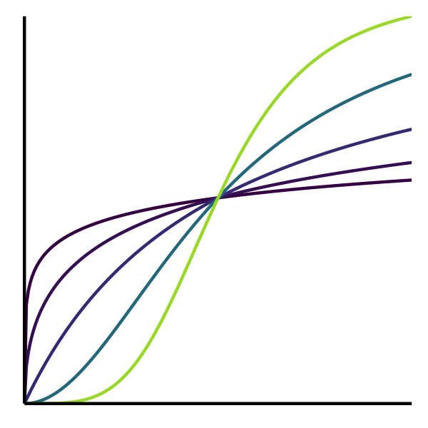
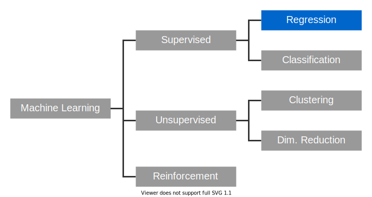
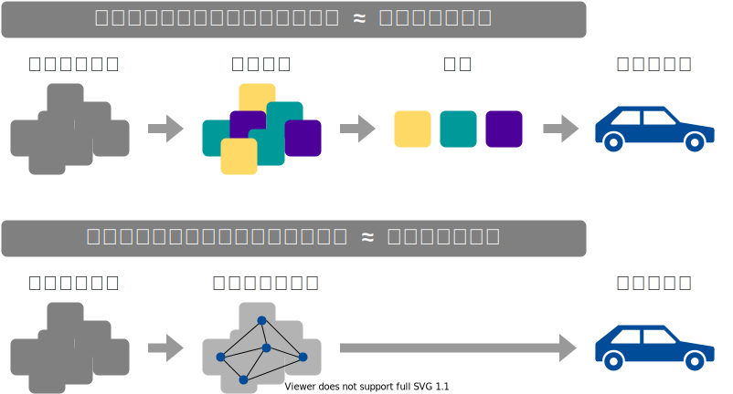

+++
url = "iwate2026stats/1-introduction.html"
linktitle = "導入、直線回帰"
title = "1. 導入、直線回帰 — 統計モデリング入門 2026 岩手連大"
date = 2026-06-22T18:00:00+09:00
draft = false
dpi = 108
+++

# [統計モデリング入門 2026 岩手連大](.)

<div class="author">
岩嵜 航
</div>

<div class="affiliation">
東北大学 生命科学研究科 進化ゲノミクス分野 牧野研 特任助教
</div>

<ol>
<li class="current-deck"><a href="1-introduction.html">導入、直線回帰</a>
<li><a href="2-distribution.html">確率分布、擬似乱数生成</a>
<li><a href="3-likelihood.html">尤度、最尤推定</a>
<li><a href="4-glm.html">一般化線形モデル(GLM)</a>
<li><a href="5-glmm.html">個体差、一般化線形混合モデル(GLMM)</a>
<li><a href="6-bayesian.html">ベイズの定理、事後分布、MCMC</a>
<li><a href="7-stan.html">StanでGLM</a>
<li><a href="8-hbm.html">階層ベイズモデル(HBM)</a>
</ol>

<div class="footnote">
2026-06-22 岩手大学 連合農学研究科<br>
<a href="https://heavywatal.github.io/slides/iwate2026stats/">https://heavywatal.github.io/slides/iwate2026stats/</a>
</div>


---
## データを使ってやりたいこと

- 現象を**理解**したい
- 将来を**予測**したい
- ものを**分類・判別**したい
- 挙動を**制御**したい
- 新しい何かを**生成**したい

そのために解析は必要？
未加工の生データこそ宝？

???
よりよい職場に転職したい

---
## データ解析って必要？ 生データ見ればいいべ？

生のままでは複雑過ぎ、情報多すぎ、何もわからない。


``` r
print(ggplot2::diamonds)
```

```
      carat       cut color clarity depth table price    x    y    z
    1  0.23     Ideal     E     SI2  61.5    55   326 3.95 3.98 2.43
    2  0.21   Premium     E     SI1  59.8    61   326 3.89 3.84 2.31
    3  0.23      Good     E     VS1  56.9    65   327 4.05 4.07 2.31
    4  0.29   Premium     I     VS2  62.4    58   334 4.20 4.23 2.63
   --                                                               
53937  0.72      Good     D     SI1  63.1    55  2757 5.69 5.75 3.61
53938  0.70 Very Good     D     SI1  62.8    60  2757 5.66 5.68 3.56
53939  0.86   Premium     H     SI2  61.0    58  2757 6.15 6.12 3.74
53940  0.75     Ideal     D     SI2  62.2    55  2757 5.83 5.87 3.64
```

ダイヤモンド53,940個について10項目の値を持つデータセット

---
## 要約統計量を見てみよう

各列の**平均**とか**標準偏差**とか:


```
  stat carat depth table    price
1 mean  0.80 61.75 57.46  3932.80
2   sd  0.47  1.43  2.23  3989.44
3  max  5.01 79.00 95.00 18823.00
4  min  0.20 43.00 43.00   326.00
```

大きさ `carat` と価格 `price` の**相関係数**はかなり高い:

```
      carat depth table price
carat  1.00                  
depth  0.03  1.00            
table  0.18 -0.30  1.00      
price  0.92 -0.01  0.13  1.00
```

<hr>

**生のままよりは把握しやすい**かも。

しかし要注意...


---
## 要約統計量だけ見て可視化を怠ると構造を見逃す

<figure style="position: relative;">
<a href="https://www.research.autodesk.com/publications/same-stats-different-graphs/">

<figcaption><small>https://www.research.autodesk.com/publications/same-stats-different-graphs/</small></figcaption>
</a>

</figure>


---
## データ可視化は理解の第一歩

情報をうまく絞って整理 → **直感的にわかる**


`carat` が大きいほど `price` も高いらしい。\
その度合いは `clarity` によって異なるらしい。

---
## 統計とは

データをうまくまとめ、それに基づいて推論するための手法。

- **記述統計**: データそのものを要約する
    - 要約統計量 (e.g., 平均、標準偏差、etc.)
    - 作図、作表
- **推測統計**: データの背後にある母集団・生成過程を考える
    - 数理モデル
    - 確率分布
    - パラメータ(母数)

「グラフを眺めてなんとなく分かる」以上の分析には**モデル**が必要

---
## モデルとは

対象システムを単純化・理想化して扱いやすくしたもの

Mathematical Model 数理モデル
: 数学的な方程式として記述されるもの。
: e.g., Lotka-Volterra eq., <span style="opacity: 0.6;">Hill eq.</span>\
  <br>

Computational Model 数値計算モデル
: 数値計算の手続きとして記述されるもの。
: e.g., Schelling’s Segregation Model, <span style="opacity: 0.6;"><em>tumopp</em></span>\
  <br>

Concrete Model 具象モデル
: 具体的な事物で作られるもの。
: e.g., San Francisco Bay-Delta Model

<small>
<a href="https://amzn.to/3bdvhuI">Weisberg 2012 <cite>Simulation and Similarity (科学とモデル)</cite></a>
</small>

???
数理モデルが決定論的、数値計算が確率論的、になる場合が多いけど必ずしもそうではない。
解析的に解くことを諦めて計算機にやらせるという点で実装方法は異なるが、
数理的に記述して解釈するという大枠では同じとみなしたほうがいいかもしれない。

プラモデル: 車や飛行機の重さ・材質は無視して色や形を模倣

---
## データ科学における数理モデル

データ生成をうまく真似できそうな仮定の数式表現。

<figure>

<figcaption><small>「<a href="https://amzn.to/3uCxTKo"><cite>データ分析のための数理モデル入門</cite></a>」江崎貴裕 2020 より改変</small></figcaption>
</figure>


???

確率モデル: 決定論的なモデルじゃなくて確率論的なゆらぎを導入したもの。
ただし、大塚淳さんの定義は異なる。
帰納推論を可能にする枠組みとして自然の斉一性(ヒューム)を仮定した上で、
データを生成している真の現象を確率用語で記述したものが確率モデルだ、という感じ。
そこからさらに強い仮定としてパラメトリックな確率分布を生成元としたのが統計モデル。

---
## データ科学における数理モデル

データ生成をうまく真似できそうな仮定の数式表現。\
e.g., 大きいほど高く売れる: $\text{price} = A \times \text{carat} + B + \epsilon$


新しく採れたダイヤモンドの価格予想とかにも使える。

このように「YをXの関数として表す」ようなモデルを**回帰**と呼ぶ。


---
## 回帰は教師あり機械学習の一種とも言える

<figure>

</figure>

でも統計モデリングはいわゆる“機械学習”とは違う気もする...?


---
## モデリングにおける2つのアプローチ

<figure>

<figcaption><small>「<a href="https://amzn.to/3uCxTKo"><cite>データ分析のための数理モデル入門</cite></a>」江崎貴裕 2020 より改変</small></figcaption>
</figure>

---
## どっちも知っておいて使い分けたい

項目       | 統計モデリング | 近年の機械学習
---------- | -------------- | ----------------
モデル構造 | 単純化したい | 性能のためなら複雑化
モデル解釈 | **ここが強み** | 難しい。重視しない。途上。
予測・生成 | うまくすれば頑健 | **主目的**。強力。高精度
データ量   | 少なくてもそれなり | 大量に必要
計算量     | 場合による  | 場合による
例 | 一般化線形モデル<br>階層ベイズモデル | ランダムフォレスト<br>ニューラルネットワーク

教科書的には概ねこんな感じとして、実際の仕事ではどうだろう？

---
## 現役データサイエンティスト2人に聞きました

- 統計モデルはデータ加工など事前の手続きが多め。\
  機械学習は事前の決定が少ないので楽ちん。
- 「要因の効果はどれくらい？」\
  意思決定をするのは結局人間。物事を分かった上で判断したい。\
  **実務の人への説明**や**意思決定**の場面で解析の解釈性が重要。
- **仮説があるなら**、それに基づいて統計モデリング。\
  何もないところからまず機械学習で要因抽出・仮説生成するのもあり。
- 統計モデル縛り・実行環境縛りなどの案件もある。
- 分析方針を決める立場の上級職になるつもりなら統計モデルも必要。

協力: [`@kato_kohaku`](https://twitter.com/kato_kohaku)さん、[`@teuder`](https://twitter.com/teuder)さん


---
## 統計モデリングの教科書決定版: 久保先生の[<abbr title="データ解析のための統計モデリング入門">緑本</abbr>](https://amzn.to/33suMIZ)

ちょっとずつ線形モデルを発展させていく。

<figure style="float: right; margin-inline-start: 0.5em; margin-block: 0;">
<a href="https://kuboweb.github.io/-kubo/ce/IwanamiBook.html">

<figcaption><small>https://kuboweb.github.io/-kubo/ce/IwanamiBook.html</small></figcaption>
</a>
</figure>

<div class="column-container" style="position: relative; padding-inline: 0.75em;">
<div style="position: absolute; top: 0; right: 0; width: 100%; height: 12em; background-color: hsl(80deg 100% 50% / 10%); border-radius: 0 0 0 87.5%;"></div>
<div style="position: absolute; top: 0; right: 0; width: 100%; height: 3em; background-color: hsl(80deg 100% 50% / 15%); border-radius: 0 0 0 87.5%;"></div>

  <div>

**線形モデル LM** (単純な直線あてはめ)

<p style="opacity: 0.7; margin-inline-start: 2em;">
↓ いろんな<b style="color: #56B4E9">確率分布</b>を扱いたい
</p>

**一般化線形モデル GLM**

<p style="opacity: 0.7; margin-inline-start: 2em;">
↓ <b style="color: #E69F00;">個体差</b>などの変量効果を扱いたい
</p>

**一般化線形混合モデル GLMM**

<p style="opacity: 0.7; margin-inline-start: 2em;">
↓ もっと<b style="color: #B2001D;">自由なモデリング</b>を！
</p>

**階層ベイズモデル HBM**

  </div>
  <div style="text-align: right;">

<p>最小二乗法<br><br><br></p>
<p>最尤推定法<br><br><br><br></p>
<p>MCMC</p>

  </div>
</div>

<small>「<cite>[データ解析のための統計モデリング入門](https://amzn.to/33suMIZ)</cite>」久保拓弥 2012 より改変</small>


---
## 余裕があれば、手元でRを動かして体感しよう！

1.  こういう枠が出てきたら、自分のRスクリプトに**コピペして保存**:
    ```r
    head(iris)
    ```
1.  **実行してコンソールを確認**。思ったとおりの出力？\
    `Error` や `Warning` があったらよく読んで対処する。
1.  🔰若葉マークの練習問題があれば解いてみる。\
    そこまでのコードの**コピペ＋改変**でできるはず。

<br>
<hr>

Rの基礎、データ前処理、データ可視化などについては別資料を参照:\
<https://heavywatal.github.io/slides/tohoku2026r/1-introduction.html>


---
## Rとは

統計解析と作図の機能が充実したプログラミング言語・環境

<figure style="float: right;">
<a href="https://cran.r-project.org/">

<figcaption><small>https://cran.r-project.org/</small></figcaption>
</a>
</figure>

クロスプラットフォーム
: Linux, Mac, Windows で動く

オープンソース
: 永久に無償で、すべての機能を使える。
: 集合知によって常に進化している。

コミュニティ
: 相談できる人や参考になるウェブサイトがたくさん見つかる。

他のプログラミング言語でもいいよ:
[Python](https://www.python.org/)とか[Julia](https://julialang.org/)とか。


---
## よりよい回帰をめざして

久保先生の[<abbr title="データ解析のための統計モデリング入門">緑本</abbr>](https://amzn.to/33suMIZ)に沿ってちょっとずつ線形モデルを発展させていく。

<figure style="float: right; margin-inline-start: 0.5em; margin-block: 0;">
<a href="https://kuboweb.github.io/-kubo/ce/IwanamiBook.html">

<figcaption><small>https://kuboweb.github.io/-kubo/ce/IwanamiBook.html</small></figcaption>
</a>
</figure>

<div class="column-container" style="position: relative; padding-inline: 0.75em;">
<div style="position: absolute; top: 0; right: 0; width: 100%; height: 12em; background-color: hsl(80deg 0% 50% / 10%); border-radius: 0 0 0 87.5%;"></div>
<div style="position: absolute; top: 0; right: 0; width: 100%; height: 3em; background-color: hsl(80deg 100% 50% / 15%); border-radius: 0 0 0 87.5%;"></div>

  <div>

**線形モデル LM** (単純な直線あてはめ)

<p style="opacity: 0.7; margin-inline-start: 2em;">
↓ いろんな<b>確率分布</b>を扱いたい
</p>

**一般化線形モデル GLM**

<p style="opacity: 0.7; margin-inline-start: 2em;">
↓ <b>個体差</b>などの変量効果を扱いたい
</p>

**一般化線形混合モデル GLMM**

<p style="opacity: 0.7; margin-inline-start: 2em;">
↓ もっと<b>自由なモデリング</b>を！
</p>

**階層ベイズモデル HBM**

  </div>
  <div style="text-align: right;">

<p>最小二乗法<br><br><br></p>
<p>最尤推定法<br><br><br><br></p>
<p>MCMC</p>

  </div>
</div>

<small>「<cite>[データ解析のための統計モデリング入門](https://amzn.to/33suMIZ)</cite>」久保拓弥 2012 より改変</small>


---
## 直線あてはめ: 統計モデルの出発点


- 身長が高いほど体重も重い。いい感じ。

(説明のために作った架空のデータ。今後もほぼそうです)


---
## 回帰モデルの2段階

1. Define a **family of models**: だいたいどんな形か、式をたてる
    - 直線: $y = a_1 + a_2 x$
    - 対数: $\log(y) = a_1 + a_2 x$
    - 二次曲線: $y = a_1 + a_2 x^2$

2. Generate a **fitted model**: データに合うようにパラメータを調整
    - $y = 3x + 7$
    - $y = 9x^2$

<small><https://r4ds.had.co.nz/model-basics.html></small>

---
## たぶん身長が高いほど体重も重い

なんとなく $y = a x + b$ でいい線が引けそう\
&nbsp;


---
## たぶん身長が高いほど体重も重い

なんとなく $y = a x + b$ でいい線が引けそう\
じゃあ傾き *a* と切片 *b*、どう決める？


---
## 最小二乗法 (Ordinary Least Square: OLS)

<span style="color: #3366ff">回帰直線</span>からの<strong style="color: #E69F00">残差</strong>平方和(RSS)を最小化する。


---
## 残差平方和(RSS)が最小となるパラメータを探せ

ランダムに試してみて、上位のものを採用。\
この程度の試行回数では足りなそう。


---
## 残差平方和(RSS)が最小となるパラメータを探せ

**グリッドサーチ**: パラメータ空間の一定範囲内を均等に試す。\
さっきのランダムよりはちょっとマシか。


こうした**最適化**の手法はいろいろあるけど、ここでは扱わない。


---
## これくらいなら一瞬で計算してもらえる


``` r
par_init = c(intercept = 0, slope = 0)
result = optim(par_init, fn = rss_weight, data = df_weight)
result$par
```

```
intercept     slope 
-69.68394  78.53490 
```


上記コードは最適化一般の書き方。覚えなくていい。\
回帰が目的なら次ページのようにするのが楽 →


---
## `lm()` で直線あてはめしてみる

架空のデータを作る(乱数生成については後述):

``` r
n = 50
df_weight = tibble::tibble(
  height = rnorm(n, 1.70, 0.05),
  bmi = rnorm(n, 22, 1),
  weight = bmi * (height**2)
)
```

データと関係式(`Y ~ X` の形)を `lm()` に渡して係数を読む:

``` r
fit = lm(data = df_weight, formula = weight ~ height)
coef(fit)
```

```
(Intercept)      height 
  -69.85222    78.63444 
```

せっかくなので作図もやってみる→

---
## `lm()` の結果をggplotする


``` r
df_aug = broom::augment(fit, type.predict = "response")
head(df_aug, 3L)
```

```
    weight   height  .fitted    .resid       .hat   .sigma     .cooksd .std.resid
1 63.62151 1.718019 65.24322 -1.621716 0.02187518 3.026731 0.003331001 -0.5457876
2 72.59199 1.782862 70.34213  2.249856 0.06665415 3.017105 0.021454263  0.7751388
3 58.69604 1.617464 57.33617  1.359869 0.07039872 3.029189 0.008345025  0.4694559
```

``` r
ggplot(df_aug) +
  aes(height, weight) +
  geom_point() +
  geom_line(aes(y = .fitted), linewidth = 1, color = "#3366ff")
```


---
## 🔰 ほかのデータでも `lm()` を試してみよう


``` r
fit = lm(data = mpg, formula = hwy ~ displ)
broom::tidy(fit)
```

```
         term  estimate std.error statistic       p.value
1 (Intercept) 35.697651 0.7203676  49.55477 2.123519e-125
2       displ -3.530589 0.1945137 -18.15085  2.038974e-46
```

``` r
mpg_aug = broom::augment(fit, type.predict = "response")
ggplot(mpg_aug) + aes(displ, hwy) + geom_point() +
  geom_line(aes(y = .fitted), linewidth = 1, color = "#3366ff")
```


🔰 `diamonds` などほかのデータでも `lm()` を試してみよう。


---
## 参考文献

- [データ解析のための統計モデリング入門](https://amzn.to/33suMIZ) 久保拓弥 2012
- [StanとRでベイズ統計モデリング](https://amzn.to/3uwx7Pb) 松浦健太郎 2016
- [RとStanではじめる ベイズ統計モデリングによるデータ分析入門](https://amzn.to/3o1eCzP) 馬場真哉 2019
- [データ分析のための数理モデル入門](https://amzn.to/3uCxTKo) 江崎貴裕 2020
- [分析者のためのデータ解釈学入門](https://amzn.to/3uznzCK) 江崎貴裕 2020
- [統計学を哲学する](https://amzn.to/3ty80Kv) 大塚淳 2020
- [科学とモデル---シミュレーションの哲学 入門](https://amzn.to/2Q0f6JQ) Michael Weisberg 2017\
  (原著: [Simulation and Similarity](https://amzn.to/3bdvhuI) 2013)
- 「[進化学実習2026](/slides/tohoku2026r/)」
  東北大学 理学部生物学科 (2026-04)
- 「[Rを用いたデータ解析の基礎と応用](https://comicalcommet.github.io/r-training-2025/)」
  石川由希 2025 名古屋大学
- 「[統計モデリング概論 DSHC 2025](/slides/tokiomarine2025/)」
  東京海上 [DSHC](https://tokiomarine-dshc.com/) (2025-08)

<a href="2-distribution.html" class="readmore">
2. 確率分布、擬似乱数生成
</a>
