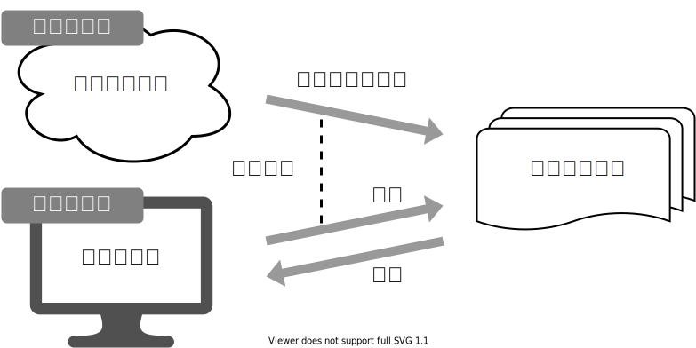

+++
url = "iwate2026stats/2-distribution.html"
linktitle = "確率分布、擬似乱数生成"
title = "2. 確率分布、擬似乱数生成 — 統計モデリング入門 2026 岩手連大"
date = 2026-06-22T18:30:00+09:00
draft = false
dpi = 108
+++

# [統計モデリング入門 2026 岩手連大](.)

<div class="author">
岩嵜 航
</div>

<div class="affiliation">
東北大学 生命科学研究科 進化ゲノミクス分野 牧野研 特任助教
</div>

<ol>
<li><a href="1-introduction.html">導入、直線回帰</a>
<li class="current-deck"><a href="2-distribution.html">確率分布、擬似乱数生成</a>
<li><a href="3-likelihood.html">尤度、最尤推定</a>
<li><a href="4-glm.html">一般化線形モデル(GLM)</a>
<li><a href="5-glmm.html">個体差、一般化線形混合モデル(GLMM)</a>
<li><a href="6-bayesian.html">ベイズの定理、事後分布、MCMC</a>
<li><a href="7-stan.html">StanでGLM</a>
<li><a href="8-hbm.html">階層ベイズモデル(HBM)</a>
</ol>

<div class="footnote">
2026-06-22 岩手大学 連合農学研究科<br>
<a href="https://heavywatal.github.io/slides/iwate2026stats/">https://heavywatal.github.io/slides/iwate2026stats/</a>
</div>


---
## 何でもかんでも直線あてはめではよろしくない


- 観察データは常に**正の値**なのに予測が負に突入してない？
- **縦軸は整数**。しかもの**ばらつき**が横軸に応じて変化？


---
## 何でもかんでも直線あてはめではよろしくない


- 観察データは常に**正の値**なのに予測が負に突入してない？
- **縦軸は整数**。しかもの**ばらつき**が横軸に応じて変化？
- **データに合わせた統計モデルを使うとマシ**


---
## よりよい回帰をめざして

久保先生の[<abbr title="データ解析のための統計モデリング入門">緑本</abbr>](https://amzn.to/33suMIZ)に沿ってちょっとずつ線形モデルを発展させていく。

<figure style="float: right; margin-inline-start: 0.5em; margin-block: 0;">
<a href="https://kuboweb.github.io/-kubo/ce/IwanamiBook.html">

<figcaption><small>https://kuboweb.github.io/-kubo/ce/IwanamiBook.html</small></figcaption>
</a>
</figure>

<div class="column-container" style="position: relative; padding-inline: 0.75em;">
<div style="position: absolute; top: 0; right: 0; width: 100%; height: 12em; background-color: hsl(80deg 0% 50% / 10%); border-radius: 0 0 0 87.5%;"></div>
<div style="position: absolute; top: 0; right: 0; width: 100%; height: 3em; background-color: hsl(80deg 100% 50% / 15%); border-radius: 0 0 0 87.5%;"></div>

  <div>

**線形モデル LM** (単純な直線あてはめ)

<p style="opacity: 0.7; margin-inline-start: 2em;">
↓ いろんな<b style="color: #56B4E9">確率分布</b>を扱いたい
</p>

**一般化線形モデル GLM**

<p style="opacity: 0.7; margin-inline-start: 2em;">
↓ <b>個体差</b>などの変量効果を扱いたい
</p>

**一般化線形混合モデル GLMM**

<p style="opacity: 0.7; margin-inline-start: 2em;">
↓ もっと<b>自由なモデリング</b>を！
</p>

**階層ベイズモデル HBM**

  </div>
  <div style="text-align: right;">

<p>最小二乗法<br><br><br></p>
<p>最尤推定法<br><br><br><br></p>
<p>MCMC</p>

  </div>
</div>


---
## 確率分布

発生する事象(値)と頻度の関係。

手元のデータを数えて作るのが**経験分布**\
e.g., サイコロを12回投げた結果、学生1000人の身長


一方、少数のパラメータと数式で作るのが**理論分布**。\
(こちらを単に「確率分布」と呼ぶことが多い印象）


---
## 分布を特徴づける代表値 central tendency

<div class="column-container">
  <div class="column" style="flex-shrink: 1.6;">

平均値 mean
: 和を観察数で割る

中央値 median
: 順に並べて真ん中

最頻値 mode
: 最も頻度が高い値

  </div>
  <div class="column">
  <a href="https://www.mhlw.go.jp/toukei/list/20-21.html">
  
  <figcaption><small><cite>所得金額階級別世帯数の頻度分布</cite> 厚生労働省 国民生活基礎調査 2022</small></figcaption>
  </a>
  </div>
</div>

外れ値に対する応答
: もし総資産額20兆円の大富豪が鳥取県に引っ越してきたら\
  → 県民の**平均**資産は4000万円上昇。**中央値**・**最頻値**はほぼそのまま。

目的や状況に応じて使い分けよう。

---
## ばらつきを捉える記述統計量

分散 variance
: 平均値からの差の自乗の平均。 $\frac 1 n \sum _i ^n (X_i - \bar X)^2$
: これの平方根が**標準偏差 (standard deviation)**。

Percentile, Quantile (四分位)
: 小さい順にならべて上位何%にあるか。
: 中央値 = 50th percentile = 第二四分位(Q2)


---
## 記述統計量に頼りすぎず分布を可視化する

同じデータでも見せ方で印象・情報量が変わる。


---
## ばらつきの様子は大小の判断にも重要

<div class="column-container" style="padding-left: 10px;">
<div class="column" style="flex-shrink: 1;">
観測値1つずつ。<br>
たまたまかも。
</div>
<div class="column" style="flex-shrink: 1;">
群内のばらつき大きい。<br>
群間の差は微妙か。
</div>
<div class="column" style="flex-shrink: 1;">
群内のばらつき小さい。<br>
群間には差がありそう。
</div>
</div>


「こんなことがたまたま起こる確率はすごく低いです！」\
をちゃんと示す手続きが**統計的仮説検定**。

<hr>

でも要約統計量とか検定結果だけを見て判断するのは危険...


---
## 確率変数$X$はパラメータ$\theta$の確率分布$f$に従う...?

$X \sim f(\theta)$

e.g.,\
コインを3枚投げたうち表の出る枚数 $X$ は**二項分布に従う**。\
$X \sim \text{Binomial}(n = 3, p = 0.5)$

<div class="column-container" style="justify-content: unset;">
  <div>


  </div>
  <div style="padding-top: 10px;">
\[\begin{split}
\Pr(X = k) &= \binom n k p^k (1 - p)^{n - k} \\
k &\in \{0, 1, 2, \ldots, n\}
\end{split}\]
  </div>
</div>

一緒に実験してみよう。（日本の硬貨は年号ありが裏）

---
## 試行を繰り返して記録してみる

コインを3枚投げたうち表の出た枚数 $X$

試行1: **表** 裏 **表** → $X = 2$\
試行2: 裏 裏 裏 → $X = 0$\
試行3: **表** 裏 裏 → $X = 1$ 続けて $2, 1, 3, 0, 2, \ldots$


<div style="text-align: right;">
試行回数を増やすほど<b>二項分布</b>の形に近づく。<br>
0と3はレア。1と2が3倍ほど出やすいらしい。
</div>

---
## コイントスしなくても $X$ らしきものを生成できる

- コインを3枚投げたうち表の出る枚数 $X$
- $n = 3, p = 0.5$ の二項分布からサンプルする乱数 $X$

<div class="column-container" style="justify-content: unset;">
  <div>

  </div>
  <div style="padding-top: 10px;">
$X \sim \text{Binomial}(n = 3, p = 0.5)$

&nbsp;&nbsp; ↓ サンプル

{2, 0, 1, 2, 1, 3, 0, 2, ...}
  </div>
</div>

これらはとてもよく似ているので\
**「コインをn枚投げたうち表の出る枚数は二項分布に従う」**\
みたいな言い方をする。逆に言うと\
**「二項分布とはn回試行のうちの成功回数を確率変数とする分布」**\
のように理解できる。

---
## 統計モデリングの一環とも捉えられる

コイン3枚投げを繰り返して得たデータ {2, 0, 1, 2, 1, 3, 0, 2, ...}

&nbsp;&nbsp; ↓ たった2つのパラメータで記述。情報を圧縮。

$n = 3, p = 0.5$ の二項分布で説明・再現できるぞ

<figure>

<figcaption><small>「<a href="https://amzn.to/3uCxTKo"><cite>データ分析のための数理モデル入門</cite></a>」江崎貴裕 2020 より改変</small></figcaption>
</figure>

こういうふうに現象と対応した確率分布、ほかにもある？

???
ただし「これが3連コイントスの真理だ」ではない。\
あくまで「こう単純化して理解できそう・使えそう」なだけ。

ほかの仮定: コインが立つかも。偏ったコインかも。両表かも。

二項分布はn枚コイントスをたった2パラメータで説明する優秀モデル


---
## 有名な確率分布、それに「従う」もの

離散一様分布
: コインの表裏、サイコロの出目1–6

負の二項分布 (幾何分布 if n = 1)
: 成功率pの試行がn回成功するまでの失敗回数

二項分布
: 成功率p、試行回数nのうちの成功回数

ポアソン分布
: 単位時間あたり平均$\lambda$回起こる事象の発生回数

ガンマ分布 (指数分布 if k = 1)
: ポアソン過程でk回起こるまでの待ち時間

正規分布
: 確率変数の和、平均値など。

---
## 離散一様分布

同じ確率で起こるn通りの事象のうちXが起こる確率

e.g., コインの表裏、サイコロの出目1–6


🔰 一様分布になりそうな例を考えてみよう


---
## 幾何分布 $~\text{Geom}(p)$

成功率pの試行が初めて成功するまでの失敗回数

e.g., コイントスで表が出るまでに何回裏が出るか


\\[
\Pr(X = k \mid p) = p (1 - p)^k
\\]

「初めて成功するまでの試行回数」とする定義もある。

🔰 幾何分布になりそうな例を考えてみよう

---
## 負の二項分布 $~\text{NB}(n, p)$

成功率pの試行がn回成功するまでの失敗回数X。
n = 1 のとき幾何分布と一致。


\\[
\Pr(X = k \mid n,~p) = \binom {n + k - 1} k p^n (1 - p)^k
\\]

失敗回数ではなく試行回数を変数とする定義もある。連続である必要はない。

🔰 負の二項分布になりそうな例を考えてみよう

<!--
平均$\lambda$がガンマ分布でばらついた過分散ポアソン分布、とも解釈できる。\
($k \to \infty$でポアソン分布と一致)
-->

---
## 二項分布 $~\text{Binomial}(n,~p)$

確率$p$で当たるクジを$n$回引いてX回当たる確率。平均は$np$。


\\[
\Pr(X = k \mid n,~p) = \binom n k p^k (1 - p)^{n - k}
\\]

🔰 二項分布になりそうな例を考えてみよう


---
## ポアソン分布 $~\text{Poisson}(\lambda)$

平均$\lambda$で単位時間(空間)あたりに発生する事象の回数。

e.g., 1時間あたりのメッセージ受信件数、メッシュ区画内の生物個体数


\\[
\Pr(X = k \mid \lambda) = \frac {\lambda^k e^{-\lambda}} {k!}
\\]

二項分布の極限 $(\lambda = np;~n \to \infty;~p \to 0)$。\
めったに起きないことを何回も試行するような感じ。


---
## 指数分布 $~\text{Exp}(\lambda)$

ポアソン過程の事象の発生間隔。平均は $1 / \lambda$ 。

e.g., メッセージの受信間隔、道路沿いに落ちてる手袋の間隔


\\[
\Pr(x \mid \lambda) = \lambda e^{-\lambda x}
\\]

幾何分布の連続値版。

🔰 ポアソン分布・指数分布になりそうな例を考えてみよう


---
## ガンマ分布 $~\text{Gamma}(k,~\lambda)$

ポアソン過程の事象k回発生までの待ち時間

e.g., メッセージを2つ受信するまでの待ち時間


\\[
\Pr(x \mid k,~\lambda) = \frac {\lambda^k x^{k - 1} e^{-\lambda x}} {\Gamma(k)}
\\]

指数分布をkのぶん右に膨らませた感じ。\
shapeパラメータ $k = 1$ のとき指数分布と一致。


---
## 正規分布 $~\mathcal{N}(\mu,~\sigma)$

平均 $\mu$、標準偏差 $\sigma$ の美しい分布。よく登場する。\
e.g., $\mu = 50, ~\sigma = 10$ (濃い灰色にデータの95%, 99%が含まれる):


\\[
\Pr(x \mid \mu,~\sigma) = \frac 1 {\sqrt{2 \pi \sigma^2}} \exp \left(\frac {-(x - \mu)^2} {2\sigma^2} \right)
\\]

---
## 正規分布に近づくものがいろいろある

標本平均の反復(**中心極限定理**);
e.g., 一様分布 [0, 100) から40サンプル


大きい$n$の二項分布


---
## 正規分布に近づくものがいろいろある

大きい$\lambda$のポアソン分布


平均値固定なら$k$が大きくなるほど左右対称に尖るガンマ分布


---
## 有名な確率分布対応関係ふりかえり

<figure style="float: right;">

</figure>

離散一様分布
: コインの表裏、サイコロの出目1–6

負の二項分布 (幾何分布 if n = 1)
: 成功率pの試行がn回成功するまでの失敗回数

二項分布
: 成功率p、試行回数nのうちの成功回数

ポアソン分布
: 単位時間あたり平均$\lambda$回起こる事象の発生回数

ガンマ分布 (指数分布 if k = 1)
: ポアソン過程でk回起こるまでの待ち時間

正規分布
: 確率変数の和、平均値。使い勝手が良く、よく登場する。


---
## 現実には、確率分布に「従わない」ことが多い

植物100個体から8個ずつ種子を取って植えたら全体で半分ちょい発芽。\
親1個体あたりの生存数は<span style="color: #56B4E9;">n=8の二項分布</span>になるはずだけど、\
極端な値(全部死亡、全部生存)が多かった。


「それはなぜ？」と考えて要因を探るのも統計モデリングの仕事。\
**「普通はこれに従うはず」を理解してこそ**できる思考。


---
## 疑似乱数生成器 Pseudo Random Number Generator

コンピューター上でランダム**っぽい**数値を出力する装置。\
実際には**決定論的**に計算されているので、\
シード(出発点)と呼び出し回数が同じなら出る数も同じになる。

```r
set.seed(42)
runif(3L)
# 0.9148060 0.9370754 0.2861395
runif(3L)
# 0.8304476 0.6417455 0.5190959
set.seed(42)
runif(6L)
# 0.9148060 0.9370754 0.2861395 0.8304476 0.6417455 0.5190959
```

シードに適当な固定値を与えておくことで再現性を保てる。\
ただし「このシードじゃないと良い結果が出ない」はダメ。

さまざまな「分布に従う」乱数を生成することもできる。


---
## いろんな乱数を生成・可視化して感覚を掴もう


``` r
n = 100
x = sample.int(6, n, replace = TRUE)  # 一様分布(整数)
x = runif(n, min = 0, max = 1)        # 一様分布
x = rgeom(n, prob = 0.5)              # 幾何分布
x = rbinom(n, size = 5, prob = 0.5)   # 二項分布
x = rpois(n, lambda = 2.1)            # ポアソン分布
x = rnorm(n, mean = 50, sd = 10)      # 正規分布
print(x)

p1 = ggplot(data.frame(x)) + aes(x)
p1 + geom_histogram() # for continuous values
p1 + geom_bar()       # for discrete values
```

🔰 正規分布の `n`, `mean`, `sd` を変えて作図し、それぞれの影響を確認しよう。

🔰 ポアソン分布の `n`, `lambda` を変えて作図し、それぞれの影響を確認しよう。

🔰 5%の当たりを狙って20連ガチャを回す人が100万人いたら、\
 &nbsp; &nbsp; 全部はずれ、1つ当たり、2つ当たり... の人はどれくらいいるか？


---
## 参考文献

- [データ解析のための統計モデリング入門](https://amzn.to/33suMIZ) 久保拓弥 2012
- [StanとRでベイズ統計モデリング](https://amzn.to/3uwx7Pb) 松浦健太郎 2016
- [RとStanではじめる ベイズ統計モデリングによるデータ分析入門](https://amzn.to/3o1eCzP) 馬場真哉 2019
- [データ分析のための数理モデル入門](https://amzn.to/3uCxTKo) 江崎貴裕 2020
- [分析者のためのデータ解釈学入門](https://amzn.to/3uznzCK) 江崎貴裕 2020
- [統計学を哲学する](https://amzn.to/3ty80Kv) 大塚淳 2020
- 「[進化学実習2026](/slides/tohoku2026r/)」
  東北大学 理学部生物学科 (2026-04)
- 「[Rを用いたデータ解析の基礎と応用](https://comicalcommet.github.io/r-training-2025/)」
  石川由希 2025 名古屋大学
- 「[統計モデリング概論 DSHC 2025](/slides/tokiomarine2025/)」
  東京海上 [DSHC](https://tokiomarine-dshc.com/) (2025-08)

<a href="3-likelihood.html" class="readmore">
3. 尤度、最尤推定
</a>
