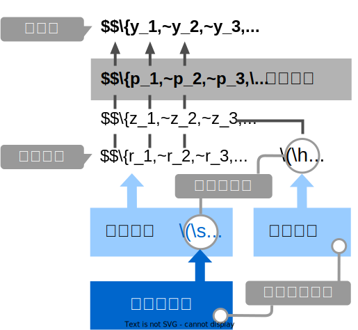
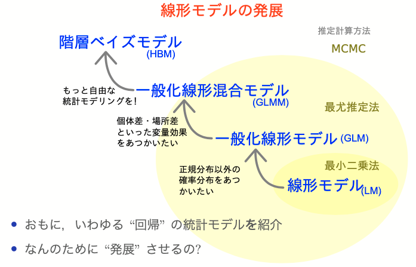

+++
url = "iwate2026stats/8-hbm.html"
linktitle = "階層ベイズモデル(HBM)"
title = "8. 階層ベイズモデル(HBM) — 統計モデリング入門 2026 岩手連大"
date = 2026-07-07T19:30:00+09:00
draft = false
dpi = 108
+++

# [統計モデリング入門 2026 岩手連大](.)

<div class="author">
岩嵜 航
</div>

<div class="affiliation">
東北大学 生命科学研究科 進化ゲノミクス分野 牧野研 特任助教
</div>

<ol>
<li><a href="1-introduction.html">導入、直線回帰</a>
<li><a href="2-distribution.html">確率分布、擬似乱数生成</a>
<li><a href="3-likelihood.html">尤度、最尤推定</a>
<li><a href="4-glm.html">一般化線形モデル(GLM)</a>
<li><a href="5-glmm.html">個体差、一般化線形混合モデル(GLMM)</a>
<li><a href="6-bayesian.html">ベイズの定理、事後分布、MCMC</a>
<li><a href="7-stan.html">StanでGLM</a>
<li class="current-deck"><a href="8-hbm.html">階層ベイズモデル(HBM)</a>
</ol>

<div class="footnote">
2026-07-07 岩手大学 連合農学研究科<br>
<a href="https://heavywatal.github.io/slides/iwate2026stats/">https://heavywatal.github.io/slides/iwate2026stats/</a>
</div>


---
## 本講義の主題: 回帰

久保先生の[<abbr title="データ解析のための統計モデリング入門">緑本</abbr>](https://amzn.to/33suMIZ)に沿ってちょっとずつ線形モデルを発展させていく。

<figure style="float: right; margin-inline-start: 0.5em; margin-block: 0;">
<a href="https://kuboweb.github.io/-kubo/ce/IwanamiBook.html">

<figcaption><small>https://kuboweb.github.io/-kubo/ce/IwanamiBook.html</small></figcaption>
</a>
</figure>

<div class="column-container" style="position: relative; padding-inline: 0.75em;">
<div style="position: absolute; top: 0; right: 0; width: 100%; height: 12em; background-color: hsl(80deg 100% 50% / 10%); border-radius: 0 0 0 87.5%;"></div>
<div style="position: absolute; top: 0; right: 0; width: 100%; height: 3em; background-color: hsl(80deg 100% 50% / 15%); border-radius: 0 0 0 87.5%;"></div>

  <div>

**線形モデル LM** (単純な直線あてはめ)

<p style="opacity: 0.7; margin-inline-start: 2em;">
↓ いろんな<b style="color: #56B4E9">確率分布</b>を扱いたい
</p>

**一般化線形モデル GLM**

<p style="opacity: 0.7; margin-inline-start: 2em;">
↓ <b style="color: #E69F00;">個体差</b>などの変量効果を扱いたい
</p>

**一般化線形混合モデル GLMM**

<p style="opacity: 0.7; margin-inline-start: 2em;">
↓ もっと<b style="color: #B2001D;">自由なモデリング</b>を！
</p>

**階層ベイズモデル HBM**

  </div>
  <div style="text-align: right;">

<p>最小二乗法<br><br><br></p>
<p>最尤推定法<br><br><br><br></p>
<p>MCMC</p>

  </div>
</div>


---
## GLMMで登場した個体差を階層ベイズモデルで

植物100個体から8個ずつ種子を取って植えたら全体で半分ちょい発芽。\
親1個体あたりの生存数は<span style="color: #56B4E9;">n=8の二項分布</span>になるはずだけど、\
極端な値(全部死亡、全部生存)が多かった。個体差？


---
## 個体差をモデルに組み込みたい

各個体の生存率$p_i$が能力値$z_i$のシグモイド関数で決まると仮定。\
その能力値は全個体共通の正規分布に従うと仮定:
$z_i \sim \mathcal{N}(\hat z, \sigma)$


パラメータ2つで済む: 平均 $\hat z$, ばらつき $\sigma$ 。


---
## 個体能力のばらつき $\sigma$ が大きいと両端が増える

普通の二項分布は個体差無し $\sigma = 0$ を仮定してるのと同じ。


---
## 階層ベイズモデルのイメージ図

事前分布のパラメータに、さらに事前分布を設定するので階層ベイズ

<figure>

</figure>


---
## さっきの図をStan言語で記述すると

`10` とか `3` とか、エイヤっと決めてるやつが超パラメータ。


``` stan
data {
  int<lower=0> N;
  array[N] int<lower=0> y;
}

parameters {
  real z_hat;           // mean ability
  real<lower=0> sigma;  // sd of r
  vector[N] r;          // individual difference
}

transformed parameters {
  vector[N] z = z_hat + r;
  vector[N] p = inv_logit(z);
}

model {
  y ~ binomial(8, p);
  z_hat ~ normal(0, 10);
  r ~ normal(0, sigma);
  sigma ~ student_t(3, 0, 1);
}

generated quantities {
  array[N] int yrep = binomial_rng(8, p);
}
```

---
## 変量効果が入った推定結果


``` r
seeds_data = list(y = df_seeds_od$y, N = sample_size)
model = cmdstanr::cmdstan_model("stan/glmm.stan")
fit = model$sample(data = seeds_data, seed = 19937L, step_size = 0.1, refresh = 0)
draws = fit$draws(c("z_hat", "sigma", "r[1]", "r[2]"))
```


```
 variable    mean  median   sd  mad      q5     q95 rhat ess_bulk ess_tail
    lp__  -456.18 -455.74 9.50 9.62 -472.27 -441.55 1.00      827     1617
    z_hat    0.27    0.26 0.32 0.32   -0.26    0.81 1.00      687     1131
    sigma    2.79    2.77 0.34 0.34    2.28    3.36 1.00     1312     2168
    r[1]    -0.27   -0.26 0.80 0.78   -1.60    1.00 1.00     3188     2064
    r[2]     1.74    1.66 1.05 1.03    0.13    3.55 1.00     3842     2785
    r[3]     1.73    1.66 1.05 0.99    0.13    3.62 1.00     4225     2642
    r[4]    -3.77   -3.59 1.58 1.48   -6.73   -1.52 1.00     4372     2149
    r[5]    -2.23   -2.14 1.09 1.05   -4.16   -0.62 1.00     4485     2484
    r[6]    -2.22   -2.11 1.12 1.06   -4.22   -0.54 1.00     4849     2515
    r[7]     0.88    0.84 0.88 0.87   -0.47    2.40 1.00     3849     2457

 # showing 10 of 403 rows (change via 'max_rows' argument or 'cmdstanr_max_rows' option)
```

---
## 抜粋して作図。悪くない。

データ生成の真のパラメータ値は $\hat z = 0.5,~\sigma = 3.0$ だった。


---
## 🔰 階層ベイズモデルの練習問題: 種の数

100個体の植物から8つずつ種を取った、のデータでやってみよう。


---
## 🔰 階層ベイズモデルの練習問題: ビール注文数
<!-- TODO: 時間が余った場合の練習問題 -->


``` r
sample_size = 300L
lambda = 3
overdisp = 4
.n = lambda / (overdisp - 1)
.p = 1 / overdisp
df_beer_od = tibble::tibble(
  X = rnbinom(sample_size, size = .n, prob = .p)
)
```


---
## ベイズ推定まとめ

- 条件付き確率 $\Pr(B \mid A)$ の理解が大事。
    - 事後分布 $\propto$ 尤度 ⨉ 事前分布
    - 確信度合いをデータで更新していく。
- 推定結果は分布そのもの。
    - そこから点推定も区間推定も可能。
- 解析的に解けない問題は計算機に乱数を振らせて解く。
    - MCMCサンプル $\sim$ 解きにくい事後分布
    - 理論・技術の進歩が目覚ましい。


---
## 回帰分析ふりかえり

より柔軟にモデルを記述できるようになった。計算方法も変化。

<figure>
<a href="https://kuboweb.github.io/-kubo/ce/LinksGlm.html">

<figcaption>
<small>久保さん https://kuboweb.github.io/-kubo/ce/LinksGlm.html</small>
</figcaption>
</a>
</figure>


---
## 全体まとめ

- 統計とは、データをうまくまとめ、それに基づいて推論するための手法。
- モデルには**理解志向**と**応用志向**があり、統計モデルは前者寄り。
    - どちらも多少は分かった上で使い分けたい。
    - どっちにしろ真の正しい何かではない。
- **確率分布**とその背後にある**確率過程**の理解が重要。
    - 乱数生成→作図を繰り返してイメージを掴もう。
    - MCMCサンプリングも事後分布からの乱数生成。
- 本講義で「統計モデリングを完全に理解した」とは言えない。
    - 理論も実践もほとんど説明していない。
    - 本を読む準備ができた、くらいの気持ち？


---
## 参考文献

- [データ解析のための統計モデリング入門](https://amzn.to/33suMIZ) 久保拓弥 2012
- [StanとRでベイズ統計モデリング](https://amzn.to/3uwx7Pb) 松浦健太郎 2016
- [RとStanではじめる ベイズ統計モデリングによるデータ分析入門](https://amzn.to/3o1eCzP) 馬場真哉 2019
- [データ分析のための数理モデル入門](https://amzn.to/3uCxTKo) 江崎貴裕 2020
- [分析者のためのデータ解釈学入門](https://amzn.to/3uznzCK) 江崎貴裕 2020
- [統計学を哲学する](https://amzn.to/3ty80Kv) 大塚淳 2020

<a href="." class="readmore">
目次に戻る
</a>
