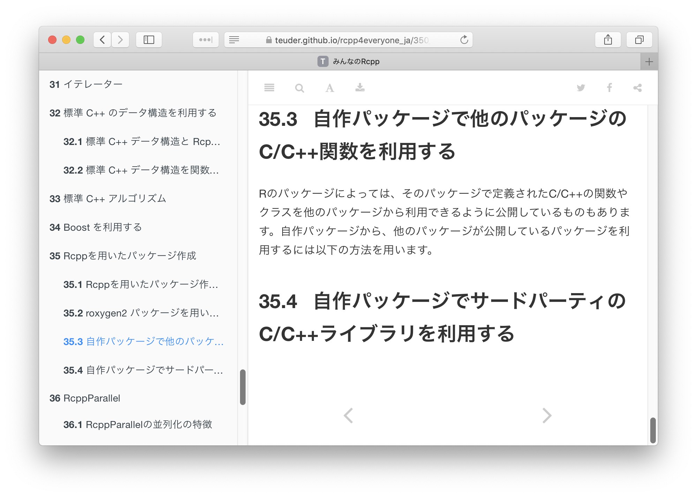

+++
title = "Japan.R 2018 Rcppパッケージで外部C++ライブラリを使う"
date = 2018-12-01T17:00:00+09:00
type = "reveal"
draft = false
+++

<h1>
<span style="font-size: 1.2rem; color: #999999;">
みんなのRcpp 35.4 (仮)</span><br>
<span style="font-size: 1.5rem">
Rcppパッケージで外部C++ライブラリを使う</span><br>
<span style="font-size: 1.2rem; color: #999999;">
Using external C++ libraries in Rcpp packages</span>
</h1>


<div class="author">
Watal M. Iwasaki
&nbsp;
<a href="https://twitter.com/heavywatal"><code>@heavywatal</code></a>
</div>

<div class="affiliation">
SOKENDAI, The Graduate University for Advanced Studies
</div>

<div class="footnote">
2018-12-01
<a href="https://japanr.connpass.com/event/105802/">Japan.R 2018</a>
</div>

https://heavywatal.github.io/slides/japanr2018/


---
## [Rcpp](http://www.rcpp.org/): a bridge between R and C++

```r
r_for = function(n) {
  s = 0; for (i in seq_len(n)) {s = s + 1 / i}; s
}
r_vec = function(n) sum(1 / seq_len(n))

Rcpp::cppFunction("double rcpp(int n) {
  double s = 0; for (int i = 1; i <= n; ++i) {s += 1.0 / i;} return s;
}")  # Compilation takes a few seconds here

n = 1000000L
rbenchmark::benchmark(r_for(n), r_vec(n), rcpp(n))[,1:4]
```
```
      test replications elapsed relative
1 r_for(n)          100   3.968   29.835
2 r_vec(n)          100   0.473    3.556
3  rcpp(n)          100   0.133    1.000
```

⚡ Rcpp helps improving performance.<br>
📦 ~1500 CRAN packages depend on Rcpp.<br>
🎉 [Happy 10th birthday and version 1.0.0  (2018-11-05)](http://dirk.eddelbuettel.com/blog/2018/11/07/).


---
## Online resources for developing Rcpp packages

- [Rcpp-package.pdf](http://dirk.eddelbuettel.com/code/rcpp/Rcpp-package.pdf) by Dirk Eddelbuettel and Romain François
- [Compiled code (`src/`) - R packages](http://r-pkgs.had.co.nz/src.html) by Hadley Wickham
- https://heavywatal.github.io/rstats/devtools <br>
  https://heavywatal.github.io/rstats/rcpp (404)
- <span class="fragment" data-fragment-index="1">
  <a href="https://teuder.github.io/rcpp4everyone_ja/">みんなのRcpp</a>
  and
  <a href="https://teuder.github.io/rcpp4everyone_en/">Rcpp for everyone</a>
  by <strong>津駄@teuder</strong> さん
  </span>

<div class="fragment" data-fragment-index="1">
<blockquote class="twitter-tweet" data-lang="en"><p lang="ja" dir="ltr">この内容が無料で読めるなんてすごい。 <a href="https://t.co/6I7GGemCDZ">https://t.co/6I7GGemCDZ</a></p>&mdash; HOXOM Inc. (@hoxom_inc) <a href="https://twitter.com/hoxom_inc/status/1057162394772811776?ref_src=twsrc%5Etfw">October 30, 2018</a></blockquote>
<blockquote class="twitter-tweet" data-lang="en"><p lang="ja" dir="ltr">この内容が無料で読めるなんてすごい <a href="https://t.co/0CRbCrO06B">https://t.co/0CRbCrO06B</a></p>&mdash; 職業、イケメン。テラモナギ (@teramonagi) <a href="https://twitter.com/teramonagi/status/1057162274421432320?ref_src=twsrc%5Etfw">October 30, 2018</a></blockquote>
<blockquote class="twitter-tweet" data-lang="en"><p lang="ja" dir="ltr">この内容が無料で読めるなんてすごい。 <a href="https://t.co/3M7Sy6tAw7">https://t.co/3M7Sy6tAw7</a></p>&mdash; niszet📚技術書典5 い04でした (@niszet0) <a href="https://twitter.com/niszet0/status/1057181653745852417?ref_src=twsrc%5Etfw">October 30, 2018</a></blockquote>
<blockquote class="twitter-tweet" data-lang="en"><p lang="ja" dir="ltr">この内容が無料で読めるなんてすごい。 <a href="https://t.co/1EH6CUVBmD">https://t.co/1EH6CUVBmD</a></p>&mdash; hoxo_m (@hoxo_m) <a href="https://twitter.com/hoxo_m/status/1057159960130289665?ref_src=twsrc%5Etfw">October 30, 2018</a></blockquote>
<blockquote class="twitter-tweet" data-lang="en"><p lang="ja" dir="ltr">この内容が無料で読めるなんてすごい。 <a href="https://t.co/wtbAOgBpa8">https://t.co/wtbAOgBpa8</a></p>&mdash; Shinichi Takayanagi (@_stakaya) <a href="https://twitter.com/_stakaya/status/1057162337419898880?ref_src=twsrc%5Etfw">October 30, 2018</a></blockquote>
<blockquote class="twitter-tweet" data-lang="en"><p lang="ja" dir="ltr">この内容が無料で読めるなんてすごい <a href="https://t.co/VQn0YOD59i">https://t.co/VQn0YOD59i</a></p>&mdash; 凸ぽん (@kyusque) <a href="https://twitter.com/kyusque/status/1057178516607840256?ref_src=twsrc%5Etfw">October 30, 2018</a></blockquote>
</div>
<script async src="https://platform.twitter.com/widgets.js" charset="utf-8"></script>
<style>
twitter-widget {
  display: inline-block !important;
  width: 32% !important;
}
</style>

---
## But lacking "how to use external libraries" 😢

<a href="https://teuder.github.io/rcpp4everyone_ja/350_package.html">

</a>

Necessity is the mother of invention. Let's do it 💪


---
## Structure of a typical C/C++ library

Source repository:
```
evolution/
├── README.md
└── src/
    ├── individual.hpp      # header file for declaration
    ├── individual.cpp      # source file for definition
    ├── population.hpp
    └── population.cpp
```

Compiled and installed:
```
${PREFIX}/                  # e.g., /usr/local/
├── include/                # header files
│   └── evolution/
│       ├── individual.hpp
│       └── population.hpp
└── lib/
    └── libevolution.a      # shared library (.dylib, .dll)
```

Libraries can be header-only,
e.g., [Eigen](http://eigen.tuxfamily.org), [nlohmann/json](https://github.com/nlohmann/json).

---
## Basic steps to incorporate C/C++ libraries

- Write `src/Makevars` to instruct compilers and linkers:

    ```makefile
    CXX_STD=CXX11
    PKG_CPPFLAGS=-DSTRICT_R_HEADERS -I/usr/local/include
    PKG_LIBS=-L/usr/local/lib -Wl,-rpath,/usr/local/lib -levolution
    ```

- Use `configure` script to
    - Generate `src/Makevars` from a template `src/Makevars.in`.
    - Inspect build environments: OS, compilers, etc.
    - Detect installed libraries.
    - Do anything you want.<br>
      e.g., `git`, `cmake`, etc.


<cite>
http://r-pkgs.had.co.nz/src.html#make<br>
https://cran.r-project.org/doc/manuals/r-release/R-exts.html#Configure-and-cleanup
</cite>


---
## Various styles to incorporate C/C++ libraries

- Find and use installed libraries. Fail if not found.
    - 😍 Simple. 😨 Requires users' knowledge and effort.
    - e.g., [xml2](https://github.com/r-lib/xml2),
      [magick](https://github.com/ropensci/magick),
      [RcppGSL](https://github.com/eddelbuettel/rcppgsl)
- Keep source code copies in `inst/include/` and `src/`.
    - 😍 Robust. Developers control everything. 😨 Redundant.
    - e.g., [BH](https://github.com/eddelbuettel/bh/),
      [RcppArmadillo](https://github.com/RcppCore/RcppArmadillo),
      [RcppEigen](https://github.com/RcppCore/RcppEigen),
      [RcppParallel](https://github.com/RcppCore/RcppParallel),
      [RcppTOML](https://github.com/eddelbuettel/rcpptoml)
- Fetch and track source codes with [Git submodule](https://git-scm.com/book/en/v2/Git-Tools-Submodules)
    - 🙂 Less redundant. 🙁 Foreign materials in package structure.
    - e.g., [rigraph](https://github.com/igraph/rigraph),
      [rstan (StanHeaders)](https://github.com/stan-dev/rstan)
- Find and use installed libraries. Install if not found.
    - 😍 Lean. Not requires users' effort.
    - e.g., [tumopp](https://heavywatal.github.io/rtumopp/)

---
## Let's discuss later 🍻

- Any other ways to handle external C++ libraries?
- Where to share these knowledge?
    - My own website
    - みんなのRcpp
    - Rcpp official documentation
- How are Windows users doing?

## Thank you for your attention 🤘
