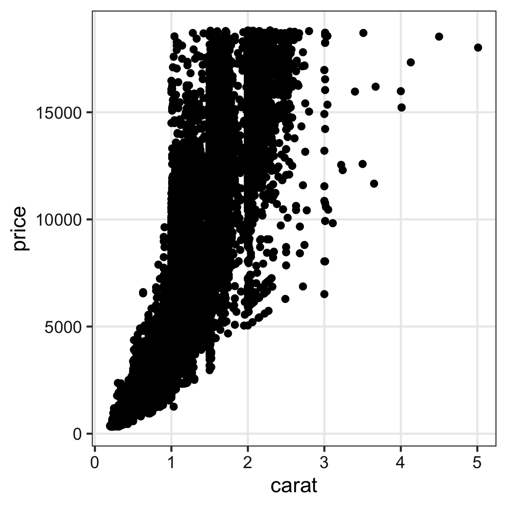
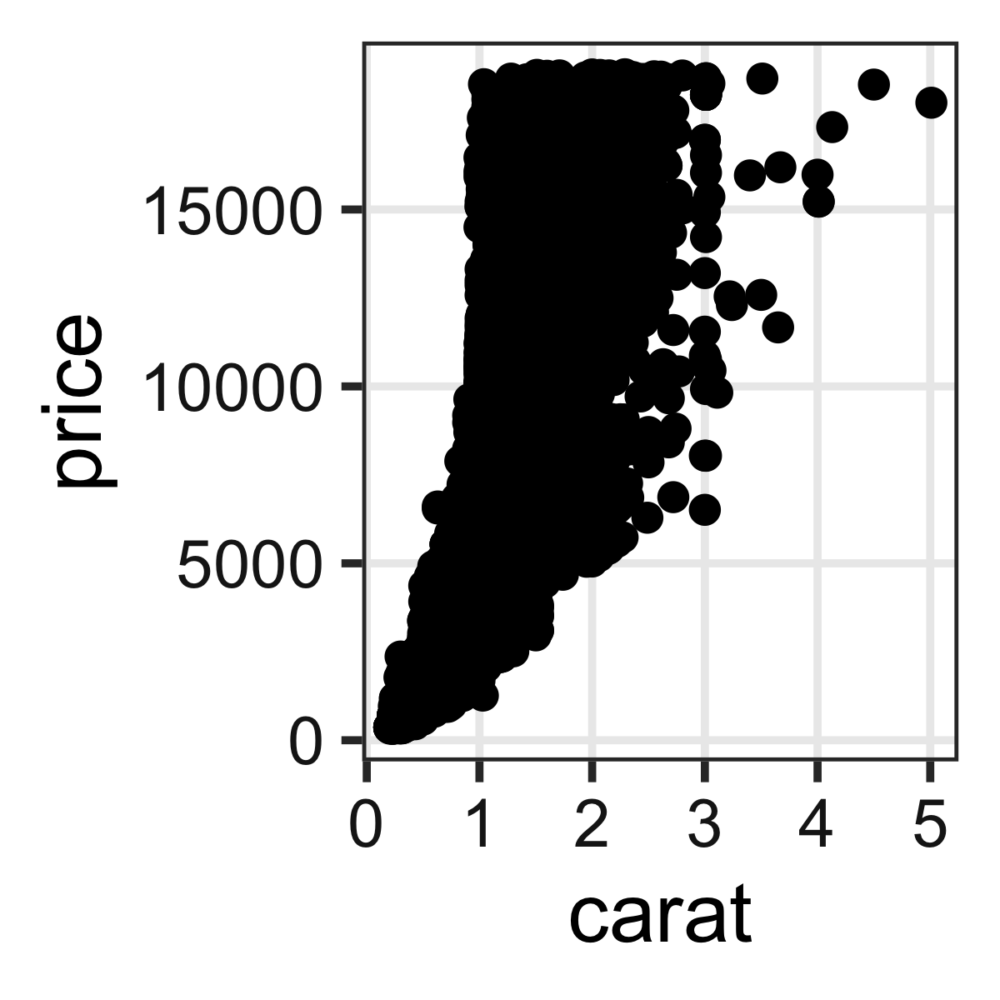

+++
title = "Rデータ解析入門入門2023 — MILAB R講習会"
linktitle = "Rデータ解析入門入門2023"
date = 2023-02-24T18:00:00+09:00
type = "reveal"
draft = false
+++

# [Rデータ解析入門入門2023](.)

<!--
データサイエンスに関する書籍の出版は年々増えており、
無償で利用可能な情報もインターネット上のあちこちに散らばっています。
とは言え、初学者にとってはそうした情報に辿り着く着くことさえも困難だったり、
それらを読み解くための前提知識が無くて苦労したりすることが多いでしょう。
本講演はこうした障壁を取り除き、自学自習の助けとなることを目指します。
具体的には、データ解析の全体像や可視化の意義を整理し、
Rを使ってより楽により正しくやっていくためのtipsをご紹介する予定です。
-->

<div class="author">
岩嵜 航 (Watal M. Iwasaki, PhD)
</div><div class="affiliation">
東北大学 生命科学研究科 進化ゲノミクス分野 特任助教<br>
(Graduate School of Life Sciences, Tohoku University)
</div>

<div class="footnote">
2023-02-24 MILAB R講習会<br>
<a href="https://heavywatal.github.io/slides/milab2023r/">https://heavywatal.github.io/slides/milab2023r/</a>
</div>

右下の矢印や <kbd>←</kbd><kbd>→</kbd>キーで移動できます。


---
## 岩嵜 航 = Watal M. Iwasaki.&nbsp; Call me METAL🤘


Born and raised in Sendai

PhD in Life Sciences, Tohoku University
: Evolutionary theory of complexity and diversity in biological systems. 🖥

Postdoc in SOKENDAI, Hayama
: Evolution of diversity within a tumor/cancer. 🏥
: Population genetics of Pacific bluefin tuna. 🐟
: Speciation of transposons. 🧬


Asst. Prof. in Tohoku University
: Genomics of Rice 🌾🍚, etc.

Likes
: 🍺 Beer, Sake, Whisky, Cooking
: ♬ Heavy Metal, Classical, Folk


---
## 本日のおしながき

> 一時間程度のセミナー形式で、<br>
> データ解析、可視化の意義、哲学的なところの<br>
> お話を聞いてみたいです。<br>
> ——新井田さん

<small><s>（なんという無茶振り...）</s></small>
貴重な機会をありがとうございます。

90分6–8コマの講義からのダイジェスト
: 科学研究におけるデータ解析とモデル
: データ可視化の重要性
: データ前処理
: R使用上の基本的な心構え


---
## 科学の営み = 巨人の肩に立つ

<figure style="position: absolute; top: 32px; right: 40px;">
<a href="https://en.wikipedia.org/wiki/Standing_on_the_shoulders_of_giants">

<figcaption class="url">
https://en.wikipedia.org/wiki/<br>Standing_on_the_shoulders_of_giants
</figcaption>
</a>
</figure>

先人たちの積み重ねに基づいて、新しい発見をする。<br>
**Reproducible Research (再現可能な研究)**<br>
が巨人を大きくする。

記録を残すことは何より重要
: 実験や野外観察では些細なことも漏らさず記録。
: 生データは何重にもバックアップ。

データ整理・解析・作図も不可欠、だけど...
: 再現不能の職人技で切り抜けちゃう人も多い。
: コピペ、メニュー選択、配色と配置を微調整...

疑義が生じたら...？ 別の人がその研究を発展させたいとき...？
: ✅「誰でも確実に再現できるプロトコルがこちらです」
: 💩「ありまぁす！」

---
## マウス操作とコピペを駆使した職人技は再現不可能

ちゃんと合ってるのかな... ファイルもタブもたくさん...

<figure style="position: relative;">


</figure>

---
## 研究の基本プロセス

1. 課題を見つける、仮説を立てる
1. 実験🧫・観察🔬・文献📚などからデータを集める
1. **データを整理・解析して仮説を検証する**
1. **結果を報告する**、1に戻る

<br>

- 実験や観察は研究の半分くらい。
- 残り半分はデータの整理・解析・報告。<br>
  → しかし軽視されがち。ここを**ちゃんと、でも楽に**やりたい。


---
## データ解析って必要？ 生データこそ至高では？

生のままでは複雑過ぎ、情報多すぎ、何もわからない。


```r
print(ggplot2::diamonds)
```

```
      carat       cut color clarity depth table price     x     y     z
      <dbl>     <ord> <ord>   <ord> <dbl> <dbl> <int> <dbl> <dbl> <dbl>
    1  0.23     Ideal     E     SI2  61.5    55   326  3.95  3.98  2.43
    2  0.21   Premium     E     SI1  59.8    61   326  3.89  3.84  2.31
    3  0.23      Good     E     VS1  56.9    65   327  4.05  4.07  2.31
    4  0.29   Premium     I     VS2  62.4    58   334  4.20  4.23  2.63
   --                                                                  
53937  0.72      Good     D     SI1  63.1    55  2757  5.69  5.75  3.61
53938  0.70 Very Good     D     SI1  62.8    60  2757  5.66  5.68  3.56
53939  0.86   Premium     H     SI2  61.0    58  2757  6.15  6.12  3.74
53940  0.75     Ideal     D     SI2  62.2    55  2757  5.83  5.87  3.64
```

ダイヤモンド53,940個について10項目の値を持つデータセット

---
## 要約統計量を見てみよう

各列の**平均**とか**標準偏差**とか:


```
   stat carat depth table    price
  <chr> <dbl> <dbl> <dbl>    <dbl>
1  mean  0.80 61.75 57.46  3932.80
2    sd  0.47  1.43  2.23  3989.44
3   max  5.01 79.00 95.00 18823.00
```

大きさ `carat` と価格 `price` の**相関係数**はかなり高い:

```
      carat depth table price
carat  1.00                  
depth  0.03  1.00            
table  0.18 -0.30  1.00      
price  0.92 -0.01  0.13  1.00
```

**生のままよりは把握しやすい**かも。


---
## 分布を特徴づける代表値 central tendency

<div class="column-container">
  <div class="column" style="flex-shrink: 1.6;">

平均値 mean
: 和を観察数で割る

中央値 median
: 順に並べて真ん中

最頻値 mode
: 最も頻度が高い値

  </div>
  <div class="column">
  <a href="https://www.mhlw.go.jp/toukei/list/20-21.html">
  
  <figcaption><cite>所得金額階級別世帯数の頻度分布 厚生労働省 国民生活基礎調査 2019</cite></figcaption>
  </a>
  </div>
</div>

目的や状況に応じて使い分けよう。

外れ値に対する応答
: もし総資産額20兆円の大富豪が鳥取県に引っ越してきたら<br>
  → 県民の**平均**資産は4000万円上昇。**中央値**・**最頻値**はほぼそのまま。

---
## ばらつきを捉える記述統計量

分散 variance
: 平均値からの差の自乗の平均。 $\frac 1 n \sum _i ^n (X_i - \bar X)^2$
: これの平方根が**標準偏差 (standard deviation)**。

Percentile, Quantile (四分位)
: 小さい順にならべて上位何%にあるか。
: 中央値 = 50th percentile = 第二四分位(Q2)


---
## 2つの量の関係性: 大小の比較

ばらつきの度合いも加味して判断する。

<div class="column-container" style="padding-left: 10px;">
<div class="column" style="flex-shrink: 1.1;">
観測値1つだけ。<br>
たまたまかも。
</div>
<div class="column" style="flex-shrink: 1;">
ばらつき大きい。<br>
Bが高いのもたまたま?
</div>
<div class="column" style="flex-shrink: 1;">
ばらつき小さい。<br>
AとBには差がありそう。
</div>
</div>


「こんなことがたまたま起こる確率はすごく低いです！」<br>
をちゃんと示す手続きが**統計的仮説検定**。

---
## 記述統計量に頼りすぎず分布を可視化する

同じデータでも見せ方で印象・情報量が変わる。


---
## 代表値ばかり見て可視化を怠ると構造を見逃す

<figure style="position: relative;">
<a href="https://www.autodesk.com/research/publications/same-stats-different-graphs">

<figcaption class="url">https://www.autodesk.com/research/publications/same-stats-different-graphs</figcaption>
</a>

</figure>


---
## 作図してみると全体像・構造が見やすい

情報をうまく絞って整理 → **直感的にわかる**、仮説生成


`carat` が大きいほど `price` も高いらしい。<br>
その度合いは `clarity` によって異なるらしい。

---
## 統計とは

データをうまくまとめ、それに基づいて推論するための手法。

- **記述統計**: データそのものを要約する
    - 要約統計量 (e.g., 平均、標準偏差、etc.)
    - 作図、作表
- **推測統計**: データの背後にある母集団・生成過程を考える
    - 数理モデル
    - 確率分布
    - パラメータ(母数)

「グラフを眺めてなんとなく分かる」以上の分析には**モデル**が必要

---
## モデルとは

対象システムを単純化・理想化して扱いやすくしたもの

Mathematical Model 数理モデル
: 数学的な方程式として記述されるもの。
: e.g., Lotka-Volterra eq., <span style="color: #888;">Hill eq.</span>
: <br>

Computational Model 数値計算モデル
: 数値計算の手続きとして記述されるもの。
: e.g., Schelling’s Segregation Model, <span style="color: #888;"><em>tumopp</em></span>
: <br>

Concrete Model 具象モデル
: 具体的な事物で作られるもの。
: e.g., San Francisco Bay-Delta Model

<cite>
Weisberg 2012 "Simulation and Similarity" (科学とモデル)
</cite>

???
数理モデルが決定論的、数値計算が確率論的、になる場合が多いけど必ずしもそうではない。
解析的に解くことを諦めて計算機にやらせるという点で実装方法は異なるが、
数理的に記述して解釈するという大枠では同じとみなしたほうがいいかもしれない。

プラモデル: 車や飛行機の重さ・材質は無視して色や形を模倣


---
## ウェットな実験もモデルの一種と見なせる

対象システムを単純化・理想化して扱いやすくしたもの<br>
→ 自然ではありえない状況にしてでも、見たい関係を見る<br>
→ 「Xを変えればYが変わる」という**還元的な理解の1ステップ**

- ノイズをなるべく除去
  - 栄養や温度など、**環境を揃える**
  - 近親交配を繰り返して純系を作り、**遺伝的背景を揃える**
- 興味のある要因のみ変えて、表現型の違いを評価
  - 遺伝子1つ2つだけ改変
  - 投与する薬剤の種類・量を変えてみる
  - 栄養塩の濃度と光の強さを変えてみる

ドライの理論研究者を指して「モデル屋」と呼びがちだが、<br>
広い意味では生物学者みんな「モデル屋」。


---
## データ科学における数理モデル

データ生成をうまく真似できそうな仮定の数式表現。<br>
&nbsp;

<figure>
<br>
<figcaption><cite>「データ分析のための数理モデル入門」江崎貴裕 2020 より改変</cite></figcaption>
</figure>


???

確率モデル: 決定論的なモデルじゃなくて確率論的なゆらぎを導入したもの。
ただし、大塚淳さんの定義は異なる。
帰納推論を可能にする枠組みとして自然の斉一性(ヒューム)を仮定した上で、
データを生成している真の現象を確率用語で記述したものが確率モデルだ、という感じ。
そこからさらに強い仮定としてパラメトリックな確率分布を生成元としたのが統計モデル。

---
## データ科学における数理モデル

データ生成をうまく真似できそうな仮定の数式表現。<br>
e.g., 大きいほど高く売れる: $\text{price} = A \times \text{carat} + B + \epsilon$


ダイヤモンドの価格はこういう数式でおよそ表せる、という理解<br>
→ モデルをさらに改良していき、理解の精度を上げられるかも


---
## データ解析のおおまかな流れ

1. コンピュータ環境の整備
1. データの取得、読み込み
1. 探索的データ解析
    - **前処理、加工** (労力の8割はここという説も)
    - 可視化、仮説生成 (まずここを目指す！)
    - 統計解析、仮説検証 (みんな重視しがち)
1. 報告、発表

<figure>
<a href="https://r4ds.had.co.nz/introduction.html">

<figcaption class="url">https://r4ds.had.co.nz/introduction.html</figcaption>
</a>
</figure>


---
## 機械処理しやすい形 vs 人が読み書きしやすい形

作図や解析に使えるデータ形式はほぼ決まってる
: `ggplot(data, ...)`, `glm(..., data, ...)`, ...

出発点となるデータはさまざま
: 実験ノート、フィールドノート、データベース、...

> Happy families are all alike;<br>
> every unhappy family is unhappy in its own way<br>
> --- Leo Tolstoy "Anna Karenina"

> tidy datasets are all alike,<br>
> but every messy dataset is messy in its own way<br>
> --- Hadley Wickham


---
## 整然データ tidy data &nbsp; vs &nbsp; 雑然データ messy data

<div class="column-container">
  <div class="column" style="flex-shrink: 1.1;">
    
  </div>
  <div class="column">
    
    <div style="position: absolute; top: 440px;">
    縦1列は1つの変数<br>
    横1行は1つの観測<br>
    1セルは1つの値<br>
    </div>
  </div>
</div>
<cite style="position: absolute; bottom: 18px; right: 24px;">
<a class="url" href="https://id.fnshr.info/2017/01/09/tidy-data-intro/">
西原史暁「整然データとは何か」https://id.fnshr.info/2017/01/09/tidy-data-intro/
</a>
</cite>

---
## 整然データ tidy data &nbsp; vs &nbsp; 雑然データ messy data

<div class="column-container">
  <div class="column" style="flex-shrink: 1.1;">
    
  </div>
  <div class="column">
    
    <div style="position: absolute; top: 440px;">
    <strong>縦1列は1つの変数</strong><br>
    横1行は1つの観測<br>
    1セルは1つの値<br>
    </div>
  </div>
</div>
<cite style="position: absolute; bottom: 18px; right: 24px;">
<a class="url" href="https://id.fnshr.info/2017/01/09/tidy-data-intro/">
西原史暁「整然データとは何か」https://id.fnshr.info/2017/01/09/tidy-data-intro/
</a>
</cite>

---
## 整然データ tidy data &nbsp; vs &nbsp; 雑然データ messy data

<div class="column-container">
  <div class="column" style="flex-shrink: 1.1;">
    
  </div>
  <div class="column">
    
    <div style="position: absolute; top: 440px;">
    縦1列は1つの変数<br>
    <strong>横1行は1つの観測</strong><br>
    1セルは1つの値<br>
    </div>
  </div>
</div>
<cite style="position: absolute; bottom: 18px; right: 24px;">
<a class="url" href="https://id.fnshr.info/2017/01/09/tidy-data-intro/">
西原史暁「整然データとは何か」https://id.fnshr.info/2017/01/09/tidy-data-intro/
</a>
</cite>

---
## 整然データ tidy data &nbsp; vs &nbsp; 雑然データ messy data

<div class="column-container">
  <div class="column" style="flex-shrink: 1.1;">
    
  </div>
  <div class="column">
    
    <div style="position: absolute; top: 440px;">
    縦1列は1つの変数<br>
    横1行は1つの観測<br>
    <strong>1セルは1つの値</strong><br>
    </div>
  </div>
</div>
<cite style="position: absolute; bottom: 18px; right: 24px;">
<a class="url" href="https://id.fnshr.info/2017/01/09/tidy-data-intro/">
西原史暁「整然データとは何か」https://id.fnshr.info/2017/01/09/tidy-data-intro/
</a>
</cite>


---
## 整然データ tidy data &nbsp; ≈ &nbsp; ggplot したくなる形

- **縦1列**は1つの**変数**
- **横1行**は1つの**観測**
- **1セル**は1つの**値**

<cite style="display: block; text-align: right;">
<a class="url" href="https://r4ds.had.co.nz/tidy-data.html">https://r4ds.had.co.nz/tidy-data.html</a>
</cite>


```r
print(ggplot2::diamonds)
```

```
      carat       cut color clarity depth table price     x     y     z
      <dbl>     <ord> <ord>   <ord> <dbl> <dbl> <int> <dbl> <dbl> <dbl>
    1  0.23     Ideal     E     SI2  61.5    55   326  3.95  3.98  2.43
    2  0.21   Premium     E     SI1  59.8    61   326  3.89  3.84  2.31
    3  0.23      Good     E     VS1  56.9    65   327  4.05  4.07  2.31
    4  0.29   Premium     I     VS2  62.4    58   334  4.20  4.23  2.63
   --                                                                  
53937  0.72      Good     D     SI1  63.1    55  2757  5.69  5.75  3.61
53938  0.70 Very Good     D     SI1  62.8    60  2757  5.66  5.68  3.56
53939  0.86   Premium     H     SI2  61.0    58  2757  6.15  6.12  3.74
53940  0.75     Ideal     D     SI2  62.2    55  2757  5.83  5.87  3.64
```


---
## 整然データ tidy data &nbsp; ≈ &nbsp; ggplot したくなる形

x軸、y軸、色分け、パネル分けなどを列の名前で指定して簡単作図:


```r
ggplot(diamonds) + aes(x = carat, y = price) +
  geom_point(mapping = aes(color = color, size = clarity)) +
  facet_wrap(vars(cut))
```


---
## 前処理: 生データを下ごしらえして食べやすい形に


```r
print(VADeaths)
```

```
      Rural Male Rural Female Urban Male Urban Female
50-54       11.7          8.7       15.4          8.4
55-59       18.1         11.7       24.3         13.6
60-64       26.9         20.3       37.0         19.3
65-69       41.0         30.9       54.6         35.1
70-74       66.0         54.3       71.1         50.0
```

↓ 下ごしらえ: 作図・解析で使いやすい整然データに


```
   lbound ubound region    sex death
    <int>  <int>  <chr>  <chr> <dbl>
 1     50     54  Rural   Male  11.7
 2     50     54  Rural Female   8.7
 3     50     54  Urban   Male  15.4
 4     50     54  Urban Female   8.4
--                                  
17     70     74  Rural   Male  66.0
18     70     74  Rural Female  54.3
19     70     74  Urban   Male  71.1
20     70     74  Urban Female  50.0
```


---
## 前処理は大きく2つに分けられる

<div style="float: right;">
<a href="https://dplyr.tidyverse.org/">

</a><br>
<a href="https://tidyr.tidyverse.org/">

</a><br>
<a href="https://stringr.tidyverse.org/">

</a>
</div>

- データ構造を対象とする処理
    - 使いたい部分だけ抽出
    - グループごとに特徴を要約
    - 何かの順に並べ替え
    - 異なるテーブルの結合
    - 変形: 縦長 ↔ 横広
- データ内容を対象とする処理
    - 数値の変換: 対数、正規化
    - 外れ値・欠損値への対処
    - 型変換: 連続変数、カテゴリカル変数、指示変数、因子、日時
    - 文字列処理: 正規表現によるパターンマッチ

<cite style="display: block; text-align: right;"><a href="https://www.amazon.co.jp/dp/4774196479/ref=as_li_ss_tl?ie=UTF8&linkCode=ll1&tag=heavywatal-22&linkId=8a3fd4e9a0c944b1b41242bbab8d147b">
本橋智光「前処理大全」
</a></cite>


---
## R package

便利な関数やデータセットなどをひとまとめにしたもの。

Standard Packages
: Rの標準機能。何もしなくても使用可能

Contributed Packages
: 有志により開発され、
  [CRAN](https://cran.rstudio.com/web/packages/index.html)
  にまとめて公開されている。
: 要インストール。使う前に読み込むおまじないが必要。

```r
install.packages("readr")  # 一度やればOK
library(readr)             # 読み込みはRを起動するたびに必要
update.packages()          # たまには更新しよう
```

素のRも覚えきってないのにいきなりパッケージ？
: 大丈夫。誰も覚えきってない。
: パッケージを使わないR作業 = 火もナイフも使わない料理

---
## tidyverse

<a href="https://www.tidyverse.org/">

</a>

Rでデータを上手に扱うためのパッケージ群

```r
install.packages("tidyverse")
library(tidyverse)
# 関連パッケージが一挙に読み込まれる
```

- 統一的な使い勝手
- 暗黙の処理をなるべくしない安全設計
- シンプルな関数を繋げて使うデザイン

<figure>
<a href="https://r4ds.had.co.nz/introduction.html">

<figcaption class="url">https://r4ds.had.co.nz/introduction.html</figcaption>
</a>
</figure>

---
## tidyverse

<a href="https://www.tidyverse.org/">

</a>

Rでデータを上手に扱うためのパッケージ群

```r
install.packages("tidyverse")
library(tidyverse)
# 関連パッケージが一挙に読み込まれる
```


```
── Attaching packages ─────────────────── tidyverse 1.3.2 ──
✔ ggplot2 3.4.1     ✔ purrr   1.0.1
✔ tibble  3.1.8     ✔ dplyr   1.1.0
✔ tidyr   1.3.0     ✔ stringr 1.5.0
✔ readr   2.1.4     ✔ forcats 1.0.0
── Conflicts ────────────────────── tidyverse_conflicts() ──
✖ dplyr::filter() masks stats::filter()
✖ dplyr::lag()    masks stats::lag()
```

`Conflicts ❌` とか表示されて不安だけど ↑ これは大丈夫なやつ


---
## dplyr --- data.frameの高速処理担当

<a href="https://dplyr.tidyverse.org/">

</a>

シンプルな関数がたくさん。繋げて使う (piping)

抽出
: 列: `select()`,
: 行: `filter()`, `distinct()`, `slice()`

要約・集計
: `group_by()`, `summarize()`, `count()`

並べ替え
: `arrange()`, `relocate()`

列の追加・変更
: `mutate()`, `rename()`

結合
: 行方向: `bind_rows()`
: 列方向: `left_join()`, `inner_join()`, `full_join()`

---
## dplyr 使用例

小さな関数を繋げて使う流れ作業:

```r
result = diamonds |>              # 生データから出発して
  select(carat, cut, price) |>    # 列を抽出して
  filter(carat > 1) |>            # 行を抽出して
  group_by(cut) |>                # グループ化して
  summarize(mean(price)) |>       # 平均を計算
  print()                         # 表示してみる
```

```
        cut mean(price)
      <ord>       <dbl>
1      Fair    7177.856
2      Good    7753.601
3 Very Good    8340.549
4   Premium    8487.249
5     Ideal    8674.227
```

この見慣れぬ記号 `|>` は何？<br>
(`select()` など個々の関数には今日は触れません)

---
## Pipe operator (パイプ演算子) `|>`

パイプの左側の変数を、右側の関数の第一引数にねじ込む:
```r
diamonds |> filter(carat > 1)
filter(diamonds, carat > 1)     # これと同じ

# 前処理の流れ作業に便利:
diamonds |> filter(carat > 1) |> select(carat, price) |> ...
potatoes |> cut() |> fry() |> season("salt") |> eat()
```

🔰 パイプを使わない形に書き換え、出力を確認しよう:

```r
seq(1, 6) |> sum()
```

```
[1] 21
```

```r
letters |> toupper() |> head(3)
```

```
[1] "A" "B" "C"
```

[解答例]
```r
sum(seq(1, 6))
head(toupper(letters), 3)
```

---
## パイプ演算子 `|>` を使わない方法

😐 一時変数をイチイチ作る:

```r
tmp1 = select(diamonds, carat, cut, price)   # 列を抽出して
tmp2 = filter(tmp1, carat > 1)               # 行を抽出して
tmp3 = group_by(tmp2, cut)                   # グループ化して
result = summarize(tmp3, mean(price))        # 平均を計算
```

😐 同じ名前を使い回す:

```r
result = select(diamonds, carat, cut, price) # 列を抽出して
result = filter(result, carat > 1)           # 行を抽出して
result = group_by(result, cut)               # グループ化して
result = summarize(result, mean(price))      # 平均を計算
```

どちらも悪くない。
何度も変数名を入力するのがやや冗長。


---
## パイプ演算子 `|>` を使わない方法

😫 一時変数を使わずに:

```r
result = summarize(                    # 平均を計算
    group_by(                            # グループ化して
      filter(                              # 行を抽出して
        select(diamonds, carat, cut, price), # 列を抽出して
        carat > 1),                        # 行を抽出して
      cut),                              # グループ化して
    mean(price))                       # 平均を計算
```

🤪 改行さえせずに:

```r
result = summarize(group_by(filter(select(diamonds, carat, cut, price), carat > 1), cut), mean(price))
```

論理の流れとプログラムの流れが合わず、目が行ったり来たり。<br>
さっきのほうがぜんぜんマシ。

---
## パイプ演算子 `|>` を使おう

😁 慣れれば、論理の流れを追いやすい:

```r
result = diamonds |>
  select(carat, cut, price) |>    # 列を抽出して
  filter(carat > 1) |>            # 行を抽出して
  group_by(cut) |>                # グループ化して
  summarize(mean(price)) |>       # 平均を計算
  print()                         # 表示してみる
```

```
        cut mean(price)
      <ord>       <dbl>
1      Fair    7177.856
2      Good    7753.601
3 Very Good    8340.549
4   Premium    8487.249
5     Ideal    8674.227
```

tidyverseパッケージ群はこういう使い方をしやすい設計。<br>
使わなければならないわけではないが、読めたほうがいい。

<div style="font-size: 0.8em; color: #888888;">

R < 4.2 までよく使われていた `%>%` もほぼ同じ。

</div>

---
## tidyr --- data.frameの変形・整形担当

<a href="https://tidyr.tidyverse.org/">

</a>

横広から縦長に
: `pivot_longer()`, <del><code>gather()</code></del>

縦長から横広に
: `pivot_wider()`, <del><code>spread()</code></del>

列を分離、結合
: `separate()`, `unite()`

入れ子構造をつくる、解消する
: `nest()`, `unnest()`

*etc.*

- こういう変形なしでそのまま使えるデータは激レア
- エクセルでポチポチやらず、tidyrで手続きを記述しよう
- ちょっとハードルは高いけど、使えるようになると**強い**💪


---
## `pivot_longer()` 横広から縦長に

複数列にまたがる値を1列にする。<br>
そのラベルも合わせて移動。

<figure>
<a href="https://r4ds.had.co.nz/tidy-data.html#longer">

<br>
<figcaption class="url">https://r4ds.had.co.nz/tidy-data.html#longer</figcaption>
</a>
</figure>

```r
table4a
pivot_longer(table4a, 2:3, names_to = "year", values_to = "cases")
```

---
## `pivot_wider()` 縦長から横広に

1列に収まっていた値を複数列の行列に変換。<br>
そのラベルを列の名前にする。

<figure>
<a href="https://r4ds.had.co.nz/tidy-data.html#wider">

<br>
<figcaption class="url">https://r4ds.had.co.nz/tidy-data.html#wider</figcaption>
</a>
</figure>

```r
pivot_wider(table2, names_from = type, values_from = count)
```


---
## ggplot2

<a href="https://ggplot2.tidyverse.org/">

</a>

- tidyverseパッケージ群のひとつ
- "The <strong><u>G</u></strong>rammar of <strong><u>G</u></strong>raphics" という体系に基づく設計
- 単にいろんなグラフを「描ける」だけじゃなく<br>
  **一貫性のある文法で合理的に描ける**

<figure>
<!--
<a href="https://www.amazon.co.jp/dp/B00HWUVHXK/ref=as_li_ss_il?ie=UTF8&linkCode=li3&tag=heavywatal-22&linkId=d63d3627df82c09b0bb5ca8f47ee19cc&language=ja_JP" target="_blank"></a>


-->


<br>


<figcaption class="url">Iwasaki and Innan (2017)</figcaption>
</figure>

---
## いきなりggplot2から使い始めても大丈夫

R標準のやつとは根本的に違うシステムで作図する。

<figure>

<figcaption><cite>「Rグラフィックス」Murrell著 久保訳 より改変</cite></figcaption>
</figure>

---
## 基本的な使い方: 指示を `+` で重ねていく


---
## 基本的な使い方: 指示を `+` で重ねていく


```r
ggplot(data = diamonds)             # diamondsデータでキャンバス準備
# aes(x = carat, y = price) +       # carat,price列をx,y軸にmapping
# geom_point() +                    # 散布図を描く
# facet_wrap(vars(clarity)) +       # clarity列に応じてパネル分割
# stat_smooth(method = lm) +        # 直線回帰を追加
# coord_cartesian(ylim = c(0, 2e4)) + # y軸の表示範囲を狭く
# theme_classic(base_size = 20)     # クラシックなテーマで
```


---
## 基本的な使い方: 指示を `+` で重ねていく


```r
ggplot(data = diamonds) +           # diamondsデータでキャンバス準備
  aes(x = carat, y = price)         # carat,price列をx,y軸にmapping
# geom_point() +                    # 散布図を描く
# facet_wrap(vars(clarity)) +       # clarity列に応じてパネル分割
# stat_smooth(method = lm) +        # 直線回帰を追加
# coord_cartesian(ylim = c(0, 2e4)) + # y軸の表示範囲を狭く
# theme_classic(base_size = 20)     # クラシックなテーマで
```


---
## 基本的な使い方: 指示を `+` で重ねていく


```r
ggplot(data = diamonds) +           # diamondsデータでキャンバス準備
  aes(x = carat, y = price) +       # carat,price列をx,y軸にmapping
  geom_point()                      # 散布図を描く
# facet_wrap(vars(clarity)) +       # clarity列に応じてパネル分割
# stat_smooth(method = lm) +        # 直線回帰を追加
# coord_cartesian(ylim = c(0, 2e4)) + # y軸の表示範囲を狭く
# theme_classic(base_size = 20)     # クラシックなテーマで
```


---
## 基本的な使い方: 指示を `+` で重ねていく


```r
ggplot(data = diamonds) +           # diamondsデータでキャンバス準備
  aes(x = carat, y = price) +       # carat,price列をx,y軸にmapping
  geom_point() +                    # 散布図を描く
  facet_wrap(vars(clarity))         # clarity列に応じてパネル分割
# stat_smooth(method = lm) +        # 直線回帰を追加
# coord_cartesian(ylim = c(0, 2e4)) + # y軸の表示範囲を狭く
# theme_classic(base_size = 20)     # クラシックなテーマで
```


---
## 基本的な使い方: 指示を `+` で重ねていく


```r
ggplot(data = diamonds) +           # diamondsデータでキャンバス準備
  aes(x = carat, y = price) +       # carat,price列をx,y軸にmapping
  geom_point() +                    # 散布図を描く
  facet_wrap(vars(clarity)) +       # clarity列に応じてパネル分割
  stat_smooth(method = lm)          # 直線回帰を追加
# coord_cartesian(ylim = c(0, 2e4)) + # y軸の表示範囲を狭く
# theme_classic(base_size = 20)     # クラシックなテーマで
```


---
## 基本的な使い方: 指示を `+` で重ねていく


```r
ggplot(data = diamonds) +           # diamondsデータでキャンバス準備
  aes(x = carat, y = price) +       # carat,price列をx,y軸にmapping
  geom_point() +                    # 散布図を描く
  facet_wrap(vars(clarity)) +       # clarity列に応じてパネル分割
  stat_smooth(method = lm) +        # 直線回帰を追加
  coord_cartesian(ylim = c(0, 2e4))   # y軸の表示範囲を狭く
# theme_classic(base_size = 20)     # クラシックなテーマで
```


---
## 基本的な使い方: 指示を `+` で重ねていく


```r
ggplot(data = diamonds) +           # diamondsデータでキャンバス準備
  aes(x = carat, y = price) +       # carat,price列をx,y軸にmapping
  geom_point() +                    # 散布図を描く
  facet_wrap(vars(clarity)) +       # clarity列に応じてパネル分割
  stat_smooth(method = lm) +        # 直線回帰を追加
  coord_cartesian(ylim = c(0, 2e4)) + # y軸の表示範囲を狭く
  theme_classic(base_size = 20)     # クラシックなテーマで
```


---
## 基本的な使い方: 指示を `+` で重ねていく


```r
ggplot(data = diamonds) +           # diamondsデータでキャンバス準備
  aes(x = carat, y = price) +       # carat,price列をx,y軸にmapping
  geom_point() +                    # 散布図を描く
# facet_wrap(vars(clarity)) +       # clarity列に応じてパネル分割
# stat_smooth(method = lm) +        # 直線回帰を追加
# coord_cartesian(ylim = c(0, 2e4)) + # y軸の表示範囲を狭く
  theme_classic(base_size = 20)     # クラシックなテーマで
```


---
## 図をオブジェクトとして取っておける


```r
p1 = ggplot(data = diamonds)
p2 = p1 + aes(x = carat, y = price)
p3 = p2 + geom_point()
p4 = p3 + facet_wrap(vars(clarity))
print(p3)
```


---
## ファイル名もサイズも再現可能な作図

`width`や`height`が小さいほど、文字・点・線が相対的に大きく

```r
# 7inch x 300dpi = 2100px四方 (デフォルト)
ggsave("dia1.png", p3) # width = 7, height = 7, dpi = 300
# 4     x 300    = 1200  全体7/4倍ズーム
ggsave("dia2.png", p3, width = 4, height = 4) # dpi = 300
# 2     x 600    = 1200  全体をさらに2倍ズーム
ggsave("dia3.png", p3, width = 2, height = 2, dpi = 600)
# 4     x 300    = 1200  テーマを使って文字だけ拡大
ggsave("dia4.png", p3 + theme_bw(base_size = 22), width = 4, height = 4)
```

<figure>




</figure>


---
## 論文のFigureみたいに並べるのもRで

別のパッケージ
([cowplot](https://wilkelab.org/cowplot/)
や
[patchwork](https://patchwork.data-imaginist.com/))
の助けを借りて


```r
pAB = cowplot::plot_grid(p3, p3, labels = c("A", "B"), nrow = 1L)
cowplot::plot_grid(pAB, p3, labels = c("", "C"), ncol = 1L)
```


---
## Rと接する上での心構え

<figure>

</figure>

エラー文を恐れない
: 熟練プログラマでも頻繁にエラーを起こす。
: エラーはRからのメッセージ。**意図を読み取って修正**しよう。
: プログラミングの経験値 ≈ エラー解決の経験値

困ったらウェブ検索
: あなたの問題は全世界のRユーザーが既に通った道。
: 日本語で、英語で、エラー文そのもので検索すれば解決策に当たる。


---
## 疑問やエラーの解決方法

- エラーのほとんどは凡ミス由来。よく確認しよう。
    - エラー文をちゃんと読む: `No such file or directory`
    - [よくあるエラー集 (石川由希さん@名古屋大)](https://comicalcommet.github.io/r-training-2022/R_training_2022_7.html)
      をチェックする
    - 変数の中身を確かめる: `str(iris)`, `attributes(iris)`
- エラー文やパッケージ名をコピペしてウェブ検索<br>
  → [StackOverflow](https://stackoverflow.com/questions/tagged/r)
  や個人サイトに解決策
- Slack <iconify-icon inline icon="bi:slack"></iconify-icon>
  [r-wakalang](https://github.com/tokyor/r-wakalang)
  で質問を投稿する。<br>
  (質問に飢えた優しいワニが多数生息 👀 &nbsp; 👀 &nbsp; 👀 &nbsp; 👀)
- 状況再現できる小さな例
  [(reprex)](https://reprex.tidyverse.org/)
  を添えると回答を得やすい。<br>
  (これを準備してるうちに問題が切り分けられて自己解決したり)
- パッケージの公式ドキュメントをちゃんと読む
- R(Studio)内のヘルプを読む: `?sum`, `help.start()`


---
## まとめ

✅ 研究はドライでもウェットでも広い意味ではモデリング

✅ データが取れたらまず可視化

✅ そのために前処理して整然データを作る

✅ R + tidyverse が解析全体を再現可能な形で強力サポート

✅ エラーを落ち着いて読み、ダメならコミュニティに投げる


---
## Reference

Other versions
: 「[Rによるデータ前処理実習](/slides/tmd2022/)」
  東京医科歯科大 [データ関連人材育成プログラム](https://ds.tmdu.org/) (2022-09)
: 「[統計モデリング概論 DSHC 2022](/slides/tokiomarine2022/)」
  東京海上 [Data Science Hill Climb](https://tokiomarine-dshc.com/) (2022-08)
: 「[進化学実習2022](/slides/tohoku2022r/)」
  東北大学 理学部生物学科 (2022-04)
: 「[Rを用いたデータ解析の基礎と応用](https://comicalcommet.github.io/r-training-2022/)」
   石川由希 2022 名古屋大学

R for Data Science --- Hadley Wickham et al.
: <https://r4ds.hadley.nz>
  [Paperback](https://amzn.to/4cpL6w8),
  [日本語版書籍(Rではじめるデータサイエンス)](https://amzn.to/2yyFRKt)

- [分析者のためのデータ解釈学入門](https://amzn.to/3uznzCK) 江崎貴裕 2020
- [データ分析のための数理モデル入門](https://amzn.to/3uCxTKo) 江崎貴裕 2020
- [科学とモデル---シミュレーションの哲学 入門](https://amzn.to/2Q0f6JQ) Michael Weisberg 2017<br>
  (原著: [Simulation and Similarity](https://amzn.to/3bdvhuI) 2013)
