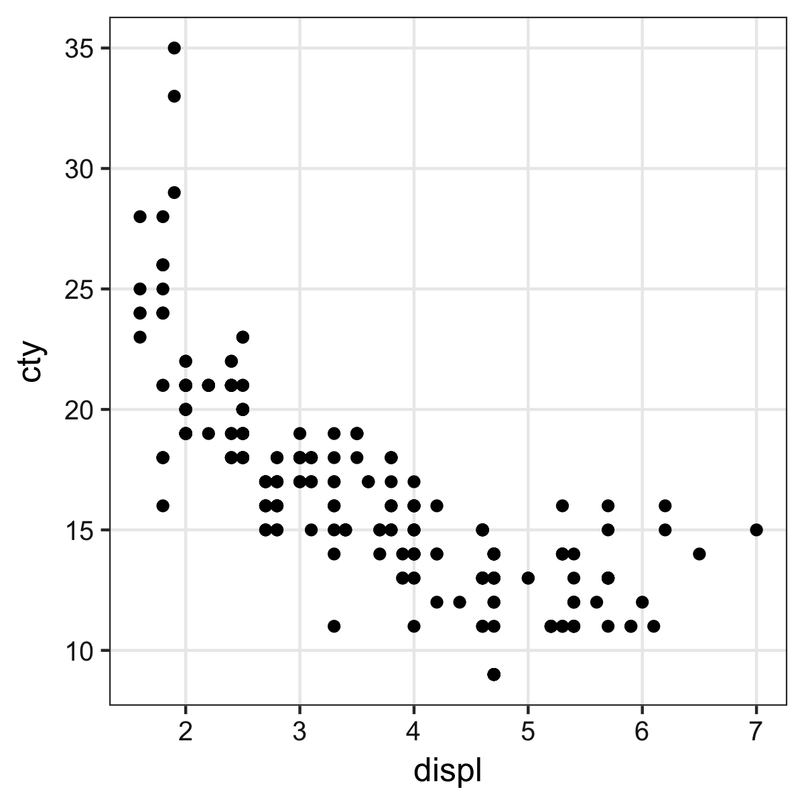

+++
url = "nagoya2018/2-ggplot.html"
title = "nagoya2018-2: ggplot2で作図"
linktitle = "R + ggplot2 — きれいなグラフを簡単に合理的に"
date = 2018-05-18T15:20:00+09:00
type = "reveal"
draft = false
+++

# Rにやらせて<ruby>楽<rt>ラク</rt></ruby>しよう <span class="subtitle">— データの可視化と下ごしらえ</span>

<div class="author">
岩嵜 航 (Watal M. Iwasaki)
</div>

<div class="affiliation">
総研大 先導科学研究科<br>
(SOKENDAI, The Graduate University for Advanced Studies)
</div>

<style>
.reveal .current-deck {font-weight: bold;}
.reveal .subtitle {font-size: 90%;}
</style>
<ol start="0">
<li><a href="0-why-r.html">どうしてRを使うの？</a>
<li><a href="1-basic-r.html">Rの基本</a>
<li class="current-deck"><a href="2-ggplot.html">R + ggplot2 — きれいなグラフを簡単に合理的に</a>
<li><a href="3-tidy-data.html">R + tidyverse — 使える形にデータを整える</a>
</ol>

<div class="footnote">
2018-05-18
名古屋大学 アドバンス生命理学特論 IGER Seminar
</div>


---
## データ可視化の重要性

情報の整理 → **正しい解析・新しい発見**

<figure style="margin-bottom: 32px;">
<a href="https://tsutawarudesign.com/">

<figcaption class="url">https://tsutawarudesign.com/</figcaption>
</a>
</figure>
<figure>
<a href="https://r4ds.had.co.nz/explore-intro.html">

<figcaption class="url">https://r4ds.had.co.nz/explore-intro.html</figcaption>
</a>
</figure>

---
## そうは言ってもセンスでしょ? --- NO!

<figure style="float: right; width: 400px;">
<a href="https://tsutawarudesign.com/">


<figcaption class="url">https://tsutawarudesign.com/</figcaption>
</a>
</figure>

ある程度は**テクニック**であり**教養**。<br>
デザインの基本的なルールを<br>
知りさえすれば誰でも上達する。

高橋佑磨センパイに教えてもらおう。

<a href="https://www.amazon.co.jp/dp/4774183210//ref=as_li_ss_il?ie=UTF8&linkCode=li3&tag=heavywatal-22&linkId=b64c46dcc91de8e52ce080fa7fd116e4" target="_blank"></a>

---
## 見せ方の吟味もRでやると捗るよ

平均値の差？ ばらつきの様子？ 軸はゼロから始まる？


---
## 平均値ばかり見て可視化を怠ると構造を見逃す

<figure style="position: relative;">
<a href="https://www.autodeskresearch.com/publications/samestats">

<figcaption class="url">https://www.autodeskresearch.com/publications/samestats/</figcaption>
</a>

</figure>


---
## 目次: R+ggplot2できれいな図を合理的に ~25分

- <strike>データ可視化の意義</strike> (済)
- ggplot2とは
- 基本的な使い方
- 多変量データの俯瞰も手軽に
- 微調整も画像ファイル出力も再現可能な形で

<figure>


</figure>

---
## ggplot2とは

<a href="https://ggplot2.tidyverse.org/">

</a>

- tidyverseパッケージ群のひとつ
- "The **G**rammer of **G**raphics" という体系に基づく設計
- 単にいろんなグラフを「描ける」だけじゃなく<br>
  「一貫性のある文法で合理的に描ける」

<figure>
<a href="https://www.amazon.co.jp/Grammar-Graphics-Statistics-Computing/dp/0387245448/ref=as_li_ss_il?ie=UTF8&linkCode=li3&tag=heavywatal-22&linkId=2d44a24b81394d310843bd982fdadf98" target="_blank"></a>


</figure>

---
## Rの普通のプロットとは根本的に違う

いきなりggplot2から使い始めても大丈夫。


---
## 基本的な使い方: 指示を `+` していく

- `ggplot()` このデータでよろしく
- `geom_*()` 点や線をよろしく
- `theme_*()` 軸とか背景の見た目をよろしく


```r
ggplot(data = mpg)
# geom_point(mapping = aes(x = displ, y = cty))
# theme_classic(base_size = 20, base_family = "Helvetica")
```


---
## 基本的な使い方: 指示を `+` していく

- `ggplot()` このデータでよろしく
- `geom_*()` 点や線をよろしく
- `theme_*()` 軸とか背景の見た目をよろしく


```r
ggplot(data = mpg) +
  geom_point(mapping = aes(x = displ, y = cty))
# theme_classic(base_size = 20, base_family = "Helvetica")
```


---
## 基本的な使い方: 指示を `+` していく

- `ggplot()` このデータでよろしく
- `geom_*()` 点や線をよろしく
- `theme_*()` 軸とか背景の見た目をよろしく


```r
ggplot(data = mpg) +
  geom_point(mapping = aes(x = displ, y = cty)) +
  theme_classic(base_size = 20, base_family = "Helvetica")
```


---
## 途中経過を取っておける


```r
p0 = ggplot(mpg, aes(x = displ, y = cty))
p1 = p0 + geom_point()
p2 = p1 + theme_classic(base_size = 20, base_family = "Helvetica")
p3 = p2 + stat_smooth(method = lm, formula = y ~ log(x))
print(p3)
```


`p0` とか `p1` あとで使うよ

---
## データは1つのdata.frameにまとめておく

X軸やY軸になるものがそれぞれ縦1列。横1行が1データ点。<br>
車の燃費に関する多変量データの例 `mpg`:


```r
print(mpg)
```

```
    manufacturer  model displ  year   cyl      trans   drv   cty   hwy    fl   class
           <chr>  <chr> <dbl> <int> <int>      <chr> <chr> <int> <int> <chr>   <chr>
  1         audi     a4   1.8  1999     4   auto(l5)     f    18    29     p compact
  2         audi     a4   1.8  1999     4 manual(m5)     f    21    29     p compact
  3         audi     a4   2.0  2008     4 manual(m6)     f    20    31     p compact
  4         audi     a4   2.0  2008     4   auto(av)     f    21    30     p compact
 --                                                                                 
231   volkswagen passat   2.0  2008     4 manual(m6)     f    21    29     p midsize
232   volkswagen passat   2.8  1999     6   auto(l5)     f    16    26     p midsize
233   volkswagen passat   2.8  1999     6 manual(m5)     f    18    26     p midsize
234   volkswagen passat   3.6  2008     6   auto(s6)     f    17    26     p midsize
```

排気量`displ`と燃費`cty`以外の列も図に反映させたい...!


---
## Aesthetic mapping でデータと見せ方を紐付け

`aes()` の中で列名を指定する。


```r
p0 + geom_point(mapping = aes(x = displ, y = cty, size = cyl,
                              colour = class, shape = drv))
```


---
## データによらず一律で見せ方を変える

`aes()` の外で列名を指定する。


```r
p0 + geom_point(mapping = aes(x = displ, y = cty),
                size = 6, colour = "darkorange", alpha = 0.4)
```


---
## 色パレットの変更 `scale_colour_*()`

個々の色を自分で決めず、既存のパレットを利用するのが吉。<br>
e.g., [ColorBrewer](https://colorbrewer2.org/#type=diverging&scheme=Spectral&n=5),
[viridis](https://cran.r-project.org/web/packages/viridis/vignettes/intro-to-viridis.html)
(色覚多様性の対策にも有効)


```r
#pQ+ scale_colour_brewer(palette = "Spectral")
pQ + scale_colour_viridis_c(option = "magma", direction = -1)
```


---
## 値に応じて切り分けて表示 (1変数facet)


```r
p1 + facet_wrap(~ class, ncol = 4L)
```


ggplotの真骨頂！
これが無かったら結構たいへん。

---
## 値に応じて切り分けて表示 (≥2変数facet)


```r
p1 + facet_grid(cyl ~ class)
```


---
## 多変量データの俯瞰に便利


---
## 値を変えず座標軸を変える `scale_*`, `coord_*`


```r
ggplot(data = diamonds, aes(carat, price)) +
  geom_point(alpha = 0.25) +
  scale_x_log10(limit = c(0.1, 10)) +
  scale_y_log10(breaks = c(1, 5, 10) * 1000) +
  coord_cartesian(ylim = c(800, 12000)) +
  labs(title = "Diamonds", x = "Size (carat)", y = "Price (USD)")
```


---
## データと関係ない部分の見た目を調整 `theme`

[既存の `theme_*()`](https://ggplot2.tidyverse.org/reference/ggtheme.html)
をベースに、`theme()` 関数で微調整。


```r
p1 + theme_bw() + theme(
  panel.background = element_rect(fill = "khaki"), # 箱
  panel.grid.major = element_line(colour = "red"), # 線
  axis.title       = element_text(size = 32),      # 文字
  axis.text        = element_blank()               # 消す
)
```


---
## 論文のFigureみたいに並べる

別のパッケージ
([cowplot](https://cran.r-project.org/package=cowplot)
や
[patchwork](https://github.com/thomasp85/patchwork))
の助けを借りて


```r
pAB = cowplot::plot_grid(p2, p2, labels = c("A", "B"), nrow = 1L)
cowplot::plot_grid(pAB, p2, labels = c("", "C"), ncol=1L)
```


---
## ファイル名もサイズも再現可能な作図

`width`や`height`が小さいほど、文字・点・線が相対的に大きく


```r
# 7inch x 300dpi = 2100px四方 (デフォルト)
ggsave("mpg1.png", p1) # width = 7, height = 7, dpi = 300
# 4     x 300    = 1200  全体7/4倍ズーム
ggsave("mpg2.png", p1, width = 4, height = 4) # dpi = 300
# 2     x 600    = 1200  全体をさらに2倍ズーム
ggsave("mpg3.png", p1, width = 2, height = 2, dpi = 600)
# 4     x 300    = 1200  テーマを使って文字だけ拡大
ggsave("mpg4.png", p1 + theme_bw(base_size = 22), width = 4, height = 4)
```

<figure>




</figure>

---
## 他にどんな種類の `geom_*()` が使える？

なんでもある。
[公式サイト](https://ggplot2.tidyverse.org/reference/index.html)を見に行こう。

<figure>

</figure>

---
## まとめ

こんなグラフを描きたいな
: だいたい何でもggplot2でできるよ。

どうやるんだっけ
: たす `p = ggplot(data) + geom_*() + scale_*() + theme_*()`
: 保存 `ggsave("fig1.png", p, width=4, height=3, dpi=300)`
: 忘れるたびに調べる。徐々に身につく。

ちゃんと描こうと思うと結構な量のプログラムになるね...
: そうだね。でもそれは財産になるよ。

R for Data Science --- Hadley Wickham and Garrett Grolemund
: https://r4ds.had.co.nz/
: [英語版書籍](https://amzn.to/2tbRmVc)
: [日本語版書籍(Rではじめるデータサイエンス)](https://amzn.to/2yyFRKt)
: [ggplot2公式ドキュメント](https://ggplot2.tidyverse.org/)

---
## 参考

ggplot2は単なるパッケージからプラットフォームに
: [拡張パッケージも続々](https://exts.ggplot2.tidyverse.org/)と出てる。
: グラフ/ネットワーク ggraph, 系統樹 ggtree, ゲノム ggbio, ...

発展的な内容
: `grid` を習得するとグラフの中にグラフを入れたり、<br>
  表形式のデータを図としてグラフに並べたりもできる。<br>
  [@yutannihilationさんの記事](https://notchained.hatenablog.com/entry/2015/12/17/010904)
  とかを参考に。


もちろん地図とかもできる
: [OK, Google. "ggplot 地図"](https://www.google.co.jp/search?q=ggplot+%E5%9C%B0%E5%9B%B3)

3Dは苦手
: 本当に3Dが必要? 色分けやファセットで足りない?
: 別のパッケージ(rgl, plotly)でやる。

<a href="3-tidy-data.html" rel="next" class="readmore">
3. R + tidyverse — 使える形にデータを整える
</a>
