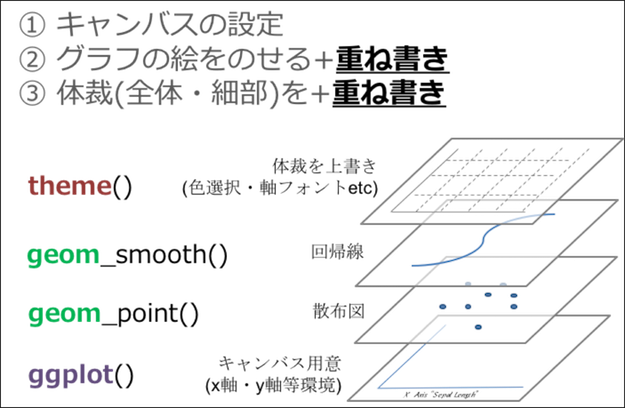

+++
title = "Rでデータを可視化する — Sendai.R #2 初心者セッション"
date = 2019-09-27T14:40:00+09:00
type = "reveal"
draft = false
+++


# Rでデータを可視化する

<div class="author">
岩嵜 航 (Watal M. Iwasaki, PhD)
</div>

<div class="affiliation">
東北大学 生命科学研究科 進化ゲノミクス分野 特任助教<br>
</div>

資料作成協力:<br>
石川由希 (名古屋大学 理学研究科 脳回路構造学 講師)

<div class="footnote">
2019-09-27
<a href="https://sendair.connpass.com/event/137548/">
Sendai.R #2 初心者セッション
</a>
</div>

---
## Who am I?


Watal M. Iwasaki = 岩嵜 航<br>
https://heavywatal.github.io/

PhD in Life Sciences, Tohoku University, Sendai
: Evolutionary theory of complexity and diversity in biological systems.

Postdoc in SOKENDAI, Hayama
: Evolution of diversity within a tumor/cancer.
: Population genetics of Pacific bluefin tuna. 🐟


Asst. Prof. in Tohoku University
: Genomics of Rice 🍚, etc.

Likes
: 🍺 Beer, Sake, Whisky, Cooking
: ♬ Heavy Metal, Classical, Folk

---
## 生データは情報が多すぎ

関係性も何も見えない


```r
print(diamonds)
```

```
      carat       cut color clarity depth table price     x     y     z
      <dbl>     <ord> <ord>   <ord> <dbl> <dbl> <int> <dbl> <dbl> <dbl>
    1  0.23     Ideal     E     SI2  61.5    55   326  3.95  3.98  2.43
    2  0.21   Premium     E     SI1  59.8    61   326  3.89  3.84  2.31
    3  0.23      Good     E     VS1  56.9    65   327  4.05  4.07  2.31
    4  0.29   Premium     I     VS2  62.4    58   334  4.20  4.23  2.63
   --                                                                  
53937  0.72      Good     D     SI1  63.1    55  2757  5.69  5.75  3.61
53938  0.70 Very Good     D     SI1  62.8    60  2757  5.66  5.68  3.56
53939  0.86   Premium     H     SI2  61.0    58  2757  6.15  6.12  3.74
53940  0.75     Ideal     D     SI2  62.2    55  2757  5.83  5.87  3.64
```

ダイヤモンド53,490個について10項目の値を持つ `data.frame`


---
## 要約統計量(平均とか分散とか)を見てみる

まあ何となく分かった気になる


```r
dplyr::summarize_if(diamonds, is.numeric, mean)
```

```
      carat   depth    table  price        x        y        z
      <dbl>   <dbl>    <dbl>  <dbl>    <dbl>    <dbl>    <dbl>
1 0.7979397 61.7494 57.45718 3932.8 5.731157 5.734526 3.538734
```

```r
dplyr::summarize_if(diamonds, is.numeric, sd)
```

```
      carat    depth    table   price        x        y         z
      <dbl>    <dbl>    <dbl>   <dbl>    <dbl>    <dbl>     <dbl>
1 0.4740112 1.432621 2.234491 3989.44 1.121761 1.142135 0.7056988
```

```r
summary(diamonds)
```

```
     carat               cut        color        clarity          depth           table           price             x                y                z         
 Min.   :0.2000   Fair     : 1610   D: 6775   SI1    :13065   Min.   :43.00   Min.   :43.00   Min.   :  326   Min.   : 0.000   Min.   : 0.000   Min.   : 0.000  
 1st Qu.:0.4000   Good     : 4906   E: 9797   VS2    :12258   1st Qu.:61.00   1st Qu.:56.00   1st Qu.:  950   1st Qu.: 4.710   1st Qu.: 4.720   1st Qu.: 2.910  
 Median :0.7000   Very Good:12082   F: 9542   SI2    : 9194   Median :61.80   Median :57.00   Median : 2401   Median : 5.700   Median : 5.710   Median : 3.530  
 Mean   :0.7979   Premium  :13791   G:11292   VS1    : 8171   Mean   :61.75   Mean   :57.46   Mean   : 3933   Mean   : 5.731   Mean   : 5.735   Mean   : 3.539  
 3rd Qu.:1.0400   Ideal    :21551   H: 8304   VVS2   : 5066   3rd Qu.:62.50   3rd Qu.:59.00   3rd Qu.: 5324   3rd Qu.: 6.540   3rd Qu.: 6.540   3rd Qu.: 4.040  
 Max.   :5.0100                     I: 5422   VVS1   : 3655   Max.   :79.00   Max.   :95.00   Max.   :18823   Max.   :10.740   Max.   :58.900   Max.   :31.800  
                                    J: 2808   (Other): 2531                                                                                                     
```

---
## 平均値ばかり見て可視化を怠ると構造を見逃す

<figure style="position: relative;">
<a href="https://www.autodeskresearch.com/publications/samestats">

<figcaption class="url">https://www.autodeskresearch.com/publications/samestats/</figcaption>
</a>

</figure>

---
## データ可視化の重要性

情報の整理 → **正しい解析・新しい発見**


---
## データ可視化の重要性

情報の整理 → **正しい解析・新しい発見**

<figure>
<a href="https://r4ds.had.co.nz/explore-intro.html">

<figcaption class="url">https://r4ds.had.co.nz/explore-intro.html</figcaption>
</a>
</figure>
<figure style="margin-bottom: 32px;">
<a href="https://tsutawarudesign.com/">

<figcaption class="url">https://tsutawarudesign.com/</figcaption>
</a>
</figure>

---
## そうは言ってもセンスでしょ? --- NO!

<figure style="float: right; width: 450px; margin: 1rem 0;">
<a href="https://tsutawarudesign.com/">


<figcaption class="url">https://tsutawarudesign.com/</figcaption>
</a>
</figure>

ある程度は**テクニック**であり**教養**。<br>
デザインの基本的なルールを<br>
知りさえすれば誰でも上達する。<br>

<a href="https://www.amazon.co.jp/dp/4774183210/ref=as_li_ss_il?ie=UTF8&linkCode=li3&tag=heavywatal-22&linkId=7417ab2bc75a7c64806c3d6c0468b45c&language=ja_JP" target="_blank"></a>

---
## 見せ方の吟味もRでやると捗るよ

平均値の差？ ばらつきの様子？ 軸はゼロから始まる？


---
## こんな感じの図もRでラクラク描けるよ

<figure>


<br>


<figcaption class="url">Iwasaki and Innan (2017)</figcaption>
</figure>

---
## 本セッションの目標

### <strike>データはまず可視化してみなきゃ</strike> (済)

### あれもこれもRでやれそうだな

### やりたくなったらこのへんを調べればいいんだな

<br>
この3点さえ押さえれば、具体的なやり方は覚えなくても大丈夫

この発表スライドもオンラインで読める
<br>
https://heavywatal.github.io/slides/

---
## 目次: Rでデータを可視化する

- <strike>データ可視化の意義</strike> (済)
- <strike>Rでやるメリット</strike> (済)
- Rの基本おさらい
- R標準のplot、パッケージのggplot2
- ggplot2の基本的な使い方
- 多変量データの俯瞰も手軽に
- 画像ファイル出力も微調整もプログラミングで

<figure>


</figure>

---
## Rとは

統計解析と作図の機能が充実したプログラミング言語

<figure style="float: right;">
<a href="https://cran.r-project.org/">

<figcaption class="url">https://cran.r-project.org/</figcaption>
</a>
</figure>

クロスプラットフォーム
: Linux, Mac, Windowsで動く。

オープンソース
: 永久に無償で、すべての機能を使える。
: 集合知によって常に進化している。

コミュニティ
: 相談できる人や参考になるウェブサイトがたくさん見つかる。

ほかのプログラミング言語でも似たようなことができる。<br>
例えばPythonもいいよ。

---
## R環境のインストール

R本体
: コマンドを解釈して実行するコア部分
: よく使われる関数なども標準パッケージとして同梱
: https://cran.rstudio.com/ からダウンロードしてインストール

RStudio Desktop
: Rをより快適に使うための総合開発環境(IDE)
: 必須ではないけど、結構みんな使ってるらしい
: https://www.rstudio.com/ からダウンロードしてインストール


---
## Rスクリプトに書いてから、コンソールで実行

File → New File → R script


---
## Rスクリプトに書いてから、コンソールで実行

File → New File → R script


---
## Rと接する上での心構え

エラーを恐れない
: 熟練プログラマーでもよくエラーを発生させる。
: エラー文はRからのメッセージなので、よく読んで意図を汲み取ろう。

困ったらググる
: その困りごとは、全世界のRユーザーの誰かが通った道。
: 日本語で、英語で、エラー文そのままで、検索してみよう。
: それでも分からなかったら [r-wakalang](https://github.com/tokyor/r-wakalang) で相談しよう。

<figure style="float: right; margin: 0;">

</figure>

コード入力はコピペが早い
: 見つけたコードはまずコピペして使ってみよう。
: 動くようなら自分のデータに合わせて改変しよう。
: (ただし、ライセンスには注意...)

---
## data.frame: 長方形のテーブル。重要。

`iris` はアヤメ属3種150個体に関する測定データ。<br>
Rに最初から入ってて、例としてよく使われる。


```r
print(iris)
```

```
    Sepal.Length Sepal.Width Petal.Length Petal.Width   Species
           <dbl>       <dbl>        <dbl>       <dbl>     <fct>
  1          5.1         3.5          1.4         0.2    setosa
  2          4.9         3.0          1.4         0.2    setosa
  3          4.7         3.2          1.3         0.2    setosa
  4          4.6         3.1          1.5         0.2    setosa
 --                                                            
147          6.3         2.5          5.0         1.9 virginica
148          6.5         3.0          5.2         2.0 virginica
149          6.2         3.4          5.4         2.3 virginica
150          5.9         3.0          5.1         1.8 virginica
```

長さ150の数値ベクトル4本と因子ベクトル1本。

---
## R標準のグラフィックス

描けるっちゃ描けるけど。カスタマイズしていくのは難しい。


```r
plot(iris$Sepal.Length, iris$Sepal.Width)
```


きれいなグラフを簡単に描けるパッケージを使いたい。

---
## R標準のグラフィックス

描けるっちゃ描けるけど。カスタマイズしていくのは難しい。


```r
hist(iris$Petal.Length)
```


きれいなグラフを簡単に描けるパッケージを使いたい。

---
## R標準のグラフィックス

描けるっちゃ描けるけど。カスタマイズしていくのは難しい。


```r
boxplot(Petal.Width ~ Species, data = iris)
```


きれいなグラフを簡単に描けるパッケージを使いたい。

---
## パッケージ

便利な関数やデータセットなどをひとまとめにしたもの。

Standard Packages
: Rの標準機能。何もしなくても使用可能。

Contributed Packages
: 有志により開発され、
  [CRAN](https://cran.rstudio.com/web/packages/index.html)
  にまとめて公開されている。
: 要インストール。使う前に読み込むおまじないが必要。


```r
install.packages("ggplot2")  # 一度やればOK
library(ggplot2)             # 読み込みはRを起動するたびに必要
update.packages()            # たまには更新しよう
```

素のRも覚えきってないのにいきなりパッケージ？
: 大丈夫。誰も覚えきってない。
: パッケージを使わないR作業 = 火もナイフも使わない料理

---
## tidyverse

<a href="https://www.tidyverse.org/">

</a>

Rでデータを上手に扱うためのパッケージ群


```r
install.packages("tidyverse")
library(tidyverse)
# 関連パッケージが一挙に読み込まれる
```

- 統一的な使い勝手
- 暗黙の処理をなるべくしない安全設計
- シンプルな関数を繋げて使うデザイン

<figure>
<a href="https://r4ds.had.co.nz/introduction.html">

<figcaption class="url">https://r4ds.had.co.nz/introduction.html</figcaption>
</a>
</figure>

---
## ggplot2とは

<a href="https://ggplot2.tidyverse.org/">

</a>

- tidyverseパッケージ群のひとつ
- "The **G**rammer of **G**raphics" という体系に基づく設計
- 単にいろんなグラフを「描ける」だけじゃなく<br>
  **一貫性のある文法で合理的に描ける**

<figure>
<a href="https://www.amazon.co.jp/Grammar-Graphics-Statistics-Computing/dp/0387245448/ref=as_li_ss_il?ie=UTF8&linkCode=li3&tag=heavywatal-22&linkId=2d44a24b81394d310843bd982fdadf98" target="_blank"></a>


</figure>

---
## R標準のプロットとは根本的に違う

いきなりggplot2から使い始めても大丈夫。


---
## 基本的な使い方: 指示を `+` していく

- `ggplot()` このデータでよろしく
- `geom_*()` 点や線をよろしく
- `theme_*()` 軸とか背景の見た目をよろしく

<figure>
<a href="https://mrunadon.github.io/概要をおさえてggplot2を使いこなすチュートリアルとコード集/">

<figcaption class="url">https://mrunadon.github.io/概要をおさえてggplot2を使いこなすチュートリアルとコード集/</figcaption>
</a>
</figure>

---
## 基本的な使い方: 指示を `+` していく

- `ggplot()` このデータでよろしく
- `geom_*()` 点や線をよろしく
- `theme_*()` 軸とか背景の見た目をよろしく


```r
ggplot(data = diamonds)               # diamondsデータでキャンバス準備
# geom_histogram(aes(x = carat)) +    # x軸caratのヒストグラムで
# theme_classic(base_size = 20)       # クラシックなテーマで
```


---
## 基本的な使い方: 指示を `+` していく

- `ggplot()` このデータでよろしく
- `geom_*()` 点や線をよろしく
- `theme_*()` 軸とか背景の見た目をよろしく


```r
ggplot(data = diamonds) +             # diamondsデータでキャンバス準備
  geom_histogram(aes(x = carat))      # x軸caratのヒストグラムで
# theme_classic(base_size = 20)       # クラシックなテーマで
```


---
## 基本的な使い方: 指示を `+` していく

- `ggplot()` このデータでよろしく
- `geom_*()` 点や線をよろしく
- `theme_*()` 軸とか背景の見た目をよろしく


```r
ggplot(data = diamonds) +             # diamondsデータでキャンバス準備
  geom_histogram(aes(x = carat)) +    # x軸caratのヒストグラムで
  theme_classic(base_size = 20)       # クラシックなテーマで
```


---
## よくあるエラー

パッケージ名は ggplot2、関数名は `ggplot`:
```
> ggplot2(data = diamonds)
Error in ggplot2(data = diamonds) : could not find function "ggplot2"
```

関数名は合ってるはずなのに...
```
> ggplot(data = diamonds)
Error in ggplot(data = diamonds) : could not find function "ggplot"
```

パッケージ読み込みは新しくRを起動するたびに必要:
```r
library(tidyverse)
```


---
## 途中経過を取っておける


```r
p0 = ggplot(data = diamonds)
p1 = p0 + geom_point(mapping = aes(x = carat, y = price))
p2 = p1 + theme_classic(base_size = 20, base_family = "Helvetica")
p3 = p2 + facet_wrap(~ clarity)
print(p3)
```


`p0` とか `p1` あとで使うよ

---
## `ggplot()` に渡すのは整然データ tidy data

- 1行は1つの観測
- 1列は1つの変数
- 1セルは1つの値
- この列をX軸、この列をY軸、この列で色わけ、と指定できる！


```r
print(diamonds)
```

```
      carat       cut color clarity depth table price     x     y     z
      <dbl>     <ord> <ord>   <ord> <dbl> <dbl> <int> <dbl> <dbl> <dbl>
    1  0.23     Ideal     E     SI2  61.5    55   326  3.95  3.98  2.43
    2  0.21   Premium     E     SI1  59.8    61   326  3.89  3.84  2.31
    3  0.23      Good     E     VS1  56.9    65   327  4.05  4.07  2.31
    4  0.29   Premium     I     VS2  62.4    58   334  4.20  4.23  2.63
   --                                                                  
53937  0.72      Good     D     SI1  63.1    55  2757  5.69  5.75  3.61
53938  0.70 Very Good     D     SI1  62.8    60  2757  5.66  5.68  3.56
53939  0.86   Premium     H     SI2  61.0    58  2757  6.15  6.12  3.74
53940  0.75     Ideal     D     SI2  62.2    55  2757  5.83  5.87  3.64
```

参考:<br>
`data(package = "ggplot2")`<br>
<https://r4ds.had.co.nz/tidy-data.html><br>
<https://speakerdeck.com/fnshr/zheng-ran-detatutenani><br>


---
## Aesthetic mapping でデータと見せ方を紐付け

`aes()` の中で列名を指定する。


```r
p0 + geom_point(mapping = aes(x = carat, y = price,
                              color = color, size = clarity))
```


---
## データによらず一律で見せ方を変える

`aes()` の外で値を指定する。


```r
p0 + geom_point(mapping = aes(x = carat, y = price),
                color = "darkorange", size = 6, alpha = 0.4)
```


---
## 色パレットの変更 `scale_colour_*()`

個々の色を自分で決めず、既存のパレットを利用するのが吉。<br>
e.g., [ColorBrewer](https://colorbrewer2.org/#type=diverging&scheme=Spectral&n=5),
[viridis](https://cran.r-project.org/web/packages/viridis/vignettes/intro-to-viridis.html)
(色覚多様性の対策にも有効)


```r
#pQ+ scale_colour_brewer(palette = "Spectral")
pQ + scale_colour_viridis_c(option = "magma", direction = -1)
```


---
## 値に応じて切り分けて表示 (1変数facet)

ggplotの真骨頂！
これをR標準グラフィックスでやるのは結構たいへん。


```r
p1 + facet_wrap(~ clarity, ncol = 4L)
```


---
## 値に応じて切り分けて表示 (≥2変数facet)

ggplotの真骨頂！
これをR標準グラフィックスでやるのは結構たいへん。


```r
p1 + facet_grid(cut ~ clarity)
```


---
## 多変量データの俯瞰に便利


---
## 値を変えず座標軸を変える `scale_*`, `coord_*`


```r
ggplot(data = diamonds, aes(carat, price)) +
  geom_point(alpha = 0.25) +
  scale_x_log10() +
  scale_y_log10(breaks = c(1, 2, 5, 10) * 1000) +
  coord_cartesian(xlim = c(0.1, 10), ylim = c(800, 12000)) +
  labs(title = "Diamonds", x = "Size (carat)", y = "Price (USD)")
```


---
## データと関係ない部分の見た目を調整 `theme`

[既存の `theme_*()`](https://ggplot2.tidyverse.org/reference/ggtheme.html)
をベースに、`theme()` 関数で微調整。


```r
p1 + theme_bw() + theme(
  panel.background = element_rect(fill = "khaki"), # 箱
  panel.grid.major = element_line(colour = "red"), # 線
  axis.title       = element_text(size = 32),      # 文字
  axis.text        = element_blank()               # 消す
)
```


---
## 論文のFigureみたいに並べる

別のパッケージ
([cowplot](https://cran.r-project.org/package=cowplot)
や
[patchwork](https://github.com/thomasp85/patchwork))
の助けを借りて


```r
pAB = cowplot::plot_grid(p2, p2, labels = c("A", "B"), nrow = 1L)
cowplot::plot_grid(pAB, p2, labels = c("", "C"), ncol=1L)
```


---
## ファイル名もサイズも再現可能な作図

`width`や`height`が小さいほど、文字・点・線が相対的に大きく


```r
# 7inch x 300dpi = 2100px四方 (デフォルト)
ggsave("dia1.png", p1) # width = 7, height = 7, dpi = 300
# 4     x 300    = 1200  全体7/4倍ズーム
ggsave("dia2.png", p1, width = 4, height = 4) # dpi = 300
# 2     x 600    = 1200  全体をさらに2倍ズーム
ggsave("dia3.png", p1, width = 2, height = 2, dpi = 600)
# 4     x 300    = 1200  テーマを使って文字だけ拡大
ggsave("dia4.png", p1 + theme_bw(base_size = 22), width = 4, height = 4)
```

<figure>


</figure>

---
## 他にどんな種類の `geom_*()` が使える？

なんでもある。
[公式サイト](https://ggplot2.tidyverse.org/reference/index.html)を見に行こう。

<figure>

</figure>

---

<figure style="margin: 0;">
<a href="https://ggplot2.tidyverse.org/">

<figcaption class="url">https://ggplot2.tidyverse.org/</figcaption>
</a>
</figure>

---
## 微調整してくと最終的に長いコードになるね...

うん。でもすべての点について後から確認できるし、使い回せる！


```r
ggplot(diamonds) +
  geom_boxplot(aes(y = carat, x = cut, color = cut)) +
  theme_classic(base_size = 15, base_family = "Helvetica") +
  coord_cartesian(ylim = c(-1, 6)) +
  labs(title = "Diamonds", x = "Size (carat)", y = "Price (USD)") +
  theme(axis.title.x = element_text(color = "black", size = 30),
        axis.title.y = element_text(color = "black", size = 30),
        axis.text.x = element_blank(),
        axis.text.y = element_text(color = "black", size = 30),
        axis.line.x = element_line(),
        axis.line.y = element_line(),
        axis.ticks.length = unit(8, "pt"),
        panel.background = element_blank(),
        panel.grid.major = element_blank(),
        panel.grid.minor = element_blank(),
        legend.position = "none",
        plot.margin = grid::unit(c(0.5, 0.5, 1, 0.5), "lines"))
```

---
## 発展的な内容

ggplot2を[さらに拡張するパッケージも続々](https://exts.ggplot2.tidyverse.org/)
: アニメーション gganimate
: ラベル付け ggrepel
: グラフ/ネットワーク ggraph
: 系統樹 ggtree


もちろん地図とかも描ける
: [OK, Google. "ggplot 地図"](https://www.google.co.jp/search?q=ggplot+%E5%9C%B0%E5%9B%B3)

ggplot2は3Dが苦手
: 本当に3Dが必要? 色分けやファセットで足りない?
: 別のパッケージ(rgl, plotly)でやる。

---
## 疑問やエラーの解決方法

- RStudio内にヘルプを表示: `?sum`, `help.start()`
- 変数の構造を確かめる: `str(iris)`, `attributes(iris)`
- エラー文をちゃんと読む: `No such file or directory`
- パッケージの公式ドキュメントをちゃんと読む
- パッケージ名やエラー文をコピペしてウェブ検索<br>
  → [StackOverflow](https://stackoverflow.com/questions/tagged/r)
  や個人サイトに解決策
- 身近な経験者に訊く
- Slackの
  [r-wakalang](https://github.com/tokyor/r-wakalang)
  で質問を投稿する。<br>
  内容によってチャンネルを選ぶ: `#r_beginners`, `#ggplot2`
- 状況を再現できる小さな例
  [(reprex)](https://reprex.tidyverse.org/)
  を添えて質問すると回答を得やすい。

---
## 参考

講義資料
: 「[Rにやらせて楽しよう — データの可視化と下ごしらえ](https://heavywatal.github.io/slides/nagoya2018/)」
   岩嵜航 2018
: 「Rを用いたデータ解析の基礎と応用」石川由希 2019 名古屋大学

R for Data Science --- Hadley Wickham and Garrett Grolemund
: https://r4ds.had.co.nz/
: [英語版書籍](https://amzn.to/2tbRmVc)
: [日本語版書籍(Rではじめるデータサイエンス)](https://amzn.to/2yyFRKt)

ggplot2公式ドキュメント
: https://ggplot2.tidyverse.org/


---
## まとめ

データを持ったらまずは可視化
: 要約統計量ばかり見てると大事なものを見逃す

こんなグラフを描きたいな
: だいたい何でもggplot2でできるよ。

どうやるんだっけ
: たす `p = ggplot(data) + geom_*() + scale_*() + theme_*()`
: 保存 `ggsave("fig1.png", p, width=4, height=3, dpi=300)`
: 忘れるたびに調べる。徐々に身につく。

ちゃんと描こうと思うと結構な量のプログラムになるね...
: そうだけど、一度書いたら後で使い回せるよ。
