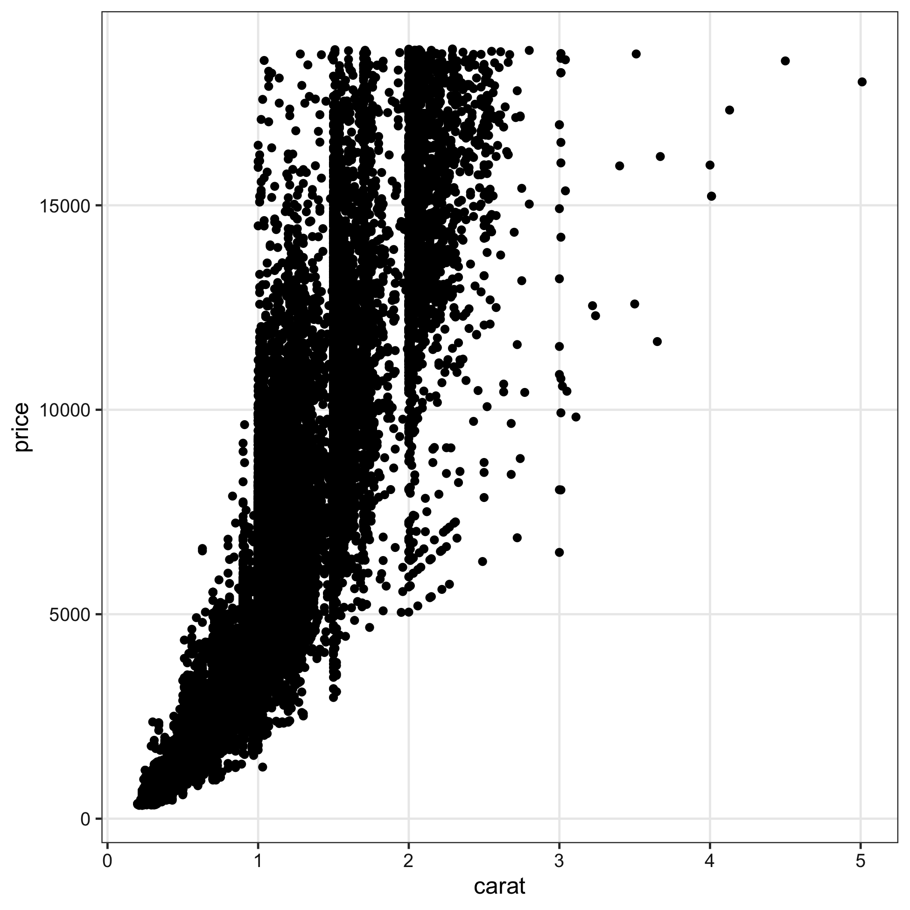

+++
url = "tmd2021/2-visualization.html"
title = "2. 入門2: データ可視化の重要性と方法 — Rによるデータ前処理実習 2021"
linktitle = "入門2: データ可視化の重要性と方法。"
date = 2021-10-02T14:40:00+09:00
type = "reveal"
draft = false
+++

<link rel="stylesheet" href="style.css">

# [Rによるデータ前処理実習2021](.)

<div class="author">
岩嵜 航 (Watal M. Iwasaki, PhD)
</div>

<div class="affiliation">
東北大学 生命科学研究科 進化ゲノミクス分野 特任助教<br>
(Graduate School of Life Sciences, Tohoku University)
</div>

<ol>
<li><a href="1-introduction.html">入門1: 前処理とは。Rを使うメリット。Rの基本。</a>
<li class="current-deck"><a href="2-visualization.html">入門2: データ可視化の重要性と方法。</a>
<li><a href="3-structure1.html">データ構造の処理1: 抽出、集約など。</a>
<li><a href="4-structure2.html">データ構造の処理2: 結合、変形など。</a>
<li><a href="5-content.html">データ内容の処理: 数値、文字列、日時など。</a>
<li><a href="6-practice.html">実践: 現実の問題に対処してみる。</a>
</ol>

<div class="footnote">
2021-10-02 東京医科歯科大学 M&Dタワー 情報検索室1
<a href="https://heavywatal.github.io/slides/tmd2021/">https://heavywatal.github.io/slides/tmd2021/</a>
</div>


---
## データ解析のおおまかな流れ

1. コンピュータ環境の整備
1. データの取得、読み込み
1. 探索的データ解析
    - 前処理、加工 (地味。意外と重い) 👈次回
    - **可視化、仮説生成** (派手！楽しい！) 👈今回
    - 統計解析、仮説検証 (みんな勉強したがる)
1. 報告、発表

<figure>
<a href="https://r4ds.had.co.nz/introduction.html">

<figcaption class="url">https://r4ds.had.co.nz/introduction.html</figcaption>
</a>
</figure>


---
## そもそもなぜ解析？ 生の数字見ればよくない？

生データは情報が多すぎて関係性も何も見えない


```r
print(diamonds)
```

```
      carat       cut color clarity depth table price     x     y     z
      <dbl>     <ord> <ord>   <ord> <dbl> <dbl> <int> <dbl> <dbl> <dbl>
    1  0.23     Ideal     E     SI2  61.5    55   326  3.95  3.98  2.43
    2  0.21   Premium     E     SI1  59.8    61   326  3.89  3.84  2.31
    3  0.23      Good     E     VS1  56.9    65   327  4.05  4.07  2.31
    4  0.29   Premium     I     VS2  62.4    58   334  4.20  4.23  2.63
   --                                                                  
53937  0.72      Good     D     SI1  63.1    55  2757  5.69  5.75  3.61
53938  0.70 Very Good     D     SI1  62.8    60  2757  5.66  5.68  3.56
53939  0.86   Premium     H     SI2  61.0    58  2757  6.15  6.12  3.74
53940  0.75     Ideal     D     SI2  62.2    55  2757  5.83  5.87  3.64
```

ダイヤモンド53,940個について10項目の値を持つ `data.frame`

---
## 要約統計量(平均とか分散とか)を見てみる

各列の**平均**とか**標準偏差**とか:


```
   stat carat depth table    price     x     y     z
  <chr> <dbl> <dbl> <dbl>    <dbl> <dbl> <dbl> <dbl>
1  mean  0.80 61.75 57.46  3932.80  5.73  5.73  3.54
2    sd  0.47  1.43  2.23  3989.44  1.12  1.14  0.71
3   max  5.01 79.00 95.00 18823.00 10.74 58.90 31.80
```

大きさ `carat` と価格 `price` の**相関係数**は 0.92 (かなり高い)。


**生のままよりは把握しやすい**かも。

しかし要注意...

---
## 平均値ばかり見て可視化を怠ると構造を見逃す

<figure style="position: relative;">
<a href="https://www.autodesk.com/research/publications/same-stats-different-graphs">

<figcaption class="url">https://www.autodesk.com/research/publications/same-stats-different-graphs</figcaption>
</a>

</figure>

---
## 作図してみると全体像・構造が見やすい

情報の整理 → **正しい解析・新しい発見・仮説生成**


`carat` が大きいほど `price` も高いらしい。<br>
その度合いは `clarity` によって異なるらしい。

---
## 作図してみると全体像・構造が見やすい

情報の整理 → **正しい解析・新しい発見・仮説生成**

<figure>
<a href="https://r4ds.had.co.nz/explore-intro.html">

<figcaption class="url">https://r4ds.had.co.nz/explore-intro.html</figcaption>
</a>
</figure>
<figure style="margin-bottom: 32px;">
<a href="https://tsutawarudesign.com/">

<figcaption class="url">https://tsutawarudesign.com/</figcaption>
</a>
</figure>

---
## そうは言ってもセンスでしょ? --- NO!

<figure style="float: right; width: 450px; margin: 1rem 0;">
<a href="https://tsutawarudesign.com/">


<figcaption class="url">https://tsutawarudesign.com/</figcaption>
</a>
</figure>

ある程度は**テクニック**であり**教養**。<br>
デザインの基本的なルールを<br>
知りさえすれば誰でも上達する。<br>

<a href="https://www.amazon.co.jp/dp/4297119854?&linkCode=li3&tag=heavywatal-22&linkId=e78727fee8cad1fa8c50eb32b94eb838&language=ja_JP&ref_=as_li_ss_il" target="_blank"></a>

---
## 同じデータでも見せ方で印象が変わる

平均値の差？ ばらつきの様子？ 軸はゼロから始まる？<br>
**目的に合わせて見せ方を吟味**しよう。


---
## こんな感じの図もRでラクラク描けるよ

<figure>


<br>


<figcaption class="url">Iwasaki and Innan (2017)</figcaption>
</figure>

---
## 本日2時限目の話題: Rによるデータ可視化

### ✅ <del>データ解析全体の流れ。可視化だいじ</del>

### ⬜ 一貫性のある文法で合理的に描けるggplot2

### ⬜ 画像出力まできっちりプログラミング

<figure>


</figure>

---
## これから可視化する data.frame

`iris` はアヤメ属3種150個体に関する測定データ。<br>
Rに最初から入ってて、例としてよく使われる。


```r
print(iris)
```

```
    Sepal.Length Sepal.Width Petal.Length Petal.Width   Species
           <dbl>       <dbl>        <dbl>       <dbl>     <fct>
  1          5.1         3.5          1.4         0.2    setosa
  2          4.9         3.0          1.4         0.2    setosa
  3          4.7         3.2          1.3         0.2    setosa
  4          4.6         3.1          1.5         0.2    setosa
 --                                                            
147          6.3         2.5          5.0         1.9 virginica
148          6.5         3.0          5.2         2.0 virginica
149          6.2         3.4          5.4         2.3 virginica
150          5.9         3.0          5.1         1.8 virginica
```

長さ150の数値ベクトル4本と因子ベクトル1本。

---
## R標準のグラフィックス

描けるっちゃ描けるけど。カスタマイズしていくのは難しい。


```r
plot(iris$Sepal.Length, iris$Sepal.Width)
```


---
## R標準のグラフィックス

描けるっちゃ描けるけど。カスタマイズしていくのは難しい。


```r
hist(iris$Petal.Length)
```


---
## R標準のグラフィックス

描けるっちゃ描けるけど。カスタマイズしていくのは難しい。


```r
plot(density(iris$Petal.Length))
```


---
## R標準のグラフィックス

描けるっちゃ描けるけど。カスタマイズしていくのは難しい。


```r
boxplot(Petal.Width ~ Species, data = iris)
```


きれいなグラフを簡単に描けるパッケージを使いたい。

---
## ggplot2

<a href="https://ggplot2.tidyverse.org/">

</a>

- tidyverseパッケージ群のひとつ
- "The <strong><u>G</u></strong>rammer of <strong><u>G</u></strong>raphics" という体系に基づく設計
- 単にいろんなグラフを「描ける」だけじゃなく<br>
  **一貫性のある文法で合理的に描ける**

<figure>
<a href="https://www.amazon.co.jp/dp/B00HWUVHXK/ref=as_li_ss_il?ie=UTF8&linkCode=li3&tag=heavywatal-22&linkId=d63d3627df82c09b0bb5ca8f47ee19cc&language=ja_JP" target="_blank"></a>


</figure>

---
## いきなりggplot2から使い始めても大丈夫

R標準のやつとは根本的に違うシステムで作図する。

<div class="goldmark-p-workaround">
<svg width="288pt" height="266pt"
 viewBox="0.00 0.00 288.35 265.60" xmlns="http://www.w3.org/2000/svg" xmlns:xlink="http://www.w3.org/1999/xlink">
<g id="graph0" class="graph" transform="scale(1 1) rotate(0) translate(4 261.6)">
<title>boxes_and_circles</title>
<polygon fill="#ffffff" stroke="transparent" points="-4,4 -4,-261.6 284.3471,-261.6 284.3471,4 -4,4"/>
<!-- Traditional R plot
boxplot(), hist(), ... -->
<g id="node1" class="node">
<title>Traditional R plot
boxplot(), hist(), ...</title>
<polygon fill="none" stroke="#000000" points="128.6762,-257.4019 .1078,-257.4019 .1078,-216.1981 128.6762,-216.1981 128.6762,-257.4019"/>
<text text-anchor="middle" x="64.392" y="-241" font-family="Helvetica,sans-Serif" font-size="14.00" fill="#000000">Traditional R plot</text>
<text text-anchor="middle" x="64.392" y="-224.2" font-family="Helvetica,sans-Serif" font-size="14.00" fill="#000000">boxplot(), hist(), ...</text>
</g>
<!-- graphics -->
<g id="node4" class="node">
<title>graphics</title>
<polygon fill="none" stroke="#000000" points="113.7897,-180 44.9943,-180 44.9943,-144 113.7897,-144 113.7897,-180"/>
<text text-anchor="middle" x="79.392" y="-157.8" font-family="Helvetica,sans-Serif" font-size="14.00" fill="#000000">graphics</text>
</g>
<!-- Traditional R plot
boxplot(), hist(), ...&#45;&gt;graphics -->
<g id="edge1" class="edge">
<title>Traditional R plot
boxplot(), hist(), ...&#45;&gt;graphics</title>
<path fill="none" stroke="#000000" d="M68.5703,-215.964C70.1727,-207.9736 72.0285,-198.7191 73.746,-190.1547"/>
<polygon fill="#000000" stroke="#000000" points="77.2114,-190.6746 75.746,-180.1816 70.348,-189.2982 77.2114,-190.6746"/>
</g>
<!-- lattice -->
<g id="node2" class="node">
<title>lattice</title>
<polygon fill="none" stroke="#000000" points="200.392,-254.8 146.392,-254.8 146.392,-218.8 200.392,-218.8 200.392,-254.8"/>
<text text-anchor="middle" x="173.392" y="-232.6" font-family="Helvetica,sans-Serif" font-size="14.00" fill="#000000">lattice</text>
</g>
<!-- grid -->
<g id="node5" class="node">
<title>grid</title>
<polygon fill="none" stroke="#000000" points="200.392,-180 146.392,-180 146.392,-144 200.392,-144 200.392,-180"/>
<text text-anchor="middle" x="173.392" y="-157.8" font-family="Helvetica,sans-Serif" font-size="14.00" fill="#000000">grid</text>
</g>
<!-- lattice&#45;&gt;grid -->
<g id="edge3" class="edge">
<title>lattice&#45;&gt;grid</title>
<path fill="none" stroke="#000000" d="M173.392,-218.693C173.392,-210.2112 173.392,-199.9062 173.392,-190.4204"/>
<polygon fill="#000000" stroke="#000000" points="176.8921,-190.1995 173.392,-180.1995 169.8921,-190.1995 176.8921,-190.1995"/>
</g>
<!-- ggplot2 -->
<g id="node3" class="node">
<title>ggplot2</title>
<polygon fill="none" stroke="#000000" points="280.3023,-254.8 218.4817,-254.8 218.4817,-218.8 280.3023,-218.8 280.3023,-254.8"/>
<text text-anchor="middle" x="249.392" y="-232.6" font-family="Helvetica,sans-Serif" font-size="14.00" fill="#000000">ggplot2</text>
</g>
<!-- ggplot2&#45;&gt;grid -->
<g id="edge4" class="edge">
<title>ggplot2&#45;&gt;grid</title>
<path fill="none" stroke="#000000" d="M230.9945,-218.693C221.4499,-209.2991 209.6333,-197.669 199.1915,-187.3922"/>
<polygon fill="#000000" stroke="#000000" points="201.4657,-184.7196 191.8835,-180.1995 196.5555,-189.7086 201.4657,-184.7196"/>
</g>
<!-- grDevices -->
<g id="node6" class="node">
<title>grDevices</title>
<polygon fill="none" stroke="#000000" points="157.6139,-108 79.1701,-108 79.1701,-72 157.6139,-72 157.6139,-108"/>
<text text-anchor="middle" x="118.392" y="-85.8" font-family="Helvetica,sans-Serif" font-size="14.00" fill="#000000">grDevices</text>
</g>
<!-- graphics&#45;&gt;grDevices -->
<g id="edge2" class="edge">
<title>graphics&#45;&gt;grDevices</title>
<path fill="none" stroke="#000000" d="M89.2333,-143.8314C93.5877,-135.7925 98.8018,-126.1666 103.6089,-117.2918"/>
<polygon fill="#000000" stroke="#000000" points="106.7328,-118.8732 108.4181,-108.4133 100.5777,-115.5392 106.7328,-118.8732"/>
</g>
<!-- grid&#45;&gt;grDevices -->
<g id="edge5" class="edge">
<title>grid&#45;&gt;grDevices</title>
<path fill="none" stroke="#000000" d="M159.5132,-143.8314C153.1784,-135.5386 145.5536,-125.557 138.5994,-116.4533"/>
<polygon fill="#000000" stroke="#000000" points="141.3095,-114.2353 132.4577,-108.4133 135.7468,-118.4847 141.3095,-114.2353"/>
</g>
<!-- pdf -->
<g id="node7" class="node">
<title>pdf</title>
<polygon fill="none" stroke="#000000" points="73.392,-36 19.392,-36 19.392,0 73.392,0 73.392,-36"/>
<text text-anchor="middle" x="46.392" y="-13.8" font-family="Helvetica,sans-Serif" font-size="14.00" fill="#000000">pdf</text>
</g>
<!-- grDevices&#45;&gt;pdf -->
<g id="edge6" class="edge">
<title>grDevices&#45;&gt;pdf</title>
<path fill="none" stroke="#000000" d="M100.2234,-71.8314C91.6768,-63.2848 81.3363,-52.9443 72.0118,-43.6198"/>
<polygon fill="#000000" stroke="#000000" points="74.3512,-41.0095 64.8053,-36.4133 69.4015,-45.9592 74.3512,-41.0095"/>
</g>
<!-- png -->
<g id="node8" class="node">
<title>png</title>
<polygon fill="none" stroke="#000000" points="145.392,-36 91.392,-36 91.392,0 145.392,0 145.392,-36"/>
<text text-anchor="middle" x="118.392" y="-13.8" font-family="Helvetica,sans-Serif" font-size="14.00" fill="#000000">png</text>
</g>
<!-- grDevices&#45;&gt;png -->
<g id="edge7" class="edge">
<title>grDevices&#45;&gt;png</title>
<path fill="none" stroke="#000000" d="M118.392,-71.8314C118.392,-64.131 118.392,-54.9743 118.392,-46.4166"/>
<polygon fill="#000000" stroke="#000000" points="121.8921,-46.4132 118.392,-36.4133 114.8921,-46.4133 121.8921,-46.4132"/>
</g>
<!-- svg -->
<g id="node9" class="node">
<title>svg</title>
<polygon fill="none" stroke="#000000" points="217.392,-36 163.392,-36 163.392,0 217.392,0 217.392,-36"/>
<text text-anchor="middle" x="190.392" y="-13.8" font-family="Helvetica,sans-Serif" font-size="14.00" fill="#000000">svg</text>
</g>
<!-- grDevices&#45;&gt;svg -->
<g id="edge8" class="edge">
<title>grDevices&#45;&gt;svg</title>
<path fill="none" stroke="#000000" d="M136.5606,-71.8314C145.1072,-63.2848 155.4477,-52.9443 164.7722,-43.6198"/>
<polygon fill="#000000" stroke="#000000" points="167.3825,-45.9592 171.9787,-36.4133 162.4328,-41.0095 167.3825,-45.9592"/>
</g>
</g>
</svg>
</div>

---
## 基本的な使い方: 指示を `+` で重ねていく


---
## 基本的な使い方: 指示を `+` で重ねていく


```r
ggplot(data = diamonds)             # diamondsデータでキャンバス準備
# aes(x = carat, y = price) +       # carat,price列をx,y軸にmapping
# geom_point() +                    # 散布図を描く
# facet_wrap(vars(clarity)) +       # clarity列に応じてパネル分割
# stat_smooth(method = lm) +        # 直線回帰を追加
# coord_cartesian(ylim = c(0, 2e4)) + # y軸の表示範囲を狭く
# theme_classic(base_size = 20)     # クラシックなテーマで
```


---
## 基本的な使い方: 指示を `+` で重ねていく


```r
ggplot(data = diamonds) +           # diamondsデータでキャンバス準備
  aes(x = carat, y = price)         # carat,price列をx,y軸にmapping
# geom_point() +                    # 散布図を描く
# facet_wrap(vars(clarity)) +       # clarity列に応じてパネル分割
# stat_smooth(method = lm) +        # 直線回帰を追加
# coord_cartesian(ylim = c(0, 2e4)) + # y軸の表示範囲を狭く
# theme_classic(base_size = 20)     # クラシックなテーマで
```


---
## 基本的な使い方: 指示を `+` で重ねていく


```r
ggplot(data = diamonds) +           # diamondsデータでキャンバス準備
  aes(x = carat, y = price) +       # carat,price列をx,y軸にmapping
  geom_point()                      # 散布図を描く
# facet_wrap(vars(clarity)) +       # clarity列に応じてパネル分割
# stat_smooth(method = lm) +        # 直線回帰を追加
# coord_cartesian(ylim = c(0, 2e4)) + # y軸の表示範囲を狭く
# theme_classic(base_size = 20)     # クラシックなテーマで
```


---
## 基本的な使い方: 指示を `+` で重ねていく


```r
ggplot(data = diamonds) +           # diamondsデータでキャンバス準備
  aes(x = carat, y = price) +       # carat,price列をx,y軸にmapping
  geom_point() +                    # 散布図を描く
  facet_wrap(vars(clarity))         # clarity列に応じてパネル分割
# stat_smooth(method = lm) +        # 直線回帰を追加
# coord_cartesian(ylim = c(0, 2e4)) + # y軸の表示範囲を狭く
# theme_classic(base_size = 20)     # クラシックなテーマで
```


---
## 基本的な使い方: 指示を `+` で重ねていく


```r
ggplot(data = diamonds) +           # diamondsデータでキャンバス準備
  aes(x = carat, y = price) +       # carat,price列をx,y軸にmapping
  geom_point() +                    # 散布図を描く
  facet_wrap(vars(clarity)) +       # clarity列に応じてパネル分割
  stat_smooth(method = lm)          # 直線回帰を追加
# coord_cartesian(ylim = c(0, 2e4)) + # y軸の表示範囲を狭く
# theme_classic(base_size = 20)     # クラシックなテーマで
```


---
## 基本的な使い方: 指示を `+` で重ねていく


```r
ggplot(data = diamonds) +           # diamondsデータでキャンバス準備
  aes(x = carat, y = price) +       # carat,price列をx,y軸にmapping
  geom_point() +                    # 散布図を描く
  facet_wrap(vars(clarity)) +       # clarity列に応じてパネル分割
  stat_smooth(method = lm) +        # 直線回帰を追加
  coord_cartesian(ylim = c(0, 2e4))   # y軸の表示範囲を狭く
# theme_classic(base_size = 20)     # クラシックなテーマで
```


---
## 基本的な使い方: 指示を `+` で重ねていく


```r
ggplot(data = diamonds) +           # diamondsデータでキャンバス準備
  aes(x = carat, y = price) +       # carat,price列をx,y軸にmapping
  geom_point() +                    # 散布図を描く
  facet_wrap(vars(clarity)) +       # clarity列に応じてパネル分割
  stat_smooth(method = lm) +        # 直線回帰を追加
  coord_cartesian(ylim = c(0, 2e4)) + # y軸の表示範囲を狭く
  theme_classic(base_size = 20)     # クラシックなテーマで
```


---
## 基本的な使い方: 指示を `+` で重ねていく


```r
ggplot(data = diamonds) +           # diamondsデータでキャンバス準備
  aes(x = carat, y = price) +       # carat,price列をx,y軸にmapping
  geom_point() +                    # 散布図を描く
# facet_wrap(vars(clarity)) +       # clarity列に応じてパネル分割
# stat_smooth(method = lm) +        # 直線回帰を追加
# coord_cartesian(ylim = c(0, 2e4)) + # y軸の表示範囲を狭く
  theme_classic(base_size = 20)     # クラシックなテーマで
```


---
## 途中経過オブジェクトを取っておける


```r
p1 = ggplot(data = diamonds)
p2 = p1 + aes(x = carat, y = price)
p3 = p2 + geom_point()
p4 = p3 + facet_wrap(vars(clarity))
print(p3)
```


普段はあんまりやらなけど、今日は `p2` とか使う

---
## ひとまずggplotしてみよう

自動車のスペックに関するデータ `mpg` を使って。


```
    manufacturer  model displ  year   cyl      trans   drv   cty   hwy    fl   class
           <chr>  <chr> <dbl> <int> <int>      <chr> <chr> <int> <int> <chr>   <chr>
  1         audi     a4   1.8  1999     4   auto(l5)     f    18    29     p compact
  2         audi     a4   1.8  1999     4 manual(m5)     f    21    29     p compact
 --                                                                                 
233   volkswagen passat   2.8  1999     6 manual(m5)     f    18    26     p midsize
234   volkswagen passat   3.6  2008     6   auto(s6)     f    17    26     p midsize
```

🔰 排気量 `displ` と市街地燃費 `cty` の関係を散布図で。


---
## よくあるエラー

関数名を `ggplot2` と書いちゃうと勘違い:
```
> ggplot2(diamonds)
Error in ggplot2(diamonds) : could not find function "ggplot2"
```

**ggplot2** はパッケージ名。<br>
今度こそ関数名は合ってるはずなのに...
```
> ggplot(diamonds)
Error in ggplot(diamonds) : could not find function "ggplot"
```

パッケージ読み込みを忘れてた。新しくRを起動するたびに必要:
```r
library(tidyverse)  # including ggplot2
ggplot(diamonds)    # OK!
```

そのほか [よくあるエラー集 (石川由希さん@名古屋大)](https://comicalcommet.github.io/r-training-2021/R_training_2021_7.html) を参照。


---
## `ggplot()` に渡すのは整然データ tidy data

- 1行は1つの観測
- 1列は1つの変数
- 1セルは1つの値
- この列をX軸、この列をY軸、この列で色わけ、と指定できる！


```r
print(diamonds)
```

```
      carat       cut color clarity depth table price     x     y     z
      <dbl>     <ord> <ord>   <ord> <dbl> <dbl> <int> <dbl> <dbl> <dbl>
    1  0.23     Ideal     E     SI2  61.5    55   326  3.95  3.98  2.43
    2  0.21   Premium     E     SI1  59.8    61   326  3.89  3.84  2.31
    3  0.23      Good     E     VS1  56.9    65   327  4.05  4.07  2.31
    4  0.29   Premium     I     VS2  62.4    58   334  4.20  4.23  2.63
   --                                                                  
53937  0.72      Good     D     SI1  63.1    55  2757  5.69  5.75  3.61
53938  0.70 Very Good     D     SI1  62.8    60  2757  5.66  5.68  3.56
53939  0.86   Premium     H     SI2  61.0    58  2757  6.15  6.12  3.74
53940  0.75     Ideal     D     SI2  62.2    55  2757  5.83  5.87  3.64
```

<cite>
<a class="url" href="https://r4ds.had.co.nz/tidy-data.html">https://r4ds.had.co.nz/tidy-data.html</a><br>
<a class="url" href="https://speakerdeck.com/fnshr/zheng-ran-detatutenani">https://speakerdeck.com/fnshr/zheng-ran-detatutenani</a>
</cite>


---
## Aesthetic mapping でデータと見せ方を紐付け

`aes()` の中で列名を指定する。


```r
p1 + aes(x = carat, y = price) +
  geom_point(mapping = aes(color = color, size = clarity))
```


---
## データによらず一律でaestheticsを変える

`aes()` の外で値を指定する。


```r
p1 + aes(x = carat, y = price) +
  geom_point(color = "darkorange", size = 6, alpha = 0.4)
```


---
## 色の変え方の練習

自動車のスペックに関するデータ `mpg` を使って。


```
    manufacturer  model displ  year   cyl      trans   drv   cty   hwy    fl   class
           <chr>  <chr> <dbl> <int> <int>      <chr> <chr> <int> <int> <chr>   <chr>
  1         audi     a4   1.8  1999     4   auto(l5)     f    18    29     p compact
  2         audi     a4   1.8  1999     4 manual(m5)     f    21    29     p compact
 --                                                                                 
233   volkswagen passat   2.8  1999     6 manual(m5)     f    18    26     p midsize
234   volkswagen passat   3.6  2008     6   auto(s6)     f    17    26     p midsize
```

🔰 排気量 `displ` と市街地燃費 `cty` の関係を青い散布図で描こう<br>
🔰 駆動方式 `drv` やシリンダー数 `cyl` によって色を塗り分けしてみよう


---
## [aesthetics一覧](https://ggplot2.tidyverse.org/articles/ggplot2-specs.html)

- [色・透明度を変える](https://ggplot2.tidyverse.org/reference/aes_colour_fill_alpha.html)
  - `color`: 点、線、文字の色
  - `fill`: 面の色
  - [`alpha`](https://ggplot2.tidyverse.org/reference/scale_alpha.html): 不透明度 (0が透明、1が不透明)
- [大きさ・形を変える](https://ggplot2.tidyverse.org/reference/aes_linetype_size_shape.html)
  - [`size`](https://ggplot2.tidyverse.org/reference/scale_size.html): 点や文字の大きさ、線の太さ
  - [`shape`](https://ggplot2.tidyverse.org/reference/scale_shape.html): 点の形
  - [`linetype`](https://ggplot2.tidyverse.org/reference/scale_linetype.html): 線の種類
- [単にグループ分けする](https://ggplot2.tidyverse.org/reference/aes_group_order.html)
  - `group`: 折れ線グラフやポリゴンの切り分けなど
- [座標、始点、終点](https://ggplot2.tidyverse.org/reference/aes_position.html)
  - **`x`**, **`y`**, `xmin`, `xmax`, `ymin`, `ymax`, `xend`, `yend`


---
## 点と線と文字は `color`, 面は `fill`


```r
p1 + aes(x = clarity, y = price) +
  geom_boxplot(color = "darkgreen", fill = "gold", alpha = 0.6)
```


---
## 色パレットの変更 `scale_color_*()`

個々の色を自分で決めず、既存のパレットを利用するのが吉。<br>
e.g., [ColorBrewer](https://colorbrewer2.org/#type=diverging&scheme=Spectral&n=5),
[viridis](https://ggplot2.tidyverse.org/reference/scale_viridis.html)
(色覚多様性・グレースケール対策にも有効)


```r
p2 + geom_point(mapping = aes(color = color)) +
  scale_color_viridis_d(option = "plasma") + theme_dark()
# scale_color_brewer(palette = "Spectral")
```


---
## 値に応じてパネル切り分け (1変数facet)

ggplotの真骨頂！
これをR標準機能でやるのは結構たいへん。


```r
p3 + facet_wrap(vars(clarity), ncol = 4L)
```


---
## 値に応じてパネル切り分け (≥2変数facet)

ggplotの真骨頂！
これをR標準機能でやるのは結構たいへん。


```r
p3 + facet_grid(vars(clarity), vars(cut))
```


---
## 多変量データの俯瞰、5次元くらいまで有効


---
## 値に応じたfacetの練習

自動車のスペックに関するデータ `mpg` を使って。


```
    manufacturer  model displ  year   cyl      trans   drv   cty   hwy    fl   class
           <chr>  <chr> <dbl> <int> <int>      <chr> <chr> <int> <int> <chr>   <chr>
  1         audi     a4   1.8  1999     4   auto(l5)     f    18    29     p compact
  2         audi     a4   1.8  1999     4 manual(m5)     f    21    29     p compact
 --                                                                                 
233   volkswagen passat   2.8  1999     6 manual(m5)     f    18    26     p midsize
234   volkswagen passat   3.6  2008     6   auto(s6)     f    17    26     p midsize
```

🔰 駆動方式 `drv` やシリンダー数 `cyl` によってfacetしてみよう


---
## 値を変えず座標軸を変える [`scale_*`](https://ggplot2.tidyverse.org/reference/#section-scales), [`coord_*`](https://ggplot2.tidyverse.org/reference/#section-coordinate-systems)


```r
p2 + geom_point(alpha = 0.25) +
  scale_x_log10() +
  scale_y_log10(breaks = c(1, 2, 5, 10) * 1000) +
  coord_cartesian(xlim = c(0.1, 10), ylim = c(800, 12000)) +
  labs(title = "Diamonds", x = "Size (carat)", y = "Price (USD)")
```


---
## データと関係ない部分の見た目を調整 `theme`

[既存の `theme_*()`](https://ggplot2.tidyverse.org/reference/ggtheme.html)
をベースに、[`theme()`](https://ggplot2.tidyverse.org/reference/theme.html)関数で微調整。


```r
p3 + theme_bw() + theme(
  panel.background = element_rect(fill = "white"), # 箱
  panel.grid       = element_line(color = "blue"), # 線
  axis.title       = element_text(size = 32),      # 文字
  axis.text        = element_blank()               # 消す
)
```


---
## 基本的な使い方: 指示を `+` で重ねていく


---
## 論文のFigureみたいに並べる

別のパッケージ
([cowplot](https://wilkelab.org/cowplot/)
や
[patchwork](https://patchwork.data-imaginist.com/))
の助けを借りて


```r
pAB = cowplot::plot_grid(p3, p3, labels = c("A", "B"), nrow = 1L)
cowplot::plot_grid(pAB, p3, labels = c("", "C"), ncol=1L)
```


---
## ファイル名もサイズも再現可能な作図

`width`や`height`が小さいほど、文字・点・線が相対的に大きく

```r
# 7inch x 300dpi = 2100px四方 (デフォルト)
ggsave("dia1.png", p3) # width = 7, height = 7, dpi = 300
# 4     x 300    = 1200  全体7/4倍ズーム
ggsave("dia2.png", p3, width = 4, height = 4) # dpi = 300
# 2     x 600    = 1200  全体をさらに2倍ズーム
ggsave("dia3.png", p3, width = 2, height = 2, dpi = 600)
# 4     x 300    = 1200  テーマを使って文字だけ拡大
ggsave("dia4.png", p3 + theme_bw(base_size = 22), width = 4, height = 4)
```

<figure>



</figure>

---
## 他にどんな種類の `geom_*()` が使える？

なんでもある。
[公式サイト](https://ggplot2.tidyverse.org/reference/index.html)を見に行こう。

<figure>

</figure>

---

<figure style="margin: 0;">
<a href="https://ggplot2.tidyverse.org/">

<figcaption class="url">https://ggplot2.tidyverse.org/</figcaption>
</a>
</figure>

---
## 微調整してくと最終的に長いコードになるね...

うん。でもすべての点について後から確認できるし、使い回せる！


```r
ggplot(diamonds) +
  geom_boxplot(aes(y = carat, x = cut, color = cut)) +
  theme_classic(base_size = 15) +
  coord_cartesian(ylim = c(-1, 6)) +
  labs(title = "Diamonds", x = "Size (carat)", y = "Price (USD)") +
  theme(axis.title.x = element_text(color = "black", size = 30),
        axis.title.y = element_text(color = "black", size = 30),
        axis.text.x = element_blank(),
        axis.text.y = element_text(color = "black", size = 30),
        axis.line.x = element_line(),
        axis.line.y = element_line(),
        axis.ticks.length = unit(8, "pt"),
        panel.background = element_blank(),
        panel.grid.major = element_blank(),
        panel.grid.minor = element_blank(),
        legend.position = "none",
        plot.margin = grid::unit(c(0.5, 0.5, 1, 0.5), "lines"))
```

---
## 発展的な内容

ggplot2を[さらに拡張するパッケージも続々](https://exts.ggplot2.tidyverse.org/)
: アニメーション [gganimate](https://gganimate.com/)
: 重なりを避けてラベル付け [ggrepel](https://ggrepel.slowkow.com/)
: グラフ/ネットワーク [ggraph](https://ggraph.data-imaginist.com/)
: 系統樹 [ggtree](https://github.com/YuLab-SMU/ggtree)
: 地図 [`geom_sf`](https://ggplot2.tidyverse.org/reference/ggsf.html#examples)
: 学術論文向けのいろいろ [ggpubr](https://github.com/kassambara/ggpubr)


ggplot2は3Dが苦手
: 本当に3Dが必要? 色分けやファセットで足りない?
: 別のパッケージでやる:
  [rgl](http://rgl.neoscientists.org/gallery.shtml),
  [plotly](https://plotly.com/r/3d-charts/), etc.

---
## 本日2時限目の話題: Rによるデータ可視化

<a href="https://ggplot2.tidyverse.org/">

</a>

### ✅ まずデータ全体を可視化してみるのがだいじ

### ✅ 一貫性のある文法で合理的に描けるggplot2

### ✅ 画像出力まできっちりプログラミング

<hr>

---
## 🔰 課題

下図になるべく似るように調整して `ggsave()` してください。<br>
最終日、何人かにコードと図を画面共有してもらい、私が添削します(可能？)。


---
## 🔰 自由課題

公式サイトや解説ブログなどを参考に**いろいろな関数・オプション**を試そう。<br>
最終日、何人かにコードと図を画面共有してもらい、私が添削します(可能？)。

- 図の内容や独創性は置いておいて「描きたいものが描ける」を目指す。
- 「講義で紹介されなかったこのオプションが便利」<br>
  「ホントはこうしたかったけど方法が見つからなかった」<br>
  などのコメント・質問が多く出ることを期待します。


---
## 参考

R for Data Science --- Hadley Wickham and Garrett Grolemund
: https://r4ds.had.co.nz/
: [Book](https://amzn.to/2tbRmVc)
: [日本語版書籍(Rではじめるデータサイエンス)](https://amzn.to/2yyFRKt)

Older versions
: 「[Rにやらせて楽しよう — データの可視化と下ごしらえ](https://heavywatal.github.io/slides/nagoya2018/)」
   岩嵜航 2018
: 「Rを用いたデータ解析の基礎と応用」石川由希 2019 名古屋大学
: 「[Rによるデータ前処理実習](https://heavywatal.github.io/slides/tmd2020/)」
   岩嵜航 2020 東京医科歯科大
: 「[Rを用いたデータ解析の基礎と応用](https://comicalcommet.github.io/r-training-2021/)」
   石川由希 2021 名古屋大学

ggplot2公式ドキュメント
: https://ggplot2.tidyverse.org/

<a href="3-structure1.html" rel="next" class="readmore">
3. データ構造の処理1: 抽出、集約など。</a>
</a>
