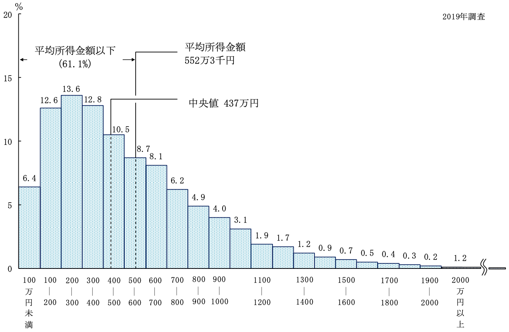
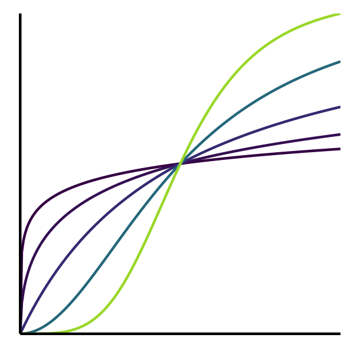
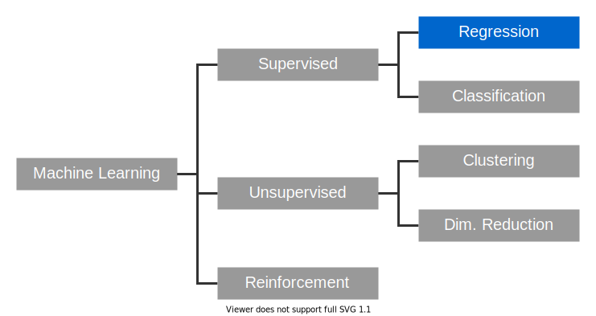
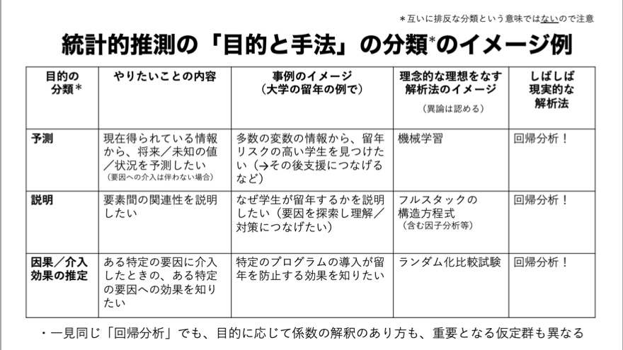
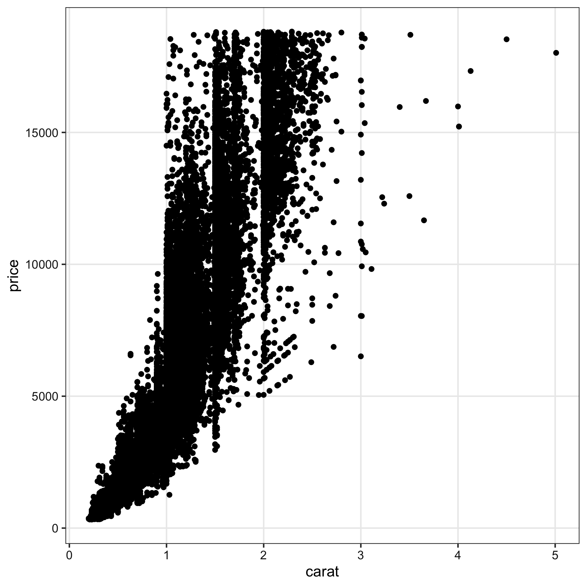
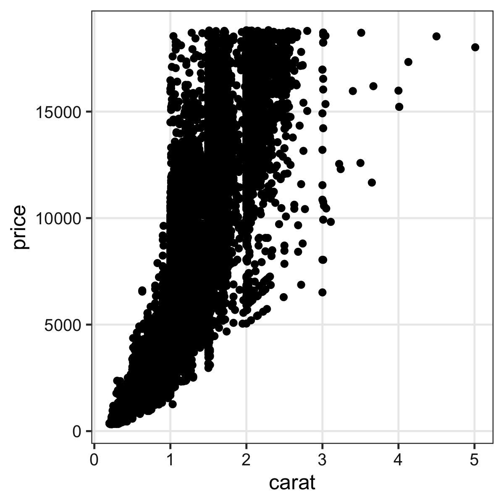
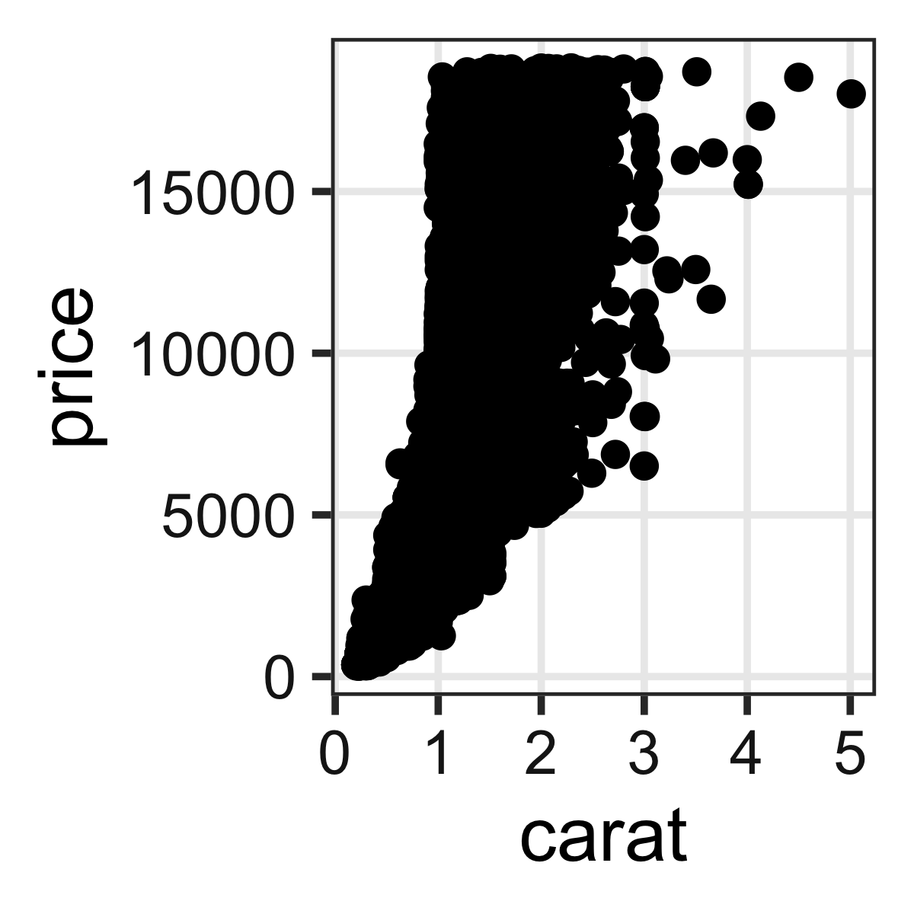
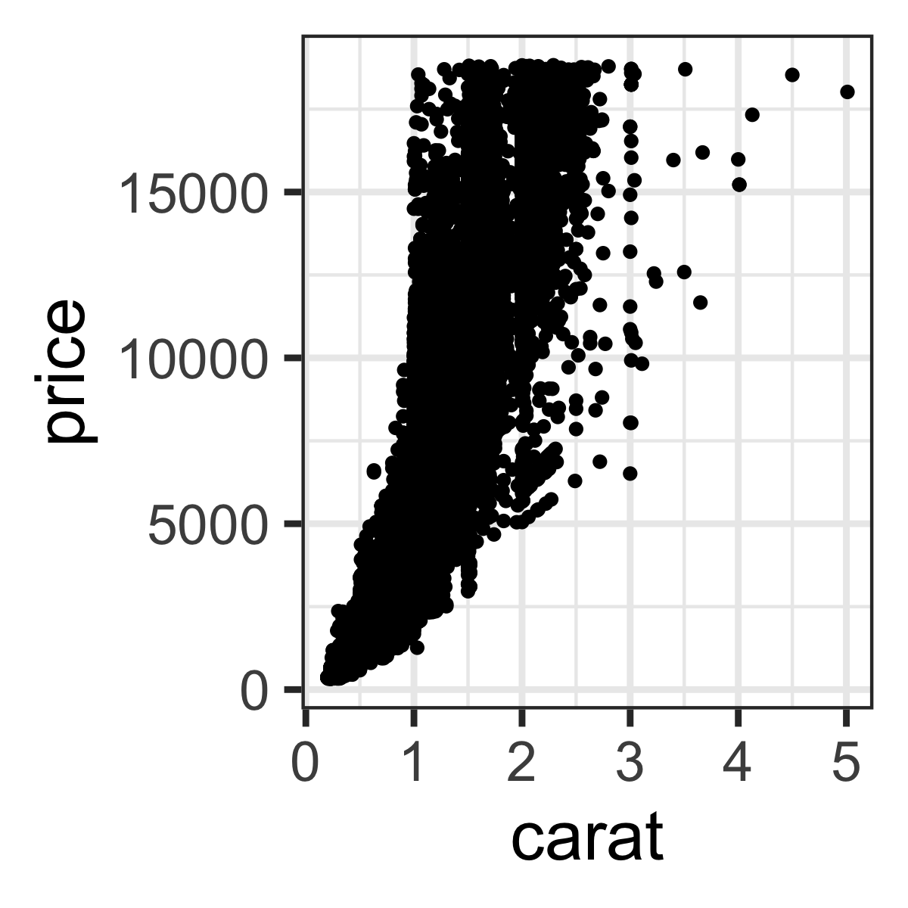

+++
url = "tmd2022stats/1-introduction.html"
linktitle = "導入、直線回帰"
title = "1. 導入、直線回帰 — 統計モデリング実習 2022 TMDU"
date = 2023-03-11T13:00:00+09:00
draft = false
dpi = 100
+++

# [統計モデリング実習 2022 TMDU](.)

<div class="author">
岩嵜 航 (Watal M. Iwasaki, PhD)
</div>

<div class="affiliation">
東北大学 生命科学研究科 進化ゲノミクス分野 特任助教<br>
(Graduate School of Life Sciences, Tohoku University)
</div>

<ol>
<li class="current-deck"><a href="1-introduction.html">導入、直線回帰</a>
<li><a href="2-distribution.html">確率分布、擬似乱数生成</a>
<li><a href="3-likelihood.html">尤度、最尤推定</a>
<li><a href="4-glm.html">一般化線形モデル (GLM)</a>
<li><a href="5-glmm.html">個体差、一般化線形混合モデル (GLMM)</a>
<li><a href="6-bayesian.html">ベイズの定理、事後分布、MCMC</a>
<li><a href="7-stan.html">StanでGLM</a>
<li><a href="8-hbm.html">階層ベイズモデル (HBM)</a>
</ol>

<div class="footnote">
2023-03-11 東京医科歯科大学<br>
<a href="https://heavywatal.github.io/slides/tmd2022stats/">https://heavywatal.github.io/slides/tmd2022stats/</a>
</div>


---
## データを使ってやりたいこと

- 現象を**理解**したい
- 将来を**予測**したい
- ものを**分類・判別**したい
- 挙動を**制御**したい
- 新しい何かを**生成**したい

そのために解析は必要？
未加工の生データこそ宝？

???
よりよい職場に転職したい

---
## データ解析って必要？ 生データ見ればいいべ？

往々にして複雑過ぎ、情報多すぎ、そのままでは手に負えない


```r
print(ggplot2::diamonds)
```

```
      carat       cut color clarity depth table price    x    y    z
    1  0.23     Ideal     E     SI2  61.5    55   326 3.95 3.98 2.43
    2  0.21   Premium     E     SI1  59.8    61   326 3.89 3.84 2.31
    3  0.23      Good     E     VS1  56.9    65   327 4.05 4.07 2.31
    4  0.29   Premium     I     VS2  62.4    58   334 4.20 4.23 2.63
   --                                                               
53937  0.72      Good     D     SI1  63.1    55  2757 5.69 5.75 3.61
53938  0.70 Very Good     D     SI1  62.8    60  2757 5.66 5.68 3.56
53939  0.86   Premium     H     SI2  61.0    58  2757 6.15 6.12 3.74
53940  0.75     Ideal     D     SI2  62.2    55  2757 5.83 5.87 3.64
```

ダイヤモンド53,940個について10項目の値を持つデータセット

---
## 要約統計量を見てみよう

各列の**平均**とか**標準偏差**とか:


```
  stat carat depth table    price
1 mean  0.80 61.75 57.46  3932.80
2   sd  0.47  1.43  2.23  3989.44
3  max  5.01 79.00 95.00 18823.00
4  min  0.20 43.00 43.00   326.00
```

大きさ `carat` と価格 `price` の**相関係数**はかなり高い:

```
      carat depth table price
carat  1.00                  
depth  0.03  1.00            
table  0.18 -0.30  1.00      
price  0.92 -0.01  0.13  1.00
```

<hr>

**生のままよりは把握しやすい**かも。

---
## 分布を特徴づける代表値 central tendency

<div class="column-container">
  <div class="column" style="flex-shrink: 1.6;">

平均値 mean
: 和を観察数で割る

中央値 median
: 順に並べて真ん中

最頻値 mode
: 最も頻度が高い値

  </div>
  <div class="column">
  <a href="https://www.mhlw.go.jp/toukei/list/20-21.html">
  
  <figcaption><small><cite>所得金額階級別世帯数の頻度分布</cite> 厚生労働省 国民生活基礎調査 2019</small></figcaption>
  </a>
  </div>
</div>

目的や状況に応じて使い分けよう。

外れ値に対する応答
: もし総資産額20兆円の大富豪が鳥取県に引っ越してきたら<br>
  → 県民の**平均**資産は4000万円上昇。**中央値**・**最頻値**はほぼそのまま。

---
## ばらつきを捉える記述統計量

分散 variance
: 平均値からの差の自乗の平均。 $\frac 1 n \sum _i ^n (X_i - \bar X)^2$
: これの平方根が**標準偏差 (standard deviation)**。

Percentile, Quantile (四分位)
: 小さい順にならべて上位何%にあるか。
: 中央値 = 50th percentile = 第二四分位(Q2)


---
## ばらつきの様子は大小の判断にも重要

<div class="column-container" style="padding-left: 10px;">
<div class="column" style="flex-shrink: 1.1;">
観測値1つずつ。<br>
たまたまかも。
</div>
<div class="column" style="flex-shrink: 1;">
ばらつき大きい。<br>
Bが高いのもたまたま?
</div>
<div class="column" style="flex-shrink: 1;">
ばらつき小さい。<br>
AとBには差がありそう。
</div>
</div>


「こんなことがたまたま起こる確率はすごく低いです！」<br>
をちゃんと示す手続きが**統計的仮説検定**。

---
## 記述統計量に頼りすぎず分布を可視化する

同じデータでも見せ方で印象・情報量が変わる。


---
## 代表値ばかり見て可視化を怠ると構造を見逃す

<figure style="position: relative;">
<a href="https://www.research.autodesk.com/publications/same-stats-different-graphs/">

<figcaption><small>https://www.research.autodesk.com/publications/same-stats-different-graphs/</small></figcaption>
</a>

</figure>


---
## データ可視化は理解の第一歩

情報をうまく絞って整理 → **直感的にわかる**


`carat` が大きいほど `price` も高いらしい。<br>
その度合いは `clarity` によって異なるらしい。

---
## 統計とは

データをうまくまとめ、それに基づいて推論するための手法。

- **記述統計**: データそのものを要約する
    - 要約統計量 (e.g., 平均、標準偏差、etc.)
    - 作図、作表
- **推測統計**: データの背後にある母集団・生成過程を考える
    - 数理モデル
    - 確率分布
    - パラメータ(母数)

「グラフを眺めてなんとなく分かる」以上の分析には**モデル**が必要

---
## モデルとは

対象システムを単純化・理想化して扱いやすくしたもの

Mathematical Model 数理モデル
: 数学的な方程式として記述されるもの。
: e.g., Lotka-Volterra eq., <span style="color: #888;">Hill eq.</span>
: <br>

Computational Model 数値計算モデル
: 数値計算の手続きとして記述されるもの。
: e.g., Schelling’s Segregation Model, <span style="color: #888;"><em>tumopp</em></span>
: <br>

Concrete Model 具象モデル
: 具体的な事物で作られるもの。
: e.g., San Francisco Bay-Delta Model

<small>
<a href="https://amzn.to/3bdvhuI">Weisberg 2012 <cite>Simulation and Similarity (科学とモデル)</cite></a>
</small>

???
数理モデルが決定論的、数値計算が確率論的、になる場合が多いけど必ずしもそうではない。
解析的に解くことを諦めて計算機にやらせるという点で実装方法は異なるが、
数理的に記述して解釈するという大枠では同じとみなしたほうがいいかもしれない。

プラモデル: 車や飛行機の重さ・材質は無視して色や形を模倣

---
## データ科学における数理モデル

データ生成をうまく真似できそうな仮定の数式表現。<br>
&nbsp;

<figure>
<br>
<figcaption><small>「<a href="https://amzn.to/3uCxTKo"><cite>データ分析のための数理モデル入門</cite></a>」江崎貴裕 2020 より改変</small></figcaption>
</figure>


???

確率モデル: 決定論的なモデルじゃなくて確率論的なゆらぎを導入したもの。
ただし、大塚淳さんの定義は異なる。
帰納推論を可能にする枠組みとして自然の斉一性(ヒューム)を仮定した上で、
データを生成している真の現象を確率用語で記述したものが確率モデルだ、という感じ。
そこからさらに強い仮定としてパラメトリックな確率分布を生成元としたのが統計モデル。

---
## データ科学における数理モデル

データ生成をうまく真似できそうな仮定の数式表現。<br>
e.g., 大きいほど高く売れる: $\text{price} = A \times \text{carat} + B + \epsilon$


新しく採れたダイヤモンドの価格予想とかにも使える。

このように「YをXの関数として表す」ようなモデルを**回帰**と呼ぶ。


---
## 本講義の主題: 回帰

単純な直線あてはめから出発し、ちょっとずつ統計モデリング。

<figure>
<a href="https://kuboweb.github.io/-kubo/ce/LinksGlm.html">

<figcaption><small>久保さん https://kuboweb.github.io/-kubo/ce/LinksGlm.html</small></figcaption>
</a>
</figure>

---
## 何でもかんでも直線あてはめではよろしくない


- 観察データは常に**正の値**なのに予測が負に突入してない？
- **縦軸は整数**。しかもの**ばらつき**が横軸に応じて変化？
- **データに合わせた統計モデルを使うとマシ**


---
## 回帰は教師あり機械学習の一種とも言える

<figure>

</figure>

でも統計モデリングはいわゆる“機械学習”とは違う気もする...?


---
## モデリングにおける2つのアプローチ

<figure>
<br>
<figcaption><small>「<a href="https://amzn.to/3uCxTKo"><cite>データ分析のための数理モデル入門</cite></a>」江崎貴裕 2020 より改変</small></figcaption>
</figure>

---
## どっちも知っておいて使い分けたい

項目       | 統計モデリング | 近年の機械学習
---------- | -------------- | ----------------
モデル構造 | 単純化したい | 性能のためなら複雑化
モデル解釈 | **ここが強み** | 難しい。重視しない。途上。
予測・生成 | うまくすれば頑健 | **主目的**。強力。高精度
データ量   | 少なくてもそれなり | 大量に必要
計算量     | 場合による  | 場合による
例 | 一般化線形モデル<br>階層ベイズモデル | ランダムフォレスト<br>ニューラルネットワーク

教科書的には概ねこんな感じとして、実際の仕事ではどうだろう？

---
## 現役データサイエンティスト2人に聞きました

- 統計モデルはデータ加工など事前の手続きが多め。<br>
  機械学習は事前の決定が少ないので楽ちん。
- 「要因の効果はどれくらい？」<br>
  意思決定をするのは結局人間。物事を分かった上で判断したい。<br>
  **実務の人への説明**や**意思決定**の場面で解析の解釈性が重要。<br>
- **仮説があるなら**、それに基づいて統計モデリング。<br>
  何もないところからまず機械学習で要因抽出・仮説生成するのもあり。
- 統計モデル縛り・実行環境縛りなどの案件もある。
- 分析方針を決める立場の上級職になるつもりなら統計モデルも必要。

協力: [`@kato_kohaku`](https://twitter.com/kato_kohaku)さん、[`@teuder`](https://twitter.com/teuder)さん


---
## 理想的じゃなくてもしばしば有用な回帰

<figure>
<a href="https://twitter.com/takehikohayashi/status/1408338198795669507">

<figcaption><small>@takehikohayashi Jun 25, 2021</small></figcaption>
</a>
</figure>


---
## 本講義のお品書き

<figure style="float: right;">
<a href="https://kuboweb.github.io/-kubo/ce/IwanamiBook.html">

</a>
</figure>

久保先生の"緑本"こと<br>
「データ解析のための統計モデリング入門」<br>
をベースに回帰分析の概要を紹介。

1. イントロ 👈 いまここ
1. Rの基礎を駆け足で
1. 統計モデルの基本
    - 直線回帰
    - 確率変数・**確率分布** 👈 本日後半の主役
    - 尤度・最尤推定
1. 一般化線形モデル、混合モデル
1. ベイズ統計、階層ベイズモデル

<!-- 回帰のキモは**線ではなく分布** -->


---
## Rとは

統計解析と作図の機能が充実したプログラミング言語・環境

<figure style="float: right;">
<a href="https://cran.r-project.org/">

<figcaption><small>https://cran.r-project.org/</small></figcaption>
</a>
</figure>

クロスプラットフォーム
: Linux, Mac, Windows で動く

オープンソース
: 永久に無償で、すべての機能を使える。
: 集合知によって常に進化している。

コミュニティ
: 相談できる人や参考になるウェブサイトがたくさん見つかる。

他のプログラミング言語でもいいよ:
[Python](https://www.python.org/)とか[Julia](https://julialang.org/)とか。


---
## R環境のセットアップ

[R本体](https://cran.r-project.org/)
: コマンドを解釈して実行するコア部分。
: よく使われる関数なども標準パッケージとして同梱。

[RStudio Desktop](https://posit.co/download/rstudio-desktop/)
: Rをより快適に使うための総合開発環境 (IDE)
: 必須じゃないけど便利なので結構みんな使ってる。
: ライバルは [VSCode](https://code.visualstudio.com/) + [R Extention](https://marketplace.visualstudio.com/items?itemName=REditorSupport.r)
  <small>(私はこちらを使用)</small>


---
## RStudioを起動してConsoleで対話しよう

**Workspace (Environment)** = 一時オブジェクトの集まり


---
## 毎回まっさらなワークスペースで始める設定

 RStudio → Preferences &nbsp; <kbd>command</kbd><kbd>,</kbd><br>
 Tools → Global options

"Restore ..." の**チェックを外し**て、 "Save ..." の**Never**を選択

<figure>
<a href="https://r4ds.had.co.nz/workflow-projects.html">

<figcaption><small>https://r4ds.had.co.nz/workflow-projects.html</small></figcaption>
</a>
</figure>


---
## "Project" を新規作成する

File → New Project... → New Directory → New Project →<br>
→ Directory name: `r-training-2022`<br>
→ as subdirectory of: `~/project` or `C:/Users/yourname/project`


📁 ディレクトリ ＝ フォルダ。 `~/` = ホームディレクトリ

---
## Rスクリプトに書いてから実行

File → New File → R script


---
## Rスクリプトに書いてから実行

File → New File → R script


---
## Rスクリプトに書いてから実行

Select text with <kbd>shift</kbd><kbd>←</kbd><kbd>↓</kbd><kbd>↑</kbd><kbd>→</kbd><br>
Execute them with <kbd>ctrl</kbd><kbd>return</kbd>


---
## Rスクリプトを保存する

- 手順
    - File → Save <kbd>command</kbd><kbd>s</kbd>
    - ファイル名: `hello.R`
    - 場所: さっき作ったプロジェクト内 (デフォルトでそうなるはず)
- **スクリプトを書いたら消さずに保存すること！**
    - 書いたスクリプトは財産
    - 保存しておけばまた使い回せる

🔰 いろんな四則演算を試して `hello.R` に保存してみよう。<br>
e.g., `1 + 2 + 3`, `3 * 7 * 2`, `4 / 2`, `4 / 3`, etc.

---
## プロジェクト📁にファイルが溜まっていく

スクリプト、データ、結果を分けて整理する例:

```
r-training-2022/           # プロジェクトの最上階
├── r-training-2022.Rproj  # これダブルクリックでRStudioを起動
├── hello.R
├── transform.R            # データ整理・変形のスクリプト
├── visualize.R            # 作図のスクリプト
├── data/                  # 元データを置くところ
│   ├── iris.tsv
│   └── diamonds.xlsx
└── output/                # 結果の出力先
    ├── iris-petal.png
    └── iris-summary.tsv
```

プロジェクト最上階を作業ディレクトリとし、<br>
ファイル読み書きの基準にする。(後で詳しく)

ほんの一例です。好きな構造に決めてください。

---
## Rと接する上での心構え

<figure>

</figure>

エラー文を恐れない
: 熟練プログラマでも頻繁にエラーを起こす。
: エラーはRからのメッセージ。**意図を読み取って修正**しよう。
: プログラミングの経験値 ≈ エラー解決の経験値

困ったらウェブ検索
: あなたの問題は全世界のRユーザーが既に通った道。
: 日本語で、英語で、エラー文そのもので検索すれば解決策に当たる。


---
## この実習の取り組み方

とにかく手を動かして体感しよう！

1.  こういう枠が出てきたら、自分のRスクリプトに**コピペして保存**:

    ```r
    head(iris)
    ```

1.  **実行してコンソールを確認**。思ったとおりの出力？<br>
    `Error` や `Warning` があったらよく読んで対処する。<br>
    (無視していい `Warning` もたまーにあるけど)

1.  🔰若葉マークの練習問題があれば解いてみる。<br>
    そこまでのコードの**コピペ＋改変**でできるはず。

疑問・困りごとがある場合は**気軽にChat欄に**書き込んでください。


---
## 変数/オブジェクトを作ってみよう


```r
x = 2        # Create x
x            # What's in x?
```

```
[1] 2
```

```r
y = 5        # Create y
y            # What's in y?
```

```
[1] 5
```

Rでは代入演算子として矢印 `<-` も使えるけど私は `=` 推奨。<br>
`#` 記号より右はRに無視される。コメントを書くのに便利。


```r
x + y
```

```
[1] 7
```

🔰 `x` と `y` の引き算、掛け算、割り算をやってみよう


---
## 基本的な演算

`+` とか `*` のような演算子(operator)を変数の間に置く。<br>

```r
10 + 3    # addition
10 - 3    # subtraction
10 * 3    # multiplication
10 / 3    # division
10 %/% 3  # integer division
10 %% 3   # modulus 剰余
10 ** 3   # exponent 10^3
```

🔰 コピペして結果を確認してみよう。

---
## 関数 (function)

変数を受け取って、何か仕事して、返す命令セット


```r
x = seq(1, 3)  # 1と3を渡すとvectorが返ってくる
x
```

```
[1] 1 2 3
```

```r
sum(x)         # vectorを渡すと足し算が返ってくる
```

```
[1] 6
```

```r
square = function(something) {  # 自分の関数を定義
  something ** 2
}
square(x)                       # 使ってみる
```

```
[1] 1 4 9
```

🔰 自分の関数を何か作ってみよう。
e.g., 2倍にする関数 `twice`


---
## 変数/オブジェクトを作ってみよう Part 2


```r
x = 42       # Create x
x            # What's in x?
```

```
[1] 42
```

```r
y = "24601"  # Create y
y            # What's in y?
```

```
[1] "24601"
```

この `x` と `y` を足そうとするとエラーになる。なぜ？


```r
x + y        # Error! Why?
```

```
Error in x + y: non-numeric argument to binary operator
```

---
## 変数/オブジェクトの型


```r
class(x)
```

```
[1] "numeric"
```

```r
is.numeric(x)
```

```
[1] TRUE
```

```r
is.character(x)
```

```
[1] FALSE
```

```r
as.character(x)
```

```
[1] "42"
```

🔰 さっき作った `y` にも同じ関数を適用してみよう。

---
## 変数/オブジェクトの型

- `vector`: 基本型。一次元の配列。
    - `logical`: 論理値 (`TRUE` or `FALSE`)
    - `numeric`: 数値 (整数 `42L` or 実数 `3.1416`)
    - `character`: 文字列 (`"a string"`)
    - `factor`: 因子 (文字列っぽいけど微妙に違う)
- `array`: 多次元配列。`vector`同様、全要素が同じ型。
    - `matrix`: 行列 = 二次元の配列。
- `list`: 異なる型でも詰め込める太っ腹ベクトル。
- **`data.frame`: 同じ長さのベクトルを並べた長方形のテーブル。重要。** <br>
  **`tibble`** とか **`tbl_df`** と呼ばれる亜種もあるけどほぼ同じ。


---
## vector: 一次元の配列

1個の値でもベクトル扱い。<br>
同じ長さ(または長さ1)の相手との計算が得意。


```r
x = c(1, 2, 9)  # 長さ3の数値ベクトル
x + x           # 同じ長さ同士の計算
```

```
[1]  2  4 18
```

```r
y = 10          # 長さ1の数値ベクトル
x + y           # 長さ3 + 長さ1 = 長さ3 (それぞれ足し算)
```

```
[1] 11 12 19
```

```r
x < 5           # 5より小さいか
```

```
[1]  TRUE  TRUE FALSE
```

🔰 この `x, y` を使っていろいろな演算を試してみよう


---
## vectorから部分的に抜き出す

`[]` を使う。番号は1から始まる。


```r
letters
```

```
 [1] "a" "b" "c" "d" "e" "f" "g" "h" "i" "j" "k" "l" "m" "n" "o" "p" "q" "r" "s" "t" "u" "v" "w" "x" "y" "z"
```

```r
letters[3]
```

```
[1] "c"
```

```r
letters[seq(4, 6)]       # 4 5 6
```

```
[1] "d" "e" "f"
```

```r
letters[seq(1, 26) < 4]  # TRUE TRUE TRUE FALSE FALSE ...
```

```
[1] "a" "b" "c"
```

---
## vectorを渡した結果は関数によって異なる

各要素に適用するもの:

```r
x = c(1, 2, 9)
y = sqrt(x)     # square root
y
```

```
[1] 1.000000 1.414214 3.000000
```

全要素を集約した値を返すもの:

```r
z = sum(x)
z
```

```
[1] 12
```

🔰 `log()`, `exp()`, `length()`, `max()`, `mean()`
にvectorを渡してみよう。


---
## matrix: 二次元の配列 (行列)

1本のvectorを折り曲げて長方形にしたもの。<br>
中身は全て同じ型。機械学習とか画像処理とかで使う。


```r
v = seq(1, 8)              # c(1, 2, 3, 4, 5, 6, 7, 8)
x = matrix(v, nrow = 2)    # 2行に畳む。列ごとに詰める
x
```

```
     [,1] [,2] [,3] [,4]
[1,]    1    3    5    7
[2,]    2    4    6    8
```

```r
y = matrix(v, nrow = 2, byrow = TRUE)  # 行ごとに詰める
y
```

```
     [,1] [,2] [,3] [,4]
[1,]    1    2    3    4
[2,]    5    6    7    8
```

🔰 結果を確認してみよう: `x + y`, `dim(x)`, `nrow(x)`, `ncol(x)`.


---
## 行 (row), 列 (column) の憶え方

<div class="column-container">
  <div class="column">
    <figure>
    <a href="https://commons.wikimedia.org/wiki/File:2012_Super_GT_Sugo_starting_grid.jpg">
    
    <figcaption><small>https://commons.wikimedia.org/wiki/<wbr>File:2012_Super_GT_Sugo_starting_grid.jpg</small></figcaption>
    </a>
    </figure>
  </div>
  <div class="column">
    <figure>
    <a href="https://en.wikipedia.org/wiki/Rhodes">
    
    <figcaption><small>https://en.wikipedia.org/wiki/Rhodes</small></figcaption>
    </a>
    </figure>
  </div>
</div>


---
## data.frame: 長方形のテーブル (重要!)

同じ長さの列vectorを複数束ねた長方形の表。<br>
e.g., 長さ150の数値ベクトル4本と因子ベクトル1本:


```r
print(iris)
```

```
    Sepal.Length Sepal.Width Petal.Length Petal.Width   Species
  1          5.1         3.5          1.4         0.2    setosa
  2          4.9         3.0          1.4         0.2    setosa
  3          4.7         3.2          1.3         0.2    setosa
  4          4.6         3.1          1.5         0.2    setosa
 --                                                            
147          6.3         2.5          5.0         1.9 virginica
148          6.5         3.0          5.2         2.0 virginica
149          6.2         3.4          5.4         2.3 virginica
150          5.9         3.0          5.1         1.8 virginica
```

`iris` はアヤメ属3種150個体に関する測定データ。<br>
Rに最初から入ってて、例としてよく使われる。

---
## data.frameを眺める

概要を掴む:
```r
head(iris, 6)   # 先頭だけ見てみる。末尾は tail()
nrow(iris)      # 行数: Number of ROWs
ncol(iris)      # 列数: Number of COLumns
names(iris)     # 列名
summary(iris)   # 要約
View(iris)      # RStudioで閲覧
```

```r
str(iris)       # 構造が分かる形で表示
```

```
tibble [150 × 5] (S3: tbl_df/tbl/data.frame)
 $ Sepal.Length: num [1:150] 5.1 4.9 4.7 4.6 5 5.4 4.6 5 4.4 4.9 ...
 $ Sepal.Width : num [1:150] 3.5 3 3.2 3.1 3.6 3.9 3.4 3.4 2.9 3.1 ...
 $ Petal.Length: num [1:150] 1.4 1.4 1.3 1.5 1.4 1.7 1.4 1.5 1.4 1.5 ...
 $ Petal.Width : num [1:150] 0.2 0.2 0.2 0.2 0.2 0.4 0.3 0.2 0.2 0.1 ...
 $ Species     : Factor w/ 3 levels "setosa","versicolor",..: 1 1 1 1 1 1 1 1 1 1 ...
```

🔰 ほかのデータもいろいろ見てみよう。
e.g., `mtcars`, `quakes`, [`data()`](https://stat.ethz.ch/R-manual/R-devel/library/datasets/html/00Index.html)

---
## data.frameを眺める

部分的なdata.frameを取得する:
```r
iris[2, ]                  # 2行目
iris[2:5, ]                # 2行目から5行目まで
iris[, 3:4]                # 3-4列目
iris[2:5, 3:4]             # 2-5行目, 3-4列目
```

vectorとして取得する:
```r
iris[[3]]                  # 3列目
iris$Petal.Length          # Petal.Length列
iris[["Petal.Length"]]     # Petal.Length列
iris[["Petal.Length"]][2]  # Petal.Length列の2番目
```

結果がdata.frameになるかvectorになるか微妙:
```r
iris[, 3]                  # 3列目
iris[, "Petal.Length"]     # Petal.Length列
iris[2, 3]                 # 2行目3列目
iris[2, "Petal.Length"]    # 2行目Petal.Length列
```

---
## data.frameの新規作成

同じ長さの **列(column) vector** を結合して作る:

```r
x = c(1, 2, 3)
y = c("A", "B", "C")
mydata = data.frame(x, y)
print(mydata)
```

```
  x y
1 1 A
2 2 B
3 3 C
```

🔰 次のようなdata.frameを作って `theDF` と名付けよう:
```
 i s
24 x
25 y
26 z
```
ヒント: `c()` 無しでクリアすることも可能。


---
## data.frameの読み書き

- readxlパッケージを使えば `.xlsx` ファイルも読める、けど
- カンマ区切り(CSV)とかタブ区切り(TSV)のテキストが無難。
- ファイル名は**作業ディレクトリ**からの**相対パス**で指定。

    ```r
    install.packages("readr") # R標準の read.table() とかは難しいので
    library(readr)            # パッケージのやつを使うよ
    write_tsv(iris, "data/iris.tsv")   # 書き出し
    iris2 = read_tsv("data/iris.tsv")  # 読み込み
    ```

あれれー、エラーが出る？


```
Error: Cannot open file for writing:
* 'data/iris.tsv'
```

---
## ファイル読み書きでありがちなエラー

- 読みたいファイル名が間違っている。
- 読みたいファイルが作業ディレクトリとは違うところにある。
- 書き込み先のディレクトリが存在しない。→ 予め作っておこう

冷静に、現在の作業ディレクトリとその中身を確認しよう:
```r
getwd()               # GET Working Directory
list.files(".")       # List files in "." (here)
list.files("data")    # List files in "./data"
dir.create("data")    # Create directory
```

[よくあるエラー集 (石川由希さん@名古屋大)](https://comicalcommet.github.io/r-training-2021/R_training_2021_7.html)
を読んでおきましょう。

🔰 R組み込みデータや自作データを読み書きしてみよう。

---
## R package

便利な関数やデータセットなどをひとまとめにしたもの。

Standard Packages
: Rの標準機能。何もしなくても使用可能。

Contributed Packages
: 有志により開発され、
  [CRAN](https://cran.rstudio.com/web/packages/) や
  [Bioconductor](https://www.bioconductor.org/) に公開されている。
: 要インストール。使う前に読み込む。

```r
install.packages("readr")  # 一度やればOK
library(readr)             # 読み込みはRを起動するたびに必要
update.packages()          # たまには更新しよう
```

素のRも覚えきってないのにいきなりパッケージ？
: 大丈夫。誰も覚えきってない。
: パッケージを使わないR作業 = 火もナイフも使わない料理

---
## tidyverse: データ科学のためのパッケージ群

<a href="https://www.tidyverse.org/">

</a>

```r
install.packages("tidyverse")
library(conflicted) # 安全のおまじない
library(tidyverse)  # 一挙に読み込み
```

```
── Attaching core tidyverse packages ──── tidyverse 2.0.0 ──
✔ dplyr     1.1.1     ✔ readr     2.1.4
✔ forcats   1.0.0     ✔ stringr   1.5.0
✔ ggplot2   3.4.1     ✔ tibble    3.2.1
✔ lubridate 1.9.2     ✔ tidyr     1.3.0
✔ purrr     1.0.1     
```

一貫したデザインでデータ解析の様々な工程をカバー

<figure>
<a href="https://r4ds.had.co.nz/introduction.html">

<figcaption><small>https://r4ds.had.co.nz/introduction.html</small></figcaption>
</a>
</figure>


---
## ggplot2: tidyverseの可視化担当

<a href="https://ggplot2.tidyverse.org/">

</a>

- "The <strong><u>G</u></strong>rammar of <strong><u>G</u></strong>raphics" という体系に基づく設計
- 単にいろんなグラフを「描ける」だけじゃなく<br>
  **一貫性のある文法で合理的に描ける**

<figure>
<!--
<a href="https://www.amazon.co.jp/dp/B00HWUVHXK/ref=as_li_ss_il?ie=UTF8&linkCode=li3&tag=heavywatal-22&linkId=d63d3627df82c09b0bb5ca8f47ee19cc&language=ja_JP" target="_blank"></a>


-->


<br>


<figcaption><small>Iwasaki and Innan (2017)</small></figcaption>
</figure>

---
## いきなりggplot2から使い始めても大丈夫

R標準のやつとは根本的に違うシステムで作図する。

<figure>

<figcaption><small>「<cite>Rグラフィックス</cite>」Murrell著 久保訳 より改変</small></figcaption>
</figure>

---
## 基本的な使い方: 指示を `+` で重ねていく


---
## 基本的な使い方: 指示を `+` で重ねていく


```r
ggplot(data = diamonds)             # diamondsデータでキャンバス準備
# aes(x = carat, y = price) +       # carat,price列をx,y軸にmapping
# geom_point() +                    # 散布図を描く
# facet_wrap(vars(clarity)) +       # clarity列に応じてパネル分割
# stat_smooth(method = lm) +        # 直線回帰を追加
# coord_cartesian(ylim = c(0, 2e4)) + # y軸の表示範囲を狭く
# theme_classic(base_size = 20)     # クラシックなテーマで
```


---
## 基本的な使い方: 指示を `+` で重ねていく


```r
ggplot(data = diamonds) +           # diamondsデータでキャンバス準備
  aes(x = carat, y = price)         # carat,price列をx,y軸にmapping
# geom_point() +                    # 散布図を描く
# facet_wrap(vars(clarity)) +       # clarity列に応じてパネル分割
# stat_smooth(method = lm) +        # 直線回帰を追加
# coord_cartesian(ylim = c(0, 2e4)) + # y軸の表示範囲を狭く
# theme_classic(base_size = 20)     # クラシックなテーマで
```


---
## 基本的な使い方: 指示を `+` で重ねていく


```r
ggplot(data = diamonds) +           # diamondsデータでキャンバス準備
  aes(x = carat, y = price) +       # carat,price列をx,y軸にmapping
  geom_point()                      # 散布図を描く
# facet_wrap(vars(clarity)) +       # clarity列に応じてパネル分割
# stat_smooth(method = lm) +        # 直線回帰を追加
# coord_cartesian(ylim = c(0, 2e4)) + # y軸の表示範囲を狭く
# theme_classic(base_size = 20)     # クラシックなテーマで
```


---
## 基本的な使い方: 指示を `+` で重ねていく


```r
ggplot(data = diamonds) +           # diamondsデータでキャンバス準備
  aes(x = carat, y = price) +       # carat,price列をx,y軸にmapping
  geom_point() +                    # 散布図を描く
  facet_wrap(vars(clarity))         # clarity列に応じてパネル分割
# stat_smooth(method = lm) +        # 直線回帰を追加
# coord_cartesian(ylim = c(0, 2e4)) + # y軸の表示範囲を狭く
# theme_classic(base_size = 20)     # クラシックなテーマで
```


---
## 基本的な使い方: 指示を `+` で重ねていく


```r
ggplot(data = diamonds) +           # diamondsデータでキャンバス準備
  aes(x = carat, y = price) +       # carat,price列をx,y軸にmapping
  geom_point() +                    # 散布図を描く
  facet_wrap(vars(clarity)) +       # clarity列に応じてパネル分割
  stat_smooth(method = lm)          # 直線回帰を追加
# coord_cartesian(ylim = c(0, 2e4)) + # y軸の表示範囲を狭く
# theme_classic(base_size = 20)     # クラシックなテーマで
```


---
## 基本的な使い方: 指示を `+` で重ねていく


```r
ggplot(data = diamonds) +           # diamondsデータでキャンバス準備
  aes(x = carat, y = price) +       # carat,price列をx,y軸にmapping
  geom_point() +                    # 散布図を描く
  facet_wrap(vars(clarity)) +       # clarity列に応じてパネル分割
  stat_smooth(method = lm) +        # 直線回帰を追加
  coord_cartesian(ylim = c(0, 2e4))   # y軸の表示範囲を狭く
# theme_classic(base_size = 20)     # クラシックなテーマで
```


---
## 基本的な使い方: 指示を `+` で重ねていく


```r
ggplot(data = diamonds) +           # diamondsデータでキャンバス準備
  aes(x = carat, y = price) +       # carat,price列をx,y軸にmapping
  geom_point() +                    # 散布図を描く
  facet_wrap(vars(clarity)) +       # clarity列に応じてパネル分割
  stat_smooth(method = lm) +        # 直線回帰を追加
  coord_cartesian(ylim = c(0, 2e4)) + # y軸の表示範囲を狭く
  theme_classic(base_size = 20)     # クラシックなテーマで
```


---
## 基本的な使い方: 指示を `+` で重ねていく


```r
ggplot(data = diamonds) +           # diamondsデータでキャンバス準備
  aes(x = carat, y = price) +       # carat,price列をx,y軸にmapping
  geom_point() +                    # 散布図を描く
# facet_wrap(vars(clarity)) +       # clarity列に応じてパネル分割
# stat_smooth(method = lm) +        # 直線回帰を追加
# coord_cartesian(ylim = c(0, 2e4)) + # y軸の表示範囲を狭く
  theme_classic(base_size = 20)     # クラシックなテーマで
```


---
## 図をオブジェクトとして取っておける


```r
p1 = ggplot(data = diamonds)
p2 = p1 + aes(x = carat, y = price)
p3 = p2 + geom_point()
p4 = p3 + facet_wrap(vars(clarity))
print(p3)
```


---
## ファイル名もサイズも再現可能な作図

`width`や`height`が小さいほど、文字・点・線が相対的に大きく

```r
# 7inch x 300dpi = 2100px四方 (デフォルト)
ggsave("dia1.png", p3) # width = 7, height = 7, dpi = 300
# 4     x 300    = 1200  全体7/4倍ズーム
ggsave("dia2.png", p3, width = 4, height = 4) # dpi = 300
# 2     x 600    = 1200  全体をさらに2倍ズーム
ggsave("dia3.png", p3, width = 2, height = 2, dpi = 600)
# 4     x 300    = 1200  テーマを使って文字だけ拡大
ggsave("dia4.png", p3 + theme_bw(base_size = 22), width = 4, height = 4)
```

<figure>




</figure>


---
## 論文のFigureみたいに並べるのもRで

別のパッケージ
([cowplot](https://wilkelab.org/cowplot/)
や
[patchwork](https://patchwork.data-imaginist.com/))
の助けを借りて


```r
pAB = cowplot::plot_grid(p3, p3, labels = c("A", "B"), nrow = 1L)
cowplot::plot_grid(pAB, p3, labels = c("", "C"), ncol = 1L)
```


---
## データ解析のおおまかな流れ

1. コンピュータ環境の整備
1. データの取得、読み込み
1. 探索的データ解析
    - **前処理、加工** (労力の8割はここという説も)
    - 可視化、仮説生成 (まずここを目指す！)
    - 統計解析、仮説検証 (みんな重視しがち)
1. 報告、発表

<figure>
<a href="https://r4ds.had.co.nz/introduction.html">

<figcaption><small>https://r4ds.had.co.nz/introduction.html</small></figcaption>
</a>
</figure>


---
## 機械処理しやすい形 vs 人が読み書きしやすい形

作図や解析に使えるデータ形式はほぼ決まってる
: `ggplot(data, ...)`, `glm(..., data, ...)`, ...

出発点となるデータはさまざま
: 実験ノート、フィールドノート、データベース、...

<figure>

> Happy families are all alike;\
> every unhappy family is unhappy in its own way
<figcaption>— Leo Tolstoy, <cite>Anna Karenina</cite></figcaption>
</figure>
<figure>

> tidy datasets are all alike,\
> but every messy dataset is messy in its own way
<figcaption>— Hadley Wickham, creator of tidyverse</figcaption>
</figure>


---
## 整然データ tidy data &nbsp; vs &nbsp; 雑然データ messy data

<div class="column-container">
  <div class="column" style="flex-shrink: 1.1;">
    
  </div>
  <div class="column">
    
    <div style="position: absolute; top: 440px;">
    縦1列は1つの変数<br>
    横1行は1つの観測<br>
    1セルは1つの値<br>
    </div>
  </div>
</div>
<small style="position: absolute; bottom: 1rem; left: 2rem;">
<a href="https://id.fnshr.info/2017/01/09/tidy-data-intro/">
西原史暁「<cite>整然データとは何か</cite>」https://id.fnshr.info/2017/01/09/tidy-data-intro/
</a>
</small>

---
## 整然データ tidy data &nbsp; vs &nbsp; 雑然データ messy data

<div class="column-container">
  <div class="column" style="flex-shrink: 1.1;">
    
  </div>
  <div class="column">
    
    <div style="position: absolute; top: 440px;">
    <strong>縦1列は1つの変数</strong><br>
    横1行は1つの観測<br>
    1セルは1つの値<br>
    </div>
  </div>
</div>
<small style="position: absolute; bottom: 1rem; left: 2rem;">
<a href="https://id.fnshr.info/2017/01/09/tidy-data-intro/">
西原史暁「<cite>整然データとは何か</cite>」https://id.fnshr.info/2017/01/09/tidy-data-intro/
</a>
</small>

---
## 整然データ tidy data &nbsp; vs &nbsp; 雑然データ messy data

<div class="column-container">
  <div class="column" style="flex-shrink: 1.1;">
    
  </div>
  <div class="column">
    
    <div style="position: absolute; top: 440px;">
    縦1列は1つの変数<br>
    <strong>横1行は1つの観測</strong><br>
    1セルは1つの値<br>
    </div>
  </div>
</div>
<small style="position: absolute; bottom: 1rem; left: 2rem;">
<a href="https://id.fnshr.info/2017/01/09/tidy-data-intro/">
西原史暁「<cite>整然データとは何か</cite>」https://id.fnshr.info/2017/01/09/tidy-data-intro/
</a>
</small>

---
## 整然データ tidy data &nbsp; vs &nbsp; 雑然データ messy data

<div class="column-container">
  <div class="column" style="flex-shrink: 1.1;">
    
  </div>
  <div class="column">
    
    <div style="position: absolute; top: 440px;">
    縦1列は1つの変数<br>
    横1行は1つの観測<br>
    <strong>1セルは1つの値</strong><br>
    </div>
  </div>
</div>
<small style="position: absolute; bottom: 1rem; left: 2rem;">
<a href="https://id.fnshr.info/2017/01/09/tidy-data-intro/">
西原史暁「<cite>整然データとは何か</cite>」https://id.fnshr.info/2017/01/09/tidy-data-intro/
</a>
</small>


---
## 整然データ tidy data &nbsp; ≈ &nbsp; ggplot したくなる形

- **縦1列**は1つの**変数**
- **横1行**は1つの**観測**
- **1セル**は1つの**値**

<small style="display: block; text-align: right;"><https://r4ds.had.co.nz/tidy-data.html></small>


```r
print(ggplot2::diamonds)
```

```
      carat       cut color clarity depth table price    x    y    z
    1  0.23     Ideal     E     SI2  61.5    55   326 3.95 3.98 2.43
    2  0.21   Premium     E     SI1  59.8    61   326 3.89 3.84 2.31
    3  0.23      Good     E     VS1  56.9    65   327 4.05 4.07 2.31
    4  0.29   Premium     I     VS2  62.4    58   334 4.20 4.23 2.63
   --                                                               
53937  0.72      Good     D     SI1  63.1    55  2757 5.69 5.75 3.61
53938  0.70 Very Good     D     SI1  62.8    60  2757 5.66 5.68 3.56
53939  0.86   Premium     H     SI2  61.0    58  2757 6.15 6.12 3.74
53940  0.75     Ideal     D     SI2  62.2    55  2757 5.83 5.87 3.64
```


---
## 整然データ tidy data &nbsp; ≈ &nbsp; ggplot したくなる形

x軸、y軸、色分け、パネル分けなどを列の名前で指定して簡単作図:


```r
ggplot(diamonds) + aes(x = carat, y = price) +
  geom_point(mapping = aes(color = color, size = clarity)) +
  facet_wrap(vars(cut))
```


---
## 前処理: 生データを下ごしらえして食べやすい形に


```r
print(VADeaths)
```

```
      Rural Male Rural Female Urban Male Urban Female
50-54       11.7          8.7       15.4          8.4
55-59       18.1         11.7       24.3         13.6
60-64       26.9         20.3       37.0         19.3
65-69       41.0         30.9       54.6         35.1
70-74       66.0         54.3       71.1         50.0
```

↓ 下ごしらえ: 作図・解析で使いやすい整然データに


```
   lbound ubound region    sex death
 1     50     54  Rural   Male  11.7
 2     50     54  Rural Female   8.7
 3     50     54  Urban   Male  15.4
 4     50     54  Urban Female   8.4
--                                  
17     70     74  Rural   Male  66.0
18     70     74  Rural Female  54.3
19     70     74  Urban   Male  71.1
20     70     74  Urban Female  50.0
```


---
## 前処理は大きく2つに分けられる

<div style="float: right;">
<a href="https://dplyr.tidyverse.org/">

</a><br>
<a href="https://tidyr.tidyverse.org/">

</a><br>
<a href="https://stringr.tidyverse.org/">

</a>
</div>

- データ構造を対象とする処理
    - 使いたい部分だけ抽出
    - グループごとに特徴を要約
    - 何かの順に並べ替え
    - 異なるテーブルの結合
    - 変形: 縦長 ↔ 横広
- データ内容を対象とする処理
    - 数値の変換: 対数、正規化
    - 外れ値・欠損値への対処
    - 型変換: 連続変数、カテゴリカル変数、指示変数、因子、日時
    - 文字列処理: 正規表現によるパターンマッチ

<small style="display: block; text-align: right;"><a href="https://www.amazon.co.jp/dp/4774196479/ref=as_li_ss_tl?ie=UTF8&linkCode=ll1&tag=heavywatal-22&linkId=8a3fd4e9a0c944b1b41242bbab8d147b">
本橋智光「前処理大全」
</a></small>


---
## dplyr --- data.frameの高速処理担当

<a href="https://dplyr.tidyverse.org/">

</a>

シンプルな関数がたくさん。繋げて使う (piping)

抽出
: 列: `select()`,
: 行: `filter()`, `distinct()`, `slice()`

要約・集計
: `group_by()`, `summarize()`, `count()`

並べ替え
: `arrange()`, `relocate()`

列の追加・変更
: `mutate()`, `rename()`

結合
: 行方向: `bind_rows()`
: 列方向: `left_join()`, `inner_join()`, `full_join()`


---
## dplyr 使用例

小さな関数を繋げて使う流れ作業:

```r
result = diamonds |>              # 生データから出発して
  select(carat, cut, price) |>    # 列を抽出して
  filter(carat > 1) |>            # 行を抽出して
  group_by(cut) |>                # グループ化して
  summarize(mean(price)) |>       # 平均を計算
  print()                         # 表示してみる
```

```
        cut mean(price)
1      Fair    7177.856
2      Good    7753.601
3 Very Good    8340.549
4   Premium    8487.249
5     Ideal    8674.227
```

この見慣れぬ記号 `|>` は何？<br>
(`select()` など個々の関数には今日は触れません)

---
## Pipe operator (パイプ演算子) `|>`

パイプの左側の変数を、右側の関数の第一引数にねじ込む:
```r
diamonds |> filter(carat > 1)
filter(diamonds, carat > 1)     # これと同じ

# 前処理の流れ作業に便利:
diamonds |> filter(carat > 1) |> select(carat, price) |> ...
potatoes |> cut() |> fry() |> season("salt") |> eat()
```

🔰 パイプを使わない形に書き換え、出力を確認しよう:

```r
seq(1, 6) |> sum()
```

```
[1] 21
```

```r
letters |> toupper() |> head(3)
```

```
[1] "A" "B" "C"
```

[解答例]
```r
sum(seq(1, 6))
head(toupper(letters), 3)
```

---
## パイプ演算子 `|>` を使わない方法

😐 一時変数をイチイチ作る:

```r
tmp1 = select(diamonds, carat, cut, price)   # 列を抽出して
tmp2 = filter(tmp1, carat > 1)               # 行を抽出して
tmp3 = group_by(tmp2, cut)                   # グループ化して
result = summarize(tmp3, mean(price))        # 平均を計算
```

😐 同じ名前を使い回す:

```r
result = select(diamonds, carat, cut, price) # 列を抽出して
result = filter(result, carat > 1)           # 行を抽出して
result = group_by(result, cut)               # グループ化して
result = summarize(result, mean(price))      # 平均を計算
```

どちらも悪くない。
何度も変数名を入力するのがやや冗長。


---
## パイプ演算子 `|>` を使わない方法

😫 一時変数を使わずに:

```r
result = summarize(                    # 平均を計算
    group_by(                            # グループ化して
      filter(                              # 行を抽出して
        select(diamonds, carat, cut, price), # 列を抽出して
        carat > 1),                        # 行を抽出して
      cut),                              # グループ化して
    mean(price))                       # 平均を計算
```

🤪 改行さえせずに:

```r
result = summarize(group_by(filter(select(diamonds, carat, cut, price), carat > 1), cut), mean(price))
```

論理の流れとプログラムの流れが合わず、目が行ったり来たり。<br>
さっきのほうがぜんぜんマシ。

---
## パイプ演算子 `|>` を使おう

😁 慣れれば、論理の流れを追いやすい:

```r
result = diamonds |>
  select(carat, cut, price) |>    # 列を抽出して
  filter(carat > 1) |>            # 行を抽出して
  group_by(cut) |>                # グループ化して
  summarize(mean(price)) |>       # 平均を計算
  print()                         # 表示してみる
```

```
        cut mean(price)
1      Fair    7177.856
2      Good    7753.601
3 Very Good    8340.549
4   Premium    8487.249
5     Ideal    8674.227
```

tidyverseパッケージ群はこういう使い方をしやすい設計。<br>
使わなければならないわけではないが、読めたほうがいい。

<div style="font-size: 0.8em; color: #888888;">

R < 4.2 までよく使われていた `%>%` もほぼ同じ。

</div>

---
## tidyr --- data.frameの変形・整形担当

<a href="https://tidyr.tidyverse.org/">

</a>

横広から縦長に
: `pivot_longer()`, <del><code>gather()</code></del>

縦長から横広に
: `pivot_wider()`, <del><code>spread()</code></del>

列を分離、結合
: `separate()`, `unite()`

入れ子構造をつくる、解消する
: `nest()`, `unnest()`

*etc.*

- こういう変形なしでそのまま使えるデータは激レア
- エクセルでポチポチやらず、tidyrで手続きを記述しよう
- ちょっとハードルは高いけど、使えるようになると**強い**💪


---
## `pivot_longer()` 横広から縦長に

複数列にまたがる値を1列にする。<br>
そのラベルも合わせて移動。

<figure>
<a href="https://r4ds.had.co.nz/tidy-data.html#longer">

<br>
<figcaption><small>https://r4ds.had.co.nz/tidy-data.html#longer</small></figcaption>
</a>
</figure>

```r
table4a
pivot_longer(table4a, 2:3, names_to = "year", values_to = "cases")
```

---
## `pivot_wider()` 縦長から横広に

1列に収まっていた値を複数列の行列に変換。<br>
そのラベルを列の名前にする。

<figure>
<a href="https://r4ds.had.co.nz/tidy-data.html#wider">

<br>
<figcaption><small>https://r4ds.had.co.nz/tidy-data.html#wider</small></figcaption>
</a>
</figure>

```r
pivot_wider(table2, names_from = type, values_from = count)
```

---
## [Rによるデータ前処理実習](https://heavywatal.github.io/slides/tmd2022/)は別の講義で

2022年9月に開講。おそらくe-なんとかで視聴可能。

<iframe width="100%" height="600" src="../tmd2022/"></iframe>

2023年の開講は未定...?


---
## 直線あてはめ: 統計モデルの出発点


- 身長が高いほど体重も重い。いい感じ。

(説明のために作った架空のデータ。今後もほぼそうです)


---
## 回帰モデルの2段階

1. Define a **family of models**: だいたいどんな形か、式をたてる
    - 直線: $y = a_1 + a_2 x$
    - 対数: $\log(y) = a_1 + a_2 x$
    - 二次曲線: $y = a_1 + a_2 x^2$

2. Generate a **fitted model**: データに合うようにパラメータを調整
    - $y = 3x + 7$
    - $y = 9x^2$

<small><https://r4ds.had.co.nz/model-basics.html></small>


---
## たぶん身長が高いほど体重も重い

なんとなく $y = a x + b$ でいい線が引けそう<br>
&nbsp;


---
## たぶん身長が高いほど体重も重い

なんとなく $y = a x + b$ でいい線が引けそう<br>
じゃあ傾き *a* と切片 *b*、どう決める？


---
## 最小二乗法 (Ordinary Least Square: OLS)

<span style="color: #3366ff">回帰直線</span>からの<strong style="color: #E69F00">残差</strong>平方和(RSS)を最小化する。


---
## 残差平方和(RSS)が最小となるパラメータを探せ

ランダムに試してみて、上位のものを採用。<br>
この程度の試行回数では足りなそう。


---
## 残差平方和(RSS)が最小となるパラメータを探せ

**グリッドサーチ**: パラメータ空間の一定範囲内を均等に試す。<br>
さっきのランダムよりはちょっとマシか。


こうした**最適化**の手法はいろいろあるけど、ここでは扱わない。


---
## これくらいなら一瞬で計算してもらえる


```r
par_init = c(intercept = 0, slope = 0)
result = optim(par_init, fn = rss_weight, data = df_weight)
result$par
```

```
intercept     slope 
-69.68394  78.53490 
```


上記コードは最適化一般の書き方。<br>
回帰が目的なら次ページのようにするのが楽 →


---
## `lm()` で直線あてはめしてみる

架空のデータを作る(乱数生成については後述):

```r
n = 50
df_weight = tibble::tibble(
  height = rnorm(n, 1.70, 0.05),
  bmi = rnorm(n, 22, 1),
  weight = bmi * (height**2)
)
```

データと関係式(`Y ~ X` の形)を `lm()` に渡して係数を読む:

```r
fit = lm(data = df_weight, formula = weight ~ height)
coef(fit)
```

```
(Intercept)      height 
  -69.85222    78.63444 
```

せっかくなので作図もやってみる→

---
## `lm()` の結果をggplotする


```r
df = modelr::add_predictions(df_weight, fit, type = "response")
head(df, 2L)
```

```
    height      bmi   weight     pred
1 1.718019 21.55500 63.62151 65.24322
2 1.782862 22.83775 72.59199 70.34213
```

```r
ggplot(df) +
  aes(height, weight) +
  geom_point() +
  geom_line(aes(y = pred), linewidth = 1, color = "#3366ff")
```


---
## 🔰 ほかのデータでも `lm()` を試してみよう


```r
fit = lm(data = mpg, formula = hwy ~ displ)
coef(fit)
```

```
(Intercept)       displ 
  35.697651   -3.530589 
```

```r
mpg_added = modelr::add_predictions(mpg, fit)
ggplot(mpg_added) + aes(displ, hwy) + geom_point() +
  geom_line(aes(y = pred), linewidth = 1, color = "#3366ff")
```


🔰 `diamonds` などほかのデータでも `lm()` を試してみよう。


---
## 疑問やエラーの解決方法

- エラーのほとんどは凡ミス由来。よく確認しよう。
    - エラー文をちゃんと読む: `No such file or directory`
    - [よくあるエラー集 (石川由希さん@名古屋大)](https://comicalcommet.github.io/r-training-2022/R_training_2022_7.html)
      をチェックする
    - 変数の中身を確かめる: `str(iris)`, `attributes(iris)`
- エラー文やパッケージ名をコピペしてウェブ検索<br>
  → [StackOverflow](https://stackoverflow.com/questions/tagged/r)
  や個人サイトに解決策
- Slack 
  [r-wakalang](https://github.com/tokyor/r-wakalang)
  で質問を投稿する。<br>
  (質問に飢えた優しいワニが多数生息 👀 &nbsp; 👀 &nbsp; 👀 &nbsp; 👀)
- 状況再現できる小さな例
  [(reprex)](https://reprex.tidyverse.org/)
  を添えると回答を得やすい。<br>
  (これを準備してるうちに問題が切り分けられて自己解決したり)
- パッケージの公式ドキュメントをちゃんと読む
- R(Studio)内のヘルプを読む: `?sum`, `help.start()`


---
## 参考文献

R for Data Science --- Hadley Wickham and Garrett Grolemund
: <https://r4ds.had.co.nz/>,
  [Book](https://amzn.to/2tbRmVc),
  [日本語版書籍(Rではじめるデータサイエンス)](https://amzn.to/2yyFRKt)

- [データ解析のための統計モデリング入門](https://amzn.to/33suMIZ) 久保拓弥 2012
- [データ分析のための数理モデル入門](https://amzn.to/3uCxTKo) 江崎貴裕 2020
- [分析者のためのデータ解釈学入門](https://amzn.to/3uznzCK) 江崎貴裕 2020

Other versions
: 「[Rによるデータ前処理実習](/slides/tmd2022/)」
  東京医科歯科大 [データ関連人材育成プログラム](https://ds.tmdu.org/) (2022-09)
: 「[統計モデリング概論 DSHC 2022](/slides/tokiomarine2022/)」
  東京海上 [DSHC](https://tokiomarine-dshc.com/) (2022-08)
: 「[進化学実習2022](/slides/tohoku2022r/)」
  東北大学 理学部生物学科 (2022-04)
: 「[Rを用いたデータ解析の基礎と応用](https://comicalcommet.github.io/r-training-2022/)」
   石川由希 2022 名古屋大学

<a href="2-distribution.html" class="readmore">
2. 確率分布、擬似乱数生成
</a>
