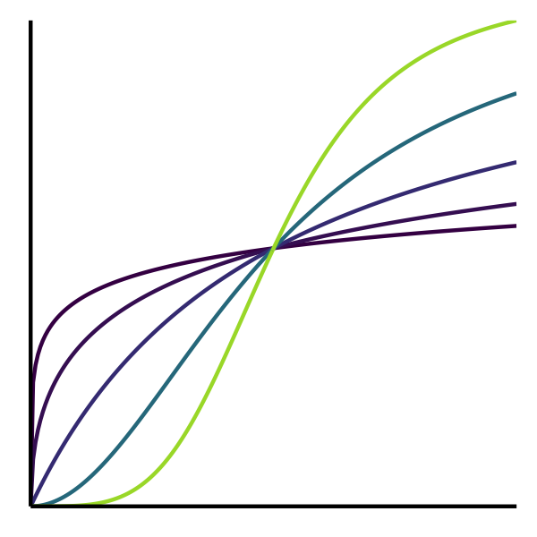

+++
url = "tohoku2022r/6-distribution.html"
title = "6. 統計モデリング1: 確率分布、尤度 — 進化学実習 2022 牧野研"
linktitle = "統計モデリング1: 確率分布、尤度"
date = 2022-04-13T16:00:00+09:00
type = "reveal"
draft = false
+++

<link rel="stylesheet" href="style.css">

# [進化学実習 2022 牧野研](.)

<div class="author">
岩嵜航、牧野能士
</div>

<div class="affiliation">
東北大学 生命科学研究科 進化ゲノミクス分野
</div>

<ol>
<li><a href="1-introduction.html">導入: データ解析の全体像。Rを使うメリット。Rの基本。</a>
<li><a href="2-visualization.html">データの可視化。</a>
<li><a href="3-structure1.html">データ構造の処理1: 抽出、集約など。</a>
<li><a href="4-structure2.html">データ構造の処理2: 結合、変形など。</a>
<li><a href="5-content.html">データ内容の処理: 数値、文字列、日時など。</a>
<li class="current-deck"><a href="6-distribution.html">統計モデリング1: 確率分布、尤度</a>
<li><a href="7-glm.html">統計モデリング2: 一般化線形モデル</a>
</ol>

<div class="footnote">
2022-04-11 東北大学 理学部生物学科 進化学実習
<a href="https://heavywatal.github.io/slides/tohoku2022r/">https://heavywatal.github.io/slides/tohoku2022r/</a>
</div>


---
## データを使ってやりたいこと

- 現象を**理解**したい
- 将来を**予測**したい
- ものを**分類・判別**したい
- 挙動を**制御**したい
- 新しい何かを**生成**したい

そのために解析は必要？
未加工の生データこそ宝？

---
## データ解析って必要？ 生データ見ればいいべ？

往々にして複雑過ぎ、情報多すぎ、そのままでは手に負えない


```r
print(ggplot2::diamonds)
```

```
      carat       cut color clarity depth table price     x     y     z
      <dbl>     <ord> <ord>   <ord> <dbl> <dbl> <int> <dbl> <dbl> <dbl>
    1  0.23     Ideal     E     SI2  61.5    55   326  3.95  3.98  2.43
    2  0.21   Premium     E     SI1  59.8    61   326  3.89  3.84  2.31
    3  0.23      Good     E     VS1  56.9    65   327  4.05  4.07  2.31
    4  0.29   Premium     I     VS2  62.4    58   334  4.20  4.23  2.63
   --                                                                  
53937  0.72      Good     D     SI1  63.1    55  2757  5.69  5.75  3.61
53938  0.70 Very Good     D     SI1  62.8    60  2757  5.66  5.68  3.56
53939  0.86   Premium     H     SI2  61.0    58  2757  6.15  6.12  3.74
53940  0.75     Ideal     D     SI2  62.2    55  2757  5.83  5.87  3.64
```

ダイヤモンド53,940個について10項目の値を持つデータセット

---
## 要約統計量を見てみよう

各列の**平均**とか**標準偏差**とか:


```
   stat carat depth table    price     x     y     z
  <chr> <dbl> <dbl> <dbl>    <dbl> <dbl> <dbl> <dbl>
1  mean  0.80 61.75 57.46  3932.80  5.73  5.73  3.54
2    sd  0.47  1.43  2.23  3989.44  1.12  1.14  0.71
3   max  5.01 79.00 95.00 18823.00 10.74 58.90 31.80
```

大きさ `carat` と価格 `price` の**相関係数**は 0.92 (かなり高い)。


**生のままよりは把握しやすい**かも。

しかし要注意...

---
## 平均値ばかり見て可視化を怠ると構造を見逃す

<figure style="position: relative;">
<a href="https://www.autodesk.com/research/publications/same-stats-different-graphs">

<figcaption class="url">https://www.autodesk.com/research/publications/same-stats-different-graphs</figcaption>
</a>

</figure>


---
## 作図してみると全体像・構造が見やすい

情報をうまく絞って整理 → **直感的にわかる**


`carat` が大きいほど `price` も高いらしい。<br>
その度合いは `clarity` によって異なるらしい。

---
## 統計とは

データをうまくまとめ、それに基づいて推論するための手法。

- **記述統計**: データそのものを要約する
    - 要約統計量 (e.g., 平均、標準偏差、etc.)
    - 作図、作表
- **推測統計**: データの背後にある母集団・生成過程を考える
    - 数理モデル
    - 確率分布
    - パラメータ(母数)

「グラフを眺めてなんとなく分かる」以上の分析には**モデル**が必要

---
## モデルとは

対象システムを単純化・理想化して扱いやすくしたもの

Mathematical Model 数理モデル
: 数学的な方程式として記述されるもの。
: e.g., Lotka-Volterra eq., <span style="color: #888;">Hill eq.</span>
: <br>

Computational Model 数値計算モデル
: 数値計算の手続きとして記述されるもの。
: e.g., Schelling’s Segregation Model, <span style="color: #888;"><em>tumopp</em></span>
: <br>

Concrete Model 具象モデル
: 具体的な事物で作られるもの。
: e.g., San Francisco Bay-Delta Model

<cite>
Weisberg 2012 "Simulation and Similarity" (科学とモデル)
</cite>

???
数理モデルが決定論的、数値計算が確率論的、になる場合が多いけど必ずしもそうではない。
解析的に解くことを諦めて計算機にやらせるという点で実装方法は異なるが、
数理的に記述して解釈するという大枠では同じとみなしたほうがいいかもしれない。

プラモデル: 車や飛行機の重さ・材質は無視して色や形を模倣


---
## データ科学における数理モデル

データ生成をうまく真似できそうな仮定の数式表現。<br>
&nbsp;

<figure>
<br>
<figcaption><cite>「データ分析のための数理モデル入門」江崎貴裕 2020 より改変</cite></figcaption>
</figure>


???

確率モデル: 決定論的なモデルじゃなくて確率論的なゆらぎを導入したもの。
ただし、大塚淳さんの定義は異なる。
帰納推論を可能にする枠組みとして自然の斉一性(ヒューム)を仮定した上で、
データを生成している真の現象を確率用語で記述したものが確率モデルだ、という感じ。
そこからさらに強い仮定としてパラメトリックな確率分布を生成元としたのが統計モデル。

---
## データ科学における数理モデル

データ生成をうまく真似できそうな仮定の数式表現。<br>
e.g., 大きいほど高く売れる: $\text{price} = A \times \text{carat} + B + \epsilon$


新しく採れたダイヤモンドの価格予想とかにも使える。

このように「YをXの関数として表す」ようなモデルを**回帰**と呼ぶ。


---
## 今回は回帰を軸とした統計モデリングの解説

単純な直線あてはめから出発し、ちょっとずつ統計モデリング。

<figure>
<a href="https://kuboweb.github.io/-kubo/ce/LinksGlm.html">

<figcaption class="url">久保さん https://kuboweb.github.io/-kubo/ce/LinksGlm.html</figcaption>
</a>
</figure>


---
## 回帰は教師あり機械学習の一種とも言える

<figure>

</figure>

でも統計モデリングはいわゆる“機械学習”とは違う気もする...?


---
## モデリングにおける2つのアプローチ

<figure>
<br>
<figcaption><cite>「データ分析のための数理モデル入門」江崎貴裕 2020 より改変</cite></figcaption>
</figure>

---
## どっちも知っておいて使い分けたい

項目       | 統計モデリング | 近年の機械学習
---------- | -------------- | ----------------
例 | 一般化線形モデル<br>階層ベイズモデル | ランダムフォレスト<br>ニューラルネットワーク
モデル構造 | 単純化したい | 性能のためなら複雑化
モデル解釈 | **ここが強み** | 難しい。重視しない。途上。
予測・生成 | うまくすれば頑健 | **主目的**。強力。高精度
データ量   | 少なくてもそれなり | 大量に必要
計算量     | 場合による  | 場合による


---
## 本講演のお品書き

<figure style="float: right;">
<a href="https://kuboweb.github.io/-kubo/ce/IwanamiBook.html">

</a>
</figure>

久保先生の"緑本"こと<br>
「データ解析のための統計モデリング入門」<br>
をベースに回帰分析の概要を紹介。

1. イントロ [(#7 9/30)](distribution.html)
1. 統計モデルの基本
    - 確率変数・**確率分布** 👈 本日の主役
    - 尤度・最尤推定
1. 一般化線形モデル、混合モデル [(#10 12/14 前半)](glm.html)
1. ベイズ統計、階層ベイズモデル [(#10 12/14 後半)](bayesian.html)

回帰のキモは**線ではなく分布**。

<hr>
<cite>

[Data Science Hill Climb 2021 (東京海上) での講義 (~6時間)](https://heavywatal.github.io/slides/tokiomarine2021/)
の演習無し抜粋バージョン (~2時間 x 2回)。

</cite>


---
## 回帰モデルの2段階

1. Define a **family of models**: だいたいどんな形か、式をたてる
    - 直線: $y = a_1 + a_2 x$
    - 対数: $\log(y) = a_1 + a_2 x$
    - 二次曲線: $y = a_1 + a_2 x^2$

2. Generate a **fitted model**: データに合うようにパラメータを調整
    - $y = 3x + 7$
    - $y = 9x^2$

<cite>
<a href="https://r4ds.had.co.nz/model-basics.html" class="url">https://r4ds.had.co.nz/model-basics.html</a>
</cite>

---
## たぶん身長が高いほど体重も重い

なんとなく $y = a x + b$ でいい線が引けそう<br>
&nbsp;


---
## たぶん身長が高いほど体重も重い

なんとなく $y = a x + b$ でいい線が引けそう<br>
じゃあ切片と傾き、どう決める？


---
## 最小二乗法

回帰直線からの<strong style="color: #3366ff">残差</strong>平方和(RSS)を最小化する。


---
## 残差平方和(RSS)が最小となるパラメータを探せ

ランダムに試してみて、上位のものを採用


---
## 残差平方和(RSS)が最小となるパラメータを探せ

**グリッドサーチ**: パラメータ空間の一定範囲内を均等に試す


こうした**最適化**の手法はいろいろあるけど、ここでは扱わない。


---
## これくらいなら一瞬で計算してもらえる


```r
par_init = c(intercept = 0, slope = 0)
result = optim(par_init, fn = rss_weight, data = df_weight)
result$par
```

```
intercept     slope 
-50.54532  67.18659 
```


---
## 何でもかんでも直線あてはめではよろしくない


- 観察データは常に**正の値**なのに予測が負に突入してない？
- **縦軸は整数**。しかもの**ばらつき**が横軸に応じて変化？


---
## 何でもかんでも直線あてはめではよろしくない


- 観察データは常に**正の値**なのに予測が負に突入してない？
- **縦軸は整数**。しかもの**ばらつき**が横軸に応じて変化？
- **データに合わせた統計モデルを使うとマシ**


---
## ちょっとずつ線形モデルを発展させていく

**線形モデル LM** (単純な直線あてはめ)

<span style="color: #888888;">&nbsp; &nbsp; ↓ いろんな<strong>確率分布</strong>を扱いたい</span> 👈 統計モデルの重要な部品

**一般化線形モデル GLM**

<span style="color: #888888;">&nbsp; &nbsp; ↓ 個体差などの変量効果を扱いたい</span>

**一般化線形混合モデル GLMM**

<span style="color: #888888;">&nbsp; &nbsp; ↓ もっと自由なモデリングを！</span>

**階層ベイズモデル HBM**

<cite>[データ解析のための統計モデリング入門](https://amzn.to/33suMIZ) 久保拓弥 2012 より改変</cite>


---
## 確率分布

発生する事象(値)と頻度の関係。

手元のデータを数えて作るのが**経験分布**<br>
e.g., サイコロを12回投げた結果、学生1000人の身長


一方、少数のパラメータと数式で作るのが**理論分布**。<br>
(こちらを単に「確率分布」と呼ぶことが多い印象）

---
## 確率変数$X$はパラメータ$\theta$の確率分布$f$に従う...?

$X \sim f(\theta)$

e.g.,<br>
コインを3枚投げたうち表の出る枚数 $X$ は**二項分布に従う**。<br>
$X \sim \text{Binomial}(n = 3, p = 0.5)$

<div class="column-container">
  <div class="column" style="flex-shrink: 2.0;">


  </div>
  <div class="column" style="padding-top: 10px;">
\[\begin{split}
\text{Prob}(X = k) &= \binom n k p^k (1 - p)^{n - k} \\
k &\in \{0, 1, 2, \ldots, n\}
\end{split}\]
  </div>
</div>

一緒に実験してみよう。

---
## 試行を繰り返して記録してみる

コインを3枚投げたうち表の出た枚数 $X$

試行1: **表** 裏 **表** → $X = 2$<br>
試行2: 裏 裏 裏 → $X = 0$<br>
試行3: **表** 裏 裏 → $X = 1$ 続けて $2, 1, 3, 0, 2, \ldots$


<div style="text-align: right;">
試行回数を増やすほど<b>二項分布</b>の形に近づく。<br>
0と3はレア。1と2が3倍ほど出やすいらしい。
</div>

---
## コイントスしなくても $X$ らしきものを生成できる

- コインを3枚投げたうち表の出る枚数 $X$
- $n = 3, p = 0.5$ の二項分布からサンプルする乱数 $X$

<div class="column-container">
  <div class="column" style="flex-shrink: 2.0;">

  </div>
  <div class="column" style="padding-top: 10px;">
$X \sim \text{Binomial}(n = 3, p = 0.5)$

&nbsp;&nbsp; ↓ サンプル

{2, 0, 1, 2, 1, 3, 0, 2, ...}
  </div>
</div>

これらはとてもよく似ているので<br>
**「コインをn枚投げたうち表の出る枚数は二項分布に従う」**<br>
みたいな言い方をする。逆に言うと<br>
**「二項分布とはn回試行のうちの成功回数を確率変数とする分布」**<br>
のように理解できる。

---
## 統計モデリングの一環とも捉えられる

コイン3枚投げを繰り返して得たデータ {2, 0, 1, 2, 1, 3, 0, 2, ...}

&nbsp;&nbsp; ↓ たった2つのパラメータで記述。情報を圧縮。

$n = 3, p = 0.5$ の二項分布で説明・再現できるぞ

<figure>
<br>
<figcaption><cite>「データ分析のための数理モデル入門」江崎貴裕 2020 より改変</cite></figcaption>
</figure>

こういうふうに現象と対応した確率分布、ほかにもある？

???
ただし「これが3連コイントスの真理だ」ではない。<br>
あくまで「こう単純化して理解できそう・使えそう」なだけ。

ほかの仮定: コインが立つかも。偏ったコインかも。両表かも。

二項分布はn枚コイントスをたった2パラメータで説明する優秀モデル


---
## 有名な確率分布、それに「従う」もの

離散一様分布
: コインの表裏、サイコロの出目1–6

幾何分布
: 成功率pの試行が初めて成功するまでの失敗回数

二項分布
: 成功率p、試行回数nのうちの成功回数

ポアソン分布
: 単位時間あたり平均$\lambda$回起こる事象の発生回数

ガンマ分布
: ポアソン過程でk回起こるまでの待ち時間
: (k = 1のとき**指数分布**と呼ばれる)

正規分布
: 確率変数の和、平均値

---
## 離散一様分布

同じ確率で起こるn通りの事象のうち実際に起こった事象X

e.g., コインの表裏、サイコロの出目1–6


🔰 一様分布になりそうな例を考えてみよう


---
## 幾何分布 $~\text{Geom}(p)$

成功率pの試行が初めて成功するまでの失敗回数X

e.g., コイントスで表が出るまでに何回裏が出るか


\\[
\text{Prob}(X = k \mid p) = p (1 - p)^k
\\]

「初めて成功するまでの試行回数」とする定義もある。

🔰 幾何分布になりそうな例を考えてみよう

---
## 二項分布 $~\text{Binomial}(n,~p)$

確率$p$で当たるクジを$n$回引いたうち当たった回数X。平均は$np$。


\\[
\text{Prob}(X = k \mid n,~p) = \binom n k p^k (1 - p)^{n - k}
\\]

🔰 二項分布になりそうな例を考えてみよう


---
## ポアソン分布 $~\text{Poisson}(\lambda)$

単位時間(空間)あたりに平均$\lambda$回発生する事象が実際に起きた回数X。

e.g., 1時間あたりのメッセージ受信件数、メッシュ区画内の生物個体数


\\[
\text{Prob}(X = k \mid \lambda) = \frac {\lambda^k e^{-\lambda}} {k!}
\\]

二項分布の極限 $(\lambda = np;~n \to \infty;~p \to 0)$。<br>
めったに起きないことを何回も試行するような感じ。


---
## 指数分布 $~\text{Exp}(\lambda)$

ポアソン過程の事象の発生間隔x。平均は $1 / \lambda$ 。

e.g., メッセージの受信間隔、道路沿いに落ちてる手袋の間隔


\\[
\text{Prob}(x \mid \lambda) = \lambda e^{-\lambda x}
\\]

幾何分布の連続値版。

🔰 ポアソン分布・指数分布になりそうな例を考えてみよう


---
## ガンマ分布 $~\text{Gamma}(k,~\lambda)$

ポアソン過程の事象k回発生までの待ち時間x

e.g., メッセージを2つ受信するまでの待ち時間


\\[
\text{Prob}(x \mid k,~\lambda) = \frac {\lambda^k x^{k - 1} e^{-\lambda x}} {\Gamma(k)}
\\]

指数分布をkのぶん右に膨らませた感じ。<br>
shapeパラメータ $k = 1$ のとき指数分布と一致。


---
## 正規分布 $~\mathcal{N}(\mu,~\sigma)$

平均 $\mu$、標準偏差 $\sigma$ の美しい分布。よく登場する。<br>
e.g., $\mu = 50, ~\sigma = 10$ (濃い灰色にデータの95%, 99%が含まれる):


\\[
\text{Prob}(x \mid \mu,~\sigma) = \frac 1 {\sqrt{2 \pi \sigma^2}} \exp \left(\frac {-(x - \mu)^2} {2\sigma^2} \right)
\\]

---
## 正規分布に近づくものがいろいろある

標本平均の反復(**中心極限定理**);
e.g., 一様分布 [0, 100) から40サンプル


大きい$n$の二項分布


---
## 正規分布に近づくものがいろいろある

大きい$\lambda$のポアソン分布


平均値固定なら$k$が大きくなるほど左右対称に尖るガンマ分布


---
## 有名な確率分布対応関係ふりかえり

<figure style="float: right;">
<br>
</figure>

離散一様分布
: コインの表裏、サイコロの出目1–6

幾何分布
: 成功率pの試行が初めて成功するまでの失敗回数

二項分布
: 成功率p、試行回数nのうちの成功回数

ポアソン分布
: 単位時間あたり平均$\lambda$回起こる事象の発生回数

ガンマ分布
: ポアソン過程でk回起こるまでの待ち時間
: (k = 1のとき**指数分布**と呼ばれる)

正規分布
: 確率変数の和、平均値。使い勝手が良く、よく登場する。


---
## 現実には、確率分布に「従わない」ことが多い

植物100個体から8個ずつ種子を取って植えたら全体で半分ちょい発芽。<br>
親1個体あたりの生存数は<span style="color: #3366ff;">n=8の二項分布</span>になるはずだけど、<br>
極端な値(全部死亡、全部生存)が多かった。


「それはなぜ？」と考えて要因を探るのも統計モデリングの仕事。<br>
**「普通はこれに従うはず」を理解してこそ**できる思考。


---
## 疑似乱数生成器 Pseudo Random Number Generator

コンピューター上でランダム**っぽい**数値を出力する装置。<br>
実際には**決定論的**に計算されているので、<br>
シード(出発点)と呼び出し回数が同じなら出る数も同じになる。

```r
set.seed(42)
runif(3L)
# 0.9148060 0.9370754 0.2861395
runif(3L)
# 0.8304476 0.6417455 0.5190959
set.seed(42)
runif(6L)
# 0.9148060 0.9370754 0.2861395 0.8304476 0.6417455 0.5190959
```

シードに適当な固定値を与えておくことで再現性を保てる。<br>
ただし「このシードじゃないと良い結果が出ない」はダメ。

さまざまな「分布に従う」乱数を生成することもできる。

---
## いろんな乱数を生成・可視化して感覚を掴もう

🔰 `?rbinom` などヘルプを参照しつつたくさん試そう。

🔰 e.g., 1%の当たりを狙って100連ガチャを回した場合とか

```r
n = 100
x = sample.int(6, n, replace = TRUE)
x = runif(n, min = 0, max = 1)
x = rgeom(n, prob = 0.5)
x = rbinom(n, size = 3, prob = 0.5)
x = rpois(n, lambda = 10)
x = rnorm(n, mean = 50, sd = 10)
print(x)

p1 = ggplot(data.frame(x)) + aes(x)
p1 + geom_histogram() # for continuous values
p1 + geom_bar()       # for discrete values
```

---
## データに分布をあてはめたい

ある植物を50個体調べて、それぞれの種子数Xを数えた。


カウントデータだからポアソン分布っぽい。<br>
ポアソン分布のパラメータ $\lambda$ はどう決める？


---
## データに分布をあてはめたい

ある植物を50個体調べて、それぞれの種子数Xを数えた。


カウントデータだからポアソン分布っぽい。<br>
ポアソン分布のパラメータ $\lambda$ はどう決める？<br>
(黒が観察データ。<span style="color: #3366ff;">青がポアソン分布</span>。よく重なるのは？)


---
## <ruby>尤<rt>ゆう</rt>度</ruby> (likelihood)

<ruby>尤<rt>もっと</rt></ruby>もらしさ。
モデルのあてはまりの良さの尺度のひとつ。

**あるモデル$M$の下でそのデータ$D$が観察される確率**。<br>
定義通り素直に書くと<br>
$\text{Prob}(D \mid M)$

データ$D$を固定し、モデル$M$の関数とみなしたものが**尤度関数**:<br>
$L(M \mid D)$

モデルの構造も固定してパラメータ$\theta$だけ動かす場合はこう書く:<br>
$L(\theta \mid D)$ とか $L(\theta)$ とか


---
## 尤度を手計算できる例

コインを5枚投げた結果 $D$: 表 4, 裏 1

表が出る確率 $p = 0.5$ と仮定:
<div>\[\begin{split}
L(0.5 \mid D)
  &= \binom 5 1 \times \text{Prob}(表 \mid 0.5) ^ 4 \times \text{Prob}(裏 \mid 0.5) ^ 1 \\
  &= 5 \times 0.5 ^ 4 \times 0.5 ^ 1 = 0.15625
\end{split}\]</div>

表が出る確率 $p = 0.8$ と仮定:
<div>\[\begin{split}
L(0.8 \mid D)
  &= \binom 5 1 \times \text{Prob}(表 \mid 0.8) ^ 4 \times \text{Prob}(裏 \mid 0.8) ^ 1 \\
  &= 5 \times 0.8 ^ 4 \times 0.2 ^ 1 = 0.4096
\end{split}\]</div>

$L(0.8 \mid D) > L(0.5 \mid D)$

$p = 0.8$ のほうがより尤もらしい。


---
## 種子数ポアソン分布の例でも尤度を計算してみる

ある植物が作った種子を数える。$n = 50$個体ぶん。

<div>\[\begin{split}
L(\lambda \mid D)
  = \prod _i ^n \text{Prob}(X_i \mid \lambda)
  = \prod _i ^n \frac {\lambda ^ {X_i} e ^ {-\lambda}} {X_i !}
\end{split}\]</div>


この中では $\lambda = 3$ がいいけど、より尤もらしい値を求めたい。

---
## 最尤推定 <u>M</u>aximum <u>L</u>ikelihood <u>E</u>stimation

扱いやすい **対数尤度** (log likelihood) にしてから計算する。<br>
一階微分が0になる $\lambda$ を求めると...**標本平均**と一致。

<div>\[\begin{split}
\log L(\lambda \mid D)
  &= \sum _i ^n \left[ X_i \log (\lambda) - \lambda - \log (X_i !) \right] \\
\frac {\mathrm d \log L(\lambda \mid D)} {\mathrm d \lambda}
  &= \frac 1 \lambda \sum _i ^n X_i - n = 0 \\
\hat \lambda &= \frac 1 n \sum _i ^n X_i
\end{split}\]</div>


---
## 最尤推定を使っても“真のλ”は得られない

今回のデータは真の生成ルール“$X \sim \text{Poisson}(\lambda = 3.0)$”で作った。<br>
「50個体サンプル→最尤推定」を1,000回繰り返してみると:


サンプルの取れ方によってはかなりズレた推定をしてしまう。<br>
(標本データへのあてはまりはかなり良く見えるのに！)


---
## サンプルサイズを増やすほどマシにはなる

“$X \sim \text{Poisson}(\lambda = 3.0)$”からnサンプル→最尤推定を1,000回繰り返す:


Q. じゃあどれくらいのサンプル数nを確保すればいいのか？<br>
A. 推定したい統計量とか、許容できる誤差とかによる。


---
## すべてのモデルは間違っている

確率分布がいい感じに最尤推定できたとしても、<br>
それはあくまでモデル。仮定。近似。

> All models are wrong, but some are useful. --- George E. P. Box

<figure>
<br>
<figcaption><cite>「データ分析のための数理モデル入門」江崎貴裕 2020 より改変</cite></figcaption>
</figure>


---
## 統計モデリングの道具 --- まとめ

- 何はともあれ作図して俯瞰
- **確率変数** $X$
- **確率分布** $X \sim f(\theta)$
    - **少ないパラメータ** $\theta$ でばらつきの様子を表現
    - **この現象はこの分布を作りがち(〜に従う)** という知見がある
- **尤度**
    - あるモデルでこのデータになる確率 $\text{Prob}(D \mid M)$
    - データ固定でモデル探索 → **尤度関数** $L(M \mid D),~L(\theta \mid D)$
    - 対数を取ったほうが扱いやすい → **対数尤度** $\log L(M \mid D)$
    - これを最大化するようなパラメータ $\hat \theta$ 探し ＝ **最尤法**


---
## 参考文献

- [データ解析のための統計モデリング入門](https://amzn.to/33suMIZ) 久保拓弥 2012
- [StanとRでベイズ統計モデリング](https://amzn.to/3uwx7Pb) 松浦健太郎 2016
- [RとStanではじめる ベイズ統計モデリングによるデータ分析入門](https://amzn.to/3o1eCzP) 馬場真哉 2019
- [データ分析のための数理モデル入門](https://amzn.to/3uCxTKo) 江崎貴裕 2020
- [分析者のためのデータ解釈学入門](https://amzn.to/3uznzCK) 江崎貴裕 2020
- [統計学を哲学する](https://amzn.to/3ty80Kv) 大塚淳 2020
- [科学とモデル---シミュレーションの哲学 入門](https://amzn.to/2Q0f6JQ) Michael Weisberg 2017<br>
  (原著: [Simulation and Similarity](https://amzn.to/3bdvhuI) 2013)

<a href="6-distribution.html" rel="next" class="readmore">
7. 統計モデリング2: 一般化線形モデル
</a>
