+++
url = "tohoku2022r/7-glm.html"
title = "7. 統計モデリング2: 一般化線形モデル — 進化学実習 2022 牧野研"
linktitle = "統計モデリング2: 一般化線形モデル"
date = 2022-04-14T14:30:00+09:00
type = "reveal"
draft = false
+++

<link rel="stylesheet" href="style.css">

# [進化学実習 2022 牧野研](.)

### 7. 統計モデリング2: 一般化線形モデル

<div class="author">
岩嵜航
</div>

<div class="affiliation">
東北大学 生命科学研究科 進化ゲノミクス分野 牧野研
</div>

<div class="footnote">
2022-04-11 東北大学 理学部生物学科 進化学実習
<a href="https://heavywatal.github.io/slides/tohoku2022r/">https://heavywatal.github.io/slides/tohoku2022r/</a>
</div>


---
## 統計モデリングのお品書き

<figure style="float: right;">
<a href="https://kuboweb.github.io/-kubo/ce/IwanamiBook.html">

</a>
</figure>

久保先生の"緑本"こと<br>
「データ解析のための統計モデリング入門」<br>
をベースに回帰分析の概要を紹介。

1. イントロ [(#6 昨日)](6-distribution.html)
1. 統計モデルの基本
    - 確率変数・**確率分布** 👈 主役
    - 尤度・最尤推定
1. 一般化線形モデル、混合モデル [(#7 今回)](7-glm.html)
1. <del>ベイズ統計、階層ベイズモデル</del> 今回はここまでやらない

回帰のキモは**線ではなく分布**。

<hr>
<cite>

[Data Science Hill Climb 2021 (東京海上) での講義 (~6時間)](https://heavywatal.github.io/slides/tokiomarine2021/)
の演習無し抜粋バージョン (~2時間 x 2回)。

</cite>


---
## 何でもかんでも直線あてはめではよろしくない

<p>

</p>

- 観察データは常に**正の値**なのに予測が負に突入してない？
- **縦軸は整数**。しかもの**ばらつき**が横軸に応じて変化？
- **データに合わせた統計モデルを使うとマシ**


---
## ここまで見てきた統計モデル

確率変数$X$はパラメータ$\theta$の確率分布$f$に“従う”:&nbsp;
$X \sim f(\theta) $

e.g., ある植物が作る種の数$X$は平均値$\lambda$のポアソン分布に従う:

<div>\[\begin{split}
X \sim \text{Poisson}(\lambda)
\end{split}\]</div>


これを一般化線形モデル(GLM)として見ることもできる。

---
## 一般化線形モデル(GLM)として記述してみる

個体$i$の種子数$y_i$は平均値$\lambda_i$のポアソン分布に従う。<br>
平均値$\lambda_i$は**他のデータによらず$\beta_0$で一定**。

<div>\[\begin{split}
y_i &\sim \text{Poisson}(\lambda_i) \\
\lambda_i &= \beta_0
\end{split}\]</div>


種子数をY軸にして、式を2つに分けただけ...?<br>
**説明変数**を含むモデルを見ればご利益が分かるかも。

---
## 説明変数が1つある一般化線形モデル

個体$i$の種子数$y_i$は平均値$\lambda_i$のポアソン分布に従う。<br>
平均値の対数$\log(\lambda_i)$は**その個体の大きさ$x_i$に比例**する。

<div class="column-container">
  <div class="column" style="flex-shrink: 1.0;">

<figure>
<br>
</figure>

  </div>
  <div class="column" style="flex-shrink: 1.0;">


  </div>
</div>

この場合は**単回帰**。説明変数が複数あると**重回帰**。


---
## 複数の説明変数を同時に扱う重回帰

<p>\[\begin{split}
y_i &\sim \text{Poisson}(\lambda_i) \\
\log(\lambda_i) &= \beta_0 + \beta_1 x_{1i} + \beta_2 x_{2i} + \ldots
\end{split}\]</p>

気温も湿度も高いほどビールが売れる、とか


今度は**確率分布**と**リンク関数**を変えてみよう。


---
## ロジスティック回帰

- 確率分布: **二項分布**
- リンク関数: $\text{logit}(p) = \log \frac {p} {1 - p}$

何かの成否に対する何かの因子の影響、とか

<div class="column-container">
  <div class="column" style="flex-shrink: 1.0; padding-top: 1rem;">

客10人中$y_i$人がビールを注文。<br>
その日$i$の気温$x_i$によって割合が変化。

<p>\[\begin{split}
y_i &\sim \text{Binomial}(n,~p_i) \\
\text{logit}(p_i) &= \beta_0 + \beta_1 x_i \\
p_i &= \frac 1 {1 + e^{-(\beta_0 + \beta_1 x_i)}}
\end{split}\]</p>

ロジスティック関数↑

  </div>
  <div class="column" style="flex-shrink: 1.0;">


  </div>
</div>

???
ロジット = 対数オッズ
オッズ = 失敗の何倍成功しやすいか
Xが1増えるとオッズがe^a倍に増える。


---
## ロジスティック回帰 (狭義)

- 確率分布: **ベルヌーイ分布** ($n = 1$ の二項分布)
- リンク関数: $\text{logit}(p) = \log \frac {p} {1 - p}$

何かの成否に対する何かの因子の影響、とか

<div class="column-container">
  <div class="column" style="flex-shrink: 1.0; padding-top: 1rem;">

風が吹けば桶屋が儲かる。

<p>\[\begin{split}
y_i &\sim \text{Bernoulli}(p_i) \\
  &= \text{Binomial}(1,~p_i) \\
\text{logit}(p_i) &= \beta_0 + \beta_1 x_i \\
p_i &= \frac 1 {1 + e^{-(\beta_0 + \beta_1 x_i)}}
\end{split}\]</p>

ロジスティック関数↑

  </div>
  <div class="column" style="flex-shrink: 1.0;">


  </div>
</div>


---
## 一般線形モデル (“化”無し) はGLMの一種

- 確率分布: **正規分布**
- リンク関数: **恒等関数**(なにもせずそのまま)

<div class="column-container">
  <div class="column" style="flex-shrink: 1.0; padding-top: 1rem;">

<p>\[\begin{split}
y_i &\sim \mathcal{N}(\mu_i,~\sigma^2) \\
\text{identity}(\mu_i) &= \beta_0 + \beta_1 x_i
\end{split}\]</p>

  </div>
  <div class="column" style="flex-shrink: 1.0;">


  </div>
</div>

最小二乗法の直線あてはめと結果的に同じになる。

<small style="color: #999999;">単回帰・重回帰と言ったとき一般線形モデルを前提とする人もいる。</small>

---
## 分散分析 (<u>An</u>alysis <u>o</u>f <u>va</u>riance, ANOVA) as GLM

**質的な説明変数**を持つ**正規分布・恒等リンク**のGLM、と解釈可能。<br>
<span title="ダミー変数とも呼ばれる">**指示変数**</span> (0 or 1) に変換してから重回帰する。

<div class="column-container">
  <div class="column" style="flex-shrink: 1.0; padding-top: 1rem;">

| 天気 | → | $x_1$ ☀️ 晴れ | $x_2$ ☔️ 雨 |
| ---- | :-: | :---: | :---: |
| ☁️ くもり | | 0 | 0 |
| ☀️ 晴れ | | 1 | 0 |
| ☔️ 雨 | | 0 | 1 |

<p>\[\begin{split}
y_i &= \mathcal{N}(\mu_i,\sigma^2) \\
\mu_i &= \beta_0 + \beta_1 x_{1i} + \beta_2 x_{2i}
\end{split}\]</p>

  </div>
  <div class="column" style="flex-shrink: 1.3;">


  </div>
</div>

くもり☁️ $\beta_0$ を基準に、晴れの効果☀️ $\beta_1$ と雨の効果☔️ $\beta_2$ が求まる。

GLMなら確率分布・リンク関数を変えてもっと柔軟にモデリングできる。


---
## 共分散分析 (<u>An</u>alysis of <u>cova</u>riance, ANCOVA) as GLM

**質的変数と量的変数を両方**含むGLM、と解釈可能。<br>
正規分布・等分散・恒等リンクなどが仮定される。


<div class="column-container">
  <div class="column" style="flex-shrink: 1.0; padding-top: 1rem;">

| 天気 | → | $x_1$ ☀️ 晴れ | $x_2$ ☔️ 雨 |
| ---- | :-: | :---: | :---: |
| ☁️ くもり | | 0 | 0 |
| ☀️ 晴れ | | 1 | 0 |
| ☔️ 雨 | | 0 | 1 |

<p>\[\begin{split}
y_i &= \mathcal{N}(\mu_i,\sigma^2) \\
\mu_i &= \beta_0 + \beta_1 x_{1i} + \beta_2 x_{2i} + \beta_3 x_{3i}
\end{split}\]</p>

  </div>
  <div class="column" style="flex-shrink: 1.3;">


  </div>
</div>

GLMなら確率分布・リンク関数を変えてもっと柔軟にモデリングできる。


---
## 一般化線形モデル(GLM)ふりかえり

確率分布・リンク関数を変えて柔軟にモデリングできる。<br>
特定の組み合わせには名前がある。

| 名前 | 確率分布 | リンク関数 | 説明変数 |
| ---- | -------- | -------- | -------- |
|ポアソン回帰|ポアソン分布|log| |
|ロジスティック回帰|二項分布|logit| |
|一般線形回帰|正規分布|恒等| |
|分散分析|正規分布|恒等|質的変数|
|共分散分析|正規分布|恒等|質的変数+量的変数|

リンク関数をもう少しだけ掘り下げたい。


---
## リンク関数

統計モデリングにおいて「まっすぐ以外も表現できる」意味

$\text{identity}(\mu_i)$
: $\mu_i = \beta_0 + \beta_1 x_{1i} + \beta_2 x_{2i} + \ldots$
: 説明変数の効果が**足し算**的に働く。

$\log(\lambda_i)$
: $\lambda_i = e^{\beta_0 + \beta_1 x_{1i} + \beta_2 x_{2i} + \ldots} = e^{\beta_0} \times e^{\beta_1 x_{1i}} \times e^{\beta_2 x_{2i}} \times \ldots$
: 説明変数の効果が**掛け算**的に働く。<br>
  e.g., $\Delta x_1$ 増えると $e^{\beta_1 \Delta x_{1}}$ 倍になる

$\text{logit}(p_i)$
: $p_i = \frac 1 {1 + e^{-(\beta_0 + \beta_1 x_i + \ldots)}} $ (ロジスティック関数)
: 説明変数の効果が**頭打ち**になる。<br>
  e.g., $\lim_{x \to -\infty} p = 0;~\lim_{x \to \infty} p = 1$

ほかに `probit`, `inverse`, `sqrt`, etc.


---
## データはひとつ、モデルはたくさん

どう選ぶ？

1. メカニズム的に納得できるものを選ぶ
    - ポアソン過程の**カウント**ならポアソン分布、**間隔**ならガンマ分布
    - n回中k回のように**割合的なカウント**なら二項分布
1. データを可視化してみて、それっぽい形・性質のものを選ぶ
    - **左右対称のひと山**ならとりあえず正規分布
    - **負の値を取らない**ならガンマ分布
    - 直線的か、指数関数的か、頭打ちか、などなど

客観的な指標もほしい。<br>
モデルの尤もらしさといえば...


---
## <ruby>尤<rt>ゆう</rt>度</ruby> (likelihood)

**あるモデル$M$の下でそのデータ$D$が観察される確率**:<br>
$\text{Prob}(D \mid M)$

データ$D$を固定し、モデル$M$の関数とみなしたものが**尤度関数**:<br>
$L(M \mid D)$

モデルの構造も固定してパラメータ$\theta$だけ動かす場合はこう書く:<br>
$L(\theta \mid D)$ or $L(\theta)$

**対数尤度** $\log L$ の形にしたほうがいろいろ便利。

<hr>

各モデルで最適なパラメータを探して、比較:<br>
$\log L^* (M_1) \text{ vs. } \log L^* (M_2) \text{ vs. } \log L^* (M_3) \ldots$


---
## たしかに尤度はあてはまりの良さを表してそう

この場合は直線回帰よりもポアソン回帰が良さそう:


この調子で、より尤度の高いモデルを探していけばいいだろうか？

---
## あてはまりが良ければいいってもんでもない

過剰適合 / 過学習 / overfitting
: パラメータを増やせば**現データへの**適合度・尤度を高くできるが、<br>
  予測・理解の役には立たなくなる。


**帰無モデル**: 説明変数なし。切片のみ。<br>
**飽和モデル**: データ点の数 ≤ パラメータの数。“データ読み上げ”的モデル


---
## 無駄な説明変数を加えても尤度は上がる

ある植物が作る種の数 $y$ は個体のサイズ $x$ に応じて増える。<br>
観察時に着てた服の色 $x_2$ を追加すると尤度が上がる......?


---
## AIC: 赤池情報量基準

<p>\[\begin{split}
\text{AIC} = -2 (\log L^* - k) = -2 \log L^* + 2k
\end{split}\]</p>

- **AICが小さいほど予測精度の良いモデル**。
    - 尤度は上げたい。
    - パラメータ数 $k$ が増えるとペナルティ。
- どのデータに対する当てはまりを目指すかという観点
    - 「手元のデータ」に対する対数尤度は $\log L^*$<br>
    - 「真のメカニズムから出てくる未来のデータ」に対する<br>
      平均対数尤度の推定量は $(\log L^* - k)$<br>
      (Kullback--Leibler情報量を使って導出するらしい)


???
https://www.slideshare.net/logics-of-blue/1-6aic


---
## 無駄な説明変数の追加でAIC増加

ある植物が作る種の数 $y$ は個体のサイズ $x$ に応じて増える。<br>
観察時に着てた服の色 $x_2$ を追加したモデルはAICが増加。


---
## ほかの情報量基準

- $\text{BIC} = -2 \log L^* + k \log n$
    - パラメータ数 $k$ でペナルティを付けるのはAICと同じ。
    - データの観測数 $n$ に依存する点でAICと異なる。<br>
      感覚としては「AICはデータサイズによるペナルティが無い」
    - (周辺尤度の最大化という観点で導出するらしい)
- [WAIC](http://watanabe-www.math.dis.titech.ac.jp/users/swatanab/waic2011.html),
  [WBIC](http://watanabe-www.math.dis.titech.ac.jp/users/swatanab/wbic2012.html)
    - AIC, BICを一般化し、広く使えるようにしたもの。
    - 理想的な条件ではそれぞれAIC, BICとほぼ同じ。<br>
      そうじゃない場合(現実的には常に)こちらが優位。
    - WAICは予測の良さ、WBICは真のモデルへの近さ、を表す。


---
## モデル選択の心構え

「正しい」ものを選べるわけではない。<br>
予測・理解に useful なものを何らかの基準で選ぶだけ。

> All models are wrong, but some are useful. --- George E. P. Box

<figure>
<br>
<figcaption><cite>「データ分析のための数理モデル入門」江崎貴裕 2020 より改変</cite></figcaption>
</figure>


---
## 現実的な注意点・悩みどころ

- 多重共線性(multicollinearity):
    - 説明変数同士が強い相関関係にある
- 変数変換:
    - 気安くやるべきじゃないけど、対数変換などしばしば有用
    - 割り算した値は危険
- 交互作用を入れると解釈が難しくなる。


---
## 交互作用

ある説明変数の効果が、別の説明変数によって異なる。<br>
e.g., ビール売上の温度依存性が天気によって異なる。

<div class="column-container">
  <div class="column" style="flex-shrink: 1.0; padding-top: 0.1rem;">

| 天気 | $x_1$ |
| ---- | :---: |
| ☀️ 晴れ | 1 |
| ☔️ 雨 | 0 |

<p>\[\begin{split}
y_i &= \mathcal{N}(\mu_i,\sigma^2) \\
\mu_i &= \beta_0 + \beta_1 x_{1i} + \beta_2 x_{2i} + \beta_{1,2} x_{1i} x_{2i}
\end{split}\]</p>

雨の日は $x_{1i} = 0$ のため $\beta_0,~\beta_2$ の項だけ。<br>
晴れの日はそれに加えて $\beta_1,~\beta_{1,2}$ の項も。

  </div>
  <div class="column" style="flex-shrink: 1.3;">


  </div>
</div>


解釈が一気に難しくなるのでむやみに使わない。

---
## 一般化線形モデル座学まとめ

- 何はともあれ散布図を描く
- 適切な確率分布・リンク関数・説明変数を考える
- パラメータを最尤推定する
- 尤度は「手元のデータへのあてはまり」
- モデルを比較するときは情報量基準を参考にする


---
## penguinsデータセット

<a href="https://allisonhorst.github.io/palmerpenguins/">
<cite>https://allisonhorst.github.io/palmerpenguins/</cite><br>


</a>


```r
# install.packages("palmerpenguins")
library(palmerpenguins)
penguins_colors = c(Adelie = "darkorange", Chinstrap = "purple", Gentoo = "cyan4")
print(penguins)
```

---
## penguinsデータセット

<a href="https://allisonhorst.github.io/palmerpenguins/">
<cite>https://allisonhorst.github.io/palmerpenguins/</cite><br>


</a>


```
      species    island bill_length_mm bill_depth_mm flipper_length_mm body_mass_g    sex  year
        <fct>     <fct>          <dbl>         <dbl>             <int>       <int>  <fct> <int>
  1    Adelie Torgersen           39.1          18.7               181        3750   male  2007
  2    Adelie Torgersen           39.5          17.4               186        3800 female  2007
  3    Adelie Torgersen           40.3          18.0               195        3250 female  2007
  4    Adelie Torgersen             NA            NA                NA          NA     NA  2007
 --                                                                                            
341 Chinstrap     Dream           43.5          18.1               202        3400 female  2009
342 Chinstrap     Dream           49.6          18.2               193        3775   male  2009
343 Chinstrap     Dream           50.8          19.0               210        4100   male  2009
344 Chinstrap     Dream           50.2          18.7               198        3775 female  2009
```

---
## 単回帰の練習: 1. まず作図

どうやら、重いペンギンほど翼長も長い。


```r
p_penweight = ggplot(penguins) +
  aes(body_mass_g, flipper_length_mm) +
  geom_point(shape = 16, alpha = 0.66) +
  theme_bw(base_size = 20) +
  theme(panel.grid.minor = element_blank())
p_penweight
```


---
## 単回帰の練習: 2. モデル作成、フィッティング


```r
fit1 = glm(flipper_length_mm ~ body_mass_g, data = penguins)
broom::tidy(fit1)
```

```
         term     estimate   std.error statistic       p.value
        <chr>        <dbl>       <dbl>     <dbl>         <dbl>
1 (Intercept) 136.72955927 1.996835406  68.47312 5.712947e-201
2 body_mass_g   0.01527592 0.000466836  32.72223 4.370681e-107
```

```r
broom::glance(fit1)
```

```
  null.deviance df.null    logLik      AIC     BIC deviance df.residual  nobs
          <dbl>   <int>     <dbl>    <dbl>   <dbl>    <dbl>       <int> <int>
1      67426.54     341 -1145.518 2297.035 2308.54  16250.3         340   342
```

---
## 単回帰の練習: 3. フィッティング結果を作図

$y = 136.7 + 0.0153 x$


```r
added1 = modelr::add_predictions(penguins, fit1)
p1 = p_penweight +
  geom_line(aes(y = pred), data = added1, size = 1, color = "#3366ff")
p1
```


---
## 重回帰の練習: 1. まず作図

重いペンギンほど翼長も長い。翼長は種によっても違うかも。


```r
p_penweight_color = p_penweight + aes(color = species) +
  scale_color_manual(values = penguins_colors)
p_penweight_color
```


---
## 重回帰の練習: 2. モデル作成、フィッティング

Adelieを基準に、ChinstrapとGentooはそれより長め。<br>
体重の効果は単回帰のときより小さい。


```r
fit2 = glm(flipper_length_mm ~ body_mass_g + species, data = penguins)
broom::tidy(fit2)
```

```
              term     estimate    std.error statistic       p.value
             <chr>        <dbl>        <dbl>     <dbl>         <dbl>
1      (Intercept) 1.588603e+02 2.3865766963 66.564071 2.450113e-196
2      body_mass_g 8.402113e-03 0.0006338976 13.254686  1.401600e-32
3 speciesChinstrap 5.597440e+00 0.7882166229  7.101398  7.334777e-12
4    speciesGentoo 1.567747e+01 1.0906590679 14.374308  6.800823e-37
```

```r
broom::glance(fit2)
```

```
  null.deviance df.null    logLik      AIC      BIC deviance df.residual  nobs
          <dbl>   <int>     <dbl>    <dbl>    <dbl>    <dbl>       <int> <int>
1      67426.54     341 -1059.718 2129.437 2148.611 9839.073         338   342
```

---
## 重回帰の練習: 3. フィッティング結果を作図


```r
added2 = modelr::add_predictions(penguins, fit2)
p2 = p_penweight_color +
  geom_line(aes(y = pred), data = added2, size = 1)
p2
```


**傾き**も種によって違うかも。**交互作用**を入れてみたい。


---
## 交互作用の練習: モデル作成、フィッティング

Adelieを基準に、Chinstrapの傾きが結構違う。<br>
切片の違いは解釈しにくくなった。


```r
fit3 = glm(flipper_length_mm ~ body_mass_g * species, data = penguins)
broom::tidy(fit3)
```

```
                          term      estimate    std.error statistic       p.value
                         <chr>         <dbl>        <dbl>     <dbl>         <dbl>
1                  (Intercept) 165.244812649 3.5508916651 46.536146 1.561669e-148
2                  body_mass_g   0.006676867 0.0009522935  7.011354  1.301783e-11
3             speciesChinstrap -13.863939075 7.3012647809 -1.898841  5.844186e-02
4                speciesGentoo   6.059375933 6.0508813200  1.001404  3.173522e-01
5 body_mass_g:speciesChinstrap   0.005228197 0.0019486293  2.683013  7.657147e-03
6    body_mass_g:speciesGentoo   0.002362269 0.0013525781  1.746494  8.163897e-02
```

```r
broom::glance(fit3)
```

```
  null.deviance df.null    logLik      AIC      BIC deviance df.residual  nobs
          <dbl>   <int>     <dbl>    <dbl>    <dbl>    <dbl>       <int> <int>
1      67426.54     341 -1055.711 2125.422 2152.265 9611.166         336   342
```

---
## 交互作用の練習: フィッティング結果を作図


```r
added3 = modelr::add_predictions(penguins, fit3)
p3 = p_penweight_color +
  geom_line(aes(y = pred), data = added3, size = 1)
p3
```


---
## ここまでの3つのモデルでどれがいいか？

AICで選ぶなら交互作用入り重回帰が良さそう。

```r
AIC(fit1, fit2, fit3)$AIC
```


---
## GLMの練習

🔰クチバシの長さと深さで同じ解析をやってみよう。


🔰余裕があったら性別や年なども説明変数に入れてみよう。


---
## 確率分布とリンク関数を明示的に指定したい

何も指定しない場合は正規分布・恒等リンクだった:

```r
formula = flipper_length_mm ~ body_mass_g
fit1 = glm(formula, data = penguins)
fit1$family
```

```

Family: gaussian 
Link function: identity 
```

こう書いたのと同じ:
```r
glm(formula, data = penguins, family = gaussian(link = identity))
```

利用可能な確率分布リンク関数は `?family` などを参照。


---
## 🔰 4日目の課題1

1. これまでに登場したデータセット、何でもいいのでGLMを適用してみよう。
1. 確率分布とリンク関数を差し替えてAICの変化を確認しよう。
1. 正規分布**じゃない**ほうが当てはまりのいいデータを探してみよう。

4/18月曜はまず40分ほど班ごとに相談。<br>
その後、各班の代表事例な発表してもらいます。

- データの出どころ、概要
- 読み込み、前処理、可視化、フィッティングのコード
- できあがりの図

<!--  -->

---
## ここ以降は余裕があれば進む

---
## n個のうちy個生存。二項分布に従......わない！

植物100個体から8個ずつ種子を取って植えたら全体で半分ちょい発芽。<br>
親1個体あたりの生存数は<span style="color: #3366ff;">n=8の二項分布</span>になるはずだけど、<br>
極端な値(全部死亡、全部生存)が多かった。個体差？


---
## 個体差をモデルに組み込みたい

各個体の生存率$p_i$をそのままパラメータにすると**過剰適合**。<br>
「パラメータ数 ≥ サンプルサイズ」の“データ読み上げ”モデル。<br>
i.e., この個体は4個生き残って生存率0.5だね。次の個体は2個体だから......


個体の生存能力をもっと少ないパラメータで表現できないか？


---
## 個体差をモデルに組み込みたい

各個体の生存率$p_i$が能力値$z_i$のシグモイド関数で決まると仮定。<br>
その能力値は全個体共通の正規分布に従うと仮定:
$z_i \sim \mathcal{N}(\hat z, \sigma)$


パラメータ2つで済む: 平均 $\hat z$, ばらつき $\sigma$ 。

前者は標本平均 $\hat p$ から求まるとして、後者どうする？

---
## 個体能力のばらつき $\sigma$ が大きいと両端が増える

普通の二項分布は個体差無し $\sigma = 0$ を仮定してるのと同じ。


---
## zの値で色分けしてみると想像しやすい

正規分布と二項分布の混ぜ合わせ......?


---
## 混合分布。ただの二項分布よりも良いあてはまり。

パラメータp(を決めるz)ごとに二項分布を作って、重み付けして足したもの。


<div align="center">


</div>

---
## 一般化線形混合モデル GLMM

**固定効果(fixed effects)** のみ扱っていたGLMを拡張して、<br>
**変量効果(random effect)** を混合したモデル。<br>
<small style="color: #999999;">「混合分布を使うモデル」という意味ではないらしい。</small>

<p>\[\begin{split}
y_i &\sim \text{Binomial}(n,~p_i) \\
\text{logit}(p_i) &= \beta_0 + \beta_1 x_{1i} + \beta_2 x_{2i} + \ldots
  + z_{1i} + \ldots \\
z_{1i} &\sim \mathcal{N}(\mu_1,~\sigma_1)
\end{split}\]</p>

e.g.,<br>
個体$i$の種子生存率$p_i$は、<br>
(固定効果) 体サイズ$x_{1i}$と日当たり$x_{2i}$に依存し、<br>
(変量効果) よくわからん個体差$z_{1i}$と植木鉢差$z_{2i}$もある。

---
## 固定効果にするか、変量効果にするか

推定したパラメータを予測に使うなら固定効果

予測に使えそうなので固定効果向き
: - 観測・操作した連続値変数: 長さ、重さ、温度、etc.
: - 観測・操作したカテゴリカル変数: 性別、投薬、etc.

予測に使えないので変量効果向き
: - 観測・操作できなかった個体差:<br>
    たまたま集まってくれた学生15人 {A, B, C, ...}。<br>
    Aさんの固定効果を推定できても、Zさんの予測には使えない。
: - 観測・操作できなかったグループ差:<br>
    ↑の学生をランダム5人ずつに分けたグループ {い、ろ、は}。<br>
    いグループの固定効果を推定できても、また集まることはない。

---
## どういうときに変量効果を考える必要があるか

データに**擬似反復**が含まれるとき。<br>
ぜんぶ独立のつもりで解析すると推定が偏ったり誤ったり。

| 植木鉢 | 個体/植木鉢 | 種子/個体 | 疑似反復 | 推定不可 |
| -----  | ----------- | ----------| ---- | ------ |
| 100個  | 1個体ずつ   | 1個ずつ   | – | 個体差・鉢差 |
| 25個   | 1個体ずつ   | 4個ずつ   | 個体 | 鉢差 |
| 20個   | 5個体ずつ   | 1個ずつ   | 植木鉢 | 個体差 |
| 5個    | 5個体ずつ   | 4個ずつ   | 植木鉢・個体 | – |

疑似反復あり<br>
→ 観測できなかった個体差・場所差(変量効果)を推定可能<br>
→ そのぶんを差し引いて固定効果を推定したい


---
## GLMMの問題点・展望

- 最尤推定の計算が難しくなるので、あまり複雑にはできない
    - ベイズ推定を使えばクリアできる
- GLMの拡張として理解はできても、実際に書くのは難しめ
    - 階層ベイズモデルの一種として見るほうが便利

→ ここでGLMMの練習はせず、階層ベイズモデルに進む。

<figure>
<a href="https://kuboweb.github.io/-kubo/ce/LinksGlm.html">

<figcaption class="url">久保さん https://kuboweb.github.io/-kubo/ce/LinksGlm.html</figcaption>
</a>
</figure>


---
## 一般化線形(混合)モデルまとめ

- 何はともあれ作図して俯瞰
- GLMは統計モデリングの考え方の根幹
    - 確率分布・リンク関数・説明変数
    - 尤度・最尤法によるパラメータ推定
    - 情報量基準などによるモデル選択
- GLMMは現実のデータ解析に向けた強化
    - 疑似反復による変量効果を考慮
    - 階層ベイズモデルとして扱うほうが楽


---
## 参考文献

- [データ解析のための統計モデリング入門](https://amzn.to/33suMIZ) 久保拓弥 2012
- [データ分析のための数理モデル入門](https://amzn.to/3uCxTKo) 江崎貴裕 2020
- [分析者のためのデータ解釈学入門](https://amzn.to/3uznzCK) 江崎貴裕 2020
- [統計学を哲学する](https://amzn.to/3ty80Kv) 大塚淳 2020
- [科学とモデル---シミュレーションの哲学 入門](https://amzn.to/2Q0f6JQ) Michael Weisberg 2017<br>
  (原著: [Simulation and Similarity](https://amzn.to/3bdvhuI) 2013)

<a href="8-misc.html" rel="next" class="readmore">
8. データ解釈の基礎知識、レポート作成
</a>
