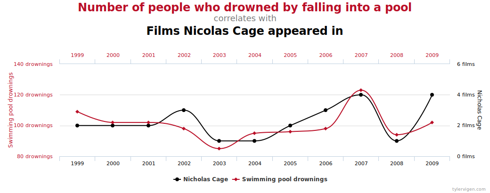
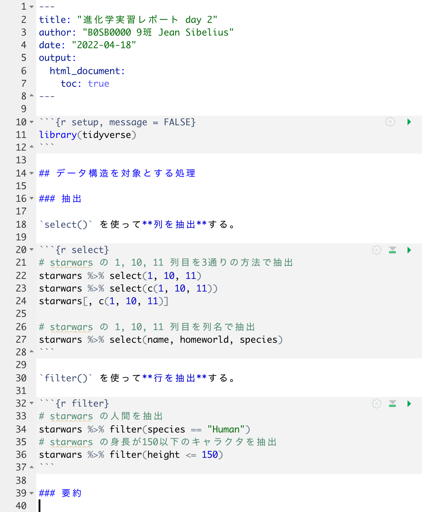
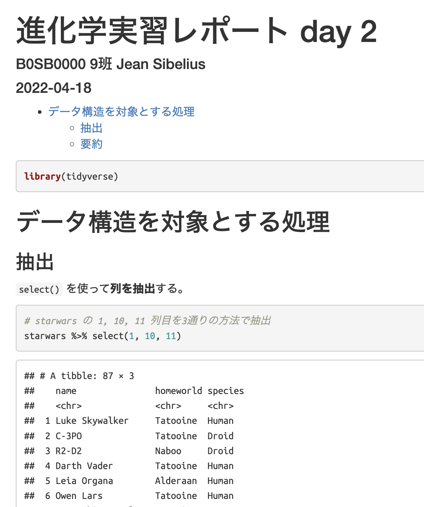

+++
url = "tohoku2022r/8-misc.html"
title = "8. データ解釈の基礎知識、レポート作成 — 進化学実習 2022 牧野研"
linktitle = "データ解釈の基礎知識、レポート作成"
date = 2022-04-14T16:00:00+09:00
type = "reveal"
draft = false
+++


# [進化学実習 2022 牧野研](.)

### 8. データ解釈の基礎知識、レポート作成

<div class="author">
岩嵜航
</div>

<div class="affiliation">
東北大学 生命科学研究科 進化ゲノミクス分野 牧野研
</div>

<div class="footnote">
2022-04-11 東北大学 理学部生物学科 進化学実習
<a href="https://heavywatal.github.io/slides/tohoku2022r/">https://heavywatal.github.io/slides/tohoku2022r/</a>
</div>


---
## この実習の目標

### ✅ <del>生物学研究にはデータとモデルが必須だと認識</del>

### ✅ <del>再現可能な解析を楽にやりたい気持ちになる</del>

### ✅ <del>必要な方法を調べ、実践する力をつける</del>

### ⬜ データ解析の基本に触れる

<br>
個々の方法は覚えなくても大丈夫！<br>
忘れては調べ、を何度も繰り返しながら染み込ませていこう。


---
## 本日のお品書き

⬜ データ解釈の心得 (理論や手法の詳細には触れない)
- 誤差 (バイアス、ばらつき)
- 統計的仮説検定
- 因果関係と相関関係

⬜ データ入力の心得

⬜ R Markdownを用いたレポート作成


---
## Garbage in, garbage out

どんなに素晴らしい統計処理をしようとも、データがゴミなら結論もゴミ。

<figure>

</figure>

- 目的に応じてちゃんとデータを採ることが重要！
- 何がデータを悪くしてしまうのか、見ていこう


---
## 観測には必ず何らかの歪みがある

現象・母集団の性質を知りたいけど、そのものは測れない。<br>
: 質的な問題 → 測れる側面だけ測るしかない
: 量的な問題 → 一部の標本を抽出して測るしかない

<figure>
<br>
<figcaption><small>「<a href="https://amzn.to/3uCxTKo"><cite>データ分析のための数理モデル入門</cite></a>」江崎貴裕 2020 より改変</small></figcaption>
</figure>


---
## 2種類の誤差

系統的誤差 systematic error / バイアス bias
: 一定の傾向をもって生じる誤差。原因を特定して対処。

偶然誤差 random error
: 偶然生じてしまうばらつき。計測を繰り返して対処。

e.g., 服を着たまま体重測定を10回繰り返す → どれも違う値

<figure>
<br>
<figcaption><small>「<a href="https://amzn.to/3uznzCK"><cite>分析者のためのデータ解釈学入門</cite></a>」江崎貴裕 2020 より改変</small></figcaption>
</figure>


---
## 選択バイアス

<figure style="position: absolute; top: 40px; right: 40px;"><a href="https://en.wikipedia.org/wiki/Survivorship_bias">
<br>
<figcaption><small>https://en.wikipedia.org/wiki/Survivorship_bias</small></figcaption>
</a></figure>

データの採れかたが結果に傾向をもたらしてしまう。

生存(者)バイアス
: 生き残ったものだけがデータとして観測される。
: 帰還した多数の戦闘機✈️✈️の損傷の分布(右図)。<br>
  被弾 → **<span style="color: #bb0000;">生還 → 観測される</span>**<br>
  被弾 → **墜落 → 観測されない**<br>
  損傷が観察されなかった場所をむしろ補強すべき。

サンプリングバイアス
: サンプル対象を決めた時点で偏っている。
: 📞電話でアンケート調査 →
  電話機を持てる裕福な人、その時間に通話できる人、
  知らない番号からでも出る人、調査している新聞社に共感している人。

🔰 生物学研究における選択バイアスにはどういうものがありそう？

---
## 測定基準に関するバイアスの例

基準が揃っていない
: 国民1人あたりの弁護士数を国際比較すると日本が少ない。<br>
  諸外国では税理士や司法書士を弁護士に含めて集計している。

基準が時間とともに変化
: 自閉症と診断された児童の数は**見かけ上**年々増えている。<br>
  診断基準の変更、病気の知名度向上が主な原因。<br>
  (親の高齢化の寄与を示唆する研究もあるらしい)

---
## データの扱いに起因するバイアス

チェリー・ピッキング 🍒
: 自分の仮説と矛盾する情報を無視し、都合のいい情報だけ集めること。
: [研究活動における3つの不正](https://www.mext.go.jp/b_menu/shingi/gijyutu/gijyutu12/houkoku/attach/1334660.htm)のうち**改竄**にあたる。

確証バイアス
: 無意識にチェリー・ピッキングしてしまう心理的傾向。
: 悪気なくやってしまわないよう、自覚を持つことが大事。

表に数字、裏にアルファベットが書いてあるカード。<br>
「偶数の裏は必ずA、という法則があるか？」<br>
これを確かめるには次の4枚のうちどれを裏返せばいいか？


???
論理学的な正解は2, B。


---
## たまたま生じたパターンにも意味を見出しがち

前後即因果の誤謬
: たまたま前後で生じた現象に因果関係があると思いがち

ギャンブラーの誤謬
: N回も連続で裏が出たら、次は表が出やすいと思いがち


---
## データ解釈に関わる認知バイアス

利用可能性ヒューリスティック
: 思い浮かびやすいものほど過大評価しがち
: e.g., 1文字目がkの単語、3文字目がkの単語、多いのはどっち？

代表性ヒューリスティック
: ステレオタイプを過大評価しがち
: e.g., リンダは31歳の独身女性。率直で聡明。大学では哲学専攻。
  人種差別や社会正義などに深く関心を持ち、学生時代には反核デモにも参加。<br>
  現在のリンダは次のどちらである可能性が高いか？
  1. リンダは銀行員として働いている。
  1. リンダは銀行員として働きながら、フェミニスト運動に参加している。

認知バイアス・誤謬はほかにもいろいろある。<br>
データ解析とは関係なく、知っておくのは悪くない。

???

https://lambtani.hatenablog.jp/entry/2017/05/18/032108


---
## 偶然誤差によるばらつき方 = 確率分布

先日 [6. 統計モデリング1](6-distribution.html) で習ったやつ！

背後にあるメカニズムによっていろんな形になるのでした。

<iframe width="400" height="300" src="./6-distribution.html#/32"></iframe>


---
## 分布を特徴づける代表値 central tendency

<div class="column-container">
  <div class="column" style="flex-shrink: 1.6;">

平均値 mean
: 和を観察数で割る

中央値 median
: 順に並べて真ん中

最頻値 mode
: 最も頻度が高い値

  </div>
  <div class="column">
  <a href="https://www.mhlw.go.jp/toukei/list/20-21.html">
  
  <figcaption><small><cite>所得金額階級別世帯数の頻度分布</cite> 厚生労働省 国民生活基礎調査 2019</small></figcaption>
  </a>
  </div>
</div>

目的や状況に応じて使い分けよう。

外れ値に対する応答
: もし総資産額20兆円の大富豪が鳥取県に引っ越してきたら<br>
  → 県民の**平均**資産は4000万円上昇。**中央値**・**最頻値**はほぼそのまま。

---
## ばらつきを捉える記述統計量

分散 variance
: 平均値からの差の自乗の平均。 $\frac 1 n \sum _i ^n (X_i - \bar X)^2$
: これの平方根が**標準偏差 (standard deviation)**。

Percentile, Quantile (四分位)
: 小さい順にならべて上位何%にあるか。
: 中央値 = 50th percentile = 第二四分位(Q2)


---
## 記述統計量に頼りすぎず分布を可視化する

同じデータでも見せ方で印象・情報量が変わる。


---
## 2つの量の関係性: 大小の比較

ばらつきの度合いも加味して判断する。

<div class="column-container" style="padding-left: 10px;">
<div class="column" style="flex-shrink: 1.1;">
観測値1つだけ。<br>
たまたまかも。
</div>
<div class="column" style="flex-shrink: 1;">
ばらつき大きい。<br>
Bが高いのもたまたま?
</div>
<div class="column" style="flex-shrink: 1;">
ばらつき小さい。<br>
AとBには差がありそう。
</div>
</div>


「こんなことがたまたま起こる確率はすごく低いです！」<br>
をちゃんと示す手続きが**統計的仮説検定**→


---
## 目的やデータに応じて正しい検定を選ぶ

例えば「2つの量の大小を比較したい」だけでもいくつかある。<br>
今回は選定には深入りせず、検定の考え方だけ触れておく。

<figure><a href="https://comicalcommet.github.io/r-training-2021/">

<figcaption><small>
「Rを用いたデータ解析の基礎と応用」石川由希さん@名古屋大
</small></figcaption>
</a></figure>


---
## 統計的仮説検定の考え方

🎲サイコロを**10回**振ったら**9回**も6の目が出たぞ。イカサマじゃないか？

帰無仮説
: 6の目が出る確率 = 1/6。普通のサイコロです。

対立仮説
: 6の目が出る確率 ≠ 1/6。イカサマです。

<div>\[\begin{split}
p = \binom {10} {9} \times {\frac 1 6} ^ {9} \times {\frac 5 6} ^ 1 + {\frac 1 6} ^ {10}
  = 8.43 \times 10 ^ {-7}
\end{split}\]</div>

1. 帰無仮説のもとで今回のデータ以上に極端な値が得られる確率*p*を計算
1. この ***p*-value** が**有意水準(危険率)**$\alpha$より低い場合、帰無仮説を棄却<br>
   (大概 $\alpha$ = 0.05 とか 0.01 とか。予め決めておく。)
1. 対立仮説を採択。6の目の出る確率は1/6と**有意に異なる**。


---
## 統計的仮説検定の考え方

🎲サイコロを**12回**振ったら**4回**も6の目が出たぞ。<br>
これも1/6よりは高いけど、イカサマのダイスかな？

<span style="color: #990000;">帰無仮説のもとで12回中4回以上6が出る確率: $p = 0.125 > \alpha$</span><br>

帰無仮説を棄却できず。6の目の出る確率が1/6と**有意に異なるとは言えない**。


平たく言えば「普通のサイコロでもそんなに珍しい出目じゃない」


---
## 多重検定で偽陽性のリスクが上昇

危険率$\alpha=0.05$の検定は、最大5%の確率で誤って帰無仮説を棄却(**偽陽性**)。<br>
同様の検定を10回やると、そのうち少なくとも1つで偽陽性になる確率は<br>
$1 - (1 - 0.05)^{10} \simeq 0.40$ まで上昇。<br>


多重比較補正
: 検定を繰り返したぶんだけ基準を厳しくして偽陽性率を抑えること。
: Bonferroni法、Holm法、Benjamini and Hochberg法など。


---
## 広くて深い統計解析の世界

> データの荒波を泳ぎきってもどこにも「究極の真実」などありはしないのだ。
> 統計学はそのときその場かぎりでの「最良の結論」を導くための方便に過ぎないのだ。
> ------ [三中信宏「統計思考の世界」](https://amzn.to/3urpls1)

<figure style="margin-top: -1em;">
<a href="http://leeswijzer.org/R/R-top.html">

<figcaption><small>「<cite>大統計曼荼羅</cite>」三中信宏</small></figcaption>
</a>
</figure>


<!--  -->


---
## 2つの量の関係性: 相関関係と因果関係

<style>
.spurious {color: #fde725;}
.correlation {color: #35B779;}
.causality-wrong {color: #31688e;}
.causality {color: #440154;}
</style>

<div class="column-container">
<div class="column" style="flex-shrink: 1;">

<span class="correlation">相関関係</span>
: ある値が大きいほど、別の値も大きいor小さい。
: e.g., 数学の成績と物理の成績。

<span class="causality">因果関係</span>
: ある事象が別の事象に影響を与える。
: e.g., 1時間勉強するごとに成績が3点伸びる。

</div>
<div class="column" style="flex-shrink: 1.8;">


</div>
</div>


<hr>

- <span class="causality">因果関係</span>があれば<span class="correlation">相関関係</span>として表れる
- **<span class="correlation">相関関係</span>があるからといって<span class="causality">因果関係</span>もあるとは限らない**→


---
## 因果・相関を見誤るパターン1: 交絡因子

**誤:** 🍦アイスの売り上げが増えるほど🍺ビールの売り上げが増える。

**正:** 🍦アイスも🍺ビールも**気温が高いほど**売れる。

<div class="column-container">
  <div class="column" style="flex-shrink: 1.2;">


</div>
<div class="column" style="flex-shrink: 1;">

<figure>

</figure>

</div>
</div>


---
## 因果・相関を見誤るパターン2: 逆の因果関係

**誤:** <span class="causality-wrong">警察官が多いほど犯罪が増える。</span>

**正:** <span class="causality">犯罪が多いから警察官が多く配備される。</span>

<br>

## 因果・相関を見誤るパターン3: 選択バイアス

(x + y) が一定の幅に収まるようなペアだけを集めてしまうとか


---
## 因果・相関を見誤るパターン4: 外れ値・グループ構造

**少数の外れ値**や**グループ構造**によって相関係数rが跳ね上がりうる。


---
## 因果・相関を見誤るパターン5: 偶然

ニコラス・ケイジの映画出演が増えるほど溺死する人が増える？

<figure>

<figcaption><small>
<a href="https://www.tylervigen.com/spurious-correlations">https://www.tylervigen.com/spurious-correlations</a>
</small></figcaption>
</figure>

このウェブサイトにはジョークとしてこうした例が多数集められている↑


---
## 変数間の関係性まとめ

<figure>

<figcaption><small>
<a href="https://amzn.to/3uznzCK">「分析者のためのデータ解釈学入門」江崎貴裕 2020</a>より改変
</small></figcaption>
</figure>

<hr>

- **<span class="correlation">相関関係</span>があるからといって<span class="causality">因果関係</span>もあるとは限らない**。
- <span class="causality-wrong">逆の因果関係</span>や<span class="spurious">見せかけの相関</span>にも要注意。

🔰 これら4つの関係性に該当する事例をそれぞれ1つ以上探してみよう。

???
16--17世紀、怪我をしたら武器に軟膏を塗ると早く治るという迷信。
質の低い軟膏を傷口に塗らないことがプラスに働いたというのが真相。


---
## 本日のお品書き

✅ データ解釈の心得
- バイアス
- 誤差
- 統計的仮説検定
- 因果関係と相関関係

⬜ データ入力の心得

⬜ R Markdownを用いたレポート作成


---
## 自分が一次データを作るときに気をつけたいこと

Rを使ったデータ前処理を習得した✨<br>
雑然データからでも下ごしらえして解析できるぞ！

とはいえ...

- まず、読み込めないと始まらない。
- dplyrやtidyrで手に負えないほど不規則では困る。

自分がデータ入力する際に、どう気をつけたらいいか？

<br>

総務省が2020年に発表して「全国民が見るべき」と話題になった<br>
[「統計表における機械判読可能なデータの表記方法の統一ルール」](https://www.soumu.go.jp/menu_news/s-news/01toukatsu01_02000186.html)
から抜粋。

---
## データ入力の心得 1. 1つのセルに1つの値

<figure><a href="https://www.soumu.go.jp/menu_news/s-news/01toukatsu01_02000186.html">

<figcaption><small>総務省 2020「<cite>統計表における機械判読可能なデータの表記方法の統一ルール</cite>」より</small></figcaption>
</a></figure>

悪い形に遭遇したときに使える関数:
`tidyr::separate()`, `tidyr::separate_rows()`, `stringr::str_split()`, `stringr::str_extract()`

---
## データ入力の心得 1. 1つのセルに1つの値

<figure><a href="https://www.soumu.go.jp/menu_news/s-news/01toukatsu01_02000186.html">

<figcaption><small>総務省 2020「<cite>統計表における機械判読可能なデータの表記方法の統一ルール</cite>」より</small></figcaption>
</a></figure>

悪い形に遭遇したときに使える関数:
`tidyr::separate()`, `tidyr::separate_rows()`, `stringr::str_split()`, `stringr::str_extract()`

---
## データ入力の心得 2. 余計な文字列が数値扱いを妨げる

<figure><a href="https://www.soumu.go.jp/menu_news/s-news/01toukatsu01_02000186.html">

<figcaption><small>総務省 2020「<cite>統計表における機械判読可能なデータの表記方法の統一ルール</cite>」より</small></figcaption>
</a></figure>

悪い形に遭遇したときに使える関数:
`readr::parse_number()`, `stringr::str_remove()`, `stringr::str_replace()`

---
## データ入力の心得 2. 余計な文字列が数値扱いを妨げる

<figure><a href="https://www.soumu.go.jp/menu_news/s-news/01toukatsu01_02000186.html">

<figcaption><small>総務省 2020「<cite>統計表における機械判読可能なデータの表記方法の統一ルール</cite>」より</small></figcaption>
</a></figure>

悪い形に遭遇したときに使える関数:
`readr::parse_number()`, `stringr::str_remove()`, `stringr::str_replace()`

---
## データ入力の心得 2. 余計な文字列が数値扱いを妨げる

<figure><a href="https://www.soumu.go.jp/menu_news/s-news/01toukatsu01_02000186.html">

<figcaption><small>総務省 2020「<cite>統計表における機械判読可能なデータの表記方法の統一ルール</cite>」より</small></figcaption>
</a></figure>

いやいや、欄外に記載するのも不規則でダメですよ。別シートか、別カラムに。

悪い形に遭遇したときに使える関数:
`readr::parse_number()`, `stringr::str_remove()`, `stringr::str_replace()`

---
## データ入力の心得 3. 空白や改行で見た目を整えない

機械にとって `"　A"` と `"A"` は違う値。

<figure><a href="https://www.soumu.go.jp/menu_news/s-news/01toukatsu01_02000186.html">

<figcaption><small>総務省 2020「<cite>統計表における機械判読可能なデータの表記方法の統一ルール</cite>」より</small></figcaption>
</a></figure>

悪い形に遭遇したときに使える関数:
`stringr::str_remove()`, `stringr::str_replace()`

---
## データ入力の心得 3. 空白や改行で見た目を整えない

<figure><a href="https://www.soumu.go.jp/menu_news/s-news/01toukatsu01_02000186.html">

<figcaption><small>総務省 2020「<cite>統計表における機械判読可能なデータの表記方法の統一ルール</cite>」より</small></figcaption>
</a></figure>

悪い形に遭遇したときに使える関数:
`stringr::str_remove()`, `stringr::str_replace()`

---
## データ入力の心得 4. セルを結合しない、絶対に

<figure><a href="https://www.soumu.go.jp/menu_news/s-news/01toukatsu01_02000186.html">

<figcaption><small>総務省 2020「<cite>統計表における機械判読可能なデータの表記方法の統一ルール</cite>」より</small></figcaption>
</a></figure>

悪い形に遭遇したときに使える関数:
`tidyr::fill()`

---
## データ入力の心得 4. セルを結合しない、絶対に

<figure><a href="https://www.soumu.go.jp/menu_news/s-news/01toukatsu01_02000186.html">

<figcaption><small>総務省 2020「<cite>統計表における機械判読可能なデータの表記方法の統一ルール</cite>」より</small></figcaption>
</a></figure>

悪い形に遭遇したときに使える関数:
`tidyr::fill()`

---
## データ入力の心得 5. 同じものが続いても省略しない

人が見れば分かるけど、機械も同じように読んではくれない。

<figure><a href="https://www.soumu.go.jp/menu_news/s-news/01toukatsu01_02000186.html">

<figcaption><small>総務省 2020「<cite>統計表における機械判読可能なデータの表記方法の統一ルール</cite>」より</small></figcaption>
</a></figure>

悪い形に遭遇したときに使える関数:
`tidyr::fill()`, `tidyr::separate()`, `stringr::str_replace()`

---
## データ入力の心得 6. 機種依存文字を避ける

できれば全角・日本語も避けてすべて半角英数で。

<figure><a href="https://www.soumu.go.jp/menu_news/s-news/01toukatsu01_02000186.html">

<figcaption><small>総務省 2020「<cite>統計表における機械判読可能なデータの表記方法の統一ルール</cite>」より</small></figcaption>
</a></figure>

悪い形に遭遇したときに使える関数:
`stringi::stri_trans_nfkc()`

---
## データ入力の心得 7. データを分断しない

<figure><a href="https://www.soumu.go.jp/menu_news/s-news/01toukatsu01_02000186.html">

<figcaption><small>総務省 2020「<cite>統計表における機械判読可能なデータの表記方法の統一ルール</cite>」より</small></figcaption>
</a></figure>


---
## データ入力の心得 7. データを分断しない

<figure><a href="https://www.soumu.go.jp/menu_news/s-news/01toukatsu01_02000186.html">

<figcaption><small>総務省 2020「<cite>統計表における機械判読可能なデータの表記方法の統一ルール</cite>」より</small></figcaption>
</a></figure>

---
## データ入力の心得 8. 1つのシートには1つの表

もっと言うと、複数シートのファイルを作らず、それぞれ別ファイルに。

<figure><a href="https://www.soumu.go.jp/menu_news/s-news/01toukatsu01_02000186.html">

<figcaption><small>総務省 2020「<cite>統計表における機械判読可能なデータの表記方法の統一ルール</cite>」より</small></figcaption>
</a></figure>

---
## データ入力の心得 9. その他

- 1行目ではすべての列に名前を与える。
  - なんとなく**1行目は空行**、**1列目は名前無し**とかやりがち。ダメ。
  - 2行目以降に列名がハミ出してもダメ。
  - プログラム内で参照される変数名として成立するように。
    - アンダースコア_以外の**記号・空白を入れない**のが安全。
    - **先頭は数字も避ける**。
- 保存形式はプレーンテキスト推奨。Excel形式(.xlsx)は扱いにくい。
    - タブ区切り(.tsv) or カンマ区切り(.csv)
    - ファイル名、フォルダ名も機械処理するつもりで規則的に。

[熊谷直喜さんのブログ「R解析用データフォーマット例」](http://nhkuma.blogspot.com/2012/12/r_5.html)
も一読を。

---
## データ入力の心得おさらい

つまり、Rで前処理・可視化・解析するぞという気持ち:

1. 1つのセルに1つの値
1. 余計な文字列が数値扱いを妨げる
1. 空白や改行で見た目を整えない
1. セルを結合しない、絶対に
1. 同じものが続いても省略しない
1. 機種依存文字、というか半角英数以外を避ける
1. データを分断しない
1. 1つのシート(ファイル)には1つの表

🔰 総務省ルールの「修正後」にまだ残る改善点をなるべく多く列挙しよう。


---
## Excelの親切に要注意

表形式のファイルを閲覧・作成するソフトとしてよく普及。<br>
しかし**親切設計がユーザーに牙を剥く**！

- 文字列が勝手に日付になる: `22-4`, `4-14`
- 遺伝子名が勝手に日付になる: `MARCH1`, `SEPT1`<br>
  ([2020年、これを避けるために改名された](https://www.theverge.com/2020/8/6/21355674/human-genes-rename-microsoft-excel-misreading-dates))

🔰 次のようなCSVファイルを作り、Excelで読み取ってみよう。<br>

```
gene,label
MARCH1,22-4
SEPT1,4-14
```

🔰 Excelで日付になったものを保存して、Rで読み取ってみよう。


---
## 本日のお品書き

✅ データ解釈の心得
- バイアス
- 誤差
- 統計的仮説検定
- 因果関係と相関関係

✅ データ入力の心得

⬜ R Markdownを用いたレポート作成


---
## R Markdown 形式でレポートを書く

<a href="https://rmarkdown.rstudio.com/">

</a>

解析からレポート作成まで一元管理できて楽ちん。

- 本文とRコードを含むテキストファイル.Rmdを作る。
- HTML, PDF, Wordなどの形式に変換して読む。
  - コードそのものも当然埋め込める。
  - 実行結果の**図**や**表**も埋め込める。

<hr>

R Markdown (`.Rmd`)
: Rなどで図や表を埋め込めるようにした**Markdown**亜種。

Markdown (`.md`)
: 最もよく普及している**軽量マークアップ言語**のひとつ。
: 微妙に異なる方言がある。Rmdで使うのは Pandoc Markdown 。

🔰 どんなものが作れるのか
[作成例ギャラリー](https://r-markdown-gallery.com/)
を見てみよう。

---
## マークアップ言語

文書の構造や視覚的修飾を記述するための言語。<br>
e.g., **HTML**+CSS, XML, LaTeX

```html
<h3>見出し3</h3>
<p>ここは段落。
<em>強調(italic)</em>、
<strong>強い強調(bold)</strong>、
<a href="https://www.lifesci.tohoku.ac.jp/">リンク</a>とか。
</p>
```

<div style="border: solid 1px #888888; padding: 0 4px;">
<h3>見出し3</h3>
<p>ここは段落。
<em>強調(italic)</em>、
<strong>強い強調(bold)</strong>、
<a href="https://www.lifesci.tohoku.ac.jp/">リンク</a>とか。
</p>
</div>

表現力豊かで強力だが人間が読み書きするには複雑すぎ、機械寄り。

🔰 好きなウェブサイトのソースコード(HTML)を見てみよう。


---
## 軽量マークアップ言語

**マークアップ言語**の中でも人間が読み書きしやすいもの。<br>
e.g., **Markdown**, reStructuredText, 各種Wiki記法など

```md
### 見出し3

ここは段落。
*強調(italic)*、
**強い強調(bold)**、
[リンク](https://www.lifesci.tohoku.ac.jp/)とか。
```

<div style="border: solid 1px #888888; padding: 0 4px;">
<h3>見出し3</h3>
<p>ここは段落。
<em>強調(italic)</em>、
<strong>強い強調(bold)</strong>、
<a href="https://www.lifesci.tohoku.ac.jp/">リンク</a>とか。
</p>
</div>


---
## Markdown記法で書いてみよう

1. RStudio > New File > Markdown File
   
1. ["markdown 記法"とかで検索](https://duckduckgo.com/?q=markdown+syntax)しつつ何か書く。
   - 見出し1, 2, 3
   - 箇条書き (番号あり・なし)
   - インラインコード、コードブロック
1. <kbd>Preview</kbd>ボタンで確認

---
## R Markdown を作ってみよう

RStudio > New File > R Markdown...<br>
(DocumentとHTMLを選択し、)タイトルと著者を埋めて、OK。


---
## 普通のmdには無いRmdの特徴

**ヘッダー**
: 最上部の `---` で挟まれた部分。
  文書全体に関わるメタデータを入力。
: オプションは出力形式によって異なる。
  e.g., [`html_document`](https://bookdown.org/yihui/rmarkdown/html-document.html)

**R code chunk**
: `` ```{r chunk-name, opt1=FALSE, ...} `` のように始まるブロック。
: コードの実行結果を最終産物に埋め込める。
: [オプションがいろいろある](https://yihui.org/knitr/options/)。e.g.,
  - `echo=FALSE`: コードを非表示。結果は表示。
  - `eval=FALSE`: コードを実行せず表示だけ。
  - `include=FALSE`: コードも結果も表示せず、実行だけする。
  - `fig.width=7, fig.height=7`: 図の大きさを制御。

まあ細かいことは必要になってから調べるとして...


---
## R MarkdownをHTMLに変換してみよう

1. ソースコードに名前をつけて保存 <kbd>command</kbd><kbd>s</kbd><br>
   e.g., `report.Rmd`
1. 🧶 Knit ボタンを押す。
   - 埋め込まれたRコードが実行される。
   - 実行結果を含むMarkdownが作られる。
   - MarkdownからHTMLに変換される。 e.g., `report.html`
   - プレビューが自動的に開く。

🔰 編集 → Knit を繰り返して変化を確認しよう

---
## レポートの体裁の例

左のようなRmdを作って🧶Knitし、右のようなHTMLファイルを提出。

<div>
</img>
</img>
</div>

---
## 🔰 レポート (締切: 2022-05-09)

- 課題: 実習中に解いた課題をR Markdownでまとめる。
  - 講義資料の🔰若葉マークの練習問題
  - 翌日にグループで相談・発表した課題
- 様式
  - Knit済み**htmlファイル**。1日分で1つ、トピックに提出。計4つ。
  - ファイル名 `C0SB0000-iwasaki-day1.html`
- 評価ポイント
  - エラーも警告も無くコード(🧶Knit)が走っている
  - 文書の構造や図が視覚的に見やすく整理されている
  - 半年後の自分が読んでわかるような親切コメント
- 手抜きポイント
  - 生物学的な意義があるか、みたいなのは不問


---
## 🔰 4日目の課題2

書籍、ニュースサイト、ブログ記事などを検索し、<br>
**良くないデータ解析の例**を探して**改善案**を挙げよう。

1. データの集め方(サンプルの選び方)が偏っていて良くない例
1. データの解釈(相関や因果)を誤っている例
1. 生データを公開してくれてるのはいいけど、形式が良くない例
1. 図の描き方で嘘をついている例 (誇張、印象操作)

4/18月曜はまず40分ほど班ごとに相談。<br>
その後、各班の代表事例を発表してもらいます。

- 出典。URLとか書籍名。
- データの概要、書き手の主張。
- ここが良くない。
- こうすればよくなりそう。


---
## 参考文献

- 「[Rを用いたデータ解析の基礎と応用](https://comicalcommet.github.io/r-training-2021/)」
   石川由希 2021 名古屋大学
- [データ解析のための統計モデリング入門](https://amzn.to/33suMIZ) 久保拓弥 2012
- [分析者のためのデータ解釈学入門](https://amzn.to/3uznzCK) 江崎貴裕 2020
- [データ分析のための数理モデル入門](https://amzn.to/3uCxTKo) 江崎貴裕 2020
- [統計学を哲学する](https://amzn.to/3ty80Kv) 大塚淳 2020
- [統計思考の世界](https://amzn.to/3urpls1) 三中信宏 2018
- R Markdown
  - [Cheat sheet (PDF)](https://raw.githubusercontent.com/rstudio/cheatsheets/main/rmarkdown.pdf)
  - [R for Data Science --- R Markdown](https://r4ds.had.co.nz/r-markdown.html)
  - [R Markdown: The Definitive Guide](https://bookdown.org/yihui/rmarkdown/)

<a href="9-report.html" rel="next" class="readmore">
9. 発表会
</a>
