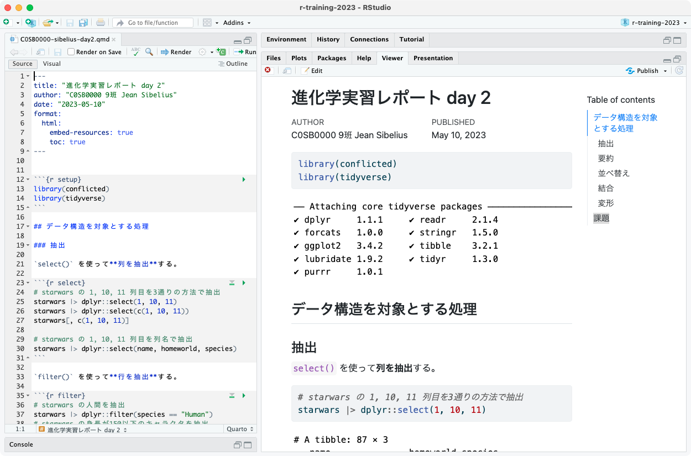

+++
url = "tohoku2025r/6-input.html"
linktitle = "データ入力、レポート作成"
title = "6. データ入力、レポート作成 — 進化学実習 2025 牧野研 東北大学"
date = 2025-04-10T14:40:00+09:00
draft = false
css = "style.css"
dpi = 108
+++

# [進化学実習 2025 牧野研 東北大学](.)

<div class="author">
岩嵜 航
</div>

<div class="affiliation">
東北大学 生命科学研究科 進化ゲノミクス分野 牧野研 特任助教
</div>

<ol>
<li><a href="1-introduction.html">導入: データ解析の全体像。Rの基本。</a>
<li><a href="2-visualization.html">データの可視化。</a>
<li><a href="3-structure1.html">データ構造の処理1: 抽出、集約など。</a>
<li><a href="4-structure2.html">データ構造の処理2: 結合、変形など。</a>
<li><a href="5-content.html">データ内容の処理: 数値、文字列など。</a>
<li class="current-deck"><a href="6-input.html">データ入力、レポート作成</a>
<li><a href="7-distribution.html">統計モデリング1: 確率分布、尤度</a>
<li><a href="8-glm.html">統計モデリング2: 一般化線形モデル</a>
<li><a href="9-report.html">発表会</a>
</ol>

<div class="footnote">
2025-04-10 東北大学 理学部生物学科 進化学実習<br>
<a href="https://heavywatal.github.io/slides/tohoku2025r/">https://heavywatal.github.io/slides/tohoku2025r/</a>
</div>


---
## データ解析のおおまかな流れ

1. コンピュータ環境の整備 ✅
1. データの取得、読み込み 👈 今回はここから
1. 探索的データ解析
    - 前処理、加工 ✅ 完全に理解した
    - 可視化、仮説生成 ✅ 完全に理解した
    - 統計解析、仮説検証 ⬜ 次回
1. 報告、発表 ⬜ Quarto楽しい

<figure>
<a href="https://r4ds.hadley.nz/intro">

<figcaption class="url">https://r4ds.hadley.nz/intro</figcaption>
</a>
</figure>


---
## data.frameの読み書き

<a href="https://readr.tidyverse.org/">

</a>

- readxlパッケージを使えば `.xlsx` ファイルも読める、けど
- カンマ区切り(CSV)とかタブ区切り(TSV)のテキストが無難。
- R標準の関数ではなく readr パッケージを使う。
- ファイル名は**作業ディレクトリ**からの**相対パス**で指定。

    ```r
    readr::write_tsv(iris, "data/iris.tsv")   # 書き出し
    iris2 = readr::read_tsv("data/iris.tsv")  # 読み込み
    ```

あれれー、エラーが出る？


```
Error: Cannot open file for writing:
* 'data/iris.tsv'
```

---
## ファイル読み書きでありがちなエラー

- 読みたいファイル名が間違っている。
- 読みたいファイルが作業ディレクトリとは違うところにある。
- 書き込み先のディレクトリが存在しない。→ 予め作っておこう

冷静に、現在の作業ディレクトリとその中身を確認しよう:
```r
getwd()                 # GET Working Directory
fs::dir_ls(".")         # List files in "." (here)
fs::dir_ls("data")      # List files in "./data"
fs::dir_create("data")  # Create directory
```

[よくあるエラー集 (石川由希さん@名古屋大)](https://comicalcommet.github.io/r-training-2024/R_training_2024_7.html)
を読んでおきましょう。

🔰 これまでに登場したデータを `data/` 以下に書き出してみよう。

🔰 それらを別の名前で読み込み直してみよう。

---
## 🔰 最終課題予告

<iframe width="1080" height="810" src="#/29"></iframe>

読み込み → 前処理 → 可視化 → 余裕でクリア、、、となるか？

---
## 実演: [e-Stat 国勢調査](https://www.e-stat.go.jp/gis/statmap-search?page=1&type=1&toukeiCode=00200521) CSV

2020年 → 小地域 → 年齢（５歳階級、４区分）別、男女別人口 → 宮城県\
<small style="opacity: 0.7;">
(今はe-Statの不具合で落とせないっぽいので
<a href="tblT001082C04.txt" download="tblT001082C04.txt">📄ここに置いときます</a>)
</small>

うまくすれば次のような人口ピラミッドを描けるはずのファイルだが...


---
## オープンデータを入手できても簡単には読み込めない

初手エラー:

``` r
infile = "tblT001082C04.txt"
readr::read_csv(infile)
```

```
Error in nchar(x, keepNA = FALSE): invalid multibyte string, element 2
```

RStudioでテキストとして開いてみると文字化け:


```
                                                                                                                                                                                                                                                                                                                                                                                                                                                                                                                                                                                                                                                                                                                                                                                                                                                                                                                                                                                                                                                                                                                                                                                                                                                                                                                                                                                                                                                                                                                                                                                                                                                                                                                                                                                                                                                                                                                                                                                                                                                                                                                                                                                                                                                                                                                                                                                                                                                                                                                                                                                                                                     
 KEY_CODE,HYOSYO,CITYNAME,NAME,HTKSYORI,HTKSAKI,GASSAN,T001082001,T001082002,T001082003,T001082004,T001082005,T001082006,T001082007,T001082008,T001082009,T001082010,T001082011,T001082012,T001082013,T001082014,T001082015,T001082016,T001082017,T001082018,T001082019,T001082020,T001082021,T001082022,T001082023,T001082024,T001082025,T001082026,T001082027,T001082028,T001082029,T001082030,T001082031,T001082032,T001082033,T001082034,T001082035,T001082036,T001082037,T001082038,T001082039,T001082040,T001082041,T001082042,T001082043,T001082044,T001082045,T001082046,T001082047,T001082048,T001082049,T001082050,T001082051,T001082052,T001082053,T001082054,T001082055,T001082056,T001082057,T001082058,T001082059,T001082060                                                                                                                                                                                                                                                                                                                                                                                                                                                                                                                                                                                                                                                                                                                                                                                                                                                                                                                                                                                                                                                                                                                                                                                                                                                                                                                                                                                                                                                                                                                                                                                                                                                                                                                                                                                                                                                                                           
 ,,,,,,,\x91\x8d\x90\x94\x81A\x94N\x97\xee\x81u\x95s\x8fځv\x8a܂\xde,\x91\x8d\x90\x94\x82O\x81`\x82S\x8d\xce,\x91\x8d\x90\x94\x82T\x81`\x82X\x8d\xce,\x91\x8d\x90\x94\x82P\x82O\x81`\x82P\x82S\x8d\xce,\x91\x8d\x90\x94\x82P\x82T\x81`\x82P\x82X\x8d\xce,\x91\x8d\x90\x94\x82Q\x82O\x81`\x82Q\x82S\x8d\xce,\x91\x8d\x90\x94\x82Q\x82T\x81`\x82Q\x82X\x8d\xce,\x91\x8d\x90\x94\x82R\x82O\x81`\x82R\x82S\x8d\xce,\x91\x8d\x90\x94\x82R\x82T\x81`\x82R\x82X\x8d\xce,\x91\x8d\x90\x94\x82S\x82O\x81`\x82S\x82S\x8d\xce,\x91\x8d\x90\x94\x82S\x82T\x81`\x82S\x82X\x8d\xce,\x91\x8d\x90\x94\x82T\x82O\x81`\x82T\x82S\x8d\xce,\x91\x8d\x90\x94\x82T\x82T\x81`\x82T\x82X\x8d\xce,\x91\x8d\x90\x94\x82U\x82O\x81`\x82U\x82S\x8d\xce,\x91\x8d\x90\x94\x82U\x82T\x81`\x82U\x82X\x8d\xce,\x91\x8d\x90\x94\x82V\x82O\x81`\x82V\x82S\x8d\xce,\x91\x8d\x90\x94\x82P\x82T\x8dΖ\xa2\x96\x9e,\x91\x8d\x90\x94\x82P\x82T\x81`\x82U\x82S\x8d\xce,\x91\x8d\x90\x94\x82U\x82T\x8dΈȏ\xe3,\x91\x8d\x90\x94\x82V\x82T\x8dΈȏ\xe3,\x92j\x82̑\x8d\x90\x94\x81A\x94N\x97\xee\x81u\x95s\x8fځv\x8a܂\xde,\x92j\x82O\x81`\x82S\x8d\xce,\x92j\x82T\x81`\x82X\x8d\xce,\x92j\x82P\x82O\x81`\x82P\x82S\x8d\xce,\x92j\x82P\x82T\x81`\x82P\x82X\x8d\xce,\x92j\x82Q\x82O\x81`\x82Q\x82S\x8d\xce,\x92j\x82Q\x82T\x81`\x82Q\x82X\x8d\xce,\x92j\x82R\x82O\x81`\x82R\x82S\x8d\xce,\x92j\x82R\x82T\x81`\x82R\x82X\x8d\xce,\x92j\x82S\x82O\x81`\x82S\x82S\x8d\xce,\x92j\x82S\x82T\x81`\x82S\x82X\x8d\xce,\x92j\x82T\x82O\x81`\x82T\x82S\x8d\xce,\x92j\x82T\x82T\x81`\x82T\x82X\x8d\xce,\x92j\x82U\x82O\x81`\x82U\x82S\x8d\xce,\x92j\x82U\x82T\x81`\x82U\x82X\x8d\xce,\x92j\x82V\x82O\x81`\x82V\x82S\x8d\xce,\x92j\x82P\x82T\x8dΖ\xa2\x96\x9e,\x92j\x82P\x82T\x81`\x82U\x82S\x8d\xce,\x92j\x82U\x82T\x8dΈȏ\xe3,\x92j\x82V\x82T\x8dΈȏ\xe3,\x8f\x97\x82̑\x8d\x90\x94\x81A\x94N\x97\xee\x81u\x95s\x8fځv\x8a܂\xde,\x8f\x97\x82O\x81`\x82S\x8d\xce,\x8f\x97\x82T\x81`\x82X\x8d\xce,\x8f\x97\x82P\x82O\x81`\x82P\x82S\x8d\xce,\x8f\x97\x82P\x82T\x81`\x82P\x82X\x8d\xce,\x8f\x97\x82Q\x82O\x81`\x82Q\x82S\x8d\xce,\x8f\x97\x82Q\x82T\x81`\x82Q\x82X\x8d\xce,\x8f\x97\x82R\x82O\x81`\x82R\x82S\x8d\xce,\x8f\x97\x82R\x82T\x81`\x82R\x82X\x8d\xce,\x8f\x97\x82S\x82O\x81`\x82S\x82S\x8d\xce,\x8f\x97\x82S\x82T\x81`\x82S\x82X\x8d\xce,\x8f\x97\x82T\x82O\x81`\x82T\x82S\x8d\xce,\x8f\x97\x82T\x82T\x81`\x82T\x82X\x8d\xce,\x8f\x97\x82U\x82O\x81`\x82U\x82S\x8d\xce,\x8f\x97\x82U\x82T\x81`\x82U\x82X\x8d\xce,\x8f\x97\x82V\x82O\x81`\x82V\x82S\x8d\xce,\x8f\x97\x82P\x82T\x8dΖ\xa2\x96\x9e,\x8f\x97\x82P\x82T\x81`\x82U\x82S\x8d\xce,\x8f\x97\x82U\x82T\x8dΈȏ\xe3,\x8f\x97\x82V\x82T\x8dΈȏ\xe3
 04101,1,\x90\xe5\x91\xe4\x8es\x90\u0097t\x8b\xe6,,0,,,311590,10231,11633,11838,15944,23772,17838,17677,19028,21113,23299,20544,18295,16702,17137,17700,33702,194212,69969,35132,150932,5350,6087,6066,8321,12579,8669,8600,9241,10232,11412,10317,9031,7893,8010,8082,17503,96295,29477,13385,160658,4881,5546,5772,7623,11193,9169,9077,9787,10881,11887,10227,9264,8809,9127,9618,16199,97917,40492,21747                                                                                                                                                                                                                                                                                                                                                                                                                                                                                                                                                                                                                                                                                                                                                                                                                                                                                                                                                                                                                                                                                                                                                                                                                                                                                                                                                                                                                                                                                                                                                                                                                                                                                                                                                                                                                                                                                                                                                                                                                                                                                                                                                                                                                         
 041010010,2,\x90\xe5\x91\xe4\x8es\x90\u0097t\x8b\xe6,\x90\u0097t\x92\xac,0,,,649,16,15,17,23,53,62,49,40,40,40,45,33,28,38,38,48,413,143,67,307,8,10,7,10,26,30,27,21,18,14,25,16,11,15,16,25,198,60,29,342,8,5,10,13,27,32,22,19,22,26,20,17,17,23,22,23,215,83,38                                                                                                                                                                                                                                                                                                                                                                                                                                                                                                                                                                                                                                                                                                                                                                                                                                                                                                                                                                                                                                                                                                                                                                                                                                                                                                                                                                                                                                                                                                                                                                                                                                                                                                                                                                                                                                                                                                                                                                                                                                                                                                                                                                                                                                                                                                                                                                 
 041010020,2,\x90\xe5\x91\xe4\x8es\x90\u0097t\x8b\xe6,\x82\xa0\x82\xaf\x82ڂ̒\xac,0,,,741,23,18,13,26,32,55,48,42,60,51,48,47,38,55,43,54,447,209,111,365,12,10,4,15,16,22,28,19,39,27,25,16,23,24,21,26,230,89,44,376,11,8,9,11,16,33,20,23,21,24,23,31,15,31,22,28,217,120,67                                                                                                                                                                                                                                                                                                                                                                                                                                                                                                                                                                                                                                                                                                                                                                                                                                                                                                                                                                                                                                                                                                                                                                                                                                                                                                                                                                                                                                                                                                                                                                                                                                                                                                                                                                                                                                                                                                                                                                                                                                                                                                                                                                                                                                                                                                                                                        
```

メニューから "File → **Reopen with Encoding...**" を選択。\
古い日本語ファイルにありがちなのは**SHIFT-JIS**。\
<small style="opacity: 0.7;">(もっと古いファイルならEUC-JPとかの場合もある。)</small>

---
## 文字コードを指定して読み込み

よく見ると、8列目以降の列名が2行にまたがっている:

``` r
sjis = readr::locale(encoding = "SHIFT-JIS")
readr::read_csv(infile, locale = sjis)
```

```
        KEY_CODE HYOSYO     CITYNAME         NAME HTKSYORI HTKSAKI GASSAN             T001082001   T001082002   T001082003       T001082004       T001082005       T001082006       T001082007       T001082008       T001082009       T001082010       T001082011       T001082012       T001082013       T001082014       T001082015       T001082016     T001082017       T001082018     T001082019     T001082020                 T001082021 T001082022 T001082023     T001082024     T001082025     T001082026     T001082027     T001082028     T001082029     T001082030     T001082031     T001082032     T001082033     T001082034     T001082035     T001082036   T001082037     T001082038   T001082039   T001082040                 T001082041 T001082042 T001082043     T001082044     T001082045     T001082046     T001082047     T001082048     T001082049     T001082050     T001082051     T001082052     T001082053     T001082054     T001082055     T001082056   T001082057     T001082058   T001082059   T001082060
           <chr>  <dbl>        <chr>        <chr>    <dbl>   <chr>  <chr>                  <chr>        <chr>        <chr>            <chr>            <chr>            <chr>            <chr>            <chr>            <chr>            <chr>            <chr>            <chr>            <chr>            <chr>            <chr>            <chr>          <chr>            <chr>          <chr>          <chr>                      <chr>      <chr>      <chr>          <chr>          <chr>          <chr>          <chr>          <chr>          <chr>          <chr>          <chr>          <chr>          <chr>          <chr>          <chr>          <chr>        <chr>          <chr>        <chr>        <chr>                      <chr>      <chr>      <chr>          <chr>          <chr>          <chr>          <chr>          <chr>          <chr>          <chr>          <chr>          <chr>          <chr>          <chr>          <chr>          <chr>        <chr>          <chr>        <chr>        <chr>
   1        <NA>     NA         <NA>         <NA>       NA    <NA>   <NA> 総数、年齢「不詳」含む 総数０〜４歳 総数５〜９歳 総数１０〜１４歳 総数１５〜１９歳 総数２０〜２４歳 総数２５〜２９歳 総数３０〜３４歳 総数３５〜３９歳 総数４０〜４４歳 総数４５〜４９歳 総数５０〜５４歳 総数５５〜５９歳 総数６０〜６４歳 総数６５〜６９歳 総数７０〜７４歳 総数１５歳未満 総数１５〜６４歳 総数６５歳以上 総数７５歳以上 男の総数、年齢「不詳」含む 男０〜４歳 男５〜９歳 男１０〜１４歳 男１５〜１９歳 男２０〜２４歳 男２５〜２９歳 男３０〜３４歳 男３５〜３９歳 男４０〜４４歳 男４５〜４９歳 男５０〜５４歳 男５５〜５９歳 男６０〜６４歳 男６５〜６９歳 男７０〜７４歳 男１５歳未満 男１５〜６４歳 男６５歳以上 男７５歳以上 女の総数、年齢「不詳」含む 女０〜４歳 女５〜９歳 女１０〜１４歳 女１５〜１９歳 女２０〜２４歳 女２５〜２９歳 女３０〜３４歳 女３５〜３９歳 女４０〜４４歳 女４５〜４９歳 女５０〜５４歳 女５５〜５９歳 女６０〜６４歳 女６５〜６９歳 女７０〜７４歳 女１５歳未満 女１５〜６４歳 女６５歳以上 女７５歳以上
   2       04101      1 仙台市青葉区         <NA>        0    <NA>   <NA>                 311590        10231        11633            11838            15944            23772            17838            17677            19028            21113            23299            20544            18295            16702            17137            17700          33702           194212          69969          35132                     150932       5350       6087           6066           8321          12579           8669           8600           9241          10232          11412          10317           9031           7893           8010           8082        17503          96295        29477        13385                     160658       4881       5546           5772           7623          11193           9169           9077           9787          10881          11887          10227           9264           8809           9127           9618        16199          97917        40492        21747
   3   041010010      2 仙台市青葉区       青葉町        0    <NA>   <NA>                    649           16           15               17               23               53               62               49               40               40               40               45               33               28               38               38             48              413            143             67                        307          8         10              7             10             26             30             27             21             18             14             25             16             11             15             16           25            198           60           29                        342          8          5             10             13             27             32             22             19             22             26             20             17             17             23             22           23            215           83           38
   4   041010020      2 仙台市青葉区   あけぼの町        0    <NA>   <NA>                    741           23           18               13               26               32               55               48               42               60               51               48               47               38               55               43             54              447            209            111                        365         12         10              4             15             16             22             28             19             39             27             25             16             23             24             21           26            230           89           44                        376         11          8              9             11             16             33             20             23             21             24             23             31             15             31             22           28            217          120           67
  --                                                                                                                                                                                                                                                                                                                                                                                                                                                                                                                                                                                                                                                                                                                                                                                                                                                                                                                                                                                                                                     
5941 04606004015      4     南三陸町   歌津字石浜        0    <NA>   <NA>                    295            9            7               11                6                6               12                6               18               16               19               21               36               18               30               26             27              158            110             54                        146          5          5              5              3              5              8              2              6              8             10             14             16              8             11             20           15             80           51           20                        149          4          2              6              3              1              4              4             12              8              9              7             20             10             19              6           12             78           59           34
5942 04606004016      4     南三陸町 歌津字田の浦        0    <NA>   <NA>                    144            5            2                5                3                5                7                5                7                6                5               15               12               17               14                4             12               82             50             32                         66          -          1              3              1              3              4              3              4              3              2              6              5              9              9              4            4             40           22            9                         78          5          1              2              2              2              3              2              3              3              3              9              7              8              5              -            8             42           28           23
5943 04606004017      4     南三陸町 歌津字草木沢        0    <NA>   <NA>                    457           21           16               18               16               12               13               20               18               18               41               34               28               37               46               43             55              237            165             76                        234         11          6              8             10             11              5              9             10             11             22             18             15             17             19             29           25            128           81           33                        223         10         10             10              6              1              8             11              8              7             19             16             13             20             27             14           30            109           84           43
5944 04606004018      4     南三陸町 歌津字伊里前        0    <NA>   <NA>                      -            -            -                -                -                -                -                -                -                -                -                -                -                -                -                -              -                -              -              -                          -          -          -              -              -              -              -              -              -              -              -              -              -              -              -              -            -              -            -            -                          -          -          -              -              -              -              -              -              -              -              -              -              -              -              -              -            -              -            -            -
```

---
## 左側と右側を分けて読み、それぞれ削ってからbind

なんか数値の列のはずなのに `-` という文字が混じっている。(中には `X` も):

``` r
dfL = readr::read_csv(infile, locale = sjis, col_select = seq(1, 7)) |>
  dplyr::slice(-1)
dfR = readr::read_csv(infile, locale = sjis, col_select = -seq(1, 7),
  skip = 1L)
raw_miyagi = dplyr::bind_cols(dfL, dfR) |> print()
```

```
        KEY_CODE HYOSYO     CITYNAME         NAME HTKSYORI HTKSAKI GASSAN 総数、年齢「不詳」含む 総数０〜４歳 総数５〜９歳 総数１０〜１４歳 総数１５〜１９歳 総数２０〜２４歳 総数２５〜２９歳 総数３０〜３４歳 総数３５〜３９歳 総数４０〜４４歳 総数４５〜４９歳 総数５０〜５４歳 総数５５〜５９歳 総数６０〜６４歳 総数６５〜６９歳 総数７０〜７４歳 総数１５歳未満 総数１５〜６４歳 総数６５歳以上 総数７５歳以上 男の総数、年齢「不詳」含む 男０〜４歳 男５〜９歳 男１０〜１４歳 男１５〜１９歳 男２０〜２４歳 男２５〜２９歳 男３０〜３４歳 男３５〜３９歳 男４０〜４４歳 男４５〜４９歳 男５０〜５４歳 男５５〜５９歳 男６０〜６４歳 男６５〜６９歳 男７０〜７４歳 男１５歳未満 男１５〜６４歳 男６５歳以上 男７５歳以上 女の総数、年齢「不詳」含む 女０〜４歳 女５〜９歳 女１０〜１４歳 女１５〜１９歳 女２０〜２４歳 女２５〜２９歳 女３０〜３４歳 女３５〜３９歳 女４０〜４４歳 女４５〜４９歳 女５０〜５４歳 女５５〜５９歳 女６０〜６４歳 女６５〜６９歳 女７０〜７４歳 女１５歳未満 女１５〜６４歳 女６５歳以上 女７５歳以上
           <chr>  <dbl>        <chr>        <chr>    <dbl>   <chr>  <chr>                  <chr>        <chr>        <chr>            <chr>            <chr>            <chr>            <chr>            <chr>            <chr>            <chr>            <chr>            <chr>            <chr>            <chr>            <chr>            <chr>          <chr>            <chr>          <chr>          <chr>                      <chr>      <chr>      <chr>          <chr>          <chr>          <chr>          <chr>          <chr>          <chr>          <chr>          <chr>          <chr>          <chr>          <chr>          <chr>          <chr>        <chr>          <chr>        <chr>        <chr>                      <chr>      <chr>      <chr>          <chr>          <chr>          <chr>          <chr>          <chr>          <chr>          <chr>          <chr>          <chr>          <chr>          <chr>          <chr>          <chr>        <chr>          <chr>        <chr>        <chr>
   1       04101      1 仙台市青葉区         <NA>        0    <NA>   <NA>                 311590        10231        11633            11838            15944            23772            17838            17677            19028            21113            23299            20544            18295            16702            17137            17700          33702           194212          69969          35132                     150932       5350       6087           6066           8321          12579           8669           8600           9241          10232          11412          10317           9031           7893           8010           8082        17503          96295        29477        13385                     160658       4881       5546           5772           7623          11193           9169           9077           9787          10881          11887          10227           9264           8809           9127           9618        16199          97917        40492        21747
   2   041010010      2 仙台市青葉区       青葉町        0    <NA>   <NA>                    649           16           15               17               23               53               62               49               40               40               40               45               33               28               38               38             48              413            143             67                        307          8         10              7             10             26             30             27             21             18             14             25             16             11             15             16           25            198           60           29                        342          8          5             10             13             27             32             22             19             22             26             20             17             17             23             22           23            215           83           38
   3   041010020      2 仙台市青葉区   あけぼの町        0    <NA>   <NA>                    741           23           18               13               26               32               55               48               42               60               51               48               47               38               55               43             54              447            209            111                        365         12         10              4             15             16             22             28             19             39             27             25             16             23             24             21           26            230           89           44                        376         11          8              9             11             16             33             20             23             21             24             23             31             15             31             22           28            217          120           67
   4   041010030      3 仙台市青葉区       旭ケ丘        0    <NA>   <NA>                   9160          279          289              272              315              766              880              771              643              633              713              561              493              436              363              358            840             6211           1671            950                       4274        149        161            141            155            315            366            352            308            296            350            278            237            220            165            167          451           2877          697          365                       4886        130        128            131            160            451            514            419            335            337            363            283            256            216            198            191          389           3334          974          585
  --                                                                                                                                                                                                                                                                                                                                                                                                                                                                                                                                                                                                                                                                                                                                                                                                                                                                                                                                                                                                                                     
5940 04606004015      4     南三陸町   歌津字石浜        0    <NA>   <NA>                    295            9            7               11                6                6               12                6               18               16               19               21               36               18               30               26             27              158            110             54                        146          5          5              5              3              5              8              2              6              8             10             14             16              8             11             20           15             80           51           20                        149          4          2              6              3              1              4              4             12              8              9              7             20             10             19              6           12             78           59           34
5941 04606004016      4     南三陸町 歌津字田の浦        0    <NA>   <NA>                    144            5            2                5                3                5                7                5                7                6                5               15               12               17               14                4             12               82             50             32                         66          -          1              3              1              3              4              3              4              3              2              6              5              9              9              4            4             40           22            9                         78          5          1              2              2              2              3              2              3              3              3              9              7              8              5              -            8             42           28           23
5942 04606004017      4     南三陸町 歌津字草木沢        0    <NA>   <NA>                    457           21           16               18               16               12               13               20               18               18               41               34               28               37               46               43             55              237            165             76                        234         11          6              8             10             11              5              9             10             11             22             18             15             17             19             29           25            128           81           33                        223         10         10             10              6              1              8             11              8              7             19             16             13             20             27             14           30            109           84           43
5943 04606004018      4     南三陸町 歌津字伊里前        0    <NA>   <NA>                      -            -            -                -                -                -                -                -                -                -                -                -                -                -                -                -              -                -              -              -                          -          -          -              -              -              -              -              -              -              -              -              -              -              -              -              -            -              -            -            -                          -          -          -              -              -              -              -              -              -              -              -              -              -              -              -              -            -              -            -            -
```

---
## 数値のはずの列に混じる `-` と `X` を `NA` 扱い

これでようやくスタート地点。。。

``` r
dfL = readr::read_csv(infile, locale = sjis, col_select = seq(1, 7)) |>
  dplyr::slice(-1)
dfR = readr::read_csv(infile, locale = sjis, col_select = -seq(1, 7),
  skip = 1L, na = c("-", "X"))
raw_miyagi = dplyr::bind_cols(dfL, dfR) |> print()
```

```
        KEY_CODE HYOSYO     CITYNAME         NAME HTKSYORI HTKSAKI GASSAN 総数、年齢「不詳」含む 総数０〜４歳 総数５〜９歳 総数１０〜１４歳 総数１５〜１９歳 総数２０〜２４歳 総数２５〜２９歳 総数３０〜３４歳 総数３５〜３９歳 総数４０〜４４歳 総数４５〜４９歳 総数５０〜５４歳 総数５５〜５９歳 総数６０〜６４歳 総数６５〜６９歳 総数７０〜７４歳 総数１５歳未満 総数１５〜６４歳 総数６５歳以上 総数７５歳以上 男の総数、年齢「不詳」含む 男０〜４歳 男５〜９歳 男１０〜１４歳 男１５〜１９歳 男２０〜２４歳 男２５〜２９歳 男３０〜３４歳 男３５〜３９歳 男４０〜４４歳 男４５〜４９歳 男５０〜５４歳 男５５〜５９歳 男６０〜６４歳 男６５〜６９歳 男７０〜７４歳 男１５歳未満 男１５〜６４歳 男６５歳以上 男７５歳以上 女の総数、年齢「不詳」含む 女０〜４歳 女５〜９歳 女１０〜１４歳 女１５〜１９歳 女２０〜２４歳 女２５〜２９歳 女３０〜３４歳 女３５〜３９歳 女４０〜４４歳 女４５〜４９歳 女５０〜５４歳 女５５〜５９歳 女６０〜６４歳 女６５〜６９歳 女７０〜７４歳 女１５歳未満 女１５〜６４歳 女６５歳以上 女７５歳以上
           <chr>  <dbl>        <chr>        <chr>    <dbl>   <chr>  <chr>                  <dbl>        <dbl>        <dbl>            <dbl>            <dbl>            <dbl>            <dbl>            <dbl>            <dbl>            <dbl>            <dbl>            <dbl>            <dbl>            <dbl>            <dbl>            <dbl>          <dbl>            <dbl>          <dbl>          <dbl>                      <dbl>      <dbl>      <dbl>          <dbl>          <dbl>          <dbl>          <dbl>          <dbl>          <dbl>          <dbl>          <dbl>          <dbl>          <dbl>          <dbl>          <dbl>          <dbl>        <dbl>          <dbl>        <dbl>        <dbl>                      <dbl>      <dbl>      <dbl>          <dbl>          <dbl>          <dbl>          <dbl>          <dbl>          <dbl>          <dbl>          <dbl>          <dbl>          <dbl>          <dbl>          <dbl>          <dbl>        <dbl>          <dbl>        <dbl>        <dbl>
   1       04101      1 仙台市青葉区         <NA>        0    <NA>   <NA>                 311590        10231        11633            11838            15944            23772            17838            17677            19028            21113            23299            20544            18295            16702            17137            17700          33702           194212          69969          35132                     150932       5350       6087           6066           8321          12579           8669           8600           9241          10232          11412          10317           9031           7893           8010           8082        17503          96295        29477        13385                     160658       4881       5546           5772           7623          11193           9169           9077           9787          10881          11887          10227           9264           8809           9127           9618        16199          97917        40492        21747
   2   041010010      2 仙台市青葉区       青葉町        0    <NA>   <NA>                    649           16           15               17               23               53               62               49               40               40               40               45               33               28               38               38             48              413            143             67                        307          8         10              7             10             26             30             27             21             18             14             25             16             11             15             16           25            198           60           29                        342          8          5             10             13             27             32             22             19             22             26             20             17             17             23             22           23            215           83           38
   3   041010020      2 仙台市青葉区   あけぼの町        0    <NA>   <NA>                    741           23           18               13               26               32               55               48               42               60               51               48               47               38               55               43             54              447            209            111                        365         12         10              4             15             16             22             28             19             39             27             25             16             23             24             21           26            230           89           44                        376         11          8              9             11             16             33             20             23             21             24             23             31             15             31             22           28            217          120           67
   4   041010030      3 仙台市青葉区       旭ケ丘        0    <NA>   <NA>                   9160          279          289              272              315              766              880              771              643              633              713              561              493              436              363              358            840             6211           1671            950                       4274        149        161            141            155            315            366            352            308            296            350            278            237            220            165            167          451           2877          697          365                       4886        130        128            131            160            451            514            419            335            337            363            283            256            216            198            191          389           3334          974          585
  --                                                                                                                                                                                                                                                                                                                                                                                                                                                                                                                                                                                                                                                                                                                                                                                                                                                                                                                                                                                                                                     
5940 04606004015      4     南三陸町   歌津字石浜        0    <NA>   <NA>                    295            9            7               11                6                6               12                6               18               16               19               21               36               18               30               26             27              158            110             54                        146          5          5              5              3              5              8              2              6              8             10             14             16              8             11             20           15             80           51           20                        149          4          2              6              3              1              4              4             12              8              9              7             20             10             19              6           12             78           59           34
5941 04606004016      4     南三陸町 歌津字田の浦        0    <NA>   <NA>                    144            5            2                5                3                5                7                5                7                6                5               15               12               17               14                4             12               82             50             32                         66         NA          1              3              1              3              4              3              4              3              2              6              5              9              9              4            4             40           22            9                         78          5          1              2              2              2              3              2              3              3              3              9              7              8              5             NA            8             42           28           23
5942 04606004017      4     南三陸町 歌津字草木沢        0    <NA>   <NA>                    457           21           16               18               16               12               13               20               18               18               41               34               28               37               46               43             55              237            165             76                        234         11          6              8             10             11              5              9             10             11             22             18             15             17             19             29           25            128           81           33                        223         10         10             10              6              1              8             11              8              7             19             16             13             20             27             14           30            109           84           43
5943 04606004018      4     南三陸町 歌津字伊里前        0    <NA>   <NA>                     NA           NA           NA               NA               NA               NA               NA               NA               NA               NA               NA               NA               NA               NA               NA               NA             NA               NA             NA             NA                         NA         NA         NA             NA             NA             NA             NA             NA             NA             NA             NA             NA             NA             NA             NA             NA           NA             NA           NA           NA                         NA         NA         NA             NA             NA             NA             NA             NA             NA             NA             NA             NA             NA             NA             NA             NA           NA             NA           NA           NA
```

<!-- dfR = readr::read_csv(infile, locale = sjis, col_select = -seq(1, 7),
  skip = 1L, na = c("-", "X"), name_repair = "minimal") -->

---
## あとはdplyrとtidyrでお掃除

まだ罠はたくさん: 列名の頭にスペース。全角数字。変な区分。


``` r
tidy_miyagi = raw_miyagi |>
  dplyr::rename_with(stringr::str_trim) |>
  dplyr::filter(HYOSYO == 1) |>
  dplyr::select(CITYNAME, matches("[男女].+歳")) |>
  tidyr::pivot_longer(!CITYNAME, names_to = "category", values_to = "count") |>
  tidyr::separate(category, c("sex", "age"), 1) |>
  dplyr::mutate(age = stringi::stri_trans_nfkc(age)) |>
  tidyr::separate(age, c("lower", "upper"), "〜", fill = "right") |>
  dplyr::mutate(lower = readr::parse_number(lower),
                upper = readr::parse_number(upper)) |>
  dplyr::filter((upper - lower) < 5 | lower == 75) |>
  dplyr::mutate(age = (lower + upper) / 2) |>
  print()
```

```
         CITYNAME   sex lower upper count   age
            <chr> <chr> <dbl> <dbl> <dbl> <dbl>
   1 仙台市青葉区    男     0     4  5350     2
   2 仙台市青葉区    男     5     9  6087     7
   3 仙台市青葉区    男    10    14  6066    12
   4 仙台市青葉区    男    15    19  8321    17
  --                                           
1245     南三陸町    女    60    64   507    62
1246     南三陸町    女    65    69   553    67
1247     南三陸町    女    70    74   450    72
1248     南三陸町    女    75    NA  1602    NA
```

---
## ここまでくれば作図は簡単


``` r
tidy_miyagi |>
  dplyr::mutate(count = ifelse(sex == "男", -1, 1) * count) |>
  ggplot() +
  geom_col(aes(age, count, fill = sex)) +
  facet_wrap(vars(CITYNAME), nrow = 4L) +
  coord_flip() + theme_minimal(base_size = 15)
```


---
## 前処理の前処理が必要になるようなデータは困る

Rを使ったデータ前処理を習得した✨\
雑然データからでも下ごしらえして解析できるぞ！

とはいえ...

- まず、読み込めないと始まらない。
- dplyrやtidyrで手に負えないほど不規則では困る。\
  Excelで手作業するなんて言語道断！

自分が一次データを作る立場なら、どう気をつけたらいいか？

<br>

総務省が2020年に発表して「全国民が見るべき」と話題になった\
[「統計表における機械判読可能なデータの表記方法の統一ルール」](https://www.soumu.go.jp/menu_news/s-news/01toukatsu01_02000186.html)
から抜粋。

---
## データ入力の心得 1. 1つのセルに1つの値

<figure><a href="https://www.soumu.go.jp/menu_news/s-news/01toukatsu01_02000186.html">

<figcaption><cite>総務省 2020「統計表における機械判読可能なデータの表記方法の統一ルール」より</cite></figcaption>
</a></figure>

悪い形に遭遇したときに使える関数:
`tidyr::separate()`, `stringr::str_split()`, `stringr::str_extract()`

---
## データ入力の心得 1. 1つのセルに1つの値

<figure><a href="https://www.soumu.go.jp/menu_news/s-news/01toukatsu01_02000186.html">

<figcaption><cite>総務省 2020「統計表における機械判読可能なデータの表記方法の統一ルール」より</cite></figcaption>
</a></figure>

悪い形に遭遇したときに使える関数:
`tidyr::separate()`, `stringr::str_split()`, `stringr::str_extract()`

---
## データ入力の心得 2. 余計な文字列が数値扱いを妨げる

<figure><a href="https://www.soumu.go.jp/menu_news/s-news/01toukatsu01_02000186.html">

<figcaption><cite>総務省 2020「統計表における機械判読可能なデータの表記方法の統一ルール」より</cite></figcaption>
</a></figure>

悪い形に遭遇したときに使える関数:
`readr::parse_number()`, `stringr::str_remove()`, `stringr::str_replace()`

---
## データ入力の心得 2. 余計な文字列が数値扱いを妨げる

<figure><a href="https://www.soumu.go.jp/menu_news/s-news/01toukatsu01_02000186.html">

<figcaption><cite>総務省 2020「統計表における機械判読可能なデータの表記方法の統一ルール」より</cite></figcaption>
</a></figure>

悪い形に遭遇したときに使える関数:
`readr::parse_number()`, `stringr::str_remove()`, `stringr::str_replace()`

---
## データ入力の心得 2. 余計な文字列が数値扱いを妨げる

<figure><a href="https://www.soumu.go.jp/menu_news/s-news/01toukatsu01_02000186.html">

<figcaption><cite>総務省 2020「統計表における機械判読可能なデータの表記方法の統一ルール」より</cite></figcaption>
</a></figure>

いやいや、欄外に記載するのも不規則でダメですよ。別シートか、別カラムに。

悪い形に遭遇したときに使える関数:
`readr::parse_number()`, `stringr::str_remove()`, `stringr::str_replace()`

---
## データ入力の心得 3. 空白や改行で見た目を整えない

機械にとって `"　A"` と `"A"` は違う値。

<figure><a href="https://www.soumu.go.jp/menu_news/s-news/01toukatsu01_02000186.html">

<figcaption><cite>総務省 2020「統計表における機械判読可能なデータの表記方法の統一ルール」より</cite></figcaption>
</a></figure>

悪い形に遭遇したときに使える関数:
`stringr::str_trim()`, `stringr::str_remove()`, `stringr::str_replace()`

---
## データ入力の心得 3. 空白や改行で見た目を整えない

<figure><a href="https://www.soumu.go.jp/menu_news/s-news/01toukatsu01_02000186.html">

<figcaption><cite>総務省 2020「統計表における機械判読可能なデータの表記方法の統一ルール」より</cite></figcaption>
</a></figure>

悪い形に遭遇したときに使える関数:
`stringr::str_trim()`, `stringr::str_remove()`, `stringr::str_replace()`

---
## データ入力の心得 4. セルを結合しない、絶対に

<figure><a href="https://www.soumu.go.jp/menu_news/s-news/01toukatsu01_02000186.html">

<figcaption><cite>総務省 2020「統計表における機械判読可能なデータの表記方法の統一ルール」より</cite></figcaption>
</a></figure>

悪い形に遭遇したときに使える関数:
`tidyr::fill()`

---
## データ入力の心得 4. セルを結合しない、絶対に

<figure><a href="https://www.soumu.go.jp/menu_news/s-news/01toukatsu01_02000186.html">

<figcaption><cite>総務省 2020「統計表における機械判読可能なデータの表記方法の統一ルール」より</cite></figcaption>
</a></figure>

悪い形に遭遇したときに使える関数:
`tidyr::fill()`

---
## データ入力の心得 5. 同じものが続いても省略しない

人が見れば分かるけど、機械も同じように読んではくれない。

<figure><a href="https://www.soumu.go.jp/menu_news/s-news/01toukatsu01_02000186.html">

<figcaption><cite>総務省 2020「統計表における機械判読可能なデータの表記方法の統一ルール」より</cite></figcaption>
</a></figure>

悪い形に遭遇したときに使える関数:
`tidyr::fill()`, `tidyr::separate()`, `stringr::str_replace()`

---
## データ入力の心得 6. 機種依存文字を避ける

できれば全角・日本語も避けてすべて半角英数で。

<figure><a href="https://www.soumu.go.jp/menu_news/s-news/01toukatsu01_02000186.html">

<figcaption><cite>総務省 2020「統計表における機械判読可能なデータの表記方法の統一ルール」より</cite></figcaption>
</a></figure>

悪い形に遭遇したときに使える関数:
`stringi::stri_trans_nfkc()`

---
## データ入力の心得 7. 1つのシートには1つの表

もっと言うと、複数シートのファイルを作らず、それぞれ別ファイルに。

<figure><a href="https://www.soumu.go.jp/menu_news/s-news/01toukatsu01_02000186.html">

<figcaption><cite>総務省 2020「統計表における機械判読可能なデータの表記方法の統一ルール」より</cite></figcaption>
</a></figure>

---
## データ入力の心得 8. その他

- 1行目ではすべての列に名前を与える。
  - なんとなく**1行目は空行**、**1列目は名前無し**とかやりがち。ダメ。
  - 2行目以降に列名がハミ出してもダメ。
  - プログラム内で参照される変数名として成立するように。
    - アンダースコア_以外の**記号・空白を入れない**のが安全。
    - **先頭は数字も避ける**。
- 保存形式はプレーンテキスト推奨。Excel形式(.xlsx)は扱いにくい。
    - タブ区切り(.tsv) or カンマ区切り(.csv)
    - ファイル名、フォルダ名も機械処理するつもりで規則的に。

[熊谷直喜さんのブログ「R解析用データフォーマット例」](https://nhkuma.blogspot.com/2012/12/r_5.html)
も一読を。

---
## データ入力の心得おさらい

つまり、Rで前処理・可視化・解析するぞという気持ち:

1. 1つのセルに1つの値
1. 余計な文字列が数値扱いを妨げる
1. 空白や改行で見た目を整えない
1. セルを結合しない、絶対に
1. 同じものが続いても省略しない
1. 機種依存文字、というか半角英数以外を避ける
1. 1つのシート(ファイル)には1つの表
1. 1行目は列名

🔰 総務省ルールの「修正後」にまだ残る改善点を最大3つ列挙しよう。


---
## Excelの親切あるいは裏切りに要注意

表形式のファイルを閲覧・作成するソフトとしてよく普及。\
しかし**親切設計がユーザーに牙を剥く**！

- 文字列が勝手に日付になる: `22-4`, `4-14`
- 遺伝子名が勝手に日付になる: `MARCH1`, `SEPT1`\
  ([2020年、これを避けるために改名された](https://www.theverge.com/2020/8/6/21355674/human-genes-rename-microsoft-excel-misreading-dates))

🔰 CSVファイルを読み書きして恐怖を体感しよう:

```
gene,label
MARCH1,22-4
SEPT1,4-14
```
1.  ↑からのコピペで `excel.csv` という名のプレーンテキストを作成。
1.  Excelでそれで開き、日付になることを確認。
1.  それを別名のCSVとして保存し、テキストの中身を確認してレポート。


---
## 🔰 最終課題: オープンデータを拾って解析しよう。

- [e-Stat](https://www.e-stat.go.jp/): 政府統計の総合窓口
- [e-gov データポータル](https://data.e-gov.go.jp/data/dataset?res_format=CSV): 中央行政
- [BODIKオープンデータカタログサイト](https://odcs.bodik.jp/): 地方自治体
- [気象庁](https://www.data.jma.go.jp/gmd/risk/obsdl/index.php)
- [DATA.GOV](https://www.data.gov/): U.S. Government’s open data
- ほか、なんでも興味のあるデータ

発表・レポートの条件
: 最低1枚の図と、そこに至る読み込み→前処理→可視化のコード。
: グラフから読み取れることを一言。
: 4日目に習う統計解析も組み込めたら理想的だが。

週明けに発表会をやります。


---
## Rコードの実行結果をとっておきたい

スクリプト.Rさえ保存しておけばいつでも実行できるけど... **面倒**

`ggsave()` で画像を書き出しておけるけど... **どのコードの結果か分からない**

→ **スクリプトと実行結果を一緒に見渡せる形式**が欲しい。


``` r
3 * 14
ggplot(mpg) + aes(displ, hwy) + geom_point(aes(color = drv))
```

```
[1] 42
```


---
## Quarto Document として研究ノートを作る

<a href="https://quarto.org/">

</a>

プログラミングからレポート作成まで一元管理できて楽ちん。

- 本文とRコードを含むテキストファイル.qmdを作る。
- HTML, PDFなどリッチな形式に変換して読む。
  - コードだけでなく実行結果の**図**や**表**も埋め込める。

<hr>

<a href="https://rmarkdown.rstudio.com/">

</a>

Quarto Markdown (`.qmd`)
: **Markdown**亜種。RやPythonのコードと図表を埋め込める。
: Quarto登場前にほぼR専用だった `.Rmd` と使い勝手は同じ。

Markdown (`.md`)
: 最もよく普及している**軽量マークアップ言語**のひとつ。
: 微妙に異なる方言がある。qmdで使うのは Pandoc Markdown 。

(どんなものが作れるのか
[作成例ギャラリー](https://quarto.org/docs/gallery/)
を見てみよう。)

---
## マークアップ言語

文書の構造や視覚的修飾を記述するための言語。\
e.g., **HTML**+CSS, XML, LaTeX

```html
<h3>見出し3</h3>
<p>ここは段落。
<em>強調(italic)</em>、
<strong>強い強調(bold)</strong>、
<a href="https://www.lifesci.tohoku.ac.jp/">リンク</a>とか。
</p>
```

<div style="border: solid 1px #888888; padding: 0 4px;">
<h3>見出し3</h3>
<p>ここは段落。
<em>強調(italic)</em>、
<strong>強い強調(bold)</strong>、
<a href="https://www.lifesci.tohoku.ac.jp/">リンク</a>とか。
</p>
</div>

表現力豊かで強力だが**人間が読み書きするには複雑すぎ**、機械向け。

(好きなウェブサイトのHTMLソースコードを見てみよう。)


---
## 軽量マークアップ言語

マークアップ言語の中でも人間が読み書きしやすいもの。\
e.g., **Markdown**, reStructuredText, 各種Wiki記法など

```md
### 見出し3

ここは段落。
*強調(italic)*、
**強い強調(bold)**、
[リンク](https://www.lifesci.tohoku.ac.jp/)とか。
```

<div style="border: solid 1px #888888; padding: 0 4px;">
<h3>見出し3</h3>
<p>ここは段落。
<em>強調(italic)</em>、
<strong>強い強調(bold)</strong>、
<a href="https://www.lifesci.tohoku.ac.jp/">リンク</a>とか。
</p>
</div>


---
## Quartoする環境は既に整っているはず


- **R (≥ 4.4.3)**: 最新版 – 0.1 くらいまでが許容範囲
- **RStudio (≥ 2024.12.1+563)**: Quarto CLI を同梱
- **tidyverse (≥ 2.0.0)**: 次の2つを自動インストール
  - rmarkdown (≥ 2.29)
  - knitr (≥ 1.50)

(示してあるバージョンは最低要件ではなく私の現在の環境の)

<hr>

<aside style="opacity: 0.66">

- [Quarto CLI](https://quarto.org/docs/get-started/):
  最新版を求めるなら手動で入れる。
- [`install.packages("quarto")`](https://github.com/quarto-dev/quarto-r):
  多くの人には不要。
  Quarto CLIをRコマンドで呼べるようにするだけ。
- [pandoc](https://pandoc.org/): Quarto CLI に同梱。
  手動で最新版を入れてもRStudio+Quartoがそれを使うかは不明。

</aside>

---
## Markdown記法で書いてみよう

1. RStudio > New File > Markdown File
   
1. ["markdown 記法"で検索](https://duckduckgo.com/?q=markdown+syntax)して何か書く。
   最低限、次の概念を含むように:
   - 見出し1, 2, 3
   - コードブロック、インラインコード
   - 箇条書き (番号あり・なし)
1. <kbd>Preview</kbd>ボタンで確認

---
## Quarto Document を作ってみよう

RStudio > New File > Quarto Document...\
(DocumentとHTMLを選択し、)タイトルと著者を埋めて、OK。


---
## 普通のmdには無いqmdの特徴

ヘッダー (フロントマター)
: 最上部の `---` で挟まれた部分。
  文書全体に関わるメタデータを入力。
: オプションは出力形式によって異なる。
  e.g., [`html`](https://quarto.org/docs/output-formats/html-basics.html)

R code chunk
: `` ```{r} `` のように始まるコードブロック。
: コードの実行結果を最終産物に埋め込める。
: `#| ` で指定できる[オプションいろいろ](https://quarto.org/docs/computations/execution-options.html)。e.g.,
  - `echo: false`: コードを非表示。結果は表示。
  - `eval: false`: コードを実行せず表示だけ。
  - `include: false`: コードも結果も表示せず、実行だけする。
  - `fig.width: 7`, `fig.height: 7`: 図の大きさを制御。

まあ細かいことは必要になってから調べるとして...

---
## qmdをHTMLに変換してみよう

左のqmdを "→Render" すると右のができる。手順は次スライド。

<div>

</div>

---
## qmdをHTMLに変換してみよう

1. ソースコードに名前をつけて保存 <kbd>command</kbd><kbd>s</kbd>\
   e.g., `report.qmd`
1. ⚙️ ボタンから "Preview in Viewer Pane" を選択。
1. "→Render" を押す。
   - 埋め込まれたRコードが実行される。
   - 実行結果を含むMarkdownが作られる。
   - MarkdownからHTMLに変換される。 e.g., `report.html`
   - プレビューが自動的に開く。
1. 編集 → 保存 → Render を繰り返して作り込む。


---
## 🔰 レポート (締切: 2025-05-13)

- 課題: 講義資料の🔰若葉マークすべて。
- 様式: Quarto Markdownで書き、Render済みHTMLを提出。
  - 1日分で1ファイル、それぞれClassroomトピックに提出。計4つ。
  - `{ID}-{name}-day{d}.html`, e.g., `C0SB0000-iwasaki-day2.html`
  - `embed-resources: true` で画像などを埋め込んだ独立HTML。
- 評価ポイント
  - エラーも警告も無くコードが走る。
  - 文書の構造や図が視覚的に見やすく整理されている。
  - 半年後の自分が読んでわかるような `# 親切コメント`。
- 手抜きポイント
  - 生物学的な意義があるか、みたいなのはほぼ不問。


---
## レポートの体裁の例

左のようなqmdを作ってRenderし、右のようなHTMLファイルを提出。

<div>
</img>
</div>


---
## ヘッダーとおまじないコードの例

```yaml
---
title: "進化学実習 day 2"
author: "C0SB0000 9班 Jean Sibelius"
date: "2025-04-10"
format:
  html:
    embed-resources: true
    toc: true
---
```

```r
library(conflicted)
library(tidyverse)
grDevices::palette("Okabe-Ito")
options(
  ggplot2.continuous.colour = "viridis",
  ggplot2.continuous.fill = "viridis",
  ggplot2.discrete.colour = grDevices::palette()[-1],
  ggplot2.discrete.fill = grDevices::palette()[-1]
)
knitr::opts_chunk$set(dev = "ragg_png")  # ggplot 日本語
```


---
## 今日の残り時間

- 班やTAに相談し、消化しきれなかった部分をなるべく解消する。
- **個人で課題1(組み込みデータの可視化)に取り組む。**
  - ある程度できたら班内で見せ合い、よかった部分を自分のに取り込む。
  - TAが評価して合格した班から解散。
- **最終課題は週明け火曜に発表してもらえればいいので今日は未完成でOK**。
  - 居残って取り組んでもOK。
- 遅くとも17:50には部屋を閉めたい。


---
## 参考文献

- 「[Rを用いたデータ解析の基礎と応用](https://comicalcommet.github.io/r-training-2024/)」
   石川由希 2024 名古屋大学
- [データ解析のための統計モデリング入門](https://amzn.to/33suMIZ) 久保拓弥 2012
- [分析者のためのデータ解釈学入門](https://amzn.to/3uznzCK) 江崎貴裕 2020
- [データ分析のための数理モデル入門](https://amzn.to/3uCxTKo) 江崎貴裕 2020
- [統計学を哲学する](https://amzn.to/3ty80Kv) 大塚淳 2020
- [統計思考の世界](https://amzn.to/3urpls1) 三中信宏 2018
- Quarto / R Markdown
  - [Cheat sheet (PDF)](https://raw.githubusercontent.com/rstudio/cheatsheets/main/rmarkdown.pdf)
  - [R for Data Science --- Quarto](https://r4ds.hadley.nz/quarto)
  - [R Markdown: The Definitive Guide](https://bookdown.org/yihui/rmarkdown/)

<a href="7-distribution.html" class="readmore">
7. 統計モデリング1: 確率分布、尤度
</a>
