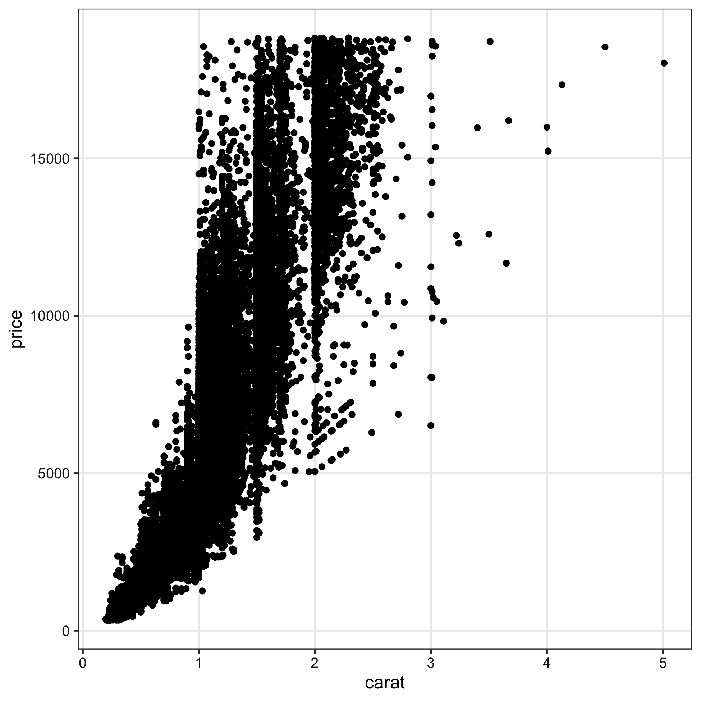
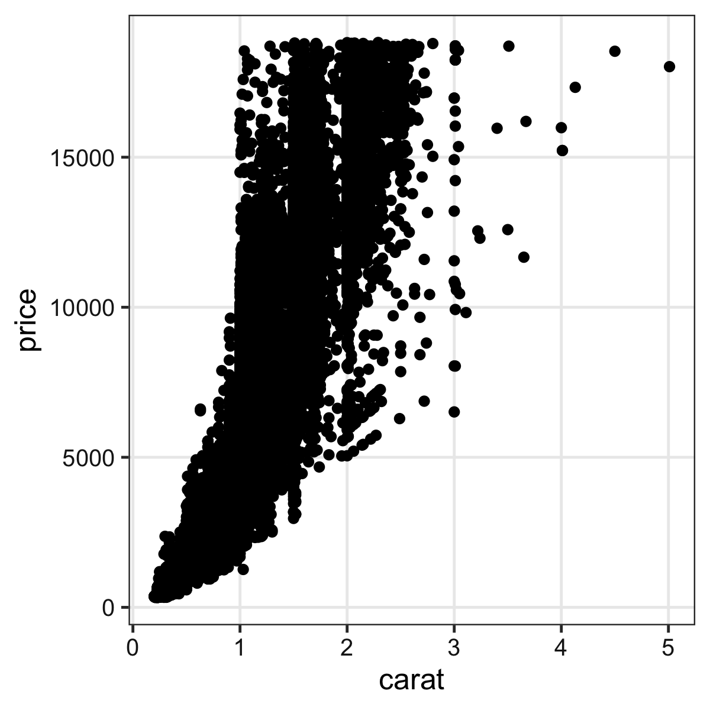
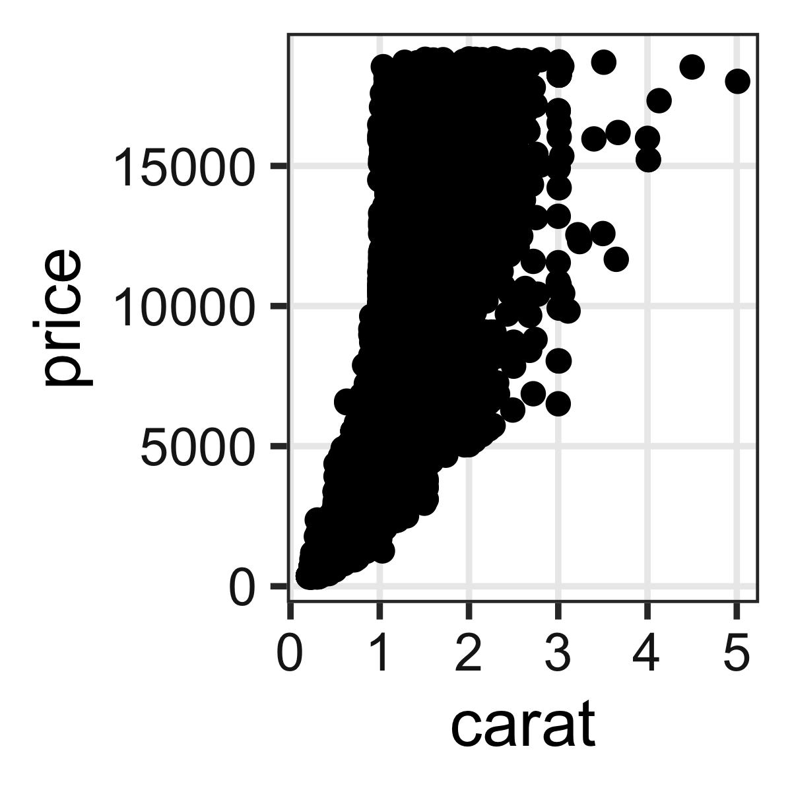
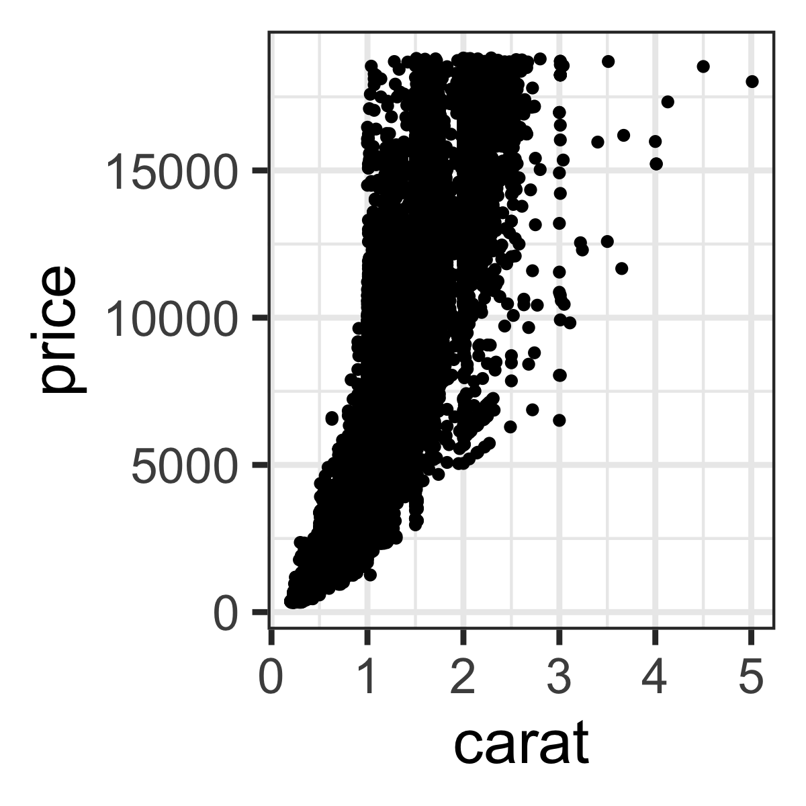

+++
url = "tohoku2026r/2-visualization.html"
linktitle = "データの可視化。"
title = "2. データの可視化。 — 進化学実習 2026 牧野研 東北大学"
date = 2026-04-08T14:40:00+09:00
draft = false
[params]
dev.css = "projector.css"
dpi = 108
+++

# [進化学実習 2026 牧野研 東北大学](.)

<div class="author">
岩嵜 航
</div>

<div class="affiliation">
東北大学 生命科学研究科 進化ゲノミクス分野 牧野研 特任助教
</div>

<ol>
<li><a href="1-introduction.html">導入: データ解析の全体像。Rの基本。</a>
<li class="current-deck"><a href="2-visualization.html">データの可視化。</a>
<li><a href="3-structure1.html">データ構造の処理1: 抽出、集約など。</a>
<li><a href="4-structure2.html">データ構造の処理2: 結合、変形など。</a>
<li><a href="5-content.html">データ内容の処理: 数値、文字列など。</a>
<li><a href="6-input.html">データ入力、レポート作成</a>
<li><a href="7-distribution.html">統計モデリング1: 確率分布、尤度</a>
<li><a href="8-glm.html">統計モデリング2: 一般化線形モデル</a>
<li><a href="9-report.html">発表会</a>
</ol>

<div class="footnote">
2026-04-08 東北大学 理学部生物学科 進化学実習<br>
<a href="https://heavywatal.github.io/slides/tohoku2026r/">https://heavywatal.github.io/slides/tohoku2026r/</a>
</div>


---
## データ解析のおおまかな流れ

1. コンピュータ環境の整備 ✅
1. データの取得、読み込み ⬜
1. 探索的データ解析
    - 前処理、加工 (地味。意外と重い) ⬜ 次回
    - **可視化、仮説生成** (派手！楽しい！) ⬜ 👈今回
    - 統計解析、仮説検証 (みんな勉強したがる) ⬜
1. 報告、発表 ⬜ Quarto楽しい

<figure>
<a href="https://r4ds.hadley.nz/intro">

<figcaption><small>https://r4ds.hadley.nz/intro</small></figcaption>
</a>
</figure>

---
## 要約統計量だけ見て可視化を怠ると構造を見逃す

<figure style="position: relative;">
<a href="https://www.research.autodesk.com/publications/same-stats-different-graphs/">

<figcaption><small>https://www.research.autodesk.com/publications/same-stats-different-graphs/</small></figcaption>
</a>

</figure>

---
## 作図してみると全体像・構造が見やすい

情報の整理 → **正しい解析・新しい発見・仮説生成**


`carat` が大きいほど `price` も高いらしい。\
その度合いは `clarity` によって異なるらしい。

---
## そうは言ってもセンスでしょ? --- NO!

<figure style="float: right; width: 670px;">
<a href="https://tsutawarudesign.com/">


<figcaption><small>https://tsutawarudesign.com/</small></figcaption>
</a>
</figure>

ある程度は**テクニック**であり**教養**。\
デザインの基本的なルールを\
知りさえすれば誰でも上達する。


---
## おしながき: Rによるデータ可視化

### ✅ <del>データ解析全体の流れ。可視化だいじ</del>

### ⬜ 一貫性のある文法で合理的に描けるggplot2


---
## `iris`: アヤメ属3種150個体の測定データ

Rに最初から入ってて、例としてよく使われる。


``` r
print(iris)
```

```
    Sepal.Length Sepal.Width Petal.Length Petal.Width   Species
  1          5.1         3.5          1.4         0.2    setosa
  2          4.9         3.0          1.4         0.2    setosa
  3          4.7         3.2          1.3         0.2    setosa
  4          4.6         3.1          1.5         0.2    setosa
 --                                                            
147          6.3         2.5          5.0         1.9 virginica
148          6.5         3.0          5.2         2.0 virginica
149          6.2         3.4          5.4         2.3 virginica
150          5.9         3.0          5.1         1.8 virginica
```

長さ150の数値ベクトル4本と因子ベクトル1本。

---
## R標準のグラフィックス

描けるっちゃ描けるけど。カスタマイズしていくのは難しい。


``` r
boxplot(Petal.Width ~ Species, data = iris)
plot(iris$Sepal.Length, iris$Sepal.Width)
hist(iris$Petal.Length)
```


きれいなグラフを簡単に描けるパッケージを使いたい。

---
## ggplot2: tidyverseの可視化担当

<a href="https://ggplot2.tidyverse.org/">

</a>

- "The <span class="mark-initial">Grammar</span> of <span class="mark-initial">Graphics</span>" という体系に基づく設計
- 単にいろんなグラフを「描ける」だけじゃなく\
  **一貫性のある文法で合理的に描ける**

<br>


---
## ggplot2: tidyverseの可視化担当

<a href="https://ggplot2.tidyverse.org/">

</a>

- "The <span class="mark-initial">Grammar</span> of <span class="mark-initial">Graphics</span>" という体系に基づく設計
- 単にいろんなグラフを「描ける」だけじゃなく\
  **一貫性のある文法で合理的に描ける**

<figure style="margin-block-start: 2em;">


<br>


<figcaption><small>Iwasaki and Innan (2017)</small></figcaption>
</figure>

---
## いきなりggplot2から使い始めても大丈夫

R標準のやつとは根本的に違うシステムで作図する。

<figure>

<figcaption><small>「<cite>Rグラフィックス</cite>」Murrell著 久保訳 より改変</small></figcaption>
</figure>

---
## 基本的な使い方: 指示を `+` で重ねていく


---
## 基本的な使い方: 指示を `+` で重ねていく


``` r
ggplot(data = diamonds)             # diamondsデータでキャンバス準備
# aes(x = carat, y = price) +       # carat,price列をx,y軸にmapping
# geom_point() +                    # 散布図を描く
# stat_smooth(method = lm) +        # 直線回帰を追加
# facet_wrap(vars(clarity)) +       # clarity列に応じてパネル分割
# coord_cartesian(ylim = c(0, 2e4)) + # y軸の表示範囲を狭く
# theme_classic(base_size = 20)     # クラシックなテーマで
```


---
## 基本的な使い方: 指示を `+` で重ねていく


``` r
ggplot(data = diamonds) +           # diamondsデータでキャンバス準備
  aes(x = carat, y = price)         # carat,price列をx,y軸にmapping
# geom_point() +                    # 散布図を描く
# stat_smooth(method = lm) +        # 直線回帰を追加
# facet_wrap(vars(clarity)) +       # clarity列に応じてパネル分割
# coord_cartesian(ylim = c(0, 2e4)) + # y軸の表示範囲を狭く
# theme_classic(base_size = 20)     # クラシックなテーマで
```


---
## 基本的な使い方: 指示を `+` で重ねていく


``` r
ggplot(data = diamonds) +           # diamondsデータでキャンバス準備
  aes(x = carat, y = price) +       # carat,price列をx,y軸にmapping
  geom_point()                      # 散布図を描く
# stat_smooth(method = lm) +        # 直線回帰を追加
# facet_wrap(vars(clarity)) +       # clarity列に応じてパネル分割
# coord_cartesian(ylim = c(0, 2e4)) + # y軸の表示範囲を狭く
# theme_classic(base_size = 20)     # クラシックなテーマで
```


---
## 基本的な使い方: 指示を `+` で重ねていく


``` r
ggplot(data = diamonds) +           # diamondsデータでキャンバス準備
  aes(x = carat, y = price) +       # carat,price列をx,y軸にmapping
  geom_point() +                    # 散布図を描く
  stat_smooth(method = lm)          # 直線回帰を追加
# facet_wrap(vars(clarity)) +       # clarity列に応じてパネル分割
# coord_cartesian(ylim = c(0, 2e4)) + # y軸の表示範囲を狭く
# theme_classic(base_size = 20)     # クラシックなテーマで
```


---
## 基本的な使い方: 指示を `+` で重ねていく


``` r
ggplot(data = diamonds) +           # diamondsデータでキャンバス準備
  aes(x = carat, y = price) +       # carat,price列をx,y軸にmapping
  geom_point() +                    # 散布図を描く
  stat_smooth(method = lm) +        # 直線回帰を追加
  facet_wrap(vars(clarity))         # clarity列に応じてパネル分割
# coord_cartesian(ylim = c(0, 2e4)) + # y軸の表示範囲を狭く
# theme_classic(base_size = 20)     # クラシックなテーマで
```


---
## 基本的な使い方: 指示を `+` で重ねていく


``` r
ggplot(data = diamonds) +           # diamondsデータでキャンバス準備
  aes(x = carat, y = price) +       # carat,price列をx,y軸にmapping
  geom_point() +                    # 散布図を描く
  stat_smooth(method = lm) +        # 直線回帰を追加
  facet_wrap(vars(clarity)) +       # clarity列に応じてパネル分割
  coord_cartesian(ylim = c(0, 2e4))   # y軸の表示範囲を狭く
# theme_classic(base_size = 20)     # クラシックなテーマで
```


---
## 基本的な使い方: 指示を `+` で重ねていく


``` r
ggplot(data = diamonds) +           # diamondsデータでキャンバス準備
  aes(x = carat, y = price) +       # carat,price列をx,y軸にmapping
  geom_point() +                    # 散布図を描く
  stat_smooth(method = lm) +        # 直線回帰を追加
  facet_wrap(vars(clarity)) +       # clarity列に応じてパネル分割
  coord_cartesian(ylim = c(0, 2e4)) + # y軸の表示範囲を狭く
  theme_classic(base_size = 20)     # クラシックなテーマで
```


---
## 基本的な使い方: 指示を `+` で重ねていく


``` r
ggplot(data = diamonds) +           # diamondsデータでキャンバス準備
  aes(x = carat, y = price) +       # carat,price列をx,y軸にmapping
  geom_point() +                    # 散布図を描く
# stat_smooth(method = lm) +        # 直線回帰を追加
# facet_wrap(vars(clarity)) +       # clarity列に応じてパネル分割
# coord_cartesian(ylim = c(0, 2e4)) + # y軸の表示範囲を狭く
  theme_classic(base_size = 20)     # クラシックなテーマで
```


---
## 途中経過オブジェクトを取っておける


``` r
p1 = ggplot(data = diamonds)
p2 = p1 + aes(x = carat, y = price)
p3 = p2 + geom_point()
p4 = p3 + facet_wrap(vars(clarity))
print(p3)
```


この `p3` は後で使います。

---
## ひとまずggplotしてみよう

自動車のスペックに関するデータ `mpg` を使って。


```
    manufacturer  model displ year cyl      trans drv cty hwy fl   class
  1         audi     a4   1.8 1999   4   auto(l5)   f  18  29  p compact
  2         audi     a4   1.8 1999   4 manual(m5)   f  21  29  p compact
 --                                                                     
233   volkswagen passat   2.8 1999   6 manual(m5)   f  18  26  p midsize
234   volkswagen passat   3.6 2008   6   auto(s6)   f  17  26  p midsize
```

🔰 排気量 `displ` と市街地燃費 `cty` の関係を散布図で。


---
## よくあるエラー

関数名を `ggplot2` と書いちゃうと勘違い:
```
> ggplot2(diamonds)
Error in ggplot2(diamonds) : could not find function "ggplot2"
```

**ggplot2** はパッケージ名。\
今度こそ関数名は合ってるはずなのに...
```
> ggplot(diamonds)
Error in ggplot(diamonds) : could not find function "ggplot"
```

パッケージ読み込みを忘れてた。新しくRを起動するたびに必要:
```r
library(conflicted) # 安全のおまじない
library(tidyverse)  # including ggplot2
ggplot(diamonds)    # OK!
```

そのほか [よくあるエラー集 (石川由希さん@名古屋大)](https://comicalcommet.github.io/r-training-2025/R_training_2025_7.html) を参照。


---
## `ggplot()` に渡すのは整然データ tidy data

- 1行は1つの観測
- 1列は1つの変数
- 1セルは1つの値
- この列をX軸、この列をY軸、この列で色わけ、と指定できる！


``` r
print(diamonds)
```

```
      carat       cut color clarity depth table price    x    y    z
    1  0.23     Ideal     E     SI2  61.5    55   326 3.95 3.98 2.43
    2  0.21   Premium     E     SI1  59.8    61   326 3.89 3.84 2.31
    3  0.23      Good     E     VS1  56.9    65   327 4.05 4.07 2.31
    4  0.29   Premium     I     VS2  62.4    58   334 4.20 4.23 2.63
   --                                                               
53937  0.72      Good     D     SI1  63.1    55  2757 5.69 5.75 3.61
53938  0.70 Very Good     D     SI1  62.8    60  2757 5.66 5.68 3.56
53939  0.86   Premium     H     SI2  61.0    58  2757 6.15 6.12 3.74
53940  0.75     Ideal     D     SI2  62.2    55  2757 5.83 5.87 3.64
```

<small><https://r4ds.hadley.nz/data-tidy.html>; <https://speakerdeck.com/fnshr/zheng-ran-detatutenani></small>


---
## Aesthetic mapping でデータと見せ方を紐付け

`aes()` の中で列名を指定する。


``` r
ggplot(diamonds) +
  aes(x = carat, y = price) +
  geom_point(mapping = aes(color = clarity, size = cut))
```


---
## データによらず一律でaestheticsを変える

`aes()` の外で値を指定する。


``` r
ggplot(diamonds) +
  aes(x = carat, y = price) +
  geom_point(color = "darkorange", size = 6, alpha = 0.4)
```


---
## 外の `aes()` は全ての `geom_*()` に波及する


``` r
ggplot(diamonds) +
  aes(x = carat, y = price) +
  geom_point(aes(color = clarity)) +
  geom_line()             # NO color
ggplot(diamonds) +
  aes(x = carat, y = price, color = clarity) +
  geom_point() +          # color
  geom_line()             # color
```


---
## [aesthetics一覧](https://ggplot2.tidyverse.org/articles/ggplot2-specs.html)

- [色・透明度を変える](https://ggplot2.tidyverse.org/reference/aes_colour_fill_alpha.html)
  - `color`: 点、線、文字の色
  - `fill`: 面の色
  - [`alpha`](https://ggplot2.tidyverse.org/reference/scale_alpha.html): 不透明度 (0が透明、1が不透明)
- [大きさ・形を変える](https://ggplot2.tidyverse.org/reference/aes_linetype_size_shape.html)
  - [`size`](https://ggplot2.tidyverse.org/reference/scale_size.html),
    [`shape`](https://ggplot2.tidyverse.org/reference/scale_shape.html): 点の大きさや形
  - [`linewidth`](https://ggplot2.tidyverse.org/reference/scale_linewidth.html),
    [`linetype`](https://ggplot2.tidyverse.org/reference/scale_linetype.html): 線の太さや種類
- [単にグループ分けする](https://ggplot2.tidyverse.org/reference/aes_group_order.html)
  - `group`: 折れ線グラフやポリゴンの切り分けなど
- [座標、始点、終点](https://ggplot2.tidyverse.org/reference/aes_position.html)
  - **`x`**, **`y`**, `xmin`, `xmax`, `ymin`, `ymax`, `xend`, `yend`


---
## 点と線と文字は `color`, 面は `fill`

不透明度は `alpha`


``` r
ggplot(diamonds) +
  aes(cut, carat) +
  geom_boxplot(color = "royalblue", fill = "gold", alpha = 0.5, linewidth = 2)
```


---
## 色の変え方の練習

自動車のスペックに関するデータ `mpg` を使って。


```
    manufacturer  model displ year cyl      trans drv cty hwy fl   class
  1         audi     a4   1.8 1999   4   auto(l5)   f  18  29  p compact
  2         audi     a4   1.8 1999   4 manual(m5)   f  21  29  p compact
 --                                                                     
233   volkswagen passat   2.8 1999   6 manual(m5)   f  18  26  p midsize
234   volkswagen passat   3.6 2008   6   auto(s6)   f  17  26  p midsize
```

🔰 排気量 `displ` と市街地燃費 `cty` の関係を青い散布図で描こう\
🔰 駆動方式 `drv` やシリンダー数 `cyl` によって色を塗り分けしてみよう


---
## 色の見え方は人によって違う

<span style="color: #F8766D;">赤</span>
<span style="color: #00BA38;">緑</span>
<span style="color: #619CFF;">青</span>の3色を使った先ほどの図は多くの人には問題なさそう。<br>
しかし5%くらいの人には右のように
<span style="color: #B6A86A;">赤</span>
<span style="color: #AC9C45;">緑</span>
<span style="color: #5A96FD;">青</span> や
<span style="color: #FF6074;">赤</span>
<span style="color: #00B5A0;">緑</span>
<span style="color: #00B2C1;">青</span>の2色に見えている。


MacやiOSなら[Sim Daltonism](https://michelf.ca/projects/sim-daltonism/)というアプリでシミュレーションできる。\
Windowsなら[Color Oracle](https://colororacle.org/)が使えそう。

---
## 多様性を前提によく考えられたパレットもある

Sequential palette:\


Diverging palette:\


Qualitative (categorical, discrete) palette:\


---
## 色パレットの変更 `scale_color_*()`

[viridis](https://cran.r-project.org/web/packages/viridis/vignettes/intro-to-viridis.html)
と
[ColorBrewer](https://colorbrewer2.org/#type=diverging&scheme=RdYlBu&n=5)
のパレットはggplot2に組み込まれているので簡単。\
上記リンクから名前を探して、`option =` か `palette =` で指定。


``` r
p = ggplot(diamonds) + aes(carat, price) +
    geom_point(mapping = aes(color = clarity))
p + scale_color_viridis_d(option = "inferno")                            + labs(title = "inferno")
p + scale_color_brewer(palette = "YlGnBu")                               + labs(title = "YlGnBu")
```


---
## 連続値(continuous)と離散値(discrete)を区別する

渡す値とscale関数が合ってないと怒られる:\
`Error: Continuous value supplied to discrete scale`


``` r
p = ggplot(diamonds) + aes(carat, price) +
    geom_point(mapping = aes(color = price))
p + scale_color_viridis_c(option = "inferno")                            + labs(title = "inferno")
p + scale_color_distiller(palette = "YlGnBu")                            + labs(title = "YlGnBu")
```


- discrete: `scale_color_viridis_d()`, `scale_color_brewer()`
- continuous: `scale_color_viridis_c()`, `scale_color_distiller()`
- binned: `scale_color_viridis_b()`, `scale_color_fermenter()`

---
## viridisやbrewer以外のパレットを使うには

R標準の `palette.colors()` や
[colorspaceパッケージ](https://colorspace.r-forge.r-project.org/articles/ggplot2_color_scales.html)
を使う。


``` r
p = ggplot(mpg) +
  aes(x = displ, y = cty) +
  geom_point(aes(color = drv), size = 4, alpha = 0.66)
p + scale_color_discrete(type = palette.colors(9L, "Okabe-Ito")[-1])     + labs(title = "Okabe-Ito")
p + scale_color_discrete(type = palette.colors(8L, "R4")[-1])            + labs(title = "R4")
p + colorspace::scale_colour_discrete_divergingx("Zissou 1")             + labs(title = "Zissou 1")
```


自分で全色個別指定もできるが、専門家の考えたセットを使うのが無難。


---
## `scale_color_*` を省略できるように設定可能

連続値viridis, 離散値Okabe-Itoをデフォルトにする例:
```r
grDevices::palette("Okabe-Ito")
theme_palette = ggplot2::theme(
  palette.colour.continuous = "viridis",
  palette.fill.continuous = "viridis",
  palette.colour.discrete = grDevices::palette()[-1],
  palette.fill.discrete = grDevices::palette()[-1]
)
ggplot2::theme_set(ggplot2::theme_get() + theme_palette)
```

`theme_set()` による設定はRを終了するまで有効。

スクリプトの先頭に書いておいて毎回設定することを推奨。

<hr>

`options(ggplot2.continuous.colour = "viridis")`
は古い(<4.0.0)。


---
## 値に応じてパネル切り分け (1変数facet)

ggplotの真骨頂！
これをR標準機能でやるのは結構たいへん。


``` r
p3 + facet_wrap(vars(clarity), ncol = 4L)
```


---
## 値に応じてパネル切り分け (≥2変数facet)

ggplotの真骨頂！
これをR標準機能でやるのは結構たいへん。


``` r
p3 + facet_grid(vars(clarity), vars(cut))
```


---
## 多変量データの俯瞰、5次元くらいまで有効


---
## 値に応じたfacetの練習

自動車のスペックに関するデータ `mpg` を使って。


```
    manufacturer  model displ year cyl      trans drv cty hwy fl   class
  1         audi     a4   1.8 1999   4   auto(l5)   f  18  29  p compact
  2         audi     a4   1.8 1999   4 manual(m5)   f  21  29  p compact
 --                                                                     
233   volkswagen passat   2.8 1999   6 manual(m5)   f  18  26  p midsize
234   volkswagen passat   3.6 2008   6   auto(s6)   f  17  26  p midsize
```

🔰 駆動方式 `drv` やシリンダー数 `cyl` によってfacetしてみよう


---
## 値を変えず座標軸を変える [`scale_*`](https://ggplot2.tidyverse.org/reference/#section-scales), [`coord_*`](https://ggplot2.tidyverse.org/reference/#section-coordinate-systems)


``` r
ggplot(diamonds) + aes(carat, price) + geom_point(alpha = 0.25) +
  scale_x_log10() +
  scale_y_log10(breaks = c(1, 2, 5, 10) * 1000) +
  coord_cartesian(xlim = c(0.1, 10), ylim = c(800, 12000)) +
  labs(title = "Diamonds", x = "Size (carat)", y = "Price (USD)")
```


---
## データと関係ない部分の見た目を調整 `theme`

[既存の `theme_*()`](https://ggplot2.tidyverse.org/reference/ggtheme.html)
をベースに、[`theme()`](https://ggplot2.tidyverse.org/reference/theme.html)関数で微調整。


``` r
p3 + theme_bw(base_size = 20) + theme(
  panel.background = element_rect(fill = "khaki"),      # 箱
  panel.grid       = element_line(color = "royalblue"), # 線
  axis.title.x     = element_text(size = 32),           # 文字
  axis.text.y      = element_blank()                    # 消す
)
```


---
## 基本的な使い方: 指示を `+` で重ねていく


---
## 論文のFigureみたいに並べる

別のパッケージ
([cowplot](https://wilkelab.org/cowplot/)
や
[patchwork](https://patchwork.data-imaginist.com/))
の助けを借りて


``` r
pAB = cowplot::plot_grid(p3, p3, labels = c("A", "B"), nrow = 1L)
cowplot::plot_grid(pAB, p3, labels = c("", "C"), ncol = 1L)
```


---
## ファイル名もサイズも再現可能な作図

`width`や`height`が小さいほど、文字・点・線が相対的に大きく

```r
# 7inch x 300dpi = 2100px四方 (デフォルト)
ggsave("dia1.png", p3) # width = 7, height = 7, dpi = 300
# 4     x 300    = 1200  全体7/4倍ズーム
ggsave("dia2.png", p3, width = 4, height = 4) # dpi = 300
# 2     x 600    = 1200  全体をさらに2倍ズーム
ggsave("dia3.png", p3, width = 2, height = 2, dpi = 600)
# 4     x 300    = 1200  テーマを使って文字だけ拡大
ggsave("dia4.png", p3 + theme_bw(base_size = 22), width = 4, height = 4)
```

<figure>




</figure>


---
## 日本語が◻️◻️◻️豆腐にならないための設定

環境設定 → General → Graphics → Backend: [**AGG**](https://ragg.r-lib.org/)


英数字以外を使わずに済ませられればそれに越したことはないけど...

---
## 他にどんな種類の `geom_*()` が使える？

なんでもある。
[公式サイト](https://ggplot2.tidyverse.org/reference/index.html)を見に行こう。

<figure>

</figure>

---

<figure style="margin: 0;">
<a href="https://ggplot2.tidyverse.org/">

<figcaption><small>https://ggplot2.tidyverse.org/</small></figcaption>
</a>
</figure>

---
## 微調整してくと最終的に長いコードになるね...

うん。でもすべての点について後から確認できるし、使い回せる！


``` r
p = ggplot(diamonds) +
  aes(price, cut) +
  geom_jitter(aes(color = cut), height = 0.2, width = 0, alpha = 0.1, stroke = 0) +
  geom_boxplot(fill = NA, outlier.shape = NA) +
  scale_color_viridis_d(option = "plasma") +
  facet_wrap(vars(clarity)) +
  coord_cartesian(xlim = c(0, 20000), ylim = c(0.5, 5.5), expand = FALSE) +
  labs(title = "Diamonds", x = "Cut", y = "Price (USD)") +
  theme_bw(base_size = 16) +
  theme(legend.position = "none",
        axis.ticks = element_blank(),
        panel.grid.major.y = element_blank(),
        panel.spacing.x = grid::unit(3, "lines"),
        plot.margin = grid::unit(c(1, 2, 0.5, 0.5), "lines"))
print(p)
ggsave("diamonds-cut-price.png", p, width = 12, height = 9)
```

---
## 発展的な内容

ggplot2を[さらに拡張するパッケージも続々](https://exts.ggplot2.tidyverse.org/)
: アニメーション [gganimate](https://gganimate.com/)
: 重なりを避けてラベル付け [ggrepel](https://ggrepel.slowkow.com/)
: グラフ/ネットワーク [ggraph](https://ggraph.data-imaginist.com/)
: 系統樹 [ggtree](https://github.com/YuLab-SMU/ggtree)
: 地図 [`geom_sf`](https://ggplot2.tidyverse.org/reference/ggsf.html#examples)
: 学術論文向けのいろいろ [ggpubr](https://github.com/kassambara/ggpubr)


ggplot2は3Dが苦手
: 本当に3Dが必要? 色分けやファセットで足りない?
: 別のパッケージでやる:
  [rgl](http://rgl.neoscientists.org/gallery.shtml),
  [plotly](https://plotly.com/r/3d-charts/), etc.


---
## 🔰 1日目の課題: 模写

下図になるべく似るように作図・調整してください。\
関数やオプションについてはggplot2公式サイトやチートシートを参考に。


細かい設定まで見逃さないように、**班で協力**しましょう。\
個人でレポートの採点をしたあと、**班ごとにボーナス**を加算します。


---
## おしながき: Rによるデータ可視化

<a href="https://ggplot2.tidyverse.org/">

</a>

### ✅ データ解析全体の流れ。可視化だいじ

### ✅一貫性のある文法で合理的に描けるggplot2

- aesthetic mapping が鍵
- 色覚多様性を意識
- 画像出力まできっちりプログラミング


---
## 今日の残り時間

- 班やTAに相談し、消化しきれなかった部分をなるべく解消する。
- 模写の課題を `ggsave()` まできっちりやる。
- TAが班の代表画像を評価し、合格した班から解散。
- 残ってほかの課題に取り組んでもOK。
- 遅くとも17:50には部屋を閉めたい。TAの給料は17:00まで。


---
## 参考

R for Data Science --- Hadley Wickham et al.
: <https://r4ds.hadley.nz>,
  [Paperback](https://amzn.to/4cpL6w8)
: [日本語版書籍(Rではじめるデータサイエンス)](https://amzn.to/2yyFRKt)

Other versions
: 「[Rにやらせて楽しよう — データの可視化と下ごしらえ](https://heavywatal.github.io/slides/nagoya2018/)」
   岩嵜航 2018
: 「[Rを用いたデータ解析の基礎と応用](https://comicalcommet.github.io/r-training-2025/)」
   石川由希 名古屋大学
: 「[Rによるデータ前処理実習](https://heavywatal.github.io/slides/tmd2024/)」
   岩嵜航 2024 東京医科歯科大

ggplot2公式ドキュメント
: https://ggplot2.tidyverse.org/

<a href="3-structure1.html" class="readmore">
3. データ構造の処理1: 抽出、集約など。
</a>
