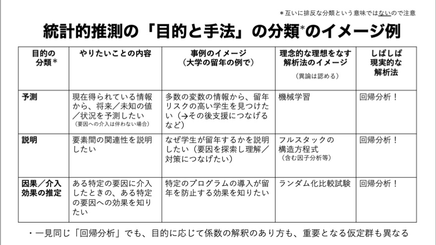

+++
url = "tokiomarine2021/1-introduction.html"
title = "1. 導入 — 統計モデリング概論 DSHC 2021"
linktitle = "導入"
date = 2021-06-30T09:30:00+09:00
type = "reveal"
draft = false
+++

<link rel="stylesheet" href="style.css">

# [統計モデリング概論 DSHC 2021](.)

<div class="author">
岩嵜 航 (Watal M. Iwasaki, PhD)
</div>

<div class="affiliation">
東北大学 生命科学研究科 進化ゲノミクス分野 特任助教<br>
(Graduate School of Life Sciences, Tohoku University)
</div>

<ol>
<li class="current-deck"><a href="1-introduction.html">導入</a>
<li><a href="2-stats-model.html">統計モデルの基本: 確率分布、尤度</a>
<li><a href="3-glm.html">一般化線形モデル、混合モデル</a>
<li><a href="4-bayesian.html">ベイズ推定、階層ベイズモデル</a>
</ol>

<div class="footnote">
2021-06-30 東京海上 Data Science Hill Climb
<a href="https://heavywatal.github.io/slides/tokiomarine2021/">https://heavywatal.github.io/slides/tokiomarine2021/</a>
</div>


---
## データを使ってやりたいこと

- 現象を**理解**したい
- 将来を**予測**したい
- ものを**分類・判別**したい
- 挙動を**制御**したい
- 新しい何かを**生成**したい

そのために解析は必要？
未加工の生データこそ宝？

???
よりよい職場に転職したい

---
## データ解析って必要？ 生データ見ればいいべ？

往々にして複雑過ぎ、情報多すぎ、そのままでは手に負えない


```r
print(ggplot2::diamonds)
```

```
      carat       cut color clarity depth table price     x     y     z
      <dbl>     <ord> <ord>   <ord> <dbl> <dbl> <int> <dbl> <dbl> <dbl>
    1  0.23     Ideal     E     SI2  61.5    55   326  3.95  3.98  2.43
    2  0.21   Premium     E     SI1  59.8    61   326  3.89  3.84  2.31
    3  0.23      Good     E     VS1  56.9    65   327  4.05  4.07  2.31
    4  0.29   Premium     I     VS2  62.4    58   334  4.20  4.23  2.63
   --                                                                  
53937  0.72      Good     D     SI1  63.1    55  2757  5.69  5.75  3.61
53938  0.70 Very Good     D     SI1  62.8    60  2757  5.66  5.68  3.56
53939  0.86   Premium     H     SI2  61.0    58  2757  6.15  6.12  3.74
53940  0.75     Ideal     D     SI2  62.2    55  2757  5.83  5.87  3.64
```

ダイヤモンド53,940個について10項目の値を持つデータセット

---
## 要約統計量を見てみよう

各列の**平均**とか**標準偏差**とか:


```
   stat carat depth table    price     x     y     z
  <chr> <dbl> <dbl> <dbl>    <dbl> <dbl> <dbl> <dbl>
1  mean  0.80 61.75 57.46  3932.80  5.73  5.73  3.54
2    sd  0.47  1.43  2.23  3989.44  1.12  1.14  0.71
3   max  5.01 79.00 95.00 18823.00 10.74 58.90 31.80
```

大きさ `carat` と価格 `price` の**相関係数**は 0.92 (かなり高い)。


<hr>

**生のままよりは把握しやすい**かも。

しかし要注意...

---
## 平均値ばかり見て可視化を怠ると構造を見逃す

<figure style="position: relative;">
<a href="https://www.autodeskresearch.com/publications/samestats">

<figcaption class="url">https://www.autodeskresearch.com/publications/samestats/</figcaption>
</a>

</figure>


---
## データ可視化は理解の第一歩

情報をうまく絞って整理 → **直感的にわかる**


`carat` が大きいほど `price` も高いらしい。<br>
その度合いは `clarity` によって異なるらしい。

---
## 統計とは

データをうまくまとめ、それに基づいて推論するための手法。

- **記述統計**: データそのものを要約する
    - 要約統計量 (e.g., 平均、標準偏差、etc.)
    - 作図、作表
- **推測統計**: データの背後にある母集団・生成過程を考える
    - 数理モデル
    - 確率分布
    - パラメータ(母数)

「グラフを眺めてなんとなく分かる」以上の分析には**モデル**が必要

---
## モデルとは

対象システムを単純化・理想化して扱いやすくしたもの

Mathematical Model 数理モデル
: 数学的な方程式として記述されるもの。
: e.g., Lotka-Volterra eq., <span style="color: #888;">Hill eq.</span>
: <br>

Computational Model 数値計算モデル
: 数値計算の手続きとして記述されるもの。
: e.g., Schelling’s Segregation Model, <span style="color: #888;"><em>tumopp</em></span>
: <br>

Concrete Model 具象モデル
: 具体的な事物で作られるもの。
: e.g., San Francisco Bay-Delta Model

<cite>
Weisberg 2012 "Simulation and Similarity" (科学とモデル)
</cite>

???
数理モデルが決定論的、数値計算が確率論的、になる場合が多いけど必ずしもそうではない。
解析的に解くことを諦めて計算機にやらせるという点で実装方法は異なるが、
数理的に記述して解釈するという大枠では同じとみなしたほうがいいかもしれない。

プラモデル: 車や飛行機の重さ・材質は無視して色や形を模倣


---
## データ科学における数理モデル

データ生成をうまく真似できそうな仮定の数式表現。<br>
&nbsp;

<figure>
<br>
<figcaption><cite>「データ分析のための数理モデル入門」江崎貴裕 2020 より改変</cite></figcaption>
</figure>


???

確率モデル: 決定論的なモデルじゃなくて確率論的なゆらぎを導入したもの。
ただし、大塚淳さんの定義は異なる。
帰納推論を可能にする枠組みとして自然の斉一性(ヒューム)を仮定した上で、
データを生成している真の現象を確率用語で記述したものが確率モデルだ、という感じ。
そこからさらに強い仮定としてパラメトリックな確率分布を生成元としたのが統計モデル。

---
## データ科学における数理モデル

データ生成をうまく真似できそうな仮定の数式表現。<br>
e.g., 大きいほど高く売れる: $\text{price} = A \times \text{carat} + B + \epsilon$


新しく採れたダイヤモンドの価格予想とかにも使える。

このように「YをXの関数として表す」ようなモデルを**回帰**と呼ぶ。


---
## 本講義の主題: 回帰

単純な直線あてはめから出発し、ちょっとずつ統計モデリング。

<figure>
<a href="https://kuboweb.github.io/-kubo/ce/LinksGlm.html">

<figcaption class="url">久保さん https://kuboweb.github.io/-kubo/ce/LinksGlm.html</figcaption>
</a>
</figure>

---
## 何でもかんでも直線あてはめではよろしくない


- 観察データは常に**正の値**なのに予測が負に突入してない？
- **縦軸は整数**。しかもの**ばらつき**が横軸に応じて変化？
- **データに合わせた統計モデルを使うとマシ**


---
## 回帰は教師あり機械学習の一種とも言える

<figure>

</figure>

でも統計モデリングはいわゆる“機械学習”とは違う気もする...?


---
## モデリングにおける2つのアプローチ

<figure>
<br>
<figcaption><cite>「データ分析のための数理モデル入門」江崎貴裕 2020 より改変</cite></figcaption>
</figure>

---
## どっちも知っておいて使い分けたい

項目       | 統計モデリング | 近年の機械学習
---------- | -------------- | ----------------
モデル構造 | 単純化したい | 性能のためなら複雑化
モデル解釈 | **ここが強み** | 難しい。重視しない。途上。
予測・生成 | うまくすれば頑健 | **主目的**。強力。高精度
データ量   | 少なくてもそれなり | 大量に必要
計算量     | 場合による  | 場合による
例 | 一般化線形モデル<br>階層ベイズモデル | ランダムフォレスト<br>ニューラルネットワーク

教科書的には概ねこんな感じとして、実際の仕事ではどうだろう？

---
## 現役データサイエンティスト2人に聞きました

- 「要因の効果はどれくらい？」<br>
  意思決定をするのは結局人間。物事を分かった上で判断したい。<br>
  **実務の人への説明**や**意思決定**の場面で解析の解釈性が重要。<br>
- 統計モデルはデータ加工など事前の手続きが多め。<br>
  機械学習は事前の決定が少ないので楽ちん。
- **仮説があるなら**、それに基づいて統計モデリング。<br>
  何もないところからまず機械学習で要因抽出・仮説生成するのもあり。
- 統計モデル縛り・実行環境縛りなどの案件もある。
- 分析方針を決める立場の上級職になるつもりなら統計モデルも必要。

協力: [`@kato_kohaku`](https://twitter.com/kato_kohaku)さん、[`@teuder`](https://twitter.com/teuder)さん


---
## 理想的じゃなくてもしばしば有用な回帰

<figure>
<a href="https://twitter.com/takehikohayashi/status/1408338198795669507">

<figcaption class="url">@takehikohayashi Jun 25, 2021</figcaption>
</a>
</figure>


---
## 本講義のお品書き

<figure style="float: right;">
<a href="https://kuboweb.github.io/-kubo/ce/IwanamiBook.html">

</a>
</figure>

久保先生の"緑本"こと<br>
「データ解析のための統計モデリング入門」<br>
をベースに回帰分析の概要を紹介。

1. イントロ←いまここ
1. 統計モデルの基本
    - 確率変数・**確率分布** 👈 本日の主役
    - 尤度・最尤推定
1. 一般化線形モデル、混合モデル
1. ベイズ統計、階層ベイズモデル

回帰のキモは**線ではなく分布**


---
## 参考文献

- [データ解析のための統計モデリング入門](https://amzn.to/33suMIZ) 久保拓弥 2012
- [StanとRでベイズ統計モデリング](https://amzn.to/3uwx7Pb) 松浦健太郎 2016
- [RとStanではじめる ベイズ統計モデリングによるデータ分析入門](https://amzn.to/3o1eCzP) 馬場真哉 2019
- [データ分析のための数理モデル入門](https://amzn.to/3uCxTKo) 江崎貴裕 2020
- [分析者のためのデータ解釈学入門](https://amzn.to/3uznzCK) 江崎貴裕 2020
- [統計学を哲学する](https://amzn.to/3ty80Kv) 大塚淳 2020
- [科学とモデル---シミュレーションの哲学 入門](https://amzn.to/2Q0f6JQ) Michael Weisberg 2017<br>
  (原著: [Simulation and Similarity](https://amzn.to/3bdvhuI) 2013)

<a href="2-stats-model.html" rel="next" class="readmore">
2. 統計モデルの基本: 確率分布、尤度
</a>
