+++
url = "tokiomarine2021/4-bayesian.html"
title = "4. ベイズ推定、階層ベイズモデル — 統計モデリング概論 DSHC 2021"
linktitle = "ベイズ推定、階層ベイズモデル"
date = 2021-06-30T15:00:00+09:00
type = "reveal"
draft = false
+++

<link rel="stylesheet" href="style.css">

# [統計モデリング概論 DSHC 2021](.)

<div class="author">
岩嵜 航 (Watal M. Iwasaki, PhD)
</div>

<div class="affiliation">
東北大学 生命科学研究科 進化ゲノミクス分野 特任助教<br>
(Graduate School of Life Sciences, Tohoku University)
</div>

<ol>
<li><a href="1-introduction.html">導入</a>
<li><a href="2-stats-model.html">統計モデルの基本: 確率分布、尤度</a>
<li><a href="3-glm.html">一般化線形モデル、混合モデル</a>
<li class="current-deck"><a href="4-bayesian.html">ベイズ推定、階層ベイズモデル</a>
</ol>

<div class="footnote">
2021-06-30 東京海上 Data Science Hill Climb
<a href="https://heavywatal.github.io/slides/tokiomarine2021/">https://heavywatal.github.io/slides/tokiomarine2021/</a>
</div>


---
## コイントス4回、たまたま表が1回だったら

<div class="column-container">
  <div class="column" style="flex-shrink: 1.0;">

最尤推定
: 推定結果は最も尤もらしい1点。
: データが少ないとき過剰適合気味。
: 表が出る確率 p = 0.25 のコインだろう。<br>
  (信じ難いけどデータはこう言っている)

<br>

ベイズ推定
: 推定結果は確率分布そのもの。
: データが少ないなりの不確実さも表現。
: p = 0.25 らへんである確率は高いが、<br>
  p = 0.6 とかである可能性もまあある。

  </div>
  <div class="column" style="flex-shrink: 1.4;">


  </div>
</div>


---
## コイントスの回数が増えていったら

**最尤推定**: 推定値が真の値に近づいていく


**ベイズ推定**: 確率分布がどんどん尖り、確信が強まる


---
## 確率おさらい

同時分布/結合確率: <span style="font-weight: normal;"> <span style="color: #E69F00;">A</span>かつ<span style="color: #0072B2;">B</span>の確率</span>
: $\text{Prob}(\textcolor{#E69F00}{A}, \textcolor{#0072B2}{B}) = \text{Prob}(\textcolor{#E69F00}{A} \cap \textcolor{#0072B2}{B}) = \text{Prob}(\textcolor{#E69F00}{A}) \text{Prob}(\textcolor{#0072B2}{B})$

周辺確率: <span style="font-weight: normal;"> <span style="color: #0072B2;">B</span>によらず<span style="color: #E69F00;">A</span>になる確率</span>
: $\text{Prob}(\textcolor{#E69F00}{A}) = \sum_{\textcolor{#0072B2}{B}} \text{Prob}(\textcolor{#E69F00}{A}, \textcolor{#0072B2}{B})$

条件付き確率: <span style="font-weight: normal;"> <span style="color: #0072B2;">B</span>である条件の下で<span style="color: #E69F00;">A</span>になる確率。重要。</span>
: $\text{Prob}(\textcolor{#E69F00}{A} \mid \textcolor{#0072B2}{B}) = \frac {\text{Prob}(\textcolor{#E69F00}{A}, \textcolor{#0072B2}{B})} {\text{Prob}(\textcolor{#0072B2}{B})}$


---
## 条件付き確率がよくわかる具体例

<span style="color: #0072B2;">B Brewery</span>のビールが<span style="color: #E69F00;">Awesome</span>な確率
: $\text{Prob}(\textcolor{#E69F00}{\text{Awesome}} \mid \textcolor{#0072B2}{\text{B Brewery}}) = \frac {\text{Prob}(\textcolor{#E69F00}{\text{Awesome}},~\textcolor{#0072B2}{\text{B Brewery}})} {\text{Prob}(\textcolor{#0072B2}{\text{B Brewery}})}$
: かなり高い確率。良い醸造所。

<span style="color: #E69F00;">Awesome</span>なビールが<span style="color: #0072B2;">B Brewery</span>のものである確率
: $\text{Prob}(\textcolor{#0072B2}{\text{B Brewery}} \mid \textcolor{#E69F00}{\text{Awesome}}) = \frac {\text{Prob}(\textcolor{#E69F00}{\text{Awesome}},~\textcolor{#0072B2}{\text{B Brewery}})} {\text{Prob}(\textcolor{#E69F00}{\text{Awesome}})}$
: かなり低い確率。Awesomeなビールはほかにもたっくさんある。


---
## ベイズの定理

乗法定理
: $\text{Prob}(\textcolor{#E69F00}{A},~\textcolor{#0072B2}{B}) = \text{Prob}(\textcolor{#E69F00}{A} \mid \textcolor{#0072B2}{B})~\text{Prob}(\textcolor{#0072B2}{B}) = \text{Prob}(\textcolor{#0072B2}{B} \mid \textcolor{#E69F00}{A})~\text{Prob}(\textcolor{#E69F00}{A})$

<a href="https://en.wikipedia.org/wiki/Thomas_Bayes">
</a>

移項するだけで**ベイズの定理**:


宴会場にビールが運ばれてきた。これはどこのブルワリーの？

事前確率: $\text{Prob}(\textcolor{#0072B2}{B})$
: 飲む前、手元のビールが<span style="color: #0072B2;">B Brewery</span>のである確率。
: ↓ 🍻 飲んでみて更新

事後確率: $\text{Prob}(\textcolor{#0072B2}{B} \mid \textcolor{#E69F00}{A})$
: 飲んでみて<span style="color: #E69F00;">Awesome</span>だったビールが
  <span style="color: #0072B2;">B Brewery</span>のである確率。


---
## ベイズの定理 in 感染症検査

- 有病率 $\text{Prob}(M)$ : 0.3% (この地域の感染者の割合; 事前確率)
- 感度 $\text{Prob}(P \mid M)$ : 90% (感染してる人に陽性判定が出る)
- 特異度 $\text{Prob}(N \mid \overline{M})$: 99% (感染してない人に陰性判定が出る)

$\text{Prob}(M \mid P)$ 真陽性率(検査陽性の人が実際に感染者である確率)は？

<div>\[\begin{split}
\text{Prob}(M \mid P)
  &= \frac {\text{Prob}(P \mid M)~\text{Prob}(M)} {\text{Prob}(P)} \\
  &= \frac {\text{Prob}(P \mid M)~\text{Prob}(M)}
           {\text{Prob}(P \mid M)~\text{Prob}(M) + (1 - \text{Prob}(N \mid \overline{M}))~\text{Prob}(\overline{M})} \\
  &= \frac {0.9 \times 0.003} {0.9 \times 0.003 + 0.01 \times 0.997} \approx 0.21
\end{split}\]</div>

感染者を隔離するスクリーニング目的では使いものにならない性能。

🔰 同様に $\text{Prob}(\overline{M} \mid N)$ 真陰性率を計算してみよう<br>
🔰 計算結果が検査性能だけでなく有病率にも依存することを確認しよう


---
## ベイズの定理 in 統計モデリング

<p>

</p>

モデル$M$に対する確信度合いをデータ$D$に基づいて更新する。<br>
モデル$M$を仮説$H$やパラメータ$\theta$に置き換えてもいい。

**周辺尤度**は「確率分布の積分は1」を満たすための正規化定数とみなせる。<br>
比例関係だけ抜き出してこう書くことが多い:
<div>\[\begin{split}
\text{Prob}(M \mid D) &\propto \text{Prob}(D \mid M)~\text{Prob}(M) \\
\text{Prob}(H \mid D) &\propto \text{Prob}(D \mid H)~\text{Prob}(H) \\
\text{Prob}(\theta \mid D) &\propto \text{Prob}(D \mid \theta)~\text{Prob}(\theta)
\end{split}\]</div>


---
## 表が出る確率のベイズ推定: 1. 事前分布

コイントスを繰り返して、表が出る確率pをベイズ推定したい。

事前分布には**ベータ分布**を採用(理由は後で分かる):
<div>\[\begin{split}
\text{Beta}(p \mid a, b) =
   \frac{\Gamma(a + b)}{\Gamma(a) \Gamma(b)} p^{a-1} (1 - p)^{b-1}
\end{split}\]</div>

分布の形は $a,~b$ によって決まる。<br>
ガンマ関数の部分は厳つく見えるけどただの正規化定数。<br>
投げる前なのでとりあえず真っ平らを仮定 $\text{Beta}(p \mid a = 1, b = 1)$:


---
## 表が出る確率のベイズ推定: 2. 尤度関数

4回投げて表が1回だった、というデータで**尤度**を計算(**二項分布**):
<div>\[\begin{split}
\text{Binom}(1 \mid 4,~p) = \binom {1} {4} p^{1} (1 - p)^{3}
\end{split}\]</div>

これに事前分布を掛けて正規化したら事後分布になるはず。

<div class="column-container">
  <div class="column" style="flex-shrink: 2.0;">


  </div>
  <div class="column" style="flex-shrink: 4.0; padding-top: 3rem;">
  ⨉
  </div>
  <div class="column" style="flex-shrink: 1.0;">
<p>

</p>
  </div>
</div>


---
## 表が出る確率のベイズ推定: 3. 事後分布

なんと、事後分布もベータ分布になる。

<div>\[\begin{split}
\text{Posterior}
  &\propto \text{Binom}(1 \mid 4,~p) \times \text{Beta}(p \mid  1, 1)\\
  &= \binom {1} {4} p^{1} (1 - p)^{3} \times
     \frac{\Gamma(1 + 1)}{\Gamma(1) \Gamma(1)} p^{1-1} (1 - p)^{1-1} \\
  &= C p^{2-1} (1 - p)^{4-1} \\
  &= \text{Beta}(p \mid 2, 4)
\end{split}\]</div>

ベータ分布の形パラメータ$a$が表、$b$が裏の回数分だけ増加。

<div class="column-container">
  <div class="column" style="flex-shrink: 1.0;">


  </div>
  <div class="column" style="flex-shrink: 4.0; padding-top: 3rem;">
  $\propto$
  </div>
  <div class="column" style="flex-shrink: 1.0">
<p>

</p>
  </div>
  <div class="column" style="flex-shrink: 4.0; padding-top: 3rem;">
  ⨉
  </div>
  <div class="column" style="flex-shrink: 1.0;">
<p>

</p>
  </div>
</div>


---
## 表が出る確率のベイズ推定: 4. 逐次学習

さっきの事後分布を事前分布として、さらにデータを集める。

コイントス4回のうち表1回、に基づく**事前分布**: $\text{Beta}(p \mid 2,~4)$

さらに16回投げたら表が7回、の**尤度**: $\text{Binomial}(7 \mid 16,~p)$

**事後分布**はまた事前分布と同じ形になる:

<div>\[\begin{split}
\text{Beta}(p \mid 9, 13) \propto
  \text{Binomial}(7 \mid 16,~p) \times \text{Beta}(p \mid 2, 4)
\end{split}\]</div>

データを加えるたびに更新していける:


---
## 共役事前分布

事後分布が事前分布と同じ形なので計算しやすい、という組み合わせ。

| 尤度関数 | 共役事前分布 |
| ---------- | ------------ |
| 二項分布 | ベータ分布 |
| ポアソン分布 | ガンマ分布 |
| 正規分布 | ガンマ分布 |
| 正規分布 (分散既知) | 正規分布 |

共役事前分布を使うことが常に正しいとも限らない。<br>
計算コストがかかっても**無情報事前分布**を使う風潮。

---
## 事後分布を用いた推定

<div class="column-container">
  <div class="column" style="flex-shrink: 1.0;">

区間推定
: 幅のある推定値を提示
: e.g., 95%ベイズ確信区間<br>
  (等裾事後信用区間, 最高密度区間)

点推定
: 値を1点だけ提示
: e.g., MAP, MED, EAP

  </div>
  <div class="column" style="flex-shrink: 1.3;">


  </div>
</div>

コイン投げモデルのベータ分布は美しい例。<br>
→ 解析的(数学的)に解ける。

実践的なモデル・事後分布はもっと複雑。<br>
→ コンピュータに頼って数値計算: MCMC

???

- 95%ベイズ確信区間 (credible interval): 真の値が95%の確率で含まれる区間。
- 等裾事後信用区間 (equal-tailed interval): 両端から2.5%ずつ削る
- 最高密度区間 (highest density interval): 分布密度に閾値を設ける
- 事後中央値 (Posteriori <u>Med</u>ian: MED)
- 事後期待値 (<u>E</u>xpected <u>A</u> <u>P</u>osteriori: EAP)
- 事後確率最大値 (<u>M</u>aximum <u>A</u> <u>P</u>osteriori: MAP)

信頼区間 (confidence interval)
頻度主義の考え方に基づいていて、解釈が難しい。
「標本抽出を100回繰り返すとそのうちの95回はその区間に母平均が含まれる」
真の値は1つに定まっていて、不確実性は有限のサンプリングに由来する。


---
## MCMC: <u>M</u>arcov <u>C</u>hain <u>M</u>onte <u>C</u>arlo

<a href="https://en.wikipedia.org/wiki/Andrey_Markov">
</a>

マルコフ連鎖
: 次の時点の挙動が現在の値だけで決定されるような確率過程。
: $\ldots \to X_{t - 2} \to X_{t - 1} \to X_{t} \to X_{t + 1}$
: $\text{Prob}(X_{t+1} \mid X_{t}, X_{t-1}, X_{t-2}, \ldots) = \text{Prob}(X_{t+1} \mid X_{t})$
: e.g., すごろく

モンテカルロ法
: 乱数を用いた計算方法の総称。
: <a href="https://en.wikipedia.org/wiki/Monte_Carlo_Casino">
  </a>
  <a href="https://en.wikipedia.org/wiki/Stanislaw_Ulam">
  </a>
  <a href="https://en.wikipedia.org/wiki/John_von_Neumann">
  </a>
  <a href="https://en.wikipedia.org/wiki/Nicholas_Metropolis">
  </a>

???
スタニスワフ・ウラムがソリテアの成功率を考えてた時に思いついて、
同僚のジョン・フォン・ノイマンが計算機上での実用まで持ってった。
モナコ公国のモンテカルロ地区に国営カジノがあって、
ウラムの叔父がそこで負けて親戚から借金したことにちなんで
同僚のニコラス・メトロポリスが命名したらしい。

マルコフ連鎖
: マルコフ過程のうち、離散的な時間を考えるもの。

マルコフ過程
: マルコフ性を持つ確率過程

マルコフ性
: 次の時点の挙動が現在の値だけで決定され、過去の値と無関係


最適化ではなくサンプリング法


---
## モンテカルロ法は乱数を用いた計算方法

e.g., 半径1の円の面積

面積4の正方形に400個の一様乱数を打ち込んだら318個乗った:<br>
$4 \times \frac {318} {400} = 3.18$


数学を知っていれば $\pi r ^ 2 \approx 3.14$

---
## 変な分布もモンテカルロ法で扱えそう

e.g., 確率密度分布に従って変数Xを集める(棄却サンプリング)。


でも、ハズレの値もけっこう引いてしまう。


---
## 次元の呪い: 高次元になるほど当たりにくくなる

(N次元球の体積 / N次元の立方体) はゼロに近づいていく。


- 2次元: $\frac {\pi r ^ 2} {(2r) ^ 2} = \frac \pi 4 \approx 0.79$
- 3次元: $\frac {\frac 4 3 \pi r ^ 3} {(2r) ^ 3} = \frac \pi 6 \approx 0.52$
- N次元: $\frac {\frac {\pi ^ {N/2}} {\Gamma (N/2 + 1)} r ^ N} {(2r) ^ N} = \frac {\pi ^ {N/2}} {2^N \Gamma (N/2 + 1)} \to 0$

パラメータが増えると計算量(≈乱数の無駄撃ち)が急増。

<hr>

密度の高い「当たり」付近を効率よく探索したい。<br>
「当たり」は「当たり」の近くにありがちだろう。<br>
→ マルコフ連鎖が使えそう


---
## Metropolis--Hastings法 (MH法)

0.  パラメータ $\theta$ の初期値を選ぶ
1.  $\theta$ をちょっと増減させて $\theta_\text{new}$ を作る
2.  それぞれ尤度を計算し、比較。
    - $L(\theta_\text{new}) \ge L(\theta)$ なら $\theta_\text{new}$ を即採択
    - $L(\theta_\text{new}) < L(\theta)$ でも
      確率 $r = \frac {L(\theta_\text{new})} {L(\theta)}$ で  $\theta_\text{new}$ を採択
3.  $\theta_\text{new}$ が採択されたら $\theta$ を更新。手順1に戻る。


---
## 採択されたパラメータ値の軌跡

尤度が高い方にただ向かうだけでなく、結構うろつく。<br>
通ったパラメータ値を集めるといい感じの分布が得られる。


---
## 尤度に比例する事後分布からサンプルしたのと等価

全体にばら撒く棄却サンプリングよりも効率よく集められる。<br>
が、パラメータ1つの1次元ではご利益はわかりにくい。


パラメータが複数ある場合は？

???
これは「コイン10回投げて6回表。表の出る確率pは？」という簡単なモデル。


---
## Gibbs Sampling

パラメータが複数の場合「ほかを固定してひとつ更新」を繰り返す。

e.g., 二次元正規分布。(-2, 2) からスタート。


---
## 中間まとめ

- ベイズ推定では不確実性も表現できる。
- コンピュータに頼った計算方法としてのモンテカルロ法。
- 多次元でも効率よくサンプルするためのMCMC。

<hr>

ここから、実行するにあたっての注意点を見ていく。


---
## 何回やっても似たような結果になってほしい

乱数や初期値によって偶々、じゃないことを確認したい。

e.g., `chains = 3, iter = 600` 。ほぼ同じところをうろうろ:


収束(convergence)の判定については後ほど。

---
## 初期値の影響が消えるまでウォーミングアップ

定常分布の山に到達してからが本番。

e.g., `iter = 600, warmup = 200` で灰色の部分を捨てる:


どれくらい長く捨てるべきかは場合による。


---
## 適度に間引いて自己相関を軽減したい

直前の値と似すぎていたら独立サンプルとして扱えないので。

e.g., `thin = 5` で5回に1回だけサンプルする:


間引かなくても大丈夫な場合も、間引いても解決しない場合もある。


---
## 収束判定

- 複数chains・複数初期値で実行し、軌跡や分布を可視化
- Gelman-Rubin統計量 $\hat R < 1.05$
- Effective Sample Size (ESS) $N_\text{eff} > 100$ per chain


```
Warning: The largest R-hat is ***, indicating chains have not mixed.
Warning: Bulk Effective Samples Size (ESS) is too low, indicating posterior means and medians may be unreliable.
Warning: Tail Effective Samples Size (ESS) is too low, indicating posterior variances and tail quantiles may be unreliable.
Running the chains for more iterations may help. See
http://mc-stan.org/misc/warnings.html
```

???
https://ill-identified.hatenablog.com/entry/2020/05/21/001158


---
## 収束・自己相関が悪い場合にどう改善するか

- 小手先の対処
    - warmupとiterをもっと長くする
    - thinを大きくして間引く
- ちょっと大掛かり
    - モデルを見直す
    - プログラムを見直す
    - アルゴリズム・ソフトウェアを変える

---
##  MCMCの方法いろいろ

採択率を高め、早く収束するように改良されてきている。

- Metropolis--Hastings法
    - Gibbs Sampling
    - Hamiltonian Monte Carlo (HMC)
        - No-U-Turn Sampler (NUTS)


---
## MCMCソフトウェア

- [BUGS](https://www.mrc-bsu.cam.ac.uk/software/bugs/)
    - クローズドソースで、ほぼWindows専用。
- [JAGS](https://mcmc-jags.sourceforge.io/)
    - オープンソースで、さまざまなOS・言語から利用可能。
    - マニュアルや用例が不足。
- [**Stan**](https://mc-stan.org/) 👈
    - オープンソースで、さまざまなOS・言語から利用可能。
    - 開発も利用も活発。マニュアルや用例も充実。
    - HMC/NUTSにより早く収束。
- [PyMC3](https://docs.pymc.io/)
- [NumPyro](https://num.pyro.ai/)
- [TensorFlow Probability](https://www.tensorflow.org/probability/)


---
## Stan

<a href="https://mc-stan.org/">

</a>

- Stan言語でモデルを書く
- C++を介して機械語に翻訳(コンパイル)するので高速
- RやPythonなどから呼び出して使うのが便利

大部分はRで説明し、部分的にPythonでの練習を挟みます。<br>

聞きながら手元で[tokiomarine2021-stan.ipynb](tokiomarine2021-stan.ipynb)を実行してもいいです。

```r
# install.packages("rstan")
library(rstan)
rstan_options(auto_write = TRUE)
```

---
## おおまかな流れ

```r
# データ準備
mydata

# Stan言語で書いたモデルをコンパイル
model = rstan::stan_model(file = "model.stan")

# MCMCサンプリング
fit = rstan::sampling(model, data = mydata)

# 結果を眺める
print(fit)
rstan::stan_trace(fit)
rstan::stan_hist(fit)
rstan::stan_ac(fit)
```


---
## 説明変数なしのベイズ推定: データ準備

表が出る確率 $p=0.7$ のイカサマコインをN回投げたデータを作る。<br>
この $p$ をStanで推定してみよう。


```r
true_p = 0.7
N = 40L
data = list(N = N, x = rbinom(N, 1, true_p))
print(data)
```

```
$N
[1] 40

$x
 [1] 0 0 1 0 1 1 0 1 1 0 1 0 0 1 1 0 0 1 1 1 0 1 0 0 1 1 1 0 1 0 0 0 1 1 1 0 1 1 0 1
```

Rならlist型、Pythonならdict型にまとめてStanに渡す。


---
## 説明変数なしのベイズ推定: Stan言語でモデル定義

文字列として保持するか、別ファイルに書いておく:


```
data {
  int<lower=0> N;
  int x[N];
}

parameters {
  real<lower=0,upper=1> p;
}

model {
  x ~ binomial(1, p);
}
```

- いくつかのブロックに分けて記述する:<br>
  R/Pythonから受け取る `data`, 推定する `parameter`, 本体の `model`.
- 整数型 `int`, 実数型 `real`, それらの配列がある。
- 下限 `lower`, 上限 `upper` を設定できる。


---
## Stan言語の7種のブロック

順番厳守。よく使うのは**太字のやつ**。

1. `functions {...}`
1. **`data {...}`**
1. `transformed data {...}`
1. **`parameters {...}`**
1. `transformed parameters {...}`
1. **`model {...}`**
1. `generated quantities {...}`

<https://mc-stan.org/docs/reference-manual/overview-of-stans-program-blocks.html>


---
## 説明変数なしのベイズ推定: MCMCサンプル

予め実行速度の速い機械語に翻訳(コンパイル):


```r
model = rstan::stan_model("binom.stan")
```

これに結構時間がかかるので、変更が無ければ再利用するため先ほど
`rstan_options(auto_write = TRUE)` しておいた。

<hr>

モデルとデータを使ってMCMCサンプリング:


```r
fit = rstan::sampling(model, data = data)
```

いろいろオプションはあるけどとりあえずデフォルトで:<br>
`chains = 4`, `iter = 2000`, `warmup = floor(iter/2)`, `thin = 1`, ...

問題があったら実行終了時に警告してくれるので**ちゃんと読む**。

---
## 説明変数なしのベイズ推定: 結果を眺める

$\hat R$ もほぼ1で $N_\text{eff}$ も大きいのでよさそう。<br>
念のため trace plot も確認しておこう。


```r
print(fit)
```

```
Inference for Stan model: binom.
4 chains, each with iter=2000; warmup=1000; thin=1; 
post-warmup draws per chain=1000, total post-warmup draws=4000.

       mean se_mean   sd   2.5%    25%    50%    75%  97.5% n_eff Rhat
p      0.55    0.00 0.08   0.39   0.50   0.55   0.60   0.69  1651    1
lp__ -29.45    0.02 0.76 -31.61 -29.61 -29.16 -28.97 -28.92  1262    1

Samples were drawn using NUTS(diag_e) at Tue Jul  6 17:58:10 2021.
For each parameter, n_eff is a crude measure of effective sample size,
and Rhat is the potential scale reduction factor on split chains (at 
convergence, Rhat=1).
```

乱数を使った計算なので(乱数シードを固定しない限り)毎回変わる。


---
## 説明変数なしのベイズ推定: trace plot 確認

どのchainも似た範囲を動いていて、しっかり毛虫っぽい:


```r
rstan::stan_trace(fit)
```


---
## 説明変数なしのベイズ推定: 自己相関の確認

2--3ステップくらいで自己相関がほぼ消えるので問題なし:


```r
rstan::stan_ac(fit, pars = c("p"))
```


---
## 説明変数なしのベイズ推定: 推定結果確認

サンプルサイズNが小さいせいか裾野の広い推定結果。<br>
真の$p$の値も含まれている:


```r
rstan::stan_hist(fit, bins = 30)
```


次はもう少しだけ複雑な例を見てみよう。

---
## 線形回帰のベイズ推定: データ準備

<a href="https://allisonhorst.github.io/palmerpenguins/">
<cite>https://allisonhorst.github.io/palmerpenguins/</cite><br>


</a>


---
## 線形回帰のベイズ推定: データ準備

<a href="https://allisonhorst.github.io/palmerpenguins/">
<cite>https://allisonhorst.github.io/palmerpenguins/</cite><br>


</a>

`Stan does not support NA` と怒られるので欠損値を取り除いておく:


```
List of 3
 $ body_mass_g      : int [1:342] 3750 3800 3250 3450 3650 3625 4675 3475 4250 3300 ...
 $ flipper_length_mm: int [1:342] 181 186 195 193 190 181 195 193 190 186 ...
 $ N                : int 342
```

---
## 単回帰のベイズ推定: Stan言語でモデル定義

切片、傾き、ばらつきを推定する:


```
data {
  int<lower=0> N;
  vector<lower=0>[N] body_mass_g;
  vector<lower=0>[N] flipper_length_mm;
}

parameters {
  real intercept;
  real slope;
  real<lower=0> sigma;
}

model {
  flipper_length_mm ~ normal(intercept + slope * body_mass_g, sigma);
}
```


---
## 単回帰のベイズ推定: MCMCサンプル

予め実行速度の速い機械語に翻訳(コンパイル):


```r
model = rstan::stan_model("penguins.stan")
```

モデルとデータを使ってMCMCサンプリング:


```r
fit = rstan::sampling(model, data = data)
```

いろいろオプションはあるけどとりあえずデフォルトで:<br>
`chains = 4`, `iter = 2000`, `warmup = floor(iter/2)`, `thin = 1`, ...

問題があったら実行終了時に警告してくれるので**ちゃんと読む**。

---
## 単回帰のベイズ推定: 結果を眺める

$\hat R$ もほぼ1で $N_\text{eff}$ も大きいのでよさそう。<br>
念のため trace plot も確認しておこう。


```r
print(fit)
```

```
Inference for Stan model: penguins.
4 chains, each with iter=2000; warmup=1000; thin=1; 
post-warmup draws per chain=1000, total post-warmup draws=4000.

             mean se_mean   sd    2.5%     25%     50%     75%   97.5% n_eff Rhat
intercept  136.76    0.05 1.97  132.89  135.40  136.75  138.04  140.67  1506    1
slope        0.02    0.00 0.00    0.01    0.01    0.02    0.02    0.02  1526    1
sigma        6.94    0.01 0.27    6.41    6.76    6.94    7.13    7.47  1198    1
lp__      -830.83    0.04 1.24 -834.08 -831.39 -830.51 -829.93 -829.43  1120    1

Samples were drawn using NUTS(diag_e) at Tue Jul  6 17:58:14 2021.
For each parameter, n_eff is a crude measure of effective sample size,
and Rhat is the potential scale reduction factor on split chains (at 
convergence, Rhat=1).
```


---
## 単回帰のベイズ推定: trace plot 確認

どのchainも似た範囲を動いていて、しっかり毛虫っぽい:


```r
rstan::stan_trace(fit)
```


---
## 単回帰のベイズ推定: 自己相関の確認

どれもまあまあすぐ消えるので問題なし:


```r
rstan::stan_ac(fit, pars = c("intercept", "slope", "sigma"))
```


---
## 単回帰のベイズ推定: 推定結果確認

正規分布っぽいきれいな形:


```r
rstan::stan_hist(fit, bins = 30)
```


これらの値を使って点推定・区間推定も可能。


---
## 単回帰のベイズ推定: 推定結果で回帰

無事に最尤推定と似たような線が引けた。


```r
coef = rstan::get_posterior_mean(fit)[, "mean-all chains"]
p_penweight +
  geom_abline(intercept = coef["intercept"], slope = coef["slope"], size = 1, color = "#3366ff")
```


---
## ベイズ推定を使った回帰に便利なパッケージ

[rstanarm](https://mc-stan.org/rstanarm/) + [tidybayes](https://mjskay.github.io/tidybayes)

- Stan言語のモデルを自分で書かずに済む。
- モデルの主要部品がコンパイル済みなので試行錯誤も機敏に。
- 区間推定の可視化までお世話してくれる。


```r
library(rstanarm)
library(tidybayes)
fit = rstanarm::stan_glm(flipper_length_mm ~ body_mass_g, family = gaussian(), data = penguins)
pred = penguins %>% tidyr::drop_na() %>% tidybayes::add_fitted_draws(fit)
p_penweight +
  ggdist::stat_lineribbon(aes(y = .value), data = pred, color = "#3366ff", size = 0.4) +
  scale_fill_brewer(palette = "Greys")
```


---
## rstanarmを使えば重回帰のベイズ推定も簡単

GLMのような書き味で書ける。


```r
fit = rstanarm::stan_glm(flipper_length_mm ~ body_mass_g + species, family = gaussian(), data = penguins)
pred = penguins %>% tidyr::drop_na() %>% tidybayes::add_fitted_draws(fit)
p_penweight + aes(color = species, group = species) +
  ggdist::stat_lineribbon(aes(y = .value), data = pred, size = 0.4) +
  scale_color_manual(values = penguins_colors) +
  scale_fill_brewer(palette = "Greys")
```


---
## GLMMで登場した個体差を階層ベイズモデルで

<figure>
<a href="https://kuboweb.github.io/-kubo/ce/LinksGlm.html">

<figcaption class="url">久保さん https://kuboweb.github.io/-kubo/ce/LinksGlm.html</figcaption>
</a>
</figure>


---
## GLMMで登場した個体差を階層ベイズモデルで

植物100個体から8個ずつ種子を取って植えたら全体で半分ちょい発芽。<br>
親1個体あたりの生存数は<span style="color: #3366ff;">n=8の二項分布</span>になるはずだけど、<br>
極端な値(全部死亡、全部生存)が多かった。個体差？


---
## 階層ベイズモデルのイメージ図

事前分布のパラメータに、さらに事前分布を設定するので階層ベイズ

<figure>

</figure>


---
## さっきの図をStan言語で記述すると

お絵描きモデルとStanモデルを見比べてみよう。


```
data {
  int<lower=0> N;
  int y[N];
}

parameters {
  real a;           // mean ability
  vector[N] r;      // individual difference
  real<lower=0> s;  // sd of r
}

model {
  y ~ binomial(8, inv_logit(a + r));
  a ~ normal(0, 10);
  r ~ normal(0, s);
  s ~ exponential(0.01);
}
```

`inv_logit(a + r)` が p に相当。<br>
`10` とか `0.01` とか、エイヤっと決めてるやつが超パラメータ。

---
## 変量効果が入った推定結果


```
Inference for Stan model: glmm.
4 chains, each with iter=2000; warmup=1000; thin=1; 
post-warmup draws per chain=1000, total post-warmup draws=4000.

          mean se_mean   sd    2.5%     25%     50%     75%   97.5% n_eff Rhat
a         0.58    0.01 0.37   -0.15    0.32    0.58    0.83    1.32   642    1
r[1]      3.77    0.04 2.06    0.57    2.28    3.49    4.96    8.51  3036    1
r[2]      0.00    0.02 0.82   -1.56   -0.54   -0.03    0.54    1.65  2294    1
r[3]     -1.09    0.02 0.85   -2.81   -1.64   -1.08   -0.50    0.50  2307    1
r[4]     -4.62    0.04 1.97   -9.20   -5.65   -4.33   -3.19   -1.65  2330    1
r[5]      3.79    0.03 2.04    0.66    2.33    3.50    4.95    8.54  3802    1
r[6]     -1.74    0.02 0.92   -3.71   -2.30   -1.71   -1.12   -0.05  2370    1
r[7]      3.80    0.03 2.09    0.65    2.28    3.52    5.01    8.59  3951    1
r[8]      1.61    0.02 1.17   -0.44    0.81    1.51    2.30    4.27  2662    1
r[9]      3.79    0.04 2.04    0.74    2.34    3.46    4.94    8.62  2784    1
r[10]    -1.73    0.02 0.90   -3.57   -2.28   -1.72   -1.12   -0.07  2820    1
r[11]     1.58    0.02 1.14   -0.37    0.79    1.47    2.23    4.19  3166    1
r[12]    -4.63    0.04 1.96   -9.20   -5.78   -4.37   -3.21   -1.59  2631    1
r[13]    -1.73    0.02 0.92   -3.76   -2.31   -1.67   -1.12   -0.06  2287    1
r[14]    -4.63    0.04 2.00   -9.48   -5.74   -4.33   -3.23   -1.59  2403    1
r[15]    -4.62    0.04 1.98   -9.33   -5.69   -4.30   -3.21   -1.62  3037    1
r[16]    -1.11    0.02 0.83   -2.87   -1.65   -1.07   -0.55    0.46  2323    1
r[17]     0.64    0.02 0.94   -1.09    0.01    0.61    1.21    2.60  2699    1
r[18]    -2.64    0.02 1.14   -5.19   -3.29   -2.54   -1.86   -0.68  2666    1
r[19]     1.58    0.02 1.14   -0.39    0.78    1.47    2.28    4.08  3418    1
r[20]    -4.56    0.04 1.87   -8.90   -5.61   -4.30   -3.20   -1.64  2715    1
r[21]    -2.61    0.02 1.12   -5.18   -3.26   -2.51   -1.84   -0.70  2764    1
r[22]     0.63    0.02 0.94   -1.05    0.00    0.60    1.23    2.53  2767    1
r[23]    -4.62    0.04 1.95   -9.14   -5.75   -4.34   -3.19   -1.66  3031    1
r[24]     3.83    0.04 2.06    0.64    2.32    3.56    5.04    8.58  3251    1
r[25]    -1.75    0.02 0.92   -3.74   -2.31   -1.71   -1.12   -0.06  2157    1
r[26]     3.83    0.03 2.09    0.58    2.33    3.52    5.03    8.79  3723    1
r[27]     0.00    0.02 0.83   -1.56   -0.57   -0.03    0.53    1.67  2271    1
r[28]    -2.62    0.02 1.13   -5.14   -3.30   -2.52   -1.85   -0.68  2707    1
r[29]     3.85    0.04 2.05    0.72    2.36    3.58    5.02    8.57  2945    1
r[30]     3.86    0.04 2.12    0.64    2.31    3.57    5.08    8.87  3007    1
r[31]     0.65    0.02 0.92   -1.05    0.00    0.61    1.24    2.56  2431    1
r[32]     1.58    0.02 1.16   -0.46    0.77    1.51    2.27    4.07  3351    1
r[33]     3.78    0.04 2.06    0.65    2.30    3.46    4.96    8.72  3404    1
r[34]     1.58    0.02 1.11   -0.34    0.80    1.48    2.25    4.04  2612    1
r[35]    -4.62    0.04 1.97   -9.23   -5.73   -4.34   -3.23   -1.55  3063    1
r[36]    -0.56    0.02 0.81   -2.14   -1.10   -0.56   -0.05    1.06  2100    1
r[37]    -1.72    0.02 0.94   -3.68   -2.31   -1.68   -1.07    0.00  2740    1
r[38]     1.59    0.02 1.19   -0.44    0.79    1.48    2.28    4.22  3245    1
r[39]     1.60    0.02 1.19   -0.39    0.79    1.48    2.30    4.26  2393    1
r[40]     3.81    0.04 2.02    0.63    2.33    3.54    4.99    8.46  3188    1
r[41]    -2.63    0.02 1.13   -5.20   -3.31   -2.52   -1.85   -0.69  2397    1
r[42]     3.87    0.04 2.12    0.63    2.36    3.57    5.12    8.78  3403    1
r[43]    -0.01    0.02 0.82   -1.63   -0.54   -0.02    0.55    1.59  2244    1
r[44]     3.84    0.04 2.08    0.68    2.33    3.54    4.98    8.69  2920    1
r[45]     3.85    0.04 2.13    0.53    2.32    3.55    5.07    8.98  3391    1
r[46]     3.80    0.04 2.12    0.60    2.28    3.48    5.00    8.77  2880    1
r[47]    -4.65    0.04 2.06   -9.51   -5.81   -4.33   -3.17   -1.61  2865    1
r[48]     0.63    0.02 0.93   -1.03    0.00    0.57    1.19    2.63  2526    1
r[49]     1.59    0.02 1.20   -0.49    0.78    1.48    2.29    4.25  3496    1
r[50]    -2.62    0.02 1.15   -5.29   -3.29   -2.52   -1.84   -0.64  2749    1
r[51]    -2.63    0.02 1.10   -5.10   -3.28   -2.53   -1.87   -0.77  2875    1
r[52]     3.85    0.03 2.12    0.50    2.31    3.60    5.12    8.79  3797    1
r[53]     3.76    0.04 2.05    0.64    2.32    3.46    4.89    8.56  2911    1
r[54]     1.57    0.02 1.16   -0.33    0.75    1.44    2.26    4.20  3088    1
r[55]    -4.62    0.04 1.95   -9.18   -5.74   -4.36   -3.21   -1.61  3075    1
r[56]    -4.62    0.04 1.95   -9.16   -5.73   -4.36   -3.20   -1.66  2247    1
r[57]     3.75    0.04 2.04    0.65    2.30    3.45    4.86    8.57  3404    1
r[58]    -0.55    0.02 0.81   -2.15   -1.09   -0.55   -0.01    1.03  2614    1
r[59]     0.63    0.02 0.90   -1.00    0.02    0.58    1.22    2.56  2475    1
r[60]     0.63    0.02 0.96   -1.10   -0.03    0.57    1.25    2.68  2577    1
r[61]    -4.60    0.03 1.92   -9.13   -5.69   -4.34   -3.23   -1.61  3126    1
r[62]     3.78    0.04 2.06    0.64    2.27    3.49    4.97    8.52  3245    1
r[63]    -1.74    0.02 0.93   -3.69   -2.31   -1.72   -1.13   -0.01  2426    1
r[64]     1.58    0.02 1.16   -0.40    0.77    1.49    2.28    4.20  3601    1
r[65]     3.82    0.04 2.04    0.73    2.33    3.49    5.03    8.47  2853    1
r[66]     3.77    0.04 2.00    0.68    2.27    3.53    4.99    8.35  3006    1
r[67]     3.82    0.04 2.08    0.58    2.32    3.54    5.06    8.58  3101    1
r[68]    -0.56    0.02 0.78   -2.14   -1.08   -0.54   -0.05    0.96  2038    1
r[69]     3.86    0.04 2.11    0.63    2.34    3.54    5.06    8.79  3173    1
r[70]     3.81    0.04 2.09    0.63    2.33    3.47    4.98    8.79  3132    1
r[71]    -2.65    0.02 1.18   -5.18   -3.33   -2.55   -1.86   -0.59  2951    1
r[72]    -1.11    0.02 0.85   -2.86   -1.64   -1.09   -0.52    0.47  2296    1
r[73]    -4.62    0.04 1.95   -9.18   -5.71   -4.36   -3.22   -1.65  2643    1
r[74]    -4.59    0.04 1.93   -9.14   -5.63   -4.32   -3.24   -1.62  2921    1
r[75]     1.56    0.02 1.13   -0.45    0.80    1.48    2.24    4.10  3230    1
r[76]     3.81    0.03 2.05    0.66    2.31    3.53    4.99    8.68  3758    1
r[77]     3.82    0.03 2.09    0.55    2.30    3.51    5.02    8.61  3834    1
r[78]     1.62    0.02 1.19   -0.44    0.81    1.52    2.36    4.22  3063    1
r[79]    -4.57    0.03 1.89   -9.01   -5.66   -4.30   -3.23   -1.61  3237    1
r[80]     3.78    0.04 2.04    0.61    2.32    3.51    4.90    8.69  3316    1
r[81]    -1.73    0.02 0.91   -3.67   -2.31   -1.69   -1.10   -0.09  2390    1
r[82]    -0.01    0.02 0.81   -1.58   -0.58   -0.03    0.52    1.61  2257    1
r[83]    -0.55    0.02 0.82   -2.17   -1.09   -0.55   -0.01    1.04  2282    1
r[84]     3.81    0.04 2.05    0.66    2.36    3.51    4.96    8.64  2613    1
r[85]     1.59    0.02 1.18   -0.38    0.77    1.46    2.28    4.25  2865    1
r[86]     0.65    0.02 0.91   -1.04    0.03    0.59    1.24    2.52  2543    1
r[87]    -0.55    0.02 0.80   -2.10   -1.09   -0.56   -0.01    1.05  2109    1
r[88]     0.64    0.02 0.93   -1.08    0.00    0.58    1.24    2.57  2944    1
r[89]    -1.74    0.02 0.91   -3.63   -2.30   -1.70   -1.11   -0.05  2721    1
r[90]    -2.64    0.02 1.12   -5.16   -3.29   -2.52   -1.88   -0.72  3005    1
r[91]    -4.63    0.04 1.99   -9.37   -5.66   -4.34   -3.24   -1.68  2237    1
r[92]    -1.73    0.02 0.89   -3.62   -2.30   -1.69   -1.11   -0.11  2556    1
r[93]    -1.71    0.02 0.90   -3.60   -2.27   -1.66   -1.09   -0.07  2328    1
r[94]     3.77    0.04 2.06    0.59    2.31    3.50    4.87    8.60  3412    1
r[95]    -4.61    0.03 1.89   -9.01   -5.69   -4.34   -3.28   -1.69  3014    1
r[96]     0.64    0.02 0.98   -1.17   -0.03    0.60    1.23    2.78  3067    1
r[97]    -4.61    0.04 1.89   -8.92   -5.77   -4.35   -3.21   -1.69  2705    1
r[98]    -4.63    0.04 1.97   -9.34   -5.70   -4.31   -3.24   -1.57  2638    1
r[99]    -1.11    0.02 0.86   -2.81   -1.67   -1.09   -0.52    0.52  2276    1
r[100]   -4.61    0.04 1.89   -8.96   -5.67   -4.35   -3.26   -1.60  2757    1
s         3.46    0.01 0.44    2.71    3.15    3.43    3.74    4.45   945    1
lp__   -433.99    0.35 9.69 -454.15 -440.31 -433.69 -427.41 -416.15   783    1

Samples were drawn using NUTS(diag_e) at Tue Jul  6 17:58:26 2021.
For each parameter, n_eff is a crude measure of effective sample size,
and Rhat is the potential scale reduction factor on split chains (at 
convergence, Rhat=1).
```

---
## 抜粋して作図。悪くない。

データ生成の真のパラメータ値は $a = 0.5,~s = 3.0$ だった。


---
## 事前分布の選別

1.  とりあえず**無情報事前分布** $[-\infty, \infty]$。Stanのデフォルト。

1.  収束が悪かったら**弱情報事前分布**を試す。<br>
    事後分布を更新していったとき**事前分布っぽさが残らない**のが良い。

    - 取りうる値を逃すような狭すぎる分布はダメ。
    - 狭すぎるよりはマシだが、広すぎても良くない。
    - 一様分布 $[a, b]$ は一見無情報っぽくて良さそうだが、<br>
      事後分布に裾野が残ったり絶壁ができたりしがちなので微妙。

    おすすめ: **Student's t分布**、正規分布、指数分布など。

<cite><https://github.com/stan-dev/stan/wiki/Prior-Choice-Recommendations></cite>


---
## Stanおすすめ弱情報事前分布: Student's t分布

Student's $t(\nu=\nu_0, \mu = 0, \sigma = \sigma_0)$

- 自由度 $\nu$: 小さいほど裾野が広い。$3 \le \nu_0 \le 7 $ で適当に固定。
- スケール $\sigma$: 「推定したい値は$[-\sigma_0, \sigma_0]$に収まるだろう」という値。


正の値しか取らない場合は `<lower=0>` として右半分だけ使うとか。


---
## 非線形回帰の例: データ

刺激強度xに対する応答強度yを20個体調査。<br>
非対称なひと山。応答変数も説明変数も正の値。

<div>\[\begin{split}
y = ae ^ {-bx} - ce ^ {-dx}
\end{split}\]</div>


---
## 非線形回帰の例: Stanコード

```stan
data {
  int<lower=1> N;
  vector[N] x;
  vector[N] y;
  int id[N];
  int<lower=1> Ninds;
}

parameters {
  real a;
  real d;
  real<upper=a> c;
  real<upper=d> b;
  real shape;
  vector[Ninds] intercept;
}

model {
  vector[N] mu = a * exp(-b * x) - (a - c) * exp(-d * x) + intercept[id];
  y ~ gamma(shape, shape ./ mu);
  a ~ exponential(1);
  b ~ exponential(1);
  c ~ exponential(1);
  d ~ exponential(1);
  shape ~ exponential(0.001);
  intercept ~ normal(0, 0.005);
}
```

---
## 練習問題

🔰 `penguins` データでStanを動かしてみよう。

[定義済みの関数](https://mc-stan.org/docs/functions-reference/)


---
## 階層ベイズモデルのほかの応用先

- 時系列モデル (状態空間モデル)
- 空間構造のあるモデル (e.g., CARモデル)
- 欠損値の補完


---
## ベイズ推定まとめ

- 条件付き確率 $\text{Prob}(B \mid A)$ の理解が大事。
    - 事後分布 $\propto$ 尤度 ⨉ 事前分布
    - 確信度合いをデータで更新していく。
- 推定結果は分布そのもの。
    - そこから点推定も区間推定も可能。
- 解析的に解けない問題は計算機に乱数を振らせて解く。
    - 理論・技術の進歩が目覚ましい。


---
## 回帰分析ふりかえり

より柔軟にモデルを記述できるようになった。計算方法も変化。

<figure>
<a href="https://kuboweb.github.io/-kubo/ce/LinksGlm.html">

<figcaption class="url">久保さん https://kuboweb.github.io/-kubo/ce/LinksGlm.html</figcaption>
</a>
</figure>


---
## 全体まとめ

- 統計とは、データをうまくまとめ、それに基づいて推論するための手法。
- モデルには**理解志向**と**応用志向**があり、統計モデルは前者寄り。
    - どちらも多少は分かった上で使い分けたい。
    - どっちにしろ真の正しい何かではない。
- **確率分布**とその背後にある**確率過程**の理解が重要。
    - 乱数生成→作図を繰り返してイメージを掴もう。
    - MCMCサンプリングも事後分布からの乱数生成。


---
## 参考文献

- [データ解析のための統計モデリング入門](https://amzn.to/33suMIZ) 久保拓弥 2012
- [StanとRでベイズ統計モデリング](https://amzn.to/3uwx7Pb) 松浦健太郎 2016
- [RとStanではじめる ベイズ統計モデリングによるデータ分析入門](https://amzn.to/3o1eCzP) 馬場真哉 2019
- [データ分析のための数理モデル入門](https://amzn.to/3uCxTKo) 江崎貴裕 2020
- [分析者のためのデータ解釈学入門](https://amzn.to/3uznzCK) 江崎貴裕 2020
- [統計学を哲学する](https://amzn.to/3ty80Kv) 大塚淳 2020

<a href="." class="readmore">
目次に戻る
</a>
