+++
url = "tokiomarine2024/8-hbm.html"
linktitle = "階層ベイズモデル(HBM)"
title = "8. 階層ベイズモデル(HBM) — 統計モデリング概論 DSHC 2024"
date = 2024-08-28T15:00:00+09:00
draft = false
css = "style.css"
dpi = 108
+++

# [統計モデリング概論 DSHC 2024](.)

<div class="author">
岩嵜 航 (Watal M. Iwasaki, PhD)
</div>

<div class="affiliation">
東北大学 生命科学研究科 進化ゲノミクス分野 特任助教<br>
(Graduate School of Life Sciences, Tohoku University)
</div>

<ol>
<li><a href="1-introduction.html">導入</a>
<li><a href="2-distribution.html">直線回帰、確率分布、擬似乱数生成</a>
<li><a href="3-likelihood.html">尤度、最尤推定</a>
<li><a href="4-glm.html">一般化線形モデル(GLM)</a>
<li><a href="5-glmm.html">個体差、一般化線形混合モデル(GLMM)</a>
<li><a href="6-bayesian.html">ベイズの定理、事後分布、MCMC</a>
<li><a href="7-stan.html">StanでGLM</a>
<li class="current-deck"><a href="8-hbm.html">階層ベイズモデル(HBM)</a>
</ol>

<div class="footnote">
2024-08-28 東京海上 Data Science Hill Climb<br>
<a href="https://heavywatal.github.io/slides/tokiomarine2024/">https://heavywatal.github.io/slides/tokiomarine2024/</a>
</div>


---
## ちょっとずつ線形モデルを発展させていく

<figure style="float: right;">
<a href="https://kuboweb.github.io/-kubo/ce/IwanamiBook.html">

</a>
</figure>

久保先生の"緑本"こと<br>
「[データ解析のための統計モデリング入門](https://kuboweb.github.io/-kubo/ce/IwanamiBook.html)」<br>
をベースに回帰分析の概要を紹介。

**線形モデル LM** (単純な直線あてはめ)

<span style="color: #888888;">&nbsp; &nbsp; ↓ いろんな<span style="font-weight: bold; color: #56B4E9;">確率分布</span>を扱いたい</span>

**一般化線形モデル GLM**

<span style="color: #888888;">&nbsp; &nbsp; ↓ <span style="font-weight: bold; color: #E69F00;">個体差</span>などの変量効果を扱いたい</span>

**一般化線形混合モデル GLMM**

<span style="color: #888888;">&nbsp; &nbsp; ↓ もっと<span style="font-weight: bold; color: #B2001D;">自由なモデリング</span>を！</span>

**階層ベイズモデル HBM**


---
## GLMMで登場した個体差を階層ベイズモデルで

植物100個体から8個ずつ種子を取って植えたら全体で半分ちょい発芽。<br>
親1個体あたりの生存数は<span style="color: #56B4E9;">n=8の二項分布</span>になるはずだけど、<br>
極端な値(全部死亡、全部生存)が多かった。個体差？


---
## 個体差をモデルに組み込みたい

各個体の生存率$p_i$が能力値$z_i$のシグモイド関数で決まると仮定。<br>
その能力値は全個体共通の正規分布に従うと仮定:
$z_i \sim \mathcal{N}(\hat z, \sigma)$


パラメータ2つで済む: 平均 $\hat z$, ばらつき $\sigma$ 。


---
## 個体能力のばらつき $\sigma$ が大きいと両端が増える

普通の二項分布は個体差無し $\sigma = 0$ を仮定してるのと同じ。


---
## 階層ベイズモデルのイメージ図

事前分布のパラメータに、さらに事前分布を設定するので階層ベイズ

<figure>

</figure>


---
## さっきの図をStan言語で記述すると

`10` とか `3` とか、エイヤっと決めてるやつが超パラメータ。


``` stan
data {
  int<lower=0> N;
  array[N] int<lower=0> y;
}

parameters {
  real z_hat;           // mean ability
  real<lower=0> sigma;  // sd of r
  vector[N] r;          // individual difference
}

transformed parameters {
  vector[N] z = z_hat + r;
  vector[N] p = inv_logit(z);
}

model {
  y ~ binomial(8, p);
  z_hat ~ normal(0, 10);
  r ~ normal(0, sigma);
  sigma ~ student_t(3, 0, 1);
}

generated quantities {
  array[N] int yrep = binomial_rng(8, p);
}
```

---
## 変量効果が入った推定結果


``` r
seeds_data = list(y = df_seeds_od$y, N = sample_size)
model = cmdstanr::cmdstan_model("stan/glmm.stan")
fit = model$sample(data = seeds_data, seed = 19937L, step_size = 0.1, refresh = 0)
draws = fit$draws(c("z_hat", "sigma", "r[1]", "r[2]"))
```


```
 variable    mean  median   sd  mad      q5     q95 rhat ess_bulk ess_tail
    lp__  -455.99 -455.73 9.15 9.30 -471.48 -441.28 1.01      770     1864
    z_hat    0.25    0.25 0.31 0.31   -0.27    0.75 1.02      601     1259
    sigma    2.79    2.76 0.34 0.33    2.28    3.37 1.01     1014     2216
    r[1]    -0.22   -0.24 0.77 0.75   -1.49    1.06 1.00     2887     2615
    r[2]     1.76    1.68 1.07 1.03    0.20    3.66 1.00     3617     2728
    r[3]     1.74    1.66 1.03 0.98    0.19    3.60 1.00     3851     2798
    r[4]    -3.70   -3.50 1.57 1.46   -6.68   -1.50 1.00     4494     2140
    r[5]    -2.22   -2.14 1.07 1.02   -4.10   -0.60 1.00     3435     2670
    r[6]    -2.22   -2.12 1.08 1.02   -4.21   -0.63 1.00     3689     2149
    r[7]     0.93    0.90 0.88 0.84   -0.46    2.44 1.00     3689     2411

 # showing 10 of 403 rows (change via 'max_rows' argument or 'cmdstanr_max_rows' option)
```

---
## 抜粋して作図。悪くない。

データ生成の真のパラメータ値は $\hat z = 0.5,~\sigma = 3.0$ だった。


---
## 🔰 階層ベイズモデルの練習問題: 種の数

[`8-hbm.ipynb`](8-hbm.ipynb)
をJupyterで開き、スライド説明に沿って実行していこう。

100個体の植物から8つずつ種を取り、発芽した数を観察。


---
## 🔰 階層ベイズモデルの練習問題: ビール注文数
<!-- TODO: 時間が余った場合の練習問題 -->


``` r
sample_size = 300L
lambda = 3
overdisp = 4
.n = lambda / (overdisp - 1)
.p = 1 / overdisp
df_beer_od = tibble::tibble(
  X = rnbinom(sample_size, size = .n, prob = .p)
)
```


---
## ベイズ推定まとめ

- 条件付き確率 $\Pr(B \mid A)$ の理解が大事。
    - 事後分布 $\propto$ 尤度 ⨉ 事前分布
    - 確信度合いをデータで更新していく。
- 推定結果は分布そのもの。
    - そこから点推定も区間推定も可能。
- 解析的に解けない問題は計算機に乱数を振らせて解く。
    - MCMCサンプル $\sim$ 解きにくい事後分布
    - 理論・技術の進歩が目覚ましい。


---
## 回帰分析ふりかえり

より柔軟にモデルを記述できるようになった。計算方法も変化。

<figure>
<a href="https://kuboweb.github.io/-kubo/ce/LinksGlm.html">

<figcaption class="url">久保さん https://kuboweb.github.io/-kubo/ce/LinksGlm.html</figcaption>
</a>
</figure>


---
## 全体まとめ

- 統計とは、データをうまくまとめ、それに基づいて推論するための手法。
- モデルには**理解志向**と**応用志向**があり、統計モデルは前者寄り。
    - どちらも多少は分かった上で使い分けたい。
    - どっちにしろ真の正しい何かではない。
- **確率分布**とその背後にある**確率過程**の理解が重要。
    - 乱数生成→作図を繰り返してイメージを掴もう。
    - MCMCサンプリングも事後分布からの乱数生成。
- 本講義で「統計モデリングを完全に理解した」とは言えない。
    - 理論も実践もほとんど説明していない。
    - 本を読む準備ができた、くらいの気持ち？


---
## 参考文献

- [データ解析のための統計モデリング入門](https://amzn.to/33suMIZ) 久保拓弥 2012
- [StanとRでベイズ統計モデリング](https://amzn.to/3uwx7Pb) 松浦健太郎 2016
- [RとStanではじめる ベイズ統計モデリングによるデータ分析入門](https://amzn.to/3o1eCzP) 馬場真哉 2019
- [データ分析のための数理モデル入門](https://amzn.to/3uCxTKo) 江崎貴裕 2020
- [分析者のためのデータ解釈学入門](https://amzn.to/3uznzCK) 江崎貴裕 2020
- [統計学を哲学する](https://amzn.to/3ty80Kv) 大塚淳 2020

<a href="." class="readmore">
目次に戻る
</a>
