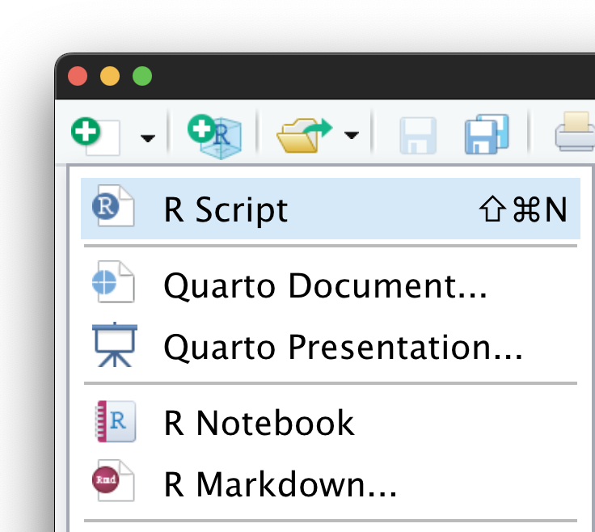

+++
title = "逆順で理解する R Markdown Presentation — Tokyo.R #102"
date = 2022-10-22T16:30:00+09:00
type = "reveal"
draft = false
og_image = "tokyor102/image/screenshot.webp"
+++

<style>
.footnote img {
  vertical-align: middle;
  height: 110px;
}
</style>

<h1>
逆順で理解する R Markdown Presentation
</h1>

<div class="author">
岩嵜 航 (Watal M. Iwasaki, PhD)
&nbsp;
<a href="https://heavywatal.github.io/"><code>@heavywatal</code>

</a>
</div>

<div class="affiliation">
東北大学 生命科学研究科 進化ゲノミクス分野 特任助教<br>
(Graduate School of Life Sciences, Tohoku University)
</div>

<div class="footnote">
2022-10-22 <a href="https://tokyor.connpass.com/event/262836/">Tokyo.R #102</a><br>
<a href="https://heavywatal.github.io/slides/tokyor102/">https://heavywatal.github.io/slides/tokyor102/</a>
&ensp;=&ensp;
<a href="https://github.com/heavywatal/slides/blob/main/rmarkdown/tokyor102/index.Rmd"><code>tokyor102.Rmd</code></a>
&ensp;|><br><br>
&emsp;
<a href="https://yihui.org/knitr"></a>
&ensp;|>&ensp;
<a href="https://gohugo.io/"></a>
&ensp;|>&ensp;
<a href="https://revealjs.com/"></a>
</div>


---
## PowerPoint無理、ウェブブラウザでプレゼンしたい


<div class="column-container">
  <div class="column" style="flex-shrink: 0.4;">

Hello, R Markdown!


```r
3 * 14
ggplot(diamonds) +
  aes(carat, price) +
  geom_point(aes(color = clarity, size = cut))
```

```
## [1] 42
```


  </div>
  <div class="column">

普通のテキスト

Rコード

<div style="margin-block-start: 4em;">実行結果</div>

図

  </div>
</div>

---
## ウェブブラウザでスライドショーを表示する仕組み

<div class="column-container">
  <div class="column" style="flex-shrink: 1.8;">

```html
<html>
 <head>
  <link rel="stylesheet"
        href="style.css">
 </head>
 <body>
  <section><h2>見出し</h2>
    スライド1 本文
  </section>
  <section><h2>見出し</h2>
    スライド2 本文
  </section>
  <script src="reveal.js">
  </script>
 </body>
</html>
```

  </div>
  <div class="column">

HTML
: マークアップ言語。`<タグ>挟む</タグ>`
: 文書の骨格、**テキストの中身**を書く。
: 余白の右クリックから表示できる →

CSS
: フォントや余白などの**スタイルを調整**。

JavaScript
: ウェブブラウザに働きかける。
: **スライドっぽく見せる**こともできる。<br>
  e.g.,
  [**reveal.js**](https://revealjs.com/),
  [remark.js](https://remarkjs.com/),
  [ioslides](https://code.google.com/p/io-2012-slides/),
  etc.

  </div>
</div>

しかし、生のHTMLを手で書くのは大変...

---
## 書きやすいMarkdownからHTMLに変換

<div class="column-container">
  <div class="column" style="flex-shrink: 1.9;">

<pre class="chroma"><code>## スライド1 見出し

スライド1 本文

&#45;--
## スライド2 見出し

スライド2 本文

&#45;--
## コードブロック

```
3 * 14
ggplot(diamonds) +
  aes(carat, price) +
  geom_point()
```</code></pre>

  </div>
  <div class="column">

Markdown
: **軽量マークアップ言語**の代表格。
: 微妙に異なるflavorが乱立。<br>
  [CommonMark](https://spec.commonmark.org/),
  [GFM](https://github.github.com/gfm/) が**標準**的な位置づけ。

<hr>

[Hugo](https://gohugo.io/)
: **超高速** Markdown → HTML スペシャリスト。
: CommonMark, GFM 準拠 + 拡張。
: ウェブサイト全体を作る前提。**初期設定が難関**。

[Pandoc](https://pandoc.org/)
: **様々な形式を相互変換**できるジェネラリスト。
: **[Pandoc's Markdown](https://pandoc.org/MANUAL.html#pandocs-markdown) が独特**。<br>
  CommonMark, GFM も扱えるけど。

  </div>
</div>

コードブロックの実行結果も表示できたら嬉しい...


---
## R Markdownのコード部分を実行してMarkdown化

<div class="column-container">
  <div class="column" style="flex-shrink: 1.9;">

<pre class="chroma"><code>&#45;--
title: "Goodbye PowerPoint"
format: revealjs
&#45;--

Hello, R Markdown!

&#96;``{r hello}
3 * 14
ggplot(diamonds) +
  aes(carat, price) +
  geom_point()
```
</code></pre>
<pre><code>```
## [1] 42
```
&lt;img src="figure/hello-1.png">
</code></pre>


  </div>
  <div class="column" style="padding-block-start: 0em;">

R Markdown (.Rmd, .qmd)
: 最上部に**メタデータ**を記述。<br>
  文書全体の設定など。
: 実行してほしいRコードを<br>
  **コードチャンク**に書く。

<br>

[knitr](https://yihui.org/knitr) 🧶 でコードチャンクを実行<br>

↓

普通のMarkdown (.md)
: 実行結果が編み込まれる。
: 画像ファイルとそこへのリンクも。

  </div>
</div>

すべて繋がった。結果は[スライド#2](#2)。簡単に実現する方法は？

---
## R Markdownからスライドショーを作る枠組み

<div class="column-container">
  <div class="column" style="flex-shrink: 1.8;">
    
  </div>
  <div class="column" style="padding-block-start: 0;">

[Quarto Presentation](https://quarto.org/docs/presentations/) 🟢 <span style="font-weight: normal;">([v1.0](https://github.com/quarto-dev/quarto-cli/releases/tag/v1.0.1) in July 2022)</span>
: `.qmd` |> knitr |> Pandoc |> reveal.js
: [RStudio](https://quarto.org/docs/tools/rstudio.html),
  [VS Code](https://quarto.org/docs/tools/vscode.html)が**ぜーんぶ面倒みてくれる**！

[R Markdown... → Presentation](https://bookdown.org/yihui/rmarkdown/presentations.html) 🟡
: `.Rmd` |> knitr |> Pandoc |> **ioslides, Slidy**
: デフォルトでは動作が鈍い、中央寄せ。

[heavywatal/slides](https://github.com/heavywatal/slides#readme) 🔴 非推奨
: `.Rmd` |> knitr |> [**Hugo** |> reveal.js](https://github.com/heavywatal/hugo-theme-reveal)
: 習得・設定が済んでしまえば速いけど...
: Quarto無き時代の俺俺フレームワーク。
: 訊かれるので一度説明しておきたかった。

<div style="opacity: 0.5;">

[xaringan](https://slides.yihui.org/xaringan/) 🥷 Presentation Ninja
: `.Rmd` |> knitr |> **remark.js**

</div>

  </div>
</div>

---
## 補遺

- 見た目を微調整したければ**CSS(+HTML)の知識**は必要になる。
- 人から見えるように公開したければ出力ファイル一式をアップロード:
  - 大学や会社のサーバー
  - 各種サービス: e.g., [GitHub Pages](https://docs.github.com/pages/getting-started-with-github-pages/about-github-pages)
  - RStudioから<kbd>Publish</kbd>ボタン:
    [RPubs](https://rpubs.com/),
    [RStudio Connect](https://docs.rstudio.com/connect/user/)
- 自分のコンピュータでプレゼンするだけなら <http://localhost/> で十分。
- HTMLスライドをPDF化したい場合は[decktape](https://github.com/astefanutti/decktape)が使える。
- [Quarto](https://quarto.org/)は多機能。
  - 入力には[Jupyter (.ipynb)](https://quarto.org/docs/tools/jupyter-lab.html)も使える。
  - HTMLスライド以外もいろいろ出力できる。
    [See Gallery](https://quarto.org/docs/gallery/).
